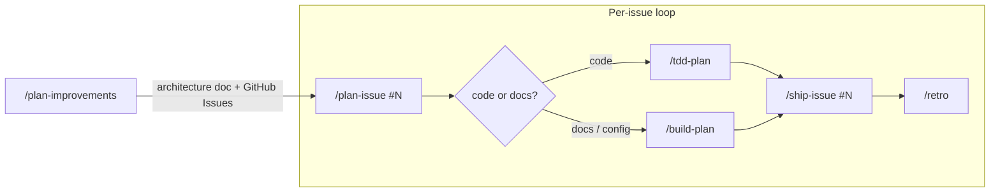

# pi-packages

A monorepo of [Pi](https://github.com/badlogic/pi-mono) extension packages, published to npm under `@gotgenes/`.
Some packages (like pi-permission-system) are designed for broad use; others scratch a personal itch and are shared in case they help others.

## Packages

| Package                                                                | Description                                                    | Downloads/month                                                                                                                          |
| ---------------------------------------------------------------------- | -------------------------------------------------------------- | ---------------------------------------------------------------------------------------------------------------------------------------- |
| [@gotgenes/pi-permission-system](./packages/pi-permission-system/)     | Permission enforcement for the Pi coding agent                 | [](https://www.npmjs.com/package/@gotgenes/pi-permission-system)     |
| [@gotgenes/pi-subagents](./packages/pi-subagents/)                     | Focused, in-process autonomous sub-agent core for Pi           | [](https://www.npmjs.com/package/@gotgenes/pi-subagents)                     |
| [@gotgenes/pi-github-tools](./packages/pi-github-tools/)               | Deterministic GitHub CI, release, and issue tools              | [](https://www.npmjs.com/package/@gotgenes/pi-github-tools)               |
| [@gotgenes/pi-autoformat](./packages/pi-autoformat/)                   | Prompt-end auto-formatting (Biome, Prettier, etc.)             | [](https://www.npmjs.com/package/@gotgenes/pi-autoformat)                   |
| [@gotgenes/pi-colgrep](./packages/pi-colgrep/)                         | Semantic code search via ColGrep as an agent tool              | [](https://www.npmjs.com/package/@gotgenes/pi-colgrep)                         |
| [@gotgenes/pi-session-tools](./packages/pi-session-tools/)             | Session naming and context bridge for multi-session workflows  | [](https://www.npmjs.com/package/@gotgenes/pi-session-tools)             |
| [@gotgenes/pi-subagents-worktrees](./packages/pi-subagents-worktrees/) | Git worktree isolation WorkspaceProvider for pi-subagents      | [](https://www.npmjs.com/package/@gotgenes/pi-subagents-worktrees) |
| [@gotgenes/pi-nocd](./packages/pi-nocd/)                               | System-prompt guard against cd-prefixing the working directory | [](https://www.npmjs.com/package/@gotgenes/pi-nocd)                               |

Each package has its own README with setup instructions, usage, and configuration details.

## Install

Install every package in this repo at once:

```bash
pi install git:github.com/gotgenes/pi-packages
```

Or install a single package via npm:

```bash
pi install npm:@gotgenes/<package-name>
```

## Uninstall

If installed via git:

```bash
pi remove git:github.com/gotgenes/pi-packages
```

If installed individually via npm:

```bash
pi remove npm:@gotgenes/<package-name>
```

## Development

### Prerequisites

- Node.js ≥ 22
- [pnpm](https://pnpm.io/) 11

### Setup

```bash
pnpm install
```

### Commands

```bash
pnpm run check    # typecheck all packages
pnpm run test     # test all packages
pnpm run lint     # biome + rumdl
pnpm run lint:fix # auto-fix lint issues
```

### Agentic development workflow

Always start Pi from the **repo root**:

```bash
pi
```

This gives the agent access to:

- `.pi/settings.json` — loads all packages from local source (with npm versions disabled)
- `.pi/prompts/` — slash commands (`/plan-improvements`, `/plan-issue`, `/tdd-plan`, `/ship-issue`, etc.)
- Root `AGENTS.md` — monorepo-wide conventions

#### Developer workflow

Development is driven by slash commands.
A discovery command, `/plan-improvements`, updates a package's architecture document and opens GitHub Issues for the work it identifies.
Each issue is then taken through a manual loop until it ships.



| Stage            | Command                      | What happens                                                                                              |
| ---------------- | ---------------------------- | --------------------------------------------------------------------------------------------------------- |
| 1. Discover      | `/plan-improvements`         | Updates a package's architecture document and creates GitHub Issues outlining the implementation work.    |
| 2. Plan          | `/plan-issue #N`             | Reads the issue, explores the codebase, produces a numbered plan, and commits it.                         |
| 3. Implement     | `/tdd-plan` or `/build-plan` | Executes the plan — TDD for code changes, build for docs/config. A pre-completion review runs at the end. |
| 4. Ship          | `/ship-issue #N`             | Pushes, verifies CI, closes the issue, and merges the release-please PR.                                  |
| 5. Retrospective | `/retro`                     | Reviews the session(s) for workflow improvements and persists retro notes.                                |

Each issue repeats stages 2–5.
Every stage can run in its own session; the prompt templates set a stage-encoded session name and write a `## Stage:` entry to a `docs/retro/NNNN-<slug>.md` file that bridges context across sessions.

Package-specific context (architecture, priorities, testing strategy) lives in skills.
Load the relevant skill before working on a package:

- `package-pi-autoformat` — for `packages/pi-autoformat/`
- `package-pi-github-tools` — for `packages/pi-github-tools/`
- `package-pi-permission-system` — for `packages/pi-permission-system/`
- `package-pi-subagents` — for `packages/pi-subagents/`

The remaining packages (`pi-colgrep`, `pi-session-tools`, `pi-subagents-worktrees`, `pi-nocd`) have no dedicated skill — their READMEs cover everything you need.

## License

MIT
