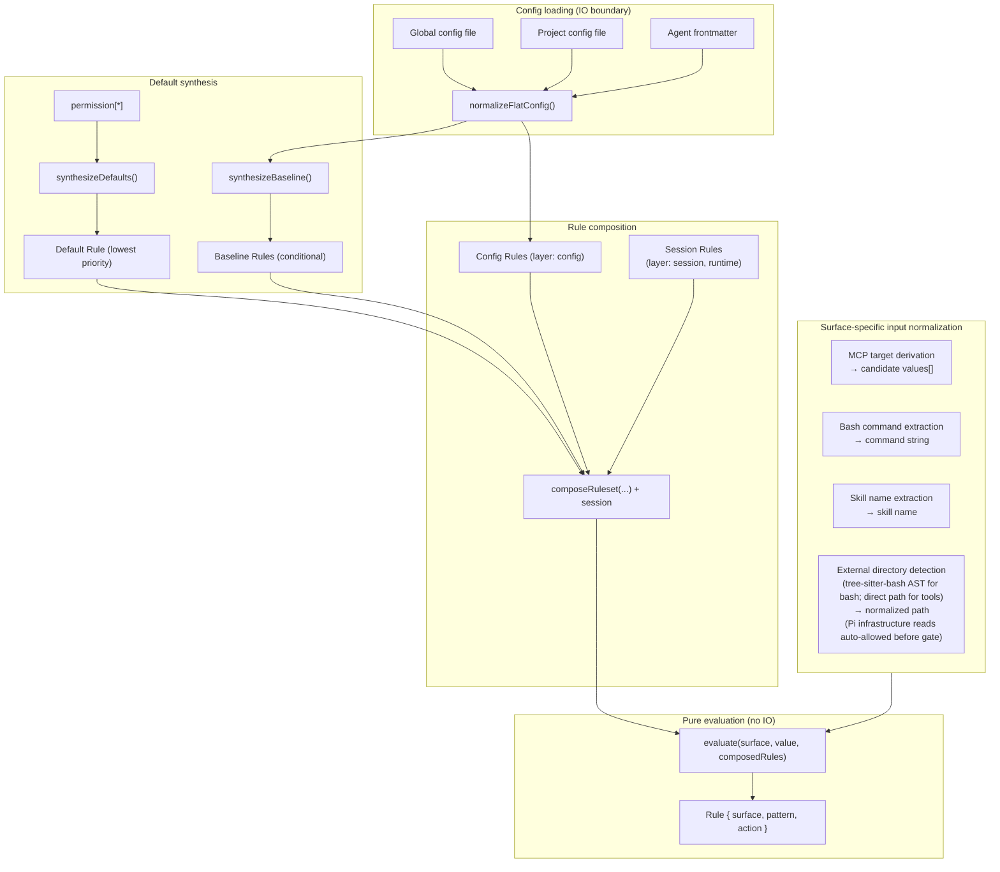
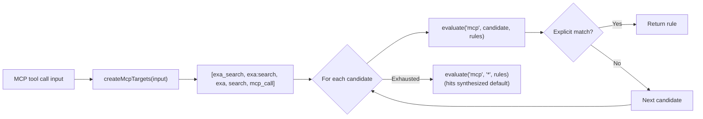

# Target Architecture

This document describes the target internal design for the permission system, informed by [OpenCode's permission model](https://opencode.ai/docs/permissions/) and the structural debt identified in [v3-architecture.md](./v3-architecture.md).

## Design principles

1. **Unified rule model** - one `Rule` type, one evaluation function, all surfaces.
2. **Pure evaluation** - permission decisions are pure functions of (surface, pattern, rules). IO stays at the edges.
3. **Session approvals are just more rules** - no separate matching engine, no separate pre-check.
4. **MCP stays special** - multi-name target derivation is pre-processing, not a special evaluation path.
5. **Defaults are rules** - the universal default (`permission["*"]`) is synthesized as a low-priority rule in the array. No side-channel fallbacks.
6. **Flat config format** - the flat `permission: { ... }` object where each key is a surface. The config IS the ruleset in human-friendly form.
7. **Preserve the two-phase model** - tool filtering (before_agent_start) and invocation gating (tool_call) remain separate.
8. **Ask = cache miss** - "ask" is the absence of a matching rule. The human is the oracle. Their decision is a rule. Persistence determines lifetime (once / session / config).

## Core data model

### Rule

✅ Implemented in `src/rule.ts` (#55, #56).

```typescript
/**
 * Provenance of a rule — which source contributed it.
 *
 * Config scopes: "global", "project", "agent", "project-agent".
 * Synthesized:   "builtin" (universal default / evaluate() fallback),
 *                "baseline" (conditional MCP metadata auto-allow).
 * Runtime:       "session" (session approvals).
 */
type RuleOrigin =
  | "global"
  | "project"
  | "agent"
  | "project-agent"
  | "builtin"
  | "baseline"
  | "session";

interface Rule {
  /** The permission surface: "bash", "edit", "mcp", "skill", "external_directory", etc. */
  surface: string;
  /** The match pattern: a command glob, tool name, file path, skill name, or "*". */
  pattern: string;
  /** The decision. */
  action: PermissionState;
  /**
   * Origin layer — used to derive PermissionCheckResult.source after evaluation.
   * Not used by evaluate(); purely informational metadata.
   */
  layer?: "default" | "baseline" | "config" | "session";
  /** Which source contributed this rule. */
  origin: RuleOrigin;
}
```

Every config entry, default policy, session approval, and agent override normalizes into `Rule[]`.

### Ruleset

```typescript
type Ruleset = Rule[];
```

Merge precedence is array ordering.
The synthesized universal default goes first (lowest priority), then MCP baseline auto-allow rules, then config rules (global → project → agent → project-agent), and finally session rules (highest priority).
Last-match-wins: `evaluate()` scans from the end.

### Evaluate

✅ Implemented in `src/rule.ts` (#55).

```typescript
function evaluate(surface: string, value: string, rules: Ruleset): Rule {
  for (let i = rules.length - 1; i >= 0; i--) {
    const rule = rules[i];
    if (wildcardMatch(rule.surface, surface) && wildcardMatch(rule.pattern, value)) {
      return rule;
    }
  }
  // Unreachable when defaults are synthesized - the catch-all always matches.
  return { surface, pattern: value, action: "ask" };
}
```

The entire decision engine.
When defaults are synthesized into the array, the catch-all `{ surface: "*", pattern: "*", action: "ask" }` always matches - the fallback return is defensive only.

## Composed ruleset

All rule sources are concatenated into a single flat array.
Index position determines priority (higher index wins):

```text
  ┌─────────────────────────────────────────────────────────────────┐
  │                     Composed Ruleset (Rule[])                   │
  │                                                                 │
  │  Index 0: Synthesized universal default (layer: "default")      │
  │    { surface: "*", pattern: "*", action: permission["*"] }      │
  │                                                                 │
  │  Index 1..B: MCP baseline auto-allow (layer: "baseline")        │
  │    (only when any config rule has surface:"mcp" action:"allow") │
  │    { surface: "mcp", pattern: "mcp_status",   action: "allow" } │
  │    { surface: "mcp", pattern: "mcp_list",     action: "allow" } │
  │    { surface: "mcp", pattern: "mcp_search",   action: "allow" } │
  │    { surface: "mcp", pattern: "mcp_describe", action: "allow" } │
  │    { surface: "mcp", pattern: "mcp_connect",  action: "allow" } │
  │                                                                 │
  │  Index B+1..C: Config rules (global → project → agent,         │
  │                   layer: "config", origin: "global"|"project"   │
  │                   |"agent"|"project-agent")                     │
  │    { surface: "bash",  pattern: "*",     action: "allow",       │
  │      origin: "global" }                                         │
  │    { surface: "bash",  pattern: "git *", action: "allow",       │
  │      origin: "global" }                                         │
  │    { surface: "bash",  pattern: "rm *",  action: "deny",        │
  │      origin: "project" }                                        │
  │    { surface: "read",  pattern: "*",     action: "allow",       │
  │      origin: "global" }                                         │
  │    { surface: "mcp",   pattern: "exa:*", action: "allow",       │
  │      origin: "agent" }                                          │
  │                                                                 │
  │  Index C+1..end: Session rules (layer: "session", highest)      │
  │    { surface: "external_directory", pattern: "/other/*",        │
  │      action: "allow" }                                          │
  │                                                                 │
  │  ◄── evaluate() scans from end, first match wins ──►            │
  └─────────────────────────────────────────────────────────────────┘
```

### Current state

✅ **Synthesis and composition are implemented** in `src/synthesize.ts` (#65, #66).

`synthesizeDefaults()` produces a single universal catch-all from `permission["*"]`.
Per-surface catch-alls (e.g. `bash: { "*": "allow" }`) are expressed as regular config rules via `normalizeFlatConfig()` — no separate override layer is needed.

`synthesizeBaseline()` conditionally emits MCP metadata auto-allow rules.

`composeRuleset()` concatenates: defaults + baseline + config rules.

✅ **Session rules are concatenated into the composed ruleset** (#81).
`checkPermission()` appends session rules after the config rules so `evaluate()` handles them via last-match-wins — no separate per-branch pre-check.

### Default synthesis

```typescript
// Single universal catch-all from permission["*"].
function synthesizeDefaults(universalDefault: PermissionState): Ruleset {
  return [
    { surface: "*", pattern: "*", action: universalDefault, layer: "default" },
  ];
}

// MCP metadata auto-allow - only synthesized when any config rule has
// surface: "mcp" && action: "allow".
function synthesizeBaseline(configRules: Ruleset): Ruleset { ... }

// Concat in priority order: defaults, baseline, config.
function composeRuleset(defaults, baseline, config): Ruleset {
  return [...defaults, ...baseline, ...config];
}
```

## Architecture overview



## Config format

✅ Implemented in #66. The legacy multi-namespace format has been removed.

```jsonc
{
  "permission": {
    "*": "ask",
    "read": "allow",
    "bash": { "*": "allow", "git *": "allow", "npm *": "allow", "rm *": "deny" },
    "mcp": { "*": "ask", "exa:*": "allow" },
    "skill": { "*": "ask", "librarian": "allow" },
    "external_directory": "ask"
  }
}
```

Each top-level key in `permission` is a surface name.
A string value is shorthand for `{ "*": action }` (surface-level catch-all).
An object value maps patterns to actions.
`permission["*"]` is the universal fallback.

### Normalization to Rule[]

✅ Implemented in `src/normalize.ts` (#56, #66).

```typescript
function normalizeFlatConfig(permission: FlatPermissionConfig): Ruleset {
  const rules: Ruleset = [];

  for (const [surface, value] of Object.entries(permission)) {
    if (typeof value === "string") {
      // Shorthand: "read": "allow" → { surface: "read", pattern: "*", action: "allow" }
      rules.push({ surface, pattern: "*", action: value as PermissionState });
    } else {
      // Object: "bash": { "*": "ask", "git *": "allow" }
      for (const [pattern, action] of Object.entries(value)) {
        rules.push({ surface, pattern, action: action as PermissionState });
      }
    }
  }

  return rules;
}
```

## MCP pre-processing

MCP is the one surface that requires pre-processing **before** evaluation.
The multi-name target derivation stays, but it feeds candidate values into `evaluate()` rather than a separate code path:



The priority ordering of candidates is preserved.
The evaluation function is unchanged - MCP just calls it multiple times with different values.

✅ **MCP target derivation helpers extracted to `src/mcp-targets.ts`** (#81).
Input normalization for all surfaces lives in `src/input-normalizer.ts`.

## Session approvals: the cache-miss model

✅ Session rules stored as `Ruleset` (#57).
✅ Session approvals generalized to all surfaces (#51).

`evaluate()` is a **lookup** against cached decisions.
When no rule matches (or the matching rule says "ask"), the system has a cache miss - it needs the human oracle to produce a decision.

The human's response is simultaneously:

1. **The answer** for this request (allow or deny).
2. **A rule** that can be cached for future lookups.

The dialog determines **persistence** - where the rule lives:

```text
  evaluate(surface, value, composedRules)
       │
       ├── match.action = "allow" → proceed (cache hit)
       ├── match.action = "deny"  → block (cache hit)
       │
       └── match.action = "ask"   → cache miss, query oracle
                │
                ▼
           Dialog: "[surface] wants to [value]"
                │
                ├── "Yes"              → allow this request (no persistence)
                ├── "Yes, for session" → allow + store in session layer
                │                        (future lookups hit without asking)
                ├── "No"               → deny this request (no persistence)
                └── (future: "Always") → allow + store in config layer (disk)
```

### Pattern suggestions

✅ Implemented in `src/pattern-suggest.ts` (#51).

When prompting, each surface suggests a **pattern** for the "for session" option.
The pattern determines what class of future requests auto-approve:

|Surface|Input value|Suggested session pattern|Mechanism|
|---|---|---|---|
|bash|`git checkout main`|`git checkout *`|Arity table (#52)|
|bash|`npm run dev`|`npm run dev`|Arity table (#52)|
|tool (read/write/etc.)|tool surface itself|`*` (all uses of that tool)|Tool-level|
|mcp|`exa:search`|`exa:*`|Server-level wildcard|
|skill|`librarian`|`librarian`|Exact name|
|external_directory|`/other/project/src/foo.ts`|`/other/project/*`|Directory prefix as glob|

The suggestion is shown in the dialog text so the user sees what they're approving:

```text
  ● Allow once
  ● Allow "git checkout *" for this session
  ● Deny
```

⚠️ Bash pattern suggestions currently use a simple first-token heuristic.
Smart arity-based suggestions are tracked in #52.

### Implementation


## Two-phase checking

### Phase 1: Tool filtering (`before_agent_start`)

```typescript
function shouldExposeTool(toolName: string, rules: Ruleset): boolean {
  const rule = evaluate(toolName, "*", rules);
  return rule.action !== "deny";
}
```

Uses `evaluate()` with pattern `"*"` - "is this tool denied at the surface level, regardless of specific input?"

### Phase 2: Invocation gating (`tool_call`)

```typescript
// Surface-specific input normalization (what to query)
const { surface, value } = normalizeInput(toolName, input);

// Single evaluation against the composed ruleset (how to decide)
const rule = evaluate(surface, value, composedRules);

if (rule.action === "allow") return proceed;
if (rule.action === "deny") return block;
// rule.action === "ask" - elicit from oracle
const decision = await elicitRule(surface, value, suggestPattern(surface, value));
if (decision.persistence === "session") {
  sessionRules.approve(surface, decision.pattern);
}
return decision.action === "allow" ? proceed : block;
```

Same `evaluate()`, same ruleset.
The only surface-specific logic is input normalization (what `surface` and `value` to look up) and pattern suggestion (what glob to offer for "session" approval).

✅ **`checkPermission()` uses a single evaluate path** (#81).
The ~200-line if/else if chain is replaced by: `normalizeInput()` → `evaluateFirst()` → `deriveSource()` → single result object.

## Subagent detection and permission forwarding

When `ask`-state permissions arise in a headless subagent child process, the extension forwards the dialog to the parent session rather than silently denying.
This requires two detections:

1. **Is the current process a subagent?** — `isSubagentExecutionContext()` in `src/subagent-context.ts`.
2. **What is the parent session ID?** — `resolvePermissionForwardingTargetSessionId()` in `src/permission-forwarding.ts`.

### Known extension env var inventory

|Extension|Child-process env vars|Parent-session env var|
|---|---|---|
|pi-agent-router (original)|`PI_IS_SUBAGENT`, `PI_SUBAGENT_SESSION_ID`, `PI_AGENT_ROUTER_SUBAGENT`|`PI_AGENT_ROUTER_PARENT_SESSION_ID`|
|[nicobailon/pi-subagents](https://github.com/nicobailon/pi-subagents)|`PI_SUBAGENT_CHILD`, `PI_SUBAGENT_RUN_ID`, `PI_SUBAGENT_CHILD_AGENT`, `PI_SUBAGENT_DEPTH`|none set (see #98)|
|[tintinweb/pi-subagents](https://github.com/tintinweb/pi-subagents)|none — runs fully in-process via `createAgentSession()`|n/a — deferred to #29|
|[HazAT/pi-interactive-subagents](https://github.com/HazAT/pi-interactive-subagents)|`PI_SUBAGENT_NAME`, `PI_SUBAGENT_ID`, `PI_SUBAGENT_SESSION`, `PI_SUBAGENT_ACTIVITY_FILE`|none set (see #98)|

### Detection (`SUBAGENT_ENV_HINT_KEYS`)

✅ Broadened in #96 to cover nicobailon and HazAT env vars.

`isSubagentExecutionContext()` returns `true` when any key in `SUBAGENT_ENV_HINT_KEYS` is set to a non-empty, non-whitespace value.
A session-directory path-based fallback (child session dir is nested under `subagentSessionsDir`) acts as a secondary guard.

### Parent-session resolution (`SUBAGENT_PARENT_SESSION_ENV_CANDIDATES`)

✅ Introduced in #96 as an ordered array.

`resolvePermissionForwardingTargetSessionId()` iterates `SUBAGENT_PARENT_SESSION_ENV_CANDIDATES` and returns the first non-empty, non-`"unknown"` value.
Currently only `PI_AGENT_ROUTER_PARENT_SESSION_ID` is in the list.
Neither nicobailon nor HazAT sets a parent-session env var today, so forwarding still fails for those extensions with an explicit log message pointing to #98.
Adding a new env var candidate when an extension adopts the convention is a one-line change to the array.

### Deferred: tintinweb in-process case

tintinweb/pi-subagents calls `createAgentSession()` directly — no child process is spawned and no env vars are ever set.
Env-var detection cannot help here.
The solution requires an event bus RPC so the child can surface permission requests to the parent within the same process.
Tracked in #29.

## Module structure (target)

Modules marked ✅ exist today.
Modules marked ⚠️ are future work.
Modules marked 🔀 exist under a different name.

```text
src/
├── rule.ts                   ✅ Rule type, Ruleset type, evaluate()
├── normalize.ts              ✅ Config → Ruleset normalization (flat format)
├── synthesize.ts             ✅ Universal default + MCP baseline → Ruleset (🔀 target name was synthesize-defaults.ts)
├── wildcard-matcher.ts       ✅ Compiled glob matching
├── mcp-targets.ts            ✅ MCP multi-name target derivation (#81)
├── input-normalizer.ts       ✅ Surface-specific input normalization → NormalizedInput (#81)
├── pattern-suggest.ts        ✅ Per-surface approval pattern suggestions
├── bash-arity.ts             ⚠️ Command arity table for bash pattern suggestions (#52)
├── home-expand.ts            ⚠️ ~/$HOME expansion for patterns (#53)
├── session-rules.ts          ✅ Session approval store (Ruleset wrapper)
├── permission-manager.ts     ✅ Config loading + merge + checkPermission() (target: extract pure checker, #81)
├── permission-gate.ts        ✅ Pure deny/ask/allow gate (injected IO)
├── permission-prompter.ts    ✅ Yolo-mode, review logging, UI/forwarding branch (#80)
├── permission-dialog.ts      ✅ Dialog options (once / session / deny)
│
├── handlers/                 ✅ Extracted event handlers
│   ├── index.ts              ✅ Re-exports
│   ├── types.ts              ✅ HandlerDeps, PromptPermissionDetails
│   ├── lifecycle.ts          ✅ session_start, session_shutdown, resources_discover
│   ├── before-agent-start.ts ✅ Tool filtering + prompt sanitization
│   ├── input.ts              ✅ Skill input gate
│   └── tool-call.ts          ✅ Invocation gating
│
├── index.ts                  ✅ Extension factory - event wiring
├── runtime.ts                ✅ ExtensionRuntime context object
├── config-loader.ts          ✅ File I/O, format detection
├── config-paths.ts           ✅ Path derivation
├── config-reporter.ts        ✅ Structured log entries for resolved config
├── config-modal.ts           ✅ /permission-system slash command UI
├── extension-config.ts       ✅ Runtime knobs (debugLog, yoloMode, etc.)
│
├── external-directory.ts     ✅ Path-outside-cwd detection (tree-sitter-bash AST); Pi infrastructure read bypass
├── system-prompt-sanitizer.ts ✅ Remove denied tools from system prompt
├── skill-prompt-sanitizer.ts  ✅ Skill prompt filtering by policy
├── permission-prompts.ts      ✅ User-facing message formatting per surface
├── tool-input-preview.ts      ✅ Loggable context from tool inputs
├── tool-registry.ts           ✅ Tool name validation
├── active-agent.ts            ✅ Agent name detection from session/system prompt
├── subagent-context.ts        ✅ Subagent execution context detection
├── permission-forwarding.ts   ✅ Constants for cross-session forwarding
├── forwarded-permissions/     ✅ Poll-based approval forwarding for subagents
├── logging.ts                 ✅ JSONL review/debug log writer
├── status.ts                  ✅ Footer status bar integration
├── yolo-mode.ts               ✅ Auto-approve logic
├── common.ts                  ✅ Shared parsing utilities
├── types.ts                   ✅ Core type definitions (PermissionState, FlatPermissionConfig, etc.)
└── before-agent-start-cache.ts ✅ Memoization for prompt sanitization
```

## Refactoring sequence

```mermaid
flowchart TD
    A["✅ #42 Extract event handlers"] --> D["✅ #43 Eliminate module-scope state"]
    B["✅ #55 Extract pure evaluate()"] --> C["✅ #56 Unify Rule type + normalize config"]
    C --> E["✅ #57 Replace SessionApprovalCache with session Ruleset"]
    E --> X["✅ #65 Synthesize defaults + unify evaluate path"]
    X --> F["✅ #51 Generalize session approvals to all surfaces"]
    F --> G["#52 Bash arity table"]
    G --> H["#53 ~/$HOME expansion"]
    X --> Y["✅ #66 Flat permission config format"]
    Y --> Z["✅ #81 Unify checkPermission surface branching"]
    I["✅ #54 Deprecate doom_loop (dead code)"] -.->|"independent"| C
    J["✅ #80 Extract PermissionPrompter"] -.->|"independent"| D

    style A fill:#c8e6c9
    style B fill:#c8e6c9
    style C fill:#c8e6c9
    style D fill:#c8e6c9
    style E fill:#c8e6c9
    style I fill:#c8e6c9
    style X fill:#c8e6c9
    style F fill:#c8e6c9
    style Y fill:#c8e6c9
    style J fill:#c8e6c9
    style Z fill:#c8e6c9
  ```

### Phase 1: Structural cleanup (complete)

|Issue|Summary|
|---|---|
|#42|✅ Extract event handlers from index.ts|
|#43|✅ Eliminate module-scope mutable state|
|#55|✅ Extract pure `evaluate()` function|
|#54|✅ Deprecate doom_loop dead config key|
|#56|✅ Unify Rule type + normalize config into Ruleset|
|#57|✅ Replace SessionApprovalCache with session Ruleset|

### Phase 2: Unified evaluation (complete)

|Issue|Summary|
|---|---|
|#65|✅ Synthesize defaults into ruleset + unify evaluate path|

### Phase 3: Feature delivery (mostly complete)

|Issue|Summary|Status|
|---|---|---|
|#51|Generalize session approvals to all surfaces|✅|
|#66|Flat permission config format|✅|
|#80|Extract PermissionPrompter class|✅|
|#52|Bash arity table for approval pattern suggestions|Open|
|#53|`~`/`$HOME` expansion in permission patterns|Open|

### Phase 4: Final unification

|Issue|Summary|Status|
|---|---|---|
|#81|Unify `checkPermission()` surface branching (+ session concatenation + MCP extraction)|✅|
|#82|Delete deprecated empty `defaults.ts` stub|✅|

## Migration and compatibility

- **Config format**: #66 replaced the legacy multi-namespace format with flat `permission: { ... }`. This was a breaking change with no backward compatibility layer.
- **Behavior**: identical permission decisions for equivalent policy + input.
- **API**: `checkPermission()` return type is unchanged externally.
- **Session approvals**: generalized to all surfaces (#51) - stored as `Rule { surface, pattern, action: "allow" }` in session rules.
- **Review log**: structured entries for all permission decisions (waiting, approved, denied, auto-approved).
- **Debuggability**: `/permission-system` command provides config inspection.

Each phase is independently shippable.
The system works correctly at every intermediate state.
