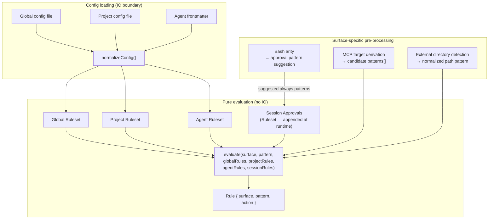
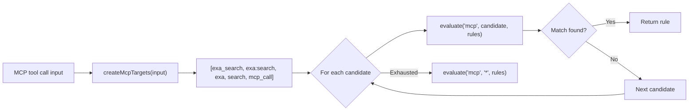
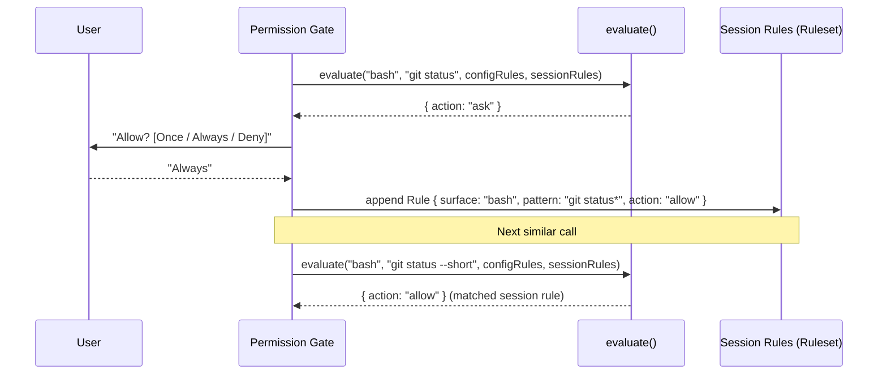
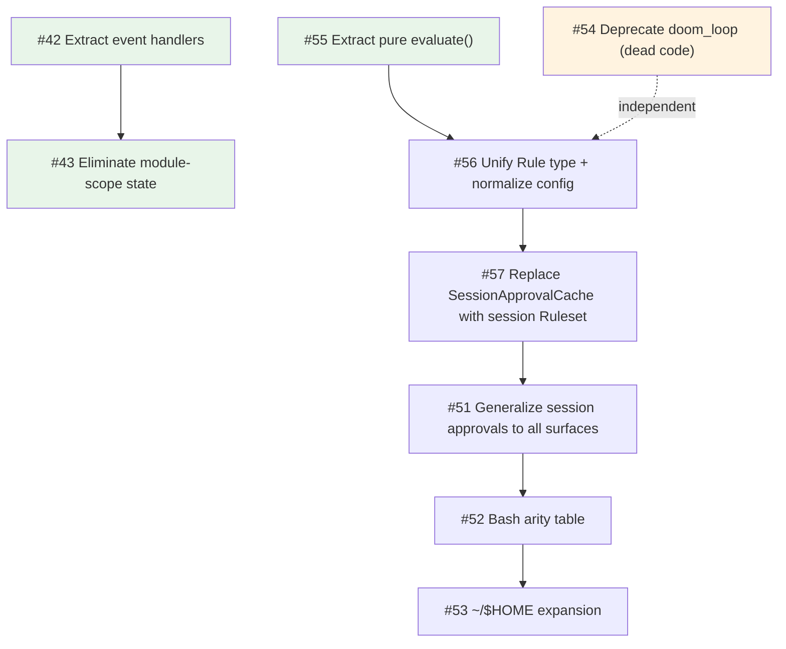

# Target Architecture

This document describes the target internal design for the permission system, informed by [OpenCode's permission model](https://opencode.ai/docs/permissions/) and the structural debt identified in [current-architecture.md](./current-architecture.md).

## Design principles

1. **Unified rule model** — one `Rule` type, one evaluation function, all surfaces.
2. **Pure evaluation** — permission decisions are pure functions of (surface, pattern, rules). IO stays at the edges.
3. **Session approvals are just more rules** — no separate matching engine.
4. **MCP stays special** — multi-name target derivation is pre-processing, not a special evaluation path.
5. **Preserve the config format** — the on-disk JSON shape does not change. Normalization happens at load time.
6. **Preserve the two-phase model** — tool filtering (before_agent_start) and invocation gating (tool_call) remain separate.

## Core data model

### Rule

```typescript
interface Rule {
  /** The permission surface: "bash", "edit", "mcp", "skill", "external_directory", etc. */
  surface: string;
  /** The match pattern: a command glob, tool name, file path, skill name, or "*". */
  pattern: string;
  /** The decision. */
  action: PermissionState;
}
```

Every config entry, session approval, and agent override normalizes into `Rule[]`.

### Ruleset

```typescript
type Ruleset = Rule[];
```

Merge precedence is array ordering.
Global rules go first, project rules next, agent frontmatter last.
Session approvals are appended after config rules.
`findLast` gives later (more specific) entries priority.

### Evaluate

```typescript
function evaluate(surface: string, pattern: string, ...rulesets: Ruleset[]): Rule {
  const rules = rulesets.flat();
  const match = rules.findLast(
    (rule) => wildcardMatch(surface, rule.surface) && wildcardMatch(pattern, rule.pattern),
  );
  return match ?? { surface, pattern, action: getDefaultAction(surface) };
}
```

The entire decision engine.
`getDefaultAction(surface)` reads from the per-surface default policy — our ergonomic advantage over a single global fallback.

## Architecture overview



## Config normalization

The on-disk config shape does not change.
At load time, each surface's `Record<string, PermissionState>` is normalized into `Rule[]`:

```typescript
function normalizeConfig(config: RawConfig, source: string): Ruleset {
  const rules: Ruleset = [];

  // tools — exact name match, no wildcards
  for (const [name, action] of Object.entries(config.tools ?? {})) {
    rules.push({ surface: name, pattern: "*", action });
  }

  // bash — wildcard patterns against command strings
  for (const [pattern, action] of Object.entries(config.bash ?? {})) {
    rules.push({ surface: "bash", pattern, action });
  }

  // mcp — wildcard patterns against derived target names
  for (const [pattern, action] of Object.entries(config.mcp ?? {})) {
    rules.push({ surface: "mcp", pattern, action });
  }

  // skills — wildcard patterns against skill names
  for (const [pattern, action] of Object.entries(config.skills ?? {})) {
    rules.push({ surface: "skill", pattern, action });
  }

  // special — exact name match
  for (const [name, action] of Object.entries(config.special ?? {})) {
    rules.push({ surface: name, pattern: "*", action });
  }

  return rules;
}
```

Key insight: `tools.read: "allow"` becomes `{ surface: "read", pattern: "*", action: "allow" }`.
`special.external_directory: "ask"` becomes `{ surface: "external_directory", pattern: "*", action: "ask" }`.
This flattening means `evaluate("read", "some/file.ts", rules)` just works — no branching on surface type.

## MCP pre-processing

MCP is the one surface that requires pre-processing **before** evaluation.
The multi-name target derivation stays, but it feeds candidate patterns into `evaluate()` rather than a separate code path:



The priority ordering of candidates is preserved.
The evaluation function is unchanged — MCP just calls it multiple times with different patterns.

## Session approvals

Session approvals become `Ruleset` — a plain array of `Rule` values appended after config rules at evaluation time.



### Pattern suggestion per surface

Each surface provides an `always` pattern suggestion when prompting:

|Surface|Input|Suggested `always` pattern|Mechanism|
|---|---|---|---|
|bash|`git checkout main`|`git checkout *`|Arity table lookup (arity 2 for `git`)|
|bash|`npm run dev`|`npm run dev*`|Arity table lookup (arity 3 for `npm run`)|
|tool|`read` on `src/foo.ts`|`*` (all reads)|Tool-level|
|mcp|`exa:search`|`exa:*`|Server-level wildcard|
|skill|`librarian`|`librarian`|Exact name|
|external_directory|`~/other-project/src/foo.ts`|`~/other-project/*`|Directory prefix as glob|

The arity table (#52) drives bash pattern suggestions.
`~`/`$HOME` expansion (#53) applies at pattern compilation time.

## Two-phase checking

### Phase 1: Tool filtering (`before_agent_start`)

```typescript
function shouldExposeTool(toolName: string, rules: Ruleset): boolean {
  const rule = evaluate(toolName, "*", rules);
  return rule.action !== "deny";
}
```

Uses `evaluate()` with pattern `"*"` — "is this tool denied at the surface level, regardless of specific input?"

### Phase 2: Invocation gating (`tool_call`)

```typescript
// Surface-specific pattern extraction
const pattern = extractPattern(toolName, input);
// e.g. bash → command string, skill → skill name, mcp → derived targets

const rule = evaluate(toolName, pattern, configRules, sessionRules);
// → apply gate based on rule.action
```

Same `evaluate()`, different pattern.

## Module structure (target)

```text
src/
├── rule.ts                   Rule type, Ruleset type, evaluate()
├── normalize.ts              Config → Ruleset normalization (replaces type zoo)
├── defaults.ts               Per-surface default policy
├── wildcard.ts               Compiled glob matching (existing, refined)
├── mcp-targets.ts            MCP multi-name target derivation (extracted)
├── bash-arity.ts             Command arity table for pattern suggestions
├── home-expand.ts            ~/​$HOME expansion for patterns
├── session-rules.ts          Session approval store (Ruleset, replaces SessionApprovalCache)
├── permission-checker.ts     Pure: checkPermission() and getToolPermission() using evaluate()
├── permission-gate.ts        IO boundary: deny/ask/allow gate with prompt injection
├── permission-dialog.ts      Dialog options (unchanged)
│
├── handlers/                 Extracted event handlers (#42)
│   ├── lifecycle.ts
│   ├── before-agent-start.ts
│   ├── input.ts
│   └── tool-call.ts
│
├── runtime.ts                ExtensionRuntime context object (#43)
├── config-loader.ts          File I/O, legacy detection (unchanged)
├── config-paths.ts           Path derivation (unchanged)
├── extension-config.ts       Runtime knobs (unchanged)
│
├── external-directory.ts     Path-outside-cwd detection (moved out of index.ts)
├── system-prompt-sanitizer.ts  (unchanged)
├── skill-prompt-sanitizer.ts   (unchanged)
├── permission-prompts.ts       (unchanged)
├── logging.ts                  (unchanged)
└── …                           (supporting modules unchanged)
```

## Refactoring sequence

The transformation from current to target architecture is a sequence of mechanical refactors, each independently shippable and testable.
No step changes the config format or user-visible behavior.



Green nodes can start immediately (no blockers).
Orange node is investigation, can run in parallel.

### Phase 1: Structural cleanup (no behavior change)

|Issue|Summary|Blocks|
|---|---|---|
|#42|Extract event handlers from index.ts|#43|
|#43|Eliminate module-scope mutable state|—|
|#55|Extract pure `evaluate()` function|#56|
|#54|Deprecate doom_loop dead config key|#56 (soft)|

### Phase 2: Unified model (internal refactor, no config change)

|Issue|Summary|Blocks|
|---|---|---|
|#56|Unify Rule type + normalize config into Ruleset|#57|
|#57|Replace SessionApprovalCache with session Ruleset|#51|

### Phase 3: Feature delivery

|Issue|Summary|Blocks|
|---|---|---|
|#51|Generalize session approvals to all surfaces|#52|
|#52|Bash arity table for approval pattern suggestions|#53 (soft)|
|#53|`~`/`$HOME` expansion in permission patterns|—|

## Migration and compatibility

- **Config format**: unchanged. The on-disk JSON schema is the same.
- **Behavior**: identical permission decisions for the same policy + input.
- **API**: `PermissionManager.checkPermission()` return type is unchanged.
- **Session approvals**: existing `external_directory` prefix approvals continue to work — they normalize to `Rule { surface: "external_directory", pattern: "<prefix>*", action: "allow" }`.
- **Review log**: entries gain a `matchedRule` field showing the winning rule, improving auditability.

Each phase is independently shippable.
The system works correctly at every intermediate state.
