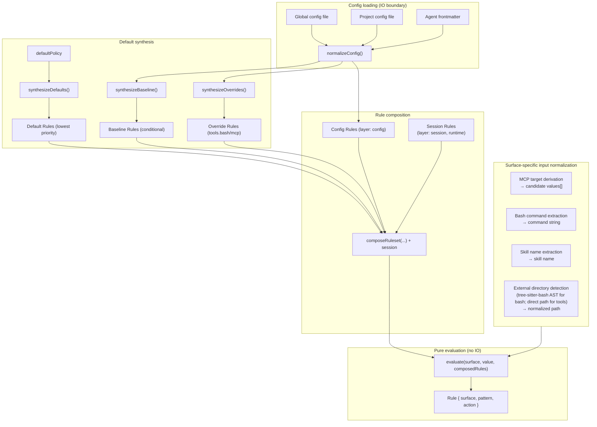
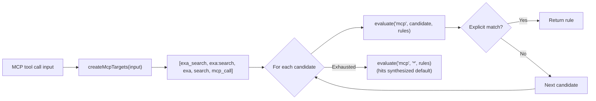
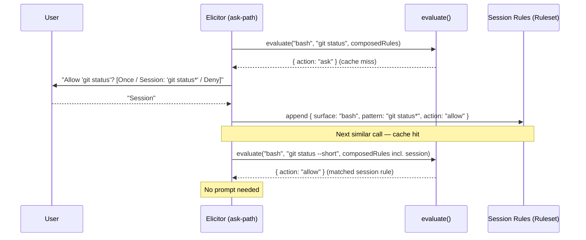
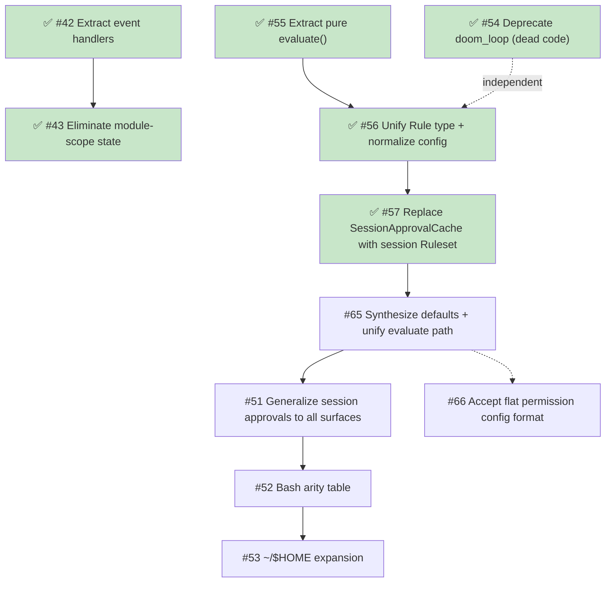

# Target Architecture

This document describes the target internal design for the permission system, informed by [OpenCode's permission model](https://opencode.ai/docs/permissions/) and the structural debt identified in [v3-architecture.md](./v3-architecture.md).

## Design principles

1. **Unified rule model** — one `Rule` type, one evaluation function, all surfaces.
2. **Pure evaluation** — permission decisions are pure functions of (surface, pattern, rules). IO stays at the edges.
3. **Session approvals are just more rules** — no separate matching engine, no separate pre-check.
4. **MCP stays special** — multi-name target derivation is pre-processing, not a special evaluation path.
5. **Defaults are rules** — `defaultPolicy` and `tools.bash`/`tools.mcp` overrides are synthesized as low-priority rules in the array. No side-channel fallbacks.
6. **Flat config format** — replace the legacy multi-namespace format with a flat `permission: { ... }` object where each key is a surface. The config IS the ruleset in human-friendly form.
7. **Preserve the two-phase model** — tool filtering (before_agent_start) and invocation gating (tool_call) remain separate.
8. **Ask = cache miss** — "ask" is the absence of a matching rule. The human is the oracle. Their decision is a rule. Persistence determines lifetime (once / session / config).

## Core data model

### Rule

```typescript
interface Rule {
  /** The permission surface: "bash", "edit", "mcp", "skill", "external_directory", etc. */
  surface: string;
  /** The match pattern: a command glob, tool name, file path, skill name, or "*". */
  pattern: string;
  /** The decision. */
  action: PermissionState;
  /**
   * Origin layer — used to derive PermissionCheckResult.source after evaluation.
   * Not used by evaluate(); purely informational metadata.
   * "default" = synthesized from defaultPolicy
   * "override" = synthesized from tools.bash / tools.mcp
   * "baseline" = synthesized MCP metadata auto-allow
   * "config" = explicit on-disk rule
   * "session" = user-approved for this session
   */
  layer?: "default" | "override" | "baseline" | "config" | "session";
}
```

Every config entry, default policy, session approval, and agent override normalizes into `Rule[]`.

### Ruleset

```typescript
type Ruleset = Rule[];
```

Merge precedence is array ordering.
Synthesized defaults go first (lowest priority), then MCP baseline auto-allow rules, then tools.bash/tools.mcp overrides, then config rules (global → project → agent → project-agent), and finally session rules (highest priority).
Last-match-wins: `evaluate()` scans from the end.

### Evaluate

```typescript
function evaluate(surface: string, value: string, rules: Ruleset): Rule {
  for (let i = rules.length - 1; i >= 0; i--) {
    const rule = rules[i];
    if (wildcardMatch(rule.surface, surface) && wildcardMatch(rule.pattern, value)) {
      return rule;
    }
  }
  // Unreachable when defaults are synthesized — the catch-all always matches.
  return { surface, pattern: value, action: "ask" };
}
```

The entire decision engine.
When defaults are synthesized into the array, the catch-all `{ surface: "*", pattern: "*", action: "ask" }` always matches — the fallback return is defensive only.

## Composed ruleset

All rule sources are concatenated into a single flat array.
Index position determines priority (higher index wins):

```text
  ┌─────────────────────────────────────────────────────────────────┐
  │                     Composed Ruleset (Rule[])                   │
  │                                                                 │
  │  Index 0..D: Synthesized defaults (layer: "default")            │
  │    { surface: "*",       pattern: "*", action: defaults.tools } │
  │    { surface: "bash",    pattern: "*", action: defaults.bash }  │
  │    { surface: "mcp",     pattern: "*", action: defaults.mcp }   │
  │    { surface: "skill",   pattern: "*", action: defaults.skills } │
  │    { surface: "special", pattern: "*", action: defaults.special } │
  │                                                                 │
  │  Index D+1..B: MCP baseline auto-allow (layer: "baseline")      │
  │    (only when any config rule has surface:"mcp" action:"allow") │
  │    { surface: "mcp", pattern: "mcp_status",   action: "allow" } │
  │    { surface: "mcp", pattern: "mcp_list",     action: "allow" } │
  │    { surface: "mcp", pattern: "mcp_search",   action: "allow" } │
  │    { surface: "mcp", pattern: "mcp_describe", action: "allow" } │
  │    { surface: "mcp", pattern: "mcp_connect",  action: "allow" } │
  │                                                                 │
  │  Index B+1..O: tools.bash/tools.mcp overrides (layer:"override") │
  │    { surface: "bash", pattern: "*", action: tools.bash }        │
  │    { surface: "mcp",  pattern: "*", action: tools.mcp }         │
  │                                                                 │
  │  Index O+1..C: Config rules (global → project → agent, layer:"config") │
  │    { surface: "bash",    pattern: "git *",  action: "allow" }   │
  │    { surface: "bash",    pattern: "rm *",   action: "deny"  }   │
  │    { surface: "read",    pattern: "*",      action: "allow" }   │
  │    { surface: "mcp",     pattern: "exa:*",  action: "allow" }   │
  │                                                                 │
  │  Index C+1..end: Session rules (layer: "session", highest)      │
  │    { surface: "external_directory", pattern: "/other/*", action: "allow" } │
  │                                                                 │
  │  ◄── evaluate() scans from end, first match wins ──►            │
  └─────────────────────────────────────────────────────────────────┘
```

### Default synthesis

`defaultPolicy` and `tools.bash`/`tools.mcp` fallback overrides become actual rules at the front of the array.
Three functions in `src/synthesize.ts` handle this:

```typescript
// Lowest-priority catch-alls from defaultPolicy.
function synthesizeDefaults(defaults: PermissionDefaultPolicy): Ruleset {
  return [
    { surface: "*",       pattern: "*", action: defaults.tools,   layer: "default" },
    { surface: "bash",    pattern: "*", action: defaults.bash,    layer: "default" },
    { surface: "mcp",     pattern: "*", action: defaults.mcp,     layer: "default" },
    { surface: "skill",   pattern: "*", action: defaults.skills,  layer: "default" },
    { surface: "special", pattern: "*", action: defaults.special, layer: "default" },
  ];
}

// MCP metadata auto-allow — only synthesized when any config rule has
// surface: "mcp" && action: "allow". Placed before overrides so that an
// explicit tools.mcp override still wins (higher array index = higher priority).
function synthesizeBaseline(configRules: Ruleset): Ruleset { … }

// per-scope tools.bash / tools.mcp catch-alls (layer: "override").
function synthesizeOverrides(scopes: OverrideScope[]): Ruleset { … }

// Concat in priority order: defaults, baseline, overrides, config.
function composeRuleset(defaults, baseline, overrides, config): Ruleset {
  return [...defaults, ...baseline, ...overrides, ...config];
}
```

`tools.bash: "allow"` synthesizes as `{ surface: "bash", pattern: "*", action: "allow", layer: "override" }` — placed after the synthesized default, so it wins for any command that isn't covered by a specific config rule.
Specific config rules (layer `"config"`) come even later and always win.

This eliminates `bashDefault`, `mcpToolLevel`, `hasAnyMcpAllowRule`, and all per-surface branching in `checkPermission()`.

## Architecture overview



## Config formats

### Legacy format (current, replaced by #66)

```jsonc
{
  "defaultPolicy": { "tools": "ask", "bash": "ask", "mcp": "ask", "skills": "ask", "special": "ask" },
  "tools": { "read": "allow", "bash": "allow" },
  "bash": { "git *": "allow", "npm *": "allow" },
  "mcp": { "exa:*": "allow" },
  "skills": { "librarian": "allow" },
  "special": { "external_directory": "ask" }
}
```

### Flat format (target, preferred)

```jsonc
{
  "permission": {
    "*": "ask",
    "read": "allow",
    "bash": { "*": "allow", "git *": "allow", "npm *": "allow", "rm *": "deny" },
    "mcp": { "*": "ask", "exa:*": "allow" },
    "skill": { "*": "ask", "librarian": "allow" },
    "external_directory": "ask"
  }
}
```

Each top-level key in `permission` is a surface name.
A string value is shorthand for `{ "*": action }` (surface-level catch-all).
An object value maps patterns to actions.
`permission["*"]` is the universal fallback — equivalent to `defaultPolicy.tools` in the legacy format.

### Both normalize to the same `Rule[]`

```typescript
[
  { surface: "*",                  pattern: "*",      action: "ask"   },  // from "*": "ask" or defaultPolicy.tools
  { surface: "read",              pattern: "*",      action: "allow" },  // from "read": "allow" or tools.read
  { surface: "bash",             pattern: "*",      action: "allow" },  // from bash["*"] or tools.bash
  { surface: "bash",             pattern: "git *",  action: "allow" },  // from bash["git *"]
  { surface: "bash",             pattern: "rm *",   action: "deny"  },
  { surface: "mcp",             pattern: "*",      action: "ask"   },  // from mcp["*"] or defaultPolicy.mcp
  { surface: "mcp",             pattern: "exa:*",  action: "allow" },
  { surface: "skill",           pattern: "*",      action: "ask"   },
  { surface: "skill",           pattern: "librarian", action: "allow" },
  { surface: "external_directory", pattern: "*",      action: "ask"   },
]
```

One representation. One evaluation path.

## Config normalization

### Legacy format parser

```typescript
function normalizeLegacyConfig(config: LegacyConfig): Ruleset {
  const rules: Ruleset = [];

  // tools — surface = tool name, pattern = "*"
  for (const [name, action] of Object.entries(config.tools ?? {})) {
    rules.push({ surface: name, pattern: "*", action });
  }

  // bash — surface = "bash", pattern = command glob
  for (const [pattern, action] of Object.entries(config.bash ?? {})) {
    rules.push({ surface: "bash", pattern, action });
  }

  // mcp — surface = "mcp", pattern = target name glob
  for (const [pattern, action] of Object.entries(config.mcp ?? {})) {
    rules.push({ surface: "mcp", pattern, action });
  }

  // skills — surface = "skill", pattern = skill name glob
  for (const [pattern, action] of Object.entries(config.skills ?? {})) {
    rules.push({ surface: "skill", pattern, action });
  }

  // special — surface = key name, pattern = "*"
  for (const [name, action] of Object.entries(config.special ?? {})) {
    rules.push({ surface: name, pattern: "*", action });
  }

  return rules;
}
```

### Flat format parser

```typescript
function normalizeFlatConfig(permission: FlatPermissionConfig): Ruleset {
  const rules: Ruleset = [];

  for (const [surface, value] of Object.entries(permission)) {
    if (typeof value === "string") {
      // Shorthand: "read": "allow" → { surface: "read", pattern: "*", action: "allow" }
      rules.push({ surface, pattern: "*", action: value as PermissionState });
    } else {
      // Object: "bash": { "*": "ask", "git *": "allow" }
      for (const [pattern, action] of Object.entries(value)) {
        rules.push({ surface, pattern, action: action as PermissionState });
      }
    }
  }

  return rules;
}
```

## MCP pre-processing

MCP is the one surface that requires pre-processing **before** evaluation.
The multi-name target derivation stays, but it feeds candidate values into `evaluate()` rather than a separate code path:



The priority ordering of candidates is preserved.
The evaluation function is unchanged — MCP just calls it multiple times with different values.

## Session approvals: the cache-miss model

`evaluate()` is a **lookup** against cached decisions.
When no rule matches (or the matching rule says "ask"), the system has a cache miss — it needs the human oracle to produce a decision.

The human's response is simultaneously:

1. **The answer** for this request (allow or deny).
2. **A rule** that can be cached for future lookups.

The dialog determines **persistence** — where the rule lives:

```text
  evaluate(surface, value, composedRules)
       │
       ├── match.action = "allow" → proceed (cache hit)
       ├── match.action = "deny"  → block (cache hit)
       │
       └── match.action = "ask"   → cache miss, query oracle
                │
                ▼
           Dialog: "[surface] wants to [value]"
                │
                ├── "Yes"              → allow this request (no persistence)
                ├── "Yes, for session" → allow + store in session layer
                │                        (future lookups hit without asking)
                ├── "No"               → deny this request (no persistence)
                └── (future: "Always") → allow + store in config layer (disk)
```

### Pattern suggestions

When prompting, each surface suggests a **pattern** for the "for session" option.
The pattern determines what class of future requests auto-approve:

|Surface|Input value|Suggested session pattern|Mechanism|
|---|---|---|---|
|bash|`git checkout main`|`git checkout *`|Arity table (#52)|
|bash|`npm run dev`|`npm run dev`|Arity table (#52)|
|tool (read/write/etc.)|tool surface itself|`*` (all uses of that tool)|Tool-level|
|mcp|`exa:search`|`exa:*`|Server-level wildcard|
|skill|`librarian`|`librarian`|Exact name|
|external_directory|`/other/project/src/foo.ts`|`/other/project/*`|Directory prefix as glob|

The suggestion is shown in the dialog text so the user sees what they're approving:

```text
  ● Allow once
  ● Allow "git checkout *" for this session
  ● Deny
```

### Implementation



## Two-phase checking

### Phase 1: Tool filtering (`before_agent_start`)

```typescript
function shouldExposeTool(toolName: string, rules: Ruleset): boolean {
  const rule = evaluate(toolName, "*", rules);
  return rule.action !== "deny";
}
```

Uses `evaluate()` with pattern `"*"` — "is this tool denied at the surface level, regardless of specific input?"

### Phase 2: Invocation gating (`tool_call`)

```typescript
// Surface-specific input normalization (what to query)
const { surface, value } = normalizeInput(toolName, input);

// Single evaluation against the composed ruleset (how to decide)
const rule = evaluate(surface, value, composedRules);

if (rule.action === "allow") return proceed;
if (rule.action === "deny") return block;
// rule.action === "ask" — elicit from oracle
const decision = await elicitRule(surface, value, suggestPattern(surface, value));
if (decision.persistence === "session") {
  sessionRules.approve(surface, decision.pattern);
}
return decision.action === "allow" ? proceed : block;
```

Same `evaluate()`, same ruleset. The only surface-specific logic is input normalization (what `surface` and `value` to look up) and pattern suggestion (what glob to offer for "session" approval).

## Module structure (target)

```text
src/
├── rule.ts                   Rule type, Ruleset type, evaluate()
├── normalize.ts              Config → Ruleset normalization (both formats)
├── synthesize-defaults.ts    defaultPolicy → Ruleset (prepended as lowest-priority rules)
├── wildcard-matcher.ts       Compiled glob matching (existing)
├── mcp-targets.ts            MCP multi-name target derivation (extracted)
├── pattern-suggest.ts        Per-surface approval pattern suggestions
├── bash-arity.ts             Command arity table for bash pattern suggestions (#52)
├── home-expand.ts            ~/$HOME expansion for patterns (#53)
├── session-rules.ts          Session approval store (Ruleset wrapper)
├── permission-checker.ts     Pure: evaluate() + input normalization per surface
├── permission-gate.ts        IO boundary: the "elicitor" — ask-path handler
├── permission-dialog.ts      Dialog options (once / session / deny)
│
├── handlers/                 Extracted event handlers
│   ├── lifecycle.ts
│   ├── before-agent-start.ts
│   ├── input.ts
│   └── tool-call.ts
│
├── runtime.ts                ExtensionRuntime context object
├── config-loader.ts          File I/O, format detection, legacy migration hints
├── config-paths.ts           Path derivation (unchanged)
├── extension-config.ts       Runtime knobs (unchanged)
│
├── external-directory.ts     Path-outside-cwd detection
├── system-prompt-sanitizer.ts  (unchanged)
├── skill-prompt-sanitizer.ts   (unchanged)
├── permission-prompts.ts       (unchanged)
├── logging.ts                  (unchanged)
└── …
```

## Refactoring sequence

The transformation from current to target architecture is a sequence of mechanical refactors, each independently shippable and testable.



### Phase 1: Structural cleanup (complete)

|Issue|Summary|Complete|
|---|---|---|
|#42|Extract event handlers from index.ts|✅|
|#43|Eliminate module-scope mutable state|✅|
|#55|Extract pure `evaluate()` function|✅|
|#54|Deprecate doom_loop dead config key|✅|
|#56|Unify Rule type + normalize config into Ruleset|✅|
|#57|Replace SessionApprovalCache with session Ruleset|✅|

### Phase 2: Unified evaluation (internal refactor, no behavior change)

|Issue|Summary|Blocks|
|---|---|---|
|#65|Synthesize defaults into ruleset + unify evaluate path|#51|

### Phase 3: Feature delivery

|Issue|Summary|Blocks|
|---|---|---|
|#51|Generalize session approvals to all surfaces|#52|
|#52|Bash arity table for approval pattern suggestions|#53 (soft)|
|#53|`~`/`$HOME` expansion in permission patterns|—|

### Phase 4: Config format evolution

|Issue|Summary|Blocks|
|---|---|---|
|#66|Accept flat `permission: { ... }` config format|—|

## Migration and compatibility

- **Config format**: #66 replaces the legacy format with flat `permission: { ... }`. Breaking change — no backward compatibility layer.
- **Behavior**: identical permission decisions for equivalent policy + input.
- **API**: `checkPermission()` return type is unchanged externally.
- **Session approvals**: existing `external_directory` prefix approvals continue to work — they are `Rule { surface: "external_directory", pattern: "<prefix>*", action: "allow" }`.
- **Review log**: entries gain a `matchedRule` field showing the winning rule, improving auditability.
- **Debuggability**: `/permission-system` command can dump the composed ruleset — the exact array `evaluate()` sees.

Each phase is independently shippable.
The system works correctly at every intermediate state.
