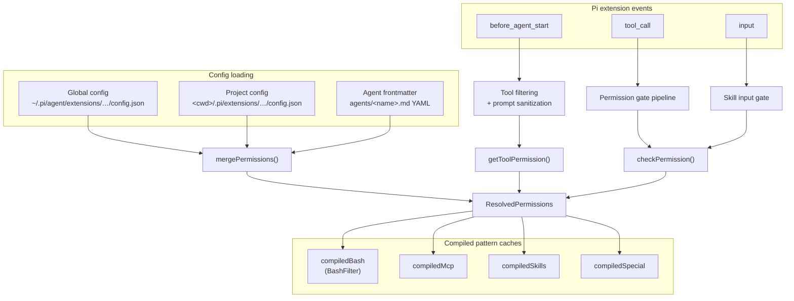
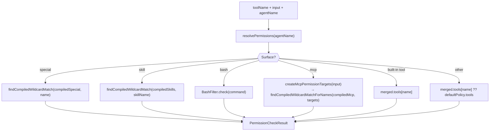

# Current Architecture

This document describes the permission system's as-is design, identifies structural strengths worth preserving, and names the debt that motivates the target architecture.

## Overview

The extension intercepts Pi's extension lifecycle events and applies policy-driven permission gates before tool execution.
Policy is loaded from JSON config files (global, project, per-agent frontmatter), merged by precedence, and checked against tool call inputs at runtime.



## Module map

```text
src/
├── index.ts                  Main extension factory — event wiring, ~1050 lines
├── permission-manager.ts     Config loading + merge + checkPermission(), ~940 lines
├── permission-gate.ts        Pure deny/ask/allow gate (injected IO)
├── permission-dialog.ts      Dialog options: Yes / Yes for session / No / No with reason
├── session-rules.ts          Ephemeral session approvals — Ruleset-based, external_directory only
├── bash-filter.ts            Wildcard matching for bash commands
├── wildcard-matcher.ts       Compiled glob → RegExp engine
├── external-directory.ts     Path-outside-cwd detection and prompt formatting (tree-sitter-bash AST for bash commands)
├── skill-prompt-sanitizer.ts Skill prompt filtering by policy
├── system-prompt-sanitizer.ts Remove denied tools from system prompt text
├── tool-input-preview.ts     Extract loggable context from tool inputs
├── tool-registry.ts          Validate tool names against registered tools
├── config-loader.ts          JSON/JSONC parsing, legacy path detection
├── config-paths.ts           Canonical path derivation for all config scopes
├── extension-config.ts       Runtime knobs (debugLog, yoloMode, etc.)
├── config-reporter.ts        Build structured log entries for resolved config
├── config-modal.ts           /permission-system slash command UI
├── permission-prompts.ts     User-facing message formatting per surface
├── active-agent.ts           Detect current agent name from session/system prompt
├── subagent-context.ts       Detect subagent execution for forwarding
├── permission-forwarding.ts  Constants for cross-session approval forwarding
├── forwarded-permissions/    Poll-based approval forwarding for subagents
├── logging.ts                JSONL review/debug log writer
├── status.ts                 Footer status bar integration
├── yolo-mode.ts              Auto-approve logic
├── common.ts                 Shared parsing utilities
├── types.ts                  Core type definitions
└── before-agent-start-cache.ts  Memoization for prompt sanitization
```

## Data model

### Config shape (on disk)

```jsonc
{
  "defaultPolicy": { "tools": "ask", "bash": "ask", "mcp": "ask", "skills": "ask", "special": "ask" },
  "tools":   { "read": "allow", "write": "deny" },
  "bash":    { "git status": "allow", "git *": "ask" },
  "mcp":     { "exa:*": "allow", "mcp_status": "allow" },
  "skills":  { "*": "ask" },
  "special": { "external_directory": "ask" }
}
```

### Runtime types

```typescript
type PermissionState = "allow" | "deny" | "ask";

// Per-surface maps — all the same underlying shape
type ToolPermissions    = Record<string, PermissionState>;
type BashPermissions    = Record<string, PermissionState>;
type SkillPermissions   = Record<string, PermissionState>;
type SpecialPermissions = Record<string, PermissionState>;

interface PermissionDefaultPolicy {
  tools: PermissionState;
  bash: PermissionState;
  mcp: PermissionState;
  skills: PermissionState;
  special: PermissionState;
}

interface GlobalPermissionConfig {
  defaultPolicy: PermissionDefaultPolicy;
  tools: ToolPermissions;
  bash: BashPermissions;
  mcp: ToolPermissions;
  skills: SkillPermissions;
  special: SpecialPermissions;
}
```

### Permission check flow



## Strengths to preserve

### 1. MCP multi-name target derivation

Pi's MCP integration surfaces tools with munged names like `search_exa` (tool_server) with no reliable delimiter.
`createMcpPermissionTargets()` generates a priority-ordered candidate list:

```text
MCP call to tool "search" on server "exa":
  → exa_search     (server_tool)
  → exa:search     (qualified)
  → exa            (server-level)
  → search         (bare tool)
  → mcp_call       (operation-level)
```

`findCompiledWildcardMatchForNames()` returns the first match across candidates — so users can write `exa: allow` or `exa:search: deny` at different specificity levels.
This multi-name lookup with priority ordering is unique to our platform and cannot be reduced to a single-pattern evaluation.

### 2. Per-surface default policy

```jsonc
{ "defaultPolicy": { "tools": "allow", "bash": "ask", "mcp": "deny", "skills": "allow" } }
```

One declaration sets different baselines per surface.
A flat catch-all (`"*": "ask"`) requires explicit rules per surface to achieve the same effect.

### 3. Two-phase checking: tool exposure vs invocation

- `getToolPermission(toolName)` — used in `before_agent_start` to filter tools from the LLM entirely.
  Checks tool-level policy without inspecting command/input patterns.
- `checkPermission(toolName, input)` — used in `tool_call` to gate specific invocations.

This separation prevents the agent from seeing tools it can never use — a stronger posture than letting it try and fail.

### 4. Compiled regex caching

Wildcard patterns are compiled to `RegExp` once at config-load time, keyed by file mtime.
Re-evaluation skips regex construction entirely when config files haven't changed.

### 5. Deterministic last-match-wins semantics

Both our `findCompiledWildcardMatch()` (reverse iteration) and OpenCode's `findLast()` use last-match-wins.
Our semantics are already aligned with the target model.

## Structural debt

### 1. Surface-specific branching in `checkPermission()`

The method is a ~120-line `if/else if` chain dispatching on `toolName`.
Every branch does the same thing: match input against compiled patterns, fall back to default.
Only MCP has genuinely different logic (multi-name lookup + baseline auto-allow).

### 2. Redundant type aliases

`ToolPermissions`, `BashPermissions`, `SkillPermissions`, `SpecialPermissions` are all `Record<string, PermissionState>`.
Four aliases for the same shape.
The compiler cannot distinguish them, so they add cognitive overhead without type safety.

### 3. ~~Two separate matching mechanisms for session approvals~~ *(resolved by #57)*

`SessionRules` now stores approvals as a plain `Ruleset` and evaluates them via `evaluate()` / `wildcardMatch()`.
The former `SessionApprovalCache` prefix-matching engine (`isPathWithinDirectory()`) has been removed.

### 4. Monolithic `index.ts`

~1050 lines with six inline event handler closures sharing mutable state via closure variables.
Covered by existing issues #42 (extract handlers) and #43 (eliminate module-scope state).

### 5. Config loading mixed into `PermissionManager`

`PermissionManager` handles file I/O, YAML frontmatter parsing, mtime-based caching, MCP server name discovery, config issue accumulation, **and** permission evaluation — all in one 940-line class.
Permission evaluation is not independently testable without a filesystem.

### 6. `external_directory` gating lives in `index.ts`, not in `checkPermission()`

The external-directory and bash-external-directory gates are ~150 lines of inline logic in the `tool_call` handler, separate from `checkPermission()`.
Session approval cache lookup, prompt formatting, and gate application are interleaved with the main permission flow.
