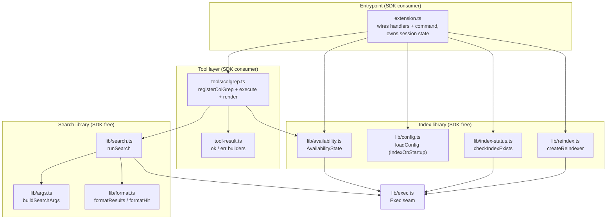
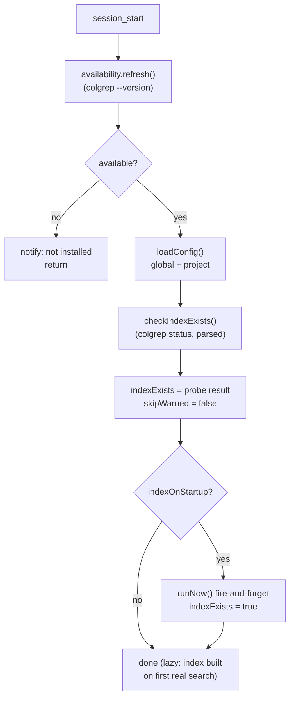
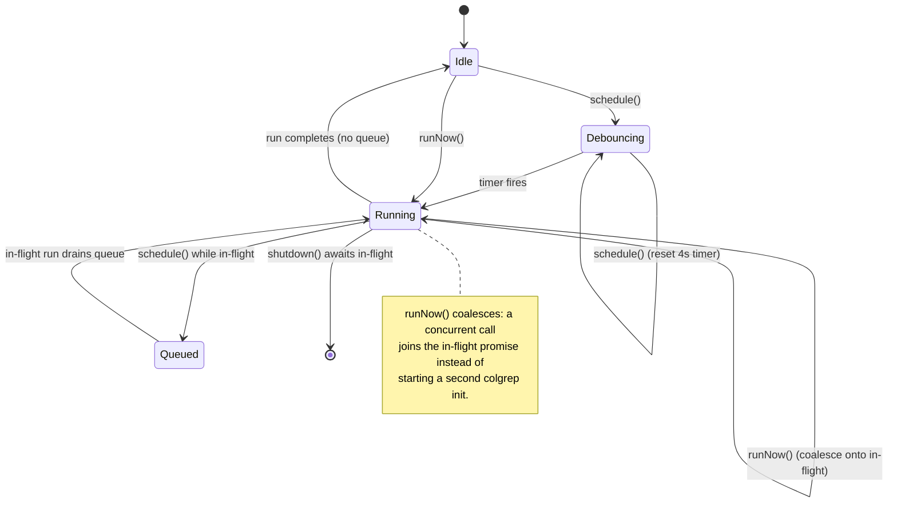

# Architecture

This document describes the internal design of `@gotgenes/pi-colgrep`: a Pi extension that exposes the [ColGrep](https://github.com/lightonai/next-plaid#colgrep) semantic code-search CLI as an agent tool and keeps its index current across a session.

## Design principles

1. **SDK-free libraries** — every module under `src/lib/` is free of Pi SDK imports.
   They accept their dependencies (an `Exec` function, paths, strings) as parameters, so each is a pure unit testable in isolation.
   Only the entrypoint (`extension.ts`) and the tool registration (`tools/colgrep.ts`) consume the SDK.
2. **One narrow seam to the outside world** — all process execution goes through the `Exec` type (`src/lib/exec.ts`), a structural subset of `pi.exec()`.
   The CLI is never spawned directly from a library module.
3. **Degrade, never throw** — colgrep is an optional external binary.
   Availability checks, index probes, and reindex runs resolve to a safe default (unavailable, no-index, logged failure) rather than throwing, so a missing or failing CLI never blocks the agent.
4. **Non-blocking by default** — index builds run in the background.
   Startup never waits on indexing; the session becomes usable immediately.
5. **Index only what is searched** — the extension does not proactively index a directory the operator never searches.
   The write/edit auto-reindex is gated on whether an index already exists.
6. **State owns its transitions** — the reindexer encapsulates its debounce timer, in-flight tracking, and queue behind a three-method interface (`schedule` / `runNow` / `shutdown`); callers tell it what happened and never inspect its internals.

## Module organization

The package has two cooperating concerns — a **search path** (agent invokes the tool) and an **index-management path** (the extension keeps the index warm) — both reaching the CLI through the shared `Exec` seam.

## Search flow

When the agent invokes the `colgrep` tool:

1. `executeColGrepSearch` (in `tools/colgrep.ts`) reads the cached `AvailabilityState`; if colgrep is unavailable it returns an `err` result immediately.
2. It rejects calls with neither `query` nor `regex`.
3. `runSearch` (`lib/search.ts`) builds the CLI arguments with `buildSearchArgs` (`lib/args.ts`), runs `colgrep --json …` through `Exec`, and passes stdout to `formatResults` (`lib/format.ts`), which turns the JSON hit array into concise `path:start-end [score=…]` lines relative to the search directory.
4. Oversized output is truncated with the SDK's `truncateHead`; the full result is written to a temp file and referenced in the tool result.

The search path is read-only and independent of the index-management path — it shares only the `Exec` seam and the `AvailabilityState`.

## Index-management lifecycle

The extension keeps a session-scoped reindexer plus two flags: `indexExists` (does an index exist for this `cwd`) and `skipWarned` (has the one-time skip notice fired).

### Session start

The startup index is launched with `void reindexer.runNow()` — the handler returns before the build completes, so Pi startup is never blocked.
The `runNow()` call synchronously starts the underlying `colgrep init` (up to its first `await`) and records the in-flight promise, so `session_shutdown` can await it.

### File mutations

On a successful `write`/`edit` `tool_result`:

- If `indexExists` is `false`, the reindex is skipped.
  The first skip emits a single `info` notice pointing at `/colgrep-reindex`; subsequent skips are silent (`skipWarned`).
- Otherwise `reindexer.schedule()` requests a debounced (4 s) reindex.

This gate means a directory the operator never searches — and never starts indexing — is never indexed proactively by edit activity.
A real `colgrep` search still auto-indexes on demand regardless, because the CLI builds a missing index when searched.

### Manual reindex

`/colgrep-reindex` runs `reindexer.runNow()` immediately, then sets `indexExists = true` — re-enabling write/edit auto-reindex for the rest of the session.
If colgrep is unavailable it warns instead.

### Session shutdown

`session_shutdown` calls `reindexer.shutdown()`, which cancels any pending debounce timer and awaits the in-flight run (including a backgrounded startup index).

## Reindexer state machine

`createReindexer` (`lib/reindex.ts`) serializes all index builds.
A single `colgrep init` runs at a time; concurrent requests collapse rather than spawn parallel processes.

The coalescing guard is race-free because `runReindex()` sets the in-flight flag synchronously, before its first `await`, so a second synchronous caller always observes it.

## Configuration

Optional JSON config is read from two locations, project overriding global (mirroring `pi-github-tools` and `pi-subagents-worktrees`):

| Scope   | Path                                           |
| ------- | ---------------------------------------------- |
| Global  | `<agentDir>/extensions/pi-colgrep/config.json` |
| Project | `<cwd>/.pi/extensions/pi-colgrep/config.json`  |

| Key              | Type    | Default | Effect                                                                                                                                 |
| ---------------- | ------- | ------- | -------------------------------------------------------------------------------------------------------------------------------------- |
| `indexOnStartup` | boolean | `true`  | When `false`, no background index runs on session start; the index is built lazily on the first real search or via `/colgrep-reindex`. |

A missing file is silent; a malformed file is ignored with a `[pi-colgrep]` warning and defaults apply.
`loadConfig` resolves to a fully-defaulted `ColGrepConfig`; `normalizeConfig` rejects non-boolean values.

## File reference

| File                      | Responsibility                                                                                                                                             |
| ------------------------- | ---------------------------------------------------------------------------------------------------------------------------------------------------------- |
| `src/extension.ts`        | Entrypoint: registers the tool, the `session_start` / `tool_result` / `session_shutdown` handlers, and the `/colgrep-reindex` command; owns session state. |
| `src/tools/colgrep.ts`    | Registers the `colgrep` tool; `executeColGrepSearch` core logic; call/result rendering.                                                                    |
| `src/tool-result.ts`      | `ok` / `err` builders for SDK-compatible tool results.                                                                                                     |
| `src/lib/exec.ts`         | `Exec` type — the single seam to process execution.                                                                                                        |
| `src/lib/availability.ts` | `checkAvailability` + cached `AvailabilityState` (`colgrep --version`).                                                                                    |
| `src/lib/config.ts`       | `loadConfig`, `normalizeConfig`, and config path builders.                                                                                                 |
| `src/lib/index-status.ts` | `checkIndexExists` + the pure `indexExistsFromStatus` parser.                                                                                              |
| `src/lib/reindex.ts`      | `createReindexer`: debounce, queue, coalesce, and shutdown.                                                                                                |
| `src/lib/search.ts`       | `runSearch`: build args, exec, format.                                                                                                                     |
| `src/lib/args.ts`         | `buildSearchArgs`: `SearchParams` → CLI argv.                                                                                                              |
| `src/lib/format.ts`       | `formatResults` / `formatHit`: colgrep `--json` → agent-friendly text.                                                                                     |

## Testability

Because every library module takes its collaborators as parameters, tests inject a mocked `Exec` and assert on argument lists and return values — no child processes spawned.
The reindexer's timer behavior is exercised with Vitest fake timers.
Extension-level wiring tests drive a lightweight `TestPi` stub and mock `#src/lib/config` to control `indexOnStartup` without touching the filesystem.
