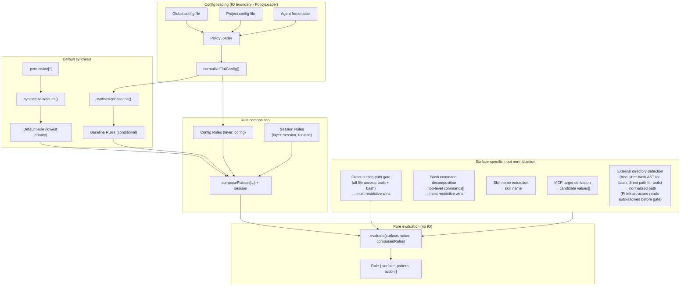
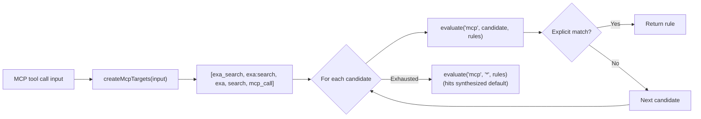
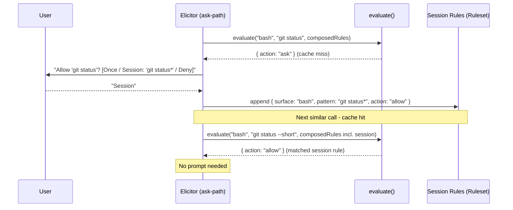
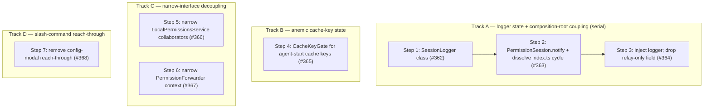

# Architecture

This document describes the internal design of the permission system, informed by [OpenCode's permission model](https://opencode.ai/docs/permissions/).

## Design principles

1. **Unified rule model** - one `Rule` type, one evaluation function, all surfaces.
2. **Pure evaluation** - permission decisions are pure functions of (surface, pattern, rules).
   IO stays at the edges.
3. **Session approvals are just more rules** - no separate matching engine, no separate pre-check.
4. **MCP stays special** - multi-name target derivation is pre-processing, not a special evaluation path.
5. **Defaults are rules** - the universal default (`permission["*"]`) is synthesized as a low-priority rule in the array.
   No side-channel fallbacks.
6. **Flat config format** - the flat `permission: { ... }` object where each key is a surface.
   The config IS the ruleset in human-friendly form.
7. **Preserve the two-phase model** - tool filtering (before_agent_start) and invocation gating (tool_call) remain separate.
8. **Ask = cache miss** - "ask" is the absence of a matching rule.
   The human is the oracle.
   Their decision is a rule.
   Persistence determines lifetime (once / session / config).

## Core data model

### Rule

```typescript
/**
 * Provenance of a rule - which source contributed it.
 *
 * Config scopes: "global", "project", "agent", "project-agent".
 * Synthesized:   "builtin" (universal default / evaluate() fallback),
 *                "baseline" (conditional MCP metadata auto-allow).
 * Runtime:       "session" (session approvals).
 */
type RuleOrigin =
  | "global"
  | "project"
  | "agent"
  | "project-agent"
  | "builtin"
  | "baseline"
  | "session";

interface Rule {
  /** The permission surface: "bash", "edit", "mcp", "skill", "external_directory", "path", etc. */
  surface: string;
  /** The match pattern: a command glob, tool name, file path, skill name, or "*". */
  pattern: string;
  /** The decision. */
  action: PermissionState;
  /**
   * Origin layer - used to derive PermissionCheckResult.source after evaluation.
   * Not used by evaluate(); purely informational metadata.
   */
  layer?: "default" | "baseline" | "config" | "session";
  /** Which source contributed this rule. */
  origin: RuleOrigin;
}
```

Every config entry, default policy, session approval, and agent override normalizes into `Rule[]`.

### Ruleset

```typescript
type Ruleset = Rule[];
```

Merge precedence is array ordering.
The synthesized universal default goes first (lowest priority), then MCP baseline auto-allow rules, then config rules (global → project → agent → project-agent), and finally session rules (highest priority).
Last-match-wins: `evaluate()` scans from the end.

### Evaluate

```typescript
function evaluate(surface: string, value: string, rules: Ruleset): Rule {
  for (let i = rules.length - 1; i >= 0; i--) {
    const rule = rules[i];
    if (wildcardMatch(rule.surface, surface) && wildcardMatch(rule.pattern, value)) {
      return rule;
    }
  }
  // Unreachable when defaults are synthesized - the catch-all always matches.
  return { surface, pattern: value, action: "ask" };
}
```

The entire decision engine.
When defaults are synthesized into the array, the catch-all `{ surface: "*", pattern: "*", action: "ask" }` always matches - the fallback return is defensive only.

## Composed ruleset

All rule sources are concatenated into a single flat array.
Index position determines priority (higher index wins):

```text
  ┌─────────────────────────────────────────────────────────────────┐
  │                     Composed Ruleset (Rule[])                   │
  │                                                                 │
  │  Index 0: Synthesized universal default (layer: "default")      │
  │    { surface: "*", pattern: "*", action: permission["*"] }      │
  │                                                                 │
  │  Index 1..B: MCP baseline auto-allow (layer: "baseline")        │
  │    (only when any config rule has surface:"mcp" action:"allow") │
  │    { surface: "mcp", pattern: "mcp_status",   action: "allow" } │
  │    { surface: "mcp", pattern: "mcp_list",     action: "allow" } │
  │    { surface: "mcp", pattern: "mcp_search",   action: "allow" } │
  │    { surface: "mcp", pattern: "mcp_describe", action: "allow" } │
  │    { surface: "mcp", pattern: "mcp_connect",  action: "allow" } │
  │                                                                 │
  │  Index B+1..C: Config rules (global → project → agent,         │
  │                   layer: "config", origin: "global"|"project"   │
  │                   |"agent"|"project-agent")                     │
  │    { surface: "bash",  pattern: "*",     action: "allow",       │
  │      origin: "global" }                                         │
  │    { surface: "bash",  pattern: "git *", action: "allow",       │
  │      origin: "global" }                                         │
  │    { surface: "bash",  pattern: "rm *",  action: "deny",        │
  │      origin: "project" }                                        │
  │    { surface: "read",  pattern: "*",     action: "allow",       │
  │      origin: "global" }                                         │
  │    { surface: "mcp",   pattern: "exa:*", action: "allow",       │
  │      origin: "agent" }                                          │
  │                                                                 │
  │  Index C+1..end: Session rules (layer: "session", highest)      │
  │    { surface: "external_directory", pattern: "/other/*",        │
  │      action: "allow" }                                          │
  │                                                                 │
  │  ◄── evaluate() scans from end, first match wins ──►            │
  └─────────────────────────────────────────────────────────────────┘
```

`synthesizeDefaults()` produces a single universal catch-all from `permission["*"]`.
Per-surface catch-alls (e.g. `bash: { "*": "allow" }`) are expressed as regular config rules via `normalizeFlatConfig()` - no separate override layer is needed.

`synthesizeBaseline()` conditionally emits MCP metadata auto-allow rules.

`composeRuleset()` concatenates: defaults + baseline + config rules.
Session rules are concatenated after config rules so `evaluate()` handles them via last-match-wins - no separate per-branch pre-check.

### Default synthesis

```typescript
// Single universal catch-all from permission["*"].
function synthesizeDefaults(universalDefault: PermissionState): Ruleset {
  return [
    { surface: "*", pattern: "*", action: universalDefault, layer: "default" },
  ];
}

// MCP metadata auto-allow - only synthesized when any config rule has
// surface: "mcp" && action: "allow".
function synthesizeBaseline(configRules: Ruleset): Ruleset { ... }

// Concat in priority order: defaults, baseline, config.
function composeRuleset(defaults, baseline, config): Ruleset {
  return [...defaults, ...baseline, ...config];
}
```

## Architecture overview



## Config format

```jsonc
{
  "permission": {
    "*": "ask",
    "read": "allow",
    "bash": { "*": "allow", "git *": "allow", "npm *": "allow", "rm *": "deny" },
    "mcp": { "*": "ask", "exa:*": "allow" },
    "skill": { "*": "ask", "librarian": "allow" },
    "path": { "*": "allow", "*.env": "deny" },
    "external_directory": "ask"
  }
}
```

Each top-level key in `permission` is a surface name.
A string value is shorthand for `{ "*": action }` (surface-level catch-all).
An object value maps patterns to actions.
`permission["*"]` is the universal fallback.

### Normalization to Rule[]

```typescript
function normalizeFlatConfig(permission: FlatPermissionConfig): Ruleset {
  const rules: Ruleset = [];

  for (const [surface, value] of Object.entries(permission)) {
    if (typeof value === "string") {
      // Shorthand: "read": "allow" → { surface: "read", pattern: "*", action: "allow" }
      rules.push({ surface, pattern: "*", action: value as PermissionState });
    } else {
      // Object: "bash": { "*": "ask", "git *": "allow" }
      for (const [pattern, action] of Object.entries(value)) {
        rules.push({ surface, pattern, action: action as PermissionState });
      }
    }
  }

  return rules;
}
```

## MCP pre-processing

MCP is the one surface that requires pre-processing **before** evaluation.
The multi-name target derivation stays, but it feeds candidate values into `evaluate()` rather than a separate code path:



The priority ordering of candidates is preserved.
The evaluation function is unchanged - MCP just calls it multiple times with different values.
MCP target derivation helpers live in `src/mcp-targets.ts`.
Input normalization for all surfaces lives in `src/input-normalizer.ts`.

### Path-bearing tool normalization

For path-bearing tools (`read`, `write`, `edit`, `find`, `grep`, `ls`), `normalizeInput` returns the file path from `input.path` as the match value instead of `"*"`.
This enables per-tool path patterns: `"read": { "*": "allow", "*.env": "deny" }` denies reads of `.env` files while allowing everything else.
When `input.path` is missing or empty, the value falls back to `"*"` (surface-level catch-all), preserving backward compatibility.
Path values are home-expanded via `expandHomePath` before matching, so `~/...` and `$HOME/...` values match home-anchored patterns (`~/.ssh/*`) just as absolute paths do.
`getToolPermission()` is unaffected - it always evaluates with `"*"` to determine whether to inject the tool at agent start.

## Session approvals: the cache-miss model

Session rules are stored as `Ruleset` and are generalized to all surfaces.

`evaluate()` is a **lookup** against cached decisions.
When no rule matches (or the matching rule says "ask"), the system has a cache miss - it needs the human oracle to produce a decision.

The human's response is simultaneously:

1. **The answer** for this request (allow or deny).
2. **A rule** that can be cached for future lookups.

The dialog determines **persistence** - where the rule lives:

```text
  evaluate(surface, value, composedRules)
       │
       ├── match.action = "allow" → proceed (cache hit)
       ├── match.action = "deny"  → block (cache hit)
       │
       └── match.action = "ask"   → cache miss, query oracle
                │
                ▼
           Dialog: "[surface] wants to [value]"
                │
                ├── "Yes"              → allow this request (no persistence)
                ├── "Yes, for session" → allow + store in session layer
                │                        (future lookups hit without asking)
                ├── "No"               → deny this request (no persistence)
                └── (future: "Always") → allow + store in config layer (disk)
```

### Pattern suggestions

When prompting, each surface suggests a **pattern** for the "for session" option.
The pattern determines what class of future requests auto-approve:

| Surface                | Input value                 | Suggested session pattern   | Mechanism                |
| ---------------------- | --------------------------- | --------------------------- | ------------------------ |
| bash                   | `git checkout main`         | `git checkout *`            | Arity table              |
| bash                   | `npm run dev`               | `npm run dev`               | Arity table              |
| tool (read/write/etc.) | tool surface itself         | `*` (all uses of that tool) | Tool-level               |
| mcp                    | `exa:search`                | `exa:*`                     | Server-level wildcard    |
| skill                  | `librarian`                 | `librarian`                 | Exact name               |
| external_directory     | `/other/project/src/foo.ts` | `/other/project/*`          | Directory prefix as glob |

The suggestion is shown in the dialog text so the user sees what they're approving:

```text
  ● Allow once
  ● Allow "git checkout *" for this session
  ● Deny
```

### Implementation



## Two-phase checking

### Phase 1: Tool filtering (`before_agent_start`)

```typescript
function shouldExposeTool(toolName: string, rules: Ruleset): boolean {
  const rule = evaluate(toolName, "*", rules);
  return rule.action !== "deny";
}
```

Uses `evaluate()` with pattern `"*"` - "is this tool denied at the surface level, regardless of specific input?"

### Phase 2: Invocation gating (`tool_call`)

```typescript
// Surface-specific input normalization (what to query)
const { surface, value } = normalizeInput(toolName, input);

// Single evaluation against the composed ruleset (how to decide)
const rule = evaluate(surface, value, composedRules);

if (rule.action === "allow") return proceed;
if (rule.action === "deny") return block;
// rule.action === "ask" - elicit from oracle
const decision = await elicitRule(surface, value, suggestPattern(surface, value));
if (decision.persistence === "session") {
  sessionRules.approve(surface, decision.pattern);
}
return decision.action === "allow" ? proceed : block;
```

Same `evaluate()`, same ruleset.
The only surface-specific logic is input normalization (what `surface` and `value` to look up) and pattern suggestion (what glob to offer for "session" approval).

`checkPermission()` uses a single evaluate path: `normalizeInput()` → `evaluateFirst()` → `deriveSource()` → single result object.

## Subagent detection and permission forwarding

When `ask`-state permissions arise in a headless subagent child process, the extension forwards the dialog to the parent session rather than silently denying.
This requires two detections:

1. **Is the current process a subagent?**
   - `isSubagentExecutionContext()` in `src/subagent-context.ts`.
2. **What is the parent session ID?**
   - `resolvePermissionForwardingTargetSessionId()` in `src/permission-forwarding.ts`.

### Known extension env var inventory

| Extension                                                                           | Child-process env vars                                                                    | Parent-session env var              |
| ----------------------------------------------------------------------------------- | ----------------------------------------------------------------------------------------- | ----------------------------------- |
| pi-agent-router (original)                                                          | `PI_IS_SUBAGENT`, `PI_SUBAGENT_SESSION_ID`, `PI_AGENT_ROUTER_SUBAGENT`                    | `PI_AGENT_ROUTER_PARENT_SESSION_ID` |
| [nicobailon/pi-subagents](https://github.com/nicobailon/pi-subagents)               | `PI_SUBAGENT_CHILD`, `PI_SUBAGENT_RUN_ID`, `PI_SUBAGENT_CHILD_AGENT`, `PI_SUBAGENT_DEPTH` | none set (see #98)                  |
| [tintinweb/pi-subagents](https://github.com/tintinweb/pi-subagents)                 | none - runs fully in-process via `createAgentSession()`                                   | n/a - deferred to #29               |
| [HazAT/pi-interactive-subagents](https://github.com/HazAT/pi-interactive-subagents) | `PI_SUBAGENT_NAME`, `PI_SUBAGENT_ID`, `PI_SUBAGENT_SESSION`, `PI_SUBAGENT_ACTIVITY_FILE`  | none set (see #98)                  |

### Detection (`isSubagentExecutionContext`)

`isSubagentExecutionContext()` checks three sources in priority order:

1. **Explicit registry** - `@gotgenes/pi-subagents` emits `subagents:child:session-created` before `bindExtensions()`; the permission system's subscriber writes the entry into `SubagentSessionRegistry` synchronously.
   The registry (keyed by **child session id**) is checked first.
   Each concurrent sibling child of the same parent receives a unique session id from `sessionManager.newSession()`, so siblings occupy distinct keys - one sibling's `disposed` event cannot evict another's entry (fixes #298).
   The registry is a process-global singleton (via `getSubagentSessionRegistry()`, backed by `globalThis` + `Symbol.for()`) because each session's `ResourceLoader` creates its own `pi.events` bus: the parent's instance registers the child over the parent bus, while the child's separate jiti instance reads the same global store to detect itself and resolve its forwarding target.
2. **Env vars** (`SUBAGENT_ENV_HINT_KEYS`) - returns `true` when any key is set to a non-empty, non-whitespace value.
   Used by process-based subagent extensions.
3. **Filesystem path** - session-directory path-based fallback (child session dir is nested under `subagentSessionsDir`).

### Parent-session resolution (`resolvePermissionForwardingTargetSessionId`)

`resolvePermissionForwardingTargetSessionId()` checks two sources in priority order:

1. **Explicit registry** - if the caller provides a `sessionId` and `registry`, the registry entry's `parentSessionId` is returned when present.
   Used by in-process subagent extensions.
2. **Env vars** (`SUBAGENT_PARENT_SESSION_ENV_CANDIDATES`) - iterates candidates and returns the first non-empty, non-`"unknown"` value.
   Used by process-based subagent extensions.

Neither nicobailon nor HazAT sets a parent-session env var today, so forwarding still fails for those extensions with an explicit log message pointing to #98.
Adding a new env var candidate when an extension adopts the convention is a one-line change to the array.

### In-process case (resolved)

In-process subagent extensions (e.g. `@gotgenes/pi-subagents`) call `createAgentSession()` directly - no child process is spawned and no env vars are ever set.
`@gotgenes/pi-subagents` publishes `subagents:child:session-created` (before `bindExtensions()`) and `subagents:child:disposed` (in the run's `finally`); `src/subagent-lifecycle-events.ts` subscribes and writes/removes the entry in `SubagentSessionRegistry` synchronously.
The registry is process-global (see `getSubagentSessionRegistry()` in `src/subagent-registry.ts`) so the child's separate jiti instance reads the same store as the parent.
See `src/subagent-registry.ts` and [Subagent Integration](../subagent-integration.md) for details.

### External convention guide

A [permission frontmatter convention guide](../guides/permission-frontmatter-for-subagent-extensions.md) documents how upstream subagent extensions can adopt the `permission:` frontmatter key as a shared convention.
This is a documentation-only proposal - no code dependency is required.
The guide covers the two-layer model, flat format reference, composition examples, and the optional event bus runtime integration.

## Cross-extension service accessor

The primary cross-extension API is a `Symbol.for()`-backed service object on `globalThis`.

Pi's extension loader creates a fresh jiti instance per extension with `moduleCache: false`, isolating module-scoped state.
`Symbol.for()` and `globalThis` are process-global by spec, so they survive this isolation.

The extension publishes a `PermissionsService` object via `publishPermissionsService()` at `session_start`, gated so an in-process subagent child does not clobber the parent's service (#302).
Other extensions retrieve it with `getPermissionsService()` from `import("@gotgenes/pi-permission-system")`.
The `package.json` `exports` field points to `src/service.ts`, which contains the interface, the accessor functions, and the `Symbol.for()` key - no extension machinery.

The `PermissionsService` interface exposes three methods:

- `checkPermission(surface, value?, agentName?)` - full policy query.
- `getToolPermission(toolName, agentName?)` - tool-level permission state (`allow`/`deny`/`ask`) for pre-filtering.
- `registerToolInputFormatter(toolName, formatter)` - register a custom ask-prompt preview for a tool name; returns a disposer (#283).

The event-bus RPC (`permissions:rpc:check`) remains as a zero-dependency fallback for consumers who do not want to add an optional peer dep.
It is deprecated in favor of the service accessor.

`permissions:decision` broadcasts and `permissions:rpc:prompt` remain on the event bus - fire-and-forget observation and async prompt forwarding are the right abstractions for those channels.

## Module structure

```text
src/
├── rule.ts                   Rule type, Ruleset type, evaluate()
├── normalize.ts              Config → Ruleset normalization (flat format)
├── synthesize.ts             Universal default + MCP baseline → Ruleset
├── wildcard-matcher.ts       Compiled glob matching
├── mcp-targets.ts            MCP multi-name target derivation
├── input-normalizer.ts       Surface-specific input normalization → NormalizedInput
├── pattern-suggest.ts        Per-surface approval pattern suggestions
├── bash-arity.ts             Command arity table for bash pattern suggestions
├── expand-home.ts            ~/$HOME expansion for patterns and path values
├── session-approval.ts        SessionApproval value object - owns the single/multi-pattern union; exposes representativePattern and toGateApproval()
├── session-rules.ts          Session approval store (Ruleset wrapper); `implements SessionApprovalRecorder` — `recordSessionApproval(approval)` fan-out delegates to per-pattern `approve()`; injected directly into `GateRunner` as the recorder role (#341)
├── policy-loader.ts          PolicyLoader interface + FilePolicyLoader (file I/O, mtime caching)
├── scope-merge.ts            Cross-scope permission merge + origin-map bookkeeping
├── permission-manager.ts     Scope loading + rule composition + checkPermission(); delegates I/O to PolicyLoader
├── permission-gate.ts        Pure deny/ask/allow gate (injected IO)
├── permission-prompter.ts    Yolo-mode, review logging, UI/forwarding branch; PromptPermissionDetails type
├── permission-dialog.ts      Dialog options (once / session / deny)
├── permission-resolver.ts    `ScopedPermissionResolver` interface - narrow `{ resolve }` role the gate factories / runner / pipeline depend on; `PermissionResolver` concrete class - holds `ScopedPermissionManager` + `SessionRules`, owns `resolve` / `checkPermission` / `getToolPermission` / `getConfigIssues` / `getPolicyCacheStamp`; extracted from `PermissionSession` (#340); the query methods (`getToolPermission` / `getConfigIssues` / `getPolicyCacheStamp`) are now consumed by `AgentPrepHandler` / `SessionLifecycleHandler` (#341)
├── decision-reporter.ts      `DecisionReporter` interface + `GateDecisionReporter` class - owns `SessionLogger` and event bus; writes review-log entries and emits decision events (#322)
├── gate-prompter.ts          `GatePrompter` interface - `canConfirm()` + `prompt(details)`; the prompting role `GateRunner` needs, bound to context by the implementor (#323)
├── prompting-gateway.ts      `PromptingGateway` class - context-owning `GatePrompter` implementation; owns the stored `ExtensionContext`, the can-prompt policy (UI / subagent / yolo-mode), and `prompt(details)` delegation; `PromptingGatewayLifecycle` interface drives `activate`/`deactivate` from `PermissionSession` (#339)
├── session-approval-recorder.ts `SessionApprovalRecorder` interface - records a granted session-scoped approval into the session ruleset; implemented by `SessionRules` (#323, #341)
│
├── permission-session.ts     `PermissionSession` class - state/lifecycle owner: owns context lifecycle, session-rule lifecycle (`reset`/`shutdown`/`reload`), cache keys, skill entries, agent-name resolution, the config gateway, the Tell-Don't-Ask gate inputs, and `notify(message)` (Tell-Don't-Ask UI warn over the owned context, no-op before activation — dissolves the `index.ts` forward-reference cycle, #363); `implements ToolCallGateInputs` (the pipeline's input contract); the resolve role moved to `PermissionResolver` (#340), the recorder role to `SessionRules`, and the three fig-leaf handler role interfaces (`GateHandlerSession` / `AgentPrepSession` / `SessionLifecycleSession`) were retired — handlers depend on the concrete class + `PermissionResolver` (#341)
├── handlers/                 Handler classes with narrow constructor injection
│   ├── index.ts              Barrel re-exports
│   ├── lifecycle.ts          SessionLifecycleHandler (session: `PermissionSession` + resolver: `PermissionResolver` (getConfigIssues) + serviceLifecycle: `ServiceLifecycle`) (#341, #320)
│   ├── before-agent-start.ts AgentPrepHandler (session: `PermissionSession` + resolver: `PermissionResolver` (getToolPermission / getPolicyCacheStamp / skill check) + toolRegistry); shouldExposeTool pure helper (#341)
│   ├── permission-gate-handler.ts PermissionGateHandler (session: `PermissionSession` + toolRegistry + pipeline + skillInputPipeline + runner); `GateRunner` and `GateDecisionReporter` are built in `index.ts` and injected (#325, #329, #341); validateRequestedTool + getEventInput + extractSkillNameFromInput pure helpers
│   └── gates/               Pure descriptor factories + runner
│       ├── types.ts          GateOutcome, ToolCallContext
│       ├── descriptor.ts     GateDescriptor (with DenialContext), GateBypass, GateResult types
│       ├── runner.ts         GateRunner class — constructed with three distinct collaborators: `ScopedPermissionResolver` (resolver), `SessionApprovalRecorder` (`SessionRules` recorder), `GatePrompter` (`PromptingGateway`), plus `DecisionReporter`; `run(gate, agentName, toolCallId)` dispatches null / bypass / descriptor (#341)
│       ├── tool-call-gate-pipeline.ts `ToolCallGateInputs` interface (three query methods: `getActiveSkillEntries`, `getInfrastructureReadDirs`, `getToolPreviewLimits`) + `ToolCallGatePipeline` class — constructed with `ScopedPermissionResolver` + `ToolCallGateInputs`; owns bash-command extraction + single `BashProgram.parse`, `ToolPreviewFormatter` construction, infra-dir list, the six gate producers, and the run loop; `evaluate(tcc, runner)` returns the first block outcome or allow (#327, #340)
│       ├── skill-input-gate-pipeline.ts `SkillInputGateInputs` + `GateNotifier` interfaces + `SkillInputGatePipeline` class — constructed once in the composition root and injected into `PermissionGateHandler`; owns raw `checkPermission` pre-check, deny notify, `describeSkillInputGate` descriptor, request-id mint (`createSkillInputRequestId`), and `runner.run`; `evaluate(skillName, agentName, notifier, runner)` makes the `input` path symmetric with the `tool_call` path (#329, absorbs #330)
│       ├── helpers.ts        deriveDecisionValue, deriveResolution, buildDecisionEvent
│       ├── skill-read.ts     describeSkillReadGate - pure descriptor factory
│       ├── skill-input.ts    describeSkillInputGate - pure descriptor factory for the skill-input gate; takes a pre-computed check result so the runner reuses the caller's check (#326)
│       ├── external-directory.ts describeExternalDirectoryGate - pure descriptor/bypass factory
│       ├── external-directory-messages.ts External-directory ask-prompt formatting (denial messages moved to denial-messages.ts)
│       ├── bash-external-directory.ts describeBashExternalDirectoryGate - pure descriptor/bypass factory over the injected `BashProgram` (`externalPaths(cwd)`); selects the worst uncovered path via `pickMostRestrictive`
│       ├── bash-path.ts      describeBashPathGate - pure descriptor/bypass factory for bash path rules over the injected `BashProgram` (`pathTokens()`); selects the worst uncovered token via `pickMostRestrictive`
│       ├── candidate-check.ts `pickMostRestrictive` - pure deny > ask > allow selection over PermissionCheckResults (first-wins on ties); shared by the bash gates
│       ├── bash-token-classification.ts Pure token classifiers - `classifyTokenAsPathCandidate` (strict: `/`, `~/`, `..`) and `classifyTokenAsRuleCandidate` (broader: also dot-files and relative paths); shared `rejectNonPathToken` predicate
│       ├── bash-program.ts   `BashProgram` value object - parses a bash command once (tree-sitter-bash) and exposes typed slices (`pathTokens()`, cwd-projecting `externalPaths(cwd)`, `commands(): BashCommand[]`); `commands()` splits the chain AND descends into command/process substitutions and subshells, emitting each nested command as an additional `BashCommand` tagged with its execution `context` (never-weaker, #306); `externalPaths(cwd)` projects a running effective working directory across a sequence of current-shell `cd`s, scoping subshells (frame stack) / pipelines / backgrounded commands and persisting brace-group `cd`s, and conservatively flags relative paths after a non-literal `cd` (#307, retiring the single `leadingCdTarget`); `pathTokens()` is cwd-independent and unchanged; owns the AST walker and `cd`-fold projection; classifiers imported from `bash-token-classification.ts`
│       ├── bash-path-extractor.ts Thin facades (`extractTokensForPathRules`, `extractExternalPathsFromBashCommand`) over `BashProgram`
│       ├── bash-command.ts   `resolveBashCommandCheck` - pure combiner over caller-supplied `BashCommand[]` units (the handler decomposes via `BashProgram.commands()`), checks each unit on the `bash` surface, tags the winning result with the offending command's execution `context` (#306), selects via `pickMostRestrictive`, and falls back to the whole command when empty (#301)
│       ├── path.ts           describePathGate - pure descriptor factory for cross-cutting path rules
│       ├── tool.ts           describeToolGate - pure descriptor factory
│       └── index.ts          Barrel re-exports
│
├── index.ts                  Extension factory - event wiring, collaborator construction (~170 lines after #320; established injection-bag wiring kept inline per anti-procedure-splitting rule)
├── permissions-service.ts    `LocalPermissionsService` class - in-process implementation of `PermissionsService`; injected with narrow collaborator interfaces `ScopedPermissionManager`, `Pick<SessionRules, "getRuleset">`, `ToolInputFormatterRegistrar` (#320, narrowed #366)
├── service-lifecycle.ts      `ServiceLifecycle` interface + `PermissionServiceLifecycle` class — owns the process-global service publish (#302 child-gated), ready emit, and session teardown ordering (#320)
├── service.ts                PermissionsService interface, Symbol.for() accessor (cross-extension API)
├── permission-events.ts      Event channel constants, payload types, emit helpers
├── permission-event-rpc.ts   permissions:rpc:check (deprecated) and permissions:rpc:prompt handlers
├── permission-ui-prompt.ts   Centralized construction for `permissions:ui_prompt` event payloads - single source for the emitted contract shape
├── config-store.ts           `ConfigStore` class — owns `config` + `lastConfigWarning`; `ConfigReader`, `SessionConfigStore`, `CommandConfigStore` narrow interfaces (#335, #337)
├── config-loader.ts          File I/O, format detection
├── config-paths.ts           Path derivation
├── extension-paths.ts        `ExtensionPaths` value object - immutable path constants derived from `agentDir` at startup (`computeExtensionPaths`)
├── config-reporter.ts        Structured log entries for resolved config
├── config-modal.ts           /permission-system slash command UI
├── extension-config.ts       Runtime knobs (debugLog, yoloMode, etc.)
│
├── permission-merge.ts        Deep-shallow merge for flat permission configs
├── canonicalize-path.ts       Best-effort symlink resolution via `realpathSync` — walks up to longest existing ancestor and re-appends non-existent tail; ENOENT/ENOTDIR safe, EACCES/ELOOP fall back to lexical form
├── path-utils.ts              Path normalization, within-directory, outside-CWD (canonical), safe-system-path, path-bearing-tool, Pi infrastructure read; `canonicalNormalizePathForComparison` for containment decisions
├── node-modules-discovery.ts  Global node_modules resolution (walk-up + npm root -g fallback)
├── system-prompt-sanitizer.ts Remove denied tools from system prompt
├── skill-prompt-sanitizer.ts  Skill prompt filtering by policy
├── denial-messages.ts         Centralized denial message formatter - DenialContext type, EXTENSION_TAG, formatDenyReason/formatUnavailableReason/formatUserDeniedReason
├── permission-prompts.ts      User-facing ask-prompt formatting + pre-check error messages
├── tool-input-preview.ts              Pure tool-input text utilities (truncation, line counting, count formatting), serialization + default constants
├── tool-input-prompt-formatters.ts    Pure per-tool prompt formatters (edit/write/read) + getPromptPath helper (#314)
├── tool-preview-formatter.ts          ToolPreviewFormatter class - config-dependent prompt + log formatting; seam-first dispatch consults ToolInputFormatterLookup before built-in switch (#266, #283)
├── tool-input-formatter-registry.ts   ToolInputFormatter type, ToolInputFormatterLookup + ToolInputFormatterRegistrar interfaces, ToolInputFormatterRegistry class - persistent registry for custom previews (#283, #366)
├── builtin-tool-input-formatters.ts   Built-in formatters registered at startup: formatMcpInputForPrompt keyed to "mcp" (#283)
├── tool-registry.ts           ToolRegistry interface + tool name validation
├── active-agent.ts            Agent name detection from session/system prompt
├── subagent-context.ts        Subagent execution context detection (registry + env vars + filesystem)
├── subagent-registry.ts       SubagentSessionRegistry class + getSubagentSessionRegistry() process-global accessor - in-process subagent session tracking
├── subagent-lifecycle-events.ts subscribeSubagentLifecycle() - subscribes to @gotgenes/pi-subagents child lifecycle events; registers/unregisters child sessions in SubagentSessionRegistry (ADR 0002)
├── permission-forwarding.ts   Constants for cross-session forwarding (registry + env var resolution)
├── forwarding-manager.ts      `ForwardingController` interface + `ForwardingManager` class - drives the forwarded-permission inbox polling lifecycle; tells `PermissionForwarder.processInbox`
├── forwarded-permissions/     Poll-based approval forwarding for subagents
│   ├── permission-forwarder.ts `PermissionForwarder` class (`ApprovalRequester` + `InboxProcessor`) - owns the forwarding lifecycle: `requestApproval()` polls for the parent's decision, `processInbox()` drains forwarded requests (#315, #316, #317)
│   └── io.ts                  Forwarding filesystem helpers - request/response read-write, location derivation, atomic JSON writes
├── session-logger.ts          `SessionLogger` interface + `PermissionSessionLogger` class; owns JSONL-writer composition, IO-failure warning dedup, and notify sink (#336, [#362])
├── logging.ts                 JSONL review/debug log writer
├── status.ts                  Footer status bar integration
├── yolo-mode.ts               Auto-approve logic
├── common.ts                  Shared parsing utilities
├── types.ts                   Core type definitions (PermissionState, FlatPermissionConfig, etc.)
└── before-agent-start-cache.ts Memoization for prompt sanitization
```

## Improvement roadmap — Phase 5 (proposed)

Phase 4 converted essentially every mutable-state-and-closures bag into a state-owning class, so Phase 5 is deliberately narrow.
A targeted sweep for Tell-Don't-Ask violations — factory closures over mutable state, forward-reference cycles, anemic getter/setter pairs a handler orchestrates by hand, Law-of-Demeter reach-throughs, and concrete-class dependencies that force test casts — turned up seven, and they are the only genuine state-encapsulation and decoupling work left.
The phase does not touch `bash-program.ts` (pure AST parsing — splitting it produces free-function modules, not state-owning behavior) or reframe `Ruleset` (that would be a value object, and it would fight the intentional pure-evaluation design principle).

### Findings summary

`fallow` reports a clean syntactic surface (health 76, 0% dead files, 0% reported dead exports, avg cyclomatic 1.4, no refactoring targets), which is exactly why these findings matter: they are structural smells `fallow` cannot see — a mutable Set hidden in a closure, a `null`-init cast papering over a construction cycle, an anemic accessor quartet a handler drives via ask-then-tell, a relay-only field reached through, and concrete-class constructor types that force `as unknown as` casts in tests.

| Metric                                                              | Phase 5 baseline                                             | Phase 5 target                         |
| ------------------------------------------------------------------- | ------------------------------------------------------------ | -------------------------------------- |
| Health score                                                        | 76 (B)                                                       | ≥ 76 (structural, not score-driven)    |
| Production `as unknown as` casts                                    | 3 (`index.ts` ×1, `config-store.ts` ×2 serialization)        | 2 (serialization only)                 |
| Factory closures over mutable state                                 | 1 (`createSessionLogger`)                                    | 0                                      |
| Forward-reference `null`-init holders in `index.ts`                 | 2 (`configStore`, `sessionNotify`)                           | 0                                      |
| Anemic cache accessors on `PermissionSession`                       | 4 methods over 2 fields                                      | 0 (2 owned `CacheKeyGate` sub-objects) |
| Ask-then-tell pairs in `AgentPrepHandler`                           | 2                                                            | 0                                      |
| Test-only-alive exports                                             | 1 (`shouldApplyCachedAgentStartState`)                       | 0                                      |
| `PermissionSession` constructor arity                               | 7 positional args                                            | 6 (relay-only `logger` dropped)        |
| `session.logger` / `session.getRuntimeContext()?.ui` reach-throughs | 5 (1 notify sink, 3 lifecycle logger, 1 reporter wiring)     | 0                                      |
| `config-modal` controller reach-throughs                            | 1 (`permissionManager` + `session.lastKnownActiveAgentName`) | 0                                      |
| `LocalPermissionsService` concrete-class deps                       | 3                                                            | 0 (narrow interfaces)                  |
| Test `as unknown as` casts removed                                  | —                                                            | −8 (3 service + 5 forwarder ctx)       |

Unchanged guardrails: 0% dead code, avg cyclomatic 1.4, maintainability 91.1, no new public surface.

### Steps

#### Track A — logger state + PermissionSession/composition-root coupling (serial)

The composition-root forward-reference cycle exists *because* the logger needs late-bound config-reading and UI-notify capability, and the `logger` field on `PermissionSession` is relayed straight back out — so these three land in order: make the logger a state-owning class, dissolve the cycle, then drop the relay-only field.

1. Convert `createSessionLogger` into a `SessionLogger` class ([#362])
   - Target: `src/session-logger.ts` — the `createSessionLogger` factory that returns an object literal closing over a mutable `reported: Set<string>` (IO-failure-warning dedup) and the writer.
   - Smell: Category C (mutable closure state) — a bag of state + closures masquerading as a factory.
   - Outcome: a `SessionLogger` class that privately owns `reported` and the writer and exposes `debug` / `review` / `warn`; constructed as `new SessionLogger(deps)`; no factory-closure mutable state remains.

2. Add `PermissionSession.notify()` and dissolve the `index.ts` forward-reference cycle ([#363])
   - Target: `src/permission-session.ts` (new `notify(message)` Tell-Don't-Ask method over the owned context); `src/index.ts` (remove `let configStore = null as unknown as ConfigStore` and the `let sessionNotify` holder, wiring the logger's notify sink as `(m) => session.notify(m)`).
   - Smell: Category C (forward references + the only production `as unknown as` cast + the `getRuntimeContext()?.ui.notify` Law-of-Demeter reach-through).
   - Outcome: production `as unknown as` casts 3 → 2; `index.ts` has no `null`-init holders; the UI-notify reach-through becomes a single tell to the context-owning session.
   - Depends on Step 1 (the logger reshape that lets construction order resolve without the cast).

3. Inject `logger` directly into the lifecycle handler and reporter; drop the relay-only field from `PermissionSession` ([#364])
   - Target: `src/permission-session.ts` (remove the `readonly logger` constructor parameter — never read internally, only relayed — taking the constructor from 7 args to 6); `src/handlers/lifecycle.ts` (accept a `SessionLogger` and call `this.logger.warn/debug` instead of `this.session.logger`); `src/index.ts` (pass the composition-root `logger` to `new GateDecisionReporter(logger, …)` and `new SessionLifecycleHandler(session, resolver, serviceLifecycle, logger)`).
   - Smell: Category C (relay-only dependency / Law-of-Demeter reach-through — the handler talks to `session.logger`, a stranger reached through the session).
   - Outcome: `PermissionSession` no longer exposes `logger`; the three lifecycle reach-throughs and the one reporter-wiring reach-through are gone; the constructor narrows to 6 args.
   - Depends on Step 2 (shares edits to `permission-session.ts` and `index.ts`; serialize to avoid conflicts).

#### Track B — anemic cache-key state (independent)

4. Encapsulate agent-start cache keys in a `CacheKeyGate` class ([#365]) ✓ complete
   - Target: `src/permission-session.ts` (replace the four anemic methods — `shouldUpdateActiveTools` / `commitActiveToolsCacheKey` / `shouldUpdatePromptState` / `commitPromptStateCacheKey` — and their two `string | null` fields with two `CacheKeyGate` instances); `src/handlers/before-agent-start.ts` (collapse the two ask-then-tell pairs into `gate.runIfChanged(key, effect)`); `src/before-agent-start-cache.ts` (remove the dead-in-production `shouldApplyCachedAgentStartState` and fold its comparison into `CacheKeyGate`).
   - Smell: Category C (anemic domain / ask-then-tell — the handler asks "should I update?"
     then tells "commit") plus Category A (a redundant export kept alive only by its own test, which is why `fallow`'s 0%-dead-exports misses it).
   - Outcome: a `CacheKeyGate` class owning a previous key and exposing `runIfChanged(nextKey, effect)`; `PermissionSession`'s four cache methods become two owned sub-objects; the handler's ask-then-tell pairs become single tells; one source of truth for the key comparison; the test-only-alive free function is gone.
   - Touches `permission-session.ts` (different members than Track A) — coordinate the merge if it lands concurrently with Track A.

#### Track C — narrow-interface decoupling for testability (independent)

5. Narrow `LocalPermissionsService` collaborators to interfaces ([#366])
   - Target: `src/permissions-service.ts` — the constructor types the concrete `PermissionManager`, `SessionRules`, and `ToolInputFormatterRegistry` but only calls `checkPermission` / `getToolPermission`, `getRuleset`, and `register`.
   - Smell: Category C (DIP — depending on concrete classes) / Category D (testability — concrete-class types expose private members, so `permissions-service.test.ts` is forced into `as unknown as` casts).
   - Outcome: depends on the existing `ScopedPermissionManager`, `Pick<SessionRules, "getRuleset">`, and a `{ register }` formatter interface; the three `as unknown as` casts in `permissions-service.test.ts` disappear and mocks become plain objects.

6. Narrow `PermissionForwarder`'s context dependency to a local interface ([#367])
   - Target: `src/forwarded-permissions/permission-forwarder.ts` — methods take the full SDK `ExtensionContext` rather than a narrow local interface of the fields actually read.
   - Smell: Category C (platform-type threading) / Category D (testability).
   - Outcome: the five `as unknown as ExtensionContext` casts in `permission-forwarder.test.ts` (the single biggest cluster of the 12 such casts across 7 test files) disappear; a bounded down-payment on the systemic ctx-threading pattern.

#### Track D — slash-command reach-through (independent)

7. Remove the `config-modal` controller reach-through ([#368])
   - Target: `src/config-modal.ts` — the `show` handler chains `controller.permissionManager.getComposedConfigRules(controller.session.lastKnownActiveAgentName ?? undefined)`, reaching through the controller bag to two strangers.
   - Smell: Category C (Law-of-Demeter reach-through).
   - Outcome: collapse the controller's `permissionManager` + `session` fields into a single `getActiveAgentConfigRules()` accessor wired in the composition root, so the command tells one collaborator; the `PermissionSession.lastKnownActiveAgentName` getter is no longer consumed via object-literal wiring (retiring the `fallow` false-positive suppression).

### Step dependency diagram



### Parallel tracks

- Track A (Steps 1–3) — logger state-ownership and the `PermissionSession`/composition-root coupling.
  Serial: Step 1 makes the logger a class; Step 2 dissolves the forward-reference cast the old factory forced; Step 3 drops the relay-only `logger` field.
  Steps 2 and 3 share edits to `permission-session.ts` and `index.ts`, so they land in order.
- Track B (Step 4) — the `CacheKeyGate` encapsulation.
  Independent of Track A in logic; it touches different `PermissionSession` members plus `AgentPrepHandler` and `before-agent-start-cache.ts`, so it can proceed in parallel (coordinate the `permission-session.ts` merge).
- Track C (Steps 5–6) — narrow-interface decoupling that removes forced test casts.
  Independent of Tracks A, B, and D; Steps 5 and 6 touch different files and are independent of each other.
- Track D (Step 7) — the `config-modal` reach-through.
  Independent of all other tracks; touches only `config-modal.ts` and its composition-root wiring.

## Refactoring history

The architecture above is the product of four completed improvement phases.
Each phase's findings, numbered plan, dependency graph, and health metrics are preserved in a per-phase history file under [`history/`](history/).

| Phase | Theme                                         | History                                                                                |
| ----- | --------------------------------------------- | -------------------------------------------------------------------------------------- |
| 1     | Preview formatter extension seam              | [phase-1-preview-formatter-seam.md](history/phase-1-preview-formatter-seam.md)         |
| 2     | Complexity and duplication paydown            | [phase-2-complexity-duplication.md](history/phase-2-complexity-duplication.md)         |
| 3     | State-owning collaborators                    | [phase-3-collaborator-encapsulation.md](history/phase-3-collaborator-encapsulation.md) |
| 4     | Constructibility and god-object decomposition | [phase-4-constructibility.md](history/phase-4-constructibility.md)                     |

### Phase 1 — Preview formatter extension seam (complete)

Made [#266] (configurable preview limits plus the formatter extension seam) tractable by extracting `ToolPreviewFormatter` ([#282]) from the flat `tool-input-preview.ts` bag, threading it through the gate descriptor chain, and adding numeric config normalization.
Four steps, all closed.

### Phase 2 — Complexity and duplication paydown (complete)

Eliminated the five `fallow` refactoring targets — `handleToolCall`, `resolvePermissions`, `runGateCheck`, `bash-path-extractor.ts`, and `stripJsonComments` — and cut test-tree duplication from 9.1% to 7.1% by extracting shared fixtures.
Six steps ([#285]–[#290]), all closed.

### Phase 3 — State-owning collaborators (complete)

Converted the package's remaining bags-of-state-and-closures into class-based collaborators that own their state and expose behavior (Tell-Don't-Ask): the forwarding subsystem (`PermissionForwarder`), the `McpTargetList` value object, the gate-runner rework (`PermissionResolver` → `DecisionReporter` → `GateRunner` → `ToolCallGatePipeline` / `SkillInputGatePipeline` → narrow handler role interfaces), and the `index.ts` composition root (`LocalPermissionsService`, `PermissionServiceLifecycle`).
Sixteen steps ([#314]–[#331]), all closed.

### Phase 4 — Constructibility and god-object decomposition (complete)

Made the core collaborators independently constructable, then split the two god objects they hid behind: injected a single `PermissionManager` into `PermissionSession` (configured once at `session_start`), extracted a `ConfigStore` and an injectable `SessionLogger`, dissolved the `ExtensionRuntime` god object, collapsed the `index.ts` closure bags, and split `PermissionSession`'s fig-leaf role interfaces into distinct collaborators (`PromptingGateway`, `PermissionResolver`) before slimming it to a state/lifecycle owner; the tail retired the 2,785-line `permission-system.test.ts` catch-all into co-located files.
Nine steps ([#334]–[#342]), all closed.

[#266]: https://github.com/gotgenes/pi-packages/issues/266
[#282]: https://github.com/gotgenes/pi-packages/issues/282
[#285]: https://github.com/gotgenes/pi-packages/issues/285
[#290]: https://github.com/gotgenes/pi-packages/issues/290
[#314]: https://github.com/gotgenes/pi-packages/issues/314
[#331]: https://github.com/gotgenes/pi-packages/issues/331
[#334]: https://github.com/gotgenes/pi-packages/issues/334
[#342]: https://github.com/gotgenes/pi-packages/issues/342
[#362]: https://github.com/gotgenes/pi-packages/issues/362
[#363]: https://github.com/gotgenes/pi-packages/issues/363
[#364]: https://github.com/gotgenes/pi-packages/issues/364
[#365]: https://github.com/gotgenes/pi-packages/issues/365
[#366]: https://github.com/gotgenes/pi-packages/issues/366
[#367]: https://github.com/gotgenes/pi-packages/issues/367
[#368]: https://github.com/gotgenes/pi-packages/issues/368
