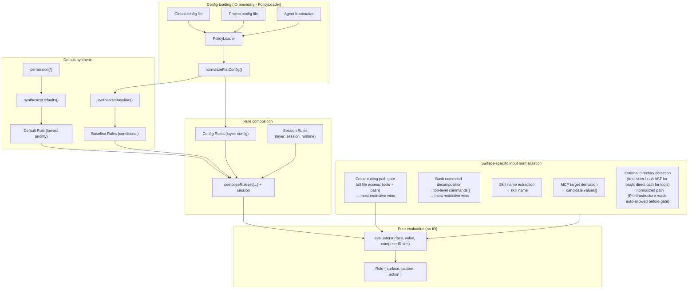
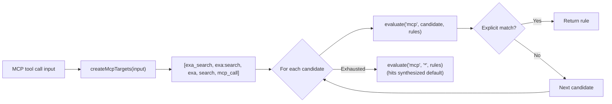
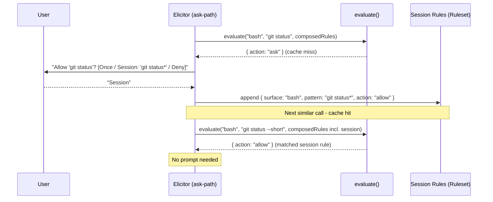
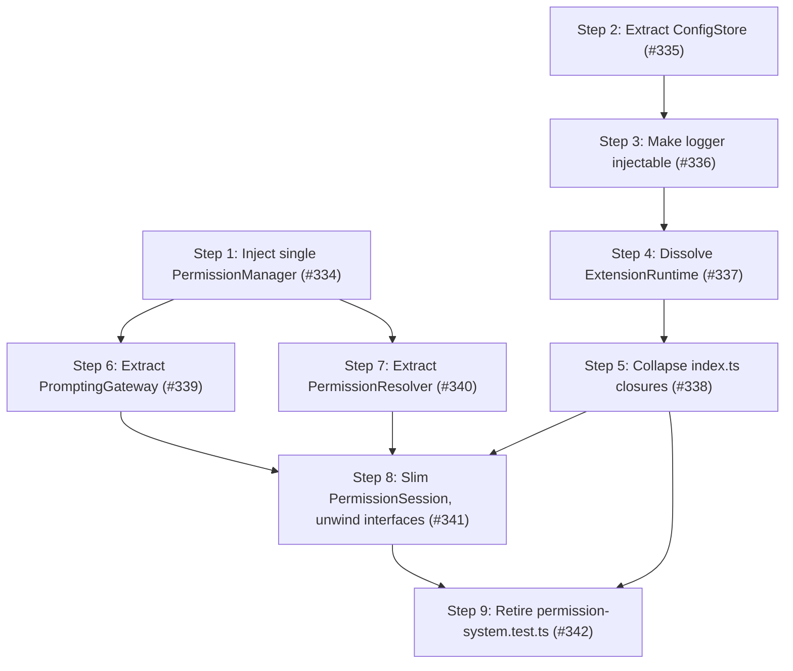

# Architecture

This document describes the internal design of the permission system, informed by [OpenCode's permission model](https://opencode.ai/docs/permissions/).

## Design principles

1. **Unified rule model** - one `Rule` type, one evaluation function, all surfaces.
2. **Pure evaluation** - permission decisions are pure functions of (surface, pattern, rules).
   IO stays at the edges.
3. **Session approvals are just more rules** - no separate matching engine, no separate pre-check.
4. **MCP stays special** - multi-name target derivation is pre-processing, not a special evaluation path.
5. **Defaults are rules** - the universal default (`permission["*"]`) is synthesized as a low-priority rule in the array.
   No side-channel fallbacks.
6. **Flat config format** - the flat `permission: { ... }` object where each key is a surface.
   The config IS the ruleset in human-friendly form.
7. **Preserve the two-phase model** - tool filtering (before_agent_start) and invocation gating (tool_call) remain separate.
8. **Ask = cache miss** - "ask" is the absence of a matching rule.
   The human is the oracle.
   Their decision is a rule.
   Persistence determines lifetime (once / session / config).

## Core data model

### Rule

```typescript
/**
 * Provenance of a rule - which source contributed it.
 *
 * Config scopes: "global", "project", "agent", "project-agent".
 * Synthesized:   "builtin" (universal default / evaluate() fallback),
 *                "baseline" (conditional MCP metadata auto-allow).
 * Runtime:       "session" (session approvals).
 */
type RuleOrigin =
  | "global"
  | "project"
  | "agent"
  | "project-agent"
  | "builtin"
  | "baseline"
  | "session";

interface Rule {
  /** The permission surface: "bash", "edit", "mcp", "skill", "external_directory", "path", etc. */
  surface: string;
  /** The match pattern: a command glob, tool name, file path, skill name, or "*". */
  pattern: string;
  /** The decision. */
  action: PermissionState;
  /**
   * Origin layer - used to derive PermissionCheckResult.source after evaluation.
   * Not used by evaluate(); purely informational metadata.
   */
  layer?: "default" | "baseline" | "config" | "session";
  /** Which source contributed this rule. */
  origin: RuleOrigin;
}
```

Every config entry, default policy, session approval, and agent override normalizes into `Rule[]`.

### Ruleset

```typescript
type Ruleset = Rule[];
```

Merge precedence is array ordering.
The synthesized universal default goes first (lowest priority), then MCP baseline auto-allow rules, then config rules (global → project → agent → project-agent), and finally session rules (highest priority).
Last-match-wins: `evaluate()` scans from the end.

### Evaluate

```typescript
function evaluate(surface: string, value: string, rules: Ruleset): Rule {
  for (let i = rules.length - 1; i >= 0; i--) {
    const rule = rules[i];
    if (wildcardMatch(rule.surface, surface) && wildcardMatch(rule.pattern, value)) {
      return rule;
    }
  }
  // Unreachable when defaults are synthesized - the catch-all always matches.
  return { surface, pattern: value, action: "ask" };
}
```

The entire decision engine.
When defaults are synthesized into the array, the catch-all `{ surface: "*", pattern: "*", action: "ask" }` always matches - the fallback return is defensive only.

## Composed ruleset

All rule sources are concatenated into a single flat array.
Index position determines priority (higher index wins):

```text
  ┌─────────────────────────────────────────────────────────────────┐
  │                     Composed Ruleset (Rule[])                   │
  │                                                                 │
  │  Index 0: Synthesized universal default (layer: "default")      │
  │    { surface: "*", pattern: "*", action: permission["*"] }      │
  │                                                                 │
  │  Index 1..B: MCP baseline auto-allow (layer: "baseline")        │
  │    (only when any config rule has surface:"mcp" action:"allow") │
  │    { surface: "mcp", pattern: "mcp_status",   action: "allow" } │
  │    { surface: "mcp", pattern: "mcp_list",     action: "allow" } │
  │    { surface: "mcp", pattern: "mcp_search",   action: "allow" } │
  │    { surface: "mcp", pattern: "mcp_describe", action: "allow" } │
  │    { surface: "mcp", pattern: "mcp_connect",  action: "allow" } │
  │                                                                 │
  │  Index B+1..C: Config rules (global → project → agent,         │
  │                   layer: "config", origin: "global"|"project"   │
  │                   |"agent"|"project-agent")                     │
  │    { surface: "bash",  pattern: "*",     action: "allow",       │
  │      origin: "global" }                                         │
  │    { surface: "bash",  pattern: "git *", action: "allow",       │
  │      origin: "global" }                                         │
  │    { surface: "bash",  pattern: "rm *",  action: "deny",        │
  │      origin: "project" }                                        │
  │    { surface: "read",  pattern: "*",     action: "allow",       │
  │      origin: "global" }                                         │
  │    { surface: "mcp",   pattern: "exa:*", action: "allow",       │
  │      origin: "agent" }                                          │
  │                                                                 │
  │  Index C+1..end: Session rules (layer: "session", highest)      │
  │    { surface: "external_directory", pattern: "/other/*",        │
  │      action: "allow" }                                          │
  │                                                                 │
  │  ◄── evaluate() scans from end, first match wins ──►            │
  └─────────────────────────────────────────────────────────────────┘
```

`synthesizeDefaults()` produces a single universal catch-all from `permission["*"]`.
Per-surface catch-alls (e.g. `bash: { "*": "allow" }`) are expressed as regular config rules via `normalizeFlatConfig()` - no separate override layer is needed.

`synthesizeBaseline()` conditionally emits MCP metadata auto-allow rules.

`composeRuleset()` concatenates: defaults + baseline + config rules.
Session rules are concatenated after config rules so `evaluate()` handles them via last-match-wins - no separate per-branch pre-check.

### Default synthesis

```typescript
// Single universal catch-all from permission["*"].
function synthesizeDefaults(universalDefault: PermissionState): Ruleset {
  return [
    { surface: "*", pattern: "*", action: universalDefault, layer: "default" },
  ];
}

// MCP metadata auto-allow - only synthesized when any config rule has
// surface: "mcp" && action: "allow".
function synthesizeBaseline(configRules: Ruleset): Ruleset { ... }

// Concat in priority order: defaults, baseline, config.
function composeRuleset(defaults, baseline, config): Ruleset {
  return [...defaults, ...baseline, ...config];
}
```

## Architecture overview



## Config format

```jsonc
{
  "permission": {
    "*": "ask",
    "read": "allow",
    "bash": { "*": "allow", "git *": "allow", "npm *": "allow", "rm *": "deny" },
    "mcp": { "*": "ask", "exa:*": "allow" },
    "skill": { "*": "ask", "librarian": "allow" },
    "path": { "*": "allow", "*.env": "deny" },
    "external_directory": "ask"
  }
}
```

Each top-level key in `permission` is a surface name.
A string value is shorthand for `{ "*": action }` (surface-level catch-all).
An object value maps patterns to actions.
`permission["*"]` is the universal fallback.

### Normalization to Rule[]

```typescript
function normalizeFlatConfig(permission: FlatPermissionConfig): Ruleset {
  const rules: Ruleset = [];

  for (const [surface, value] of Object.entries(permission)) {
    if (typeof value === "string") {
      // Shorthand: "read": "allow" → { surface: "read", pattern: "*", action: "allow" }
      rules.push({ surface, pattern: "*", action: value as PermissionState });
    } else {
      // Object: "bash": { "*": "ask", "git *": "allow" }
      for (const [pattern, action] of Object.entries(value)) {
        rules.push({ surface, pattern, action: action as PermissionState });
      }
    }
  }

  return rules;
}
```

## MCP pre-processing

MCP is the one surface that requires pre-processing **before** evaluation.
The multi-name target derivation stays, but it feeds candidate values into `evaluate()` rather than a separate code path:



The priority ordering of candidates is preserved.
The evaluation function is unchanged - MCP just calls it multiple times with different values.
MCP target derivation helpers live in `src/mcp-targets.ts`.
Input normalization for all surfaces lives in `src/input-normalizer.ts`.

### Path-bearing tool normalization

For path-bearing tools (`read`, `write`, `edit`, `find`, `grep`, `ls`), `normalizeInput` returns the file path from `input.path` as the match value instead of `"*"`.
This enables per-tool path patterns: `"read": { "*": "allow", "*.env": "deny" }` denies reads of `.env` files while allowing everything else.
When `input.path` is missing or empty, the value falls back to `"*"` (surface-level catch-all), preserving backward compatibility.
`getToolPermission()` is unaffected - it always evaluates with `"*"` to determine whether to inject the tool at agent start.

## Session approvals: the cache-miss model

Session rules are stored as `Ruleset` and are generalized to all surfaces.

`evaluate()` is a **lookup** against cached decisions.
When no rule matches (or the matching rule says "ask"), the system has a cache miss - it needs the human oracle to produce a decision.

The human's response is simultaneously:

1. **The answer** for this request (allow or deny).
2. **A rule** that can be cached for future lookups.

The dialog determines **persistence** - where the rule lives:

```text
  evaluate(surface, value, composedRules)
       │
       ├── match.action = "allow" → proceed (cache hit)
       ├── match.action = "deny"  → block (cache hit)
       │
       └── match.action = "ask"   → cache miss, query oracle
                │
                ▼
           Dialog: "[surface] wants to [value]"
                │
                ├── "Yes"              → allow this request (no persistence)
                ├── "Yes, for session" → allow + store in session layer
                │                        (future lookups hit without asking)
                ├── "No"               → deny this request (no persistence)
                └── (future: "Always") → allow + store in config layer (disk)
```

### Pattern suggestions

When prompting, each surface suggests a **pattern** for the "for session" option.
The pattern determines what class of future requests auto-approve:

| Surface                | Input value                 | Suggested session pattern   | Mechanism                |
| ---------------------- | --------------------------- | --------------------------- | ------------------------ |
| bash                   | `git checkout main`         | `git checkout *`            | Arity table              |
| bash                   | `npm run dev`               | `npm run dev`               | Arity table              |
| tool (read/write/etc.) | tool surface itself         | `*` (all uses of that tool) | Tool-level               |
| mcp                    | `exa:search`                | `exa:*`                     | Server-level wildcard    |
| skill                  | `librarian`                 | `librarian`                 | Exact name               |
| external_directory     | `/other/project/src/foo.ts` | `/other/project/*`          | Directory prefix as glob |

The suggestion is shown in the dialog text so the user sees what they're approving:

```text
  ● Allow once
  ● Allow "git checkout *" for this session
  ● Deny
```

### Implementation



## Two-phase checking

### Phase 1: Tool filtering (`before_agent_start`)

```typescript
function shouldExposeTool(toolName: string, rules: Ruleset): boolean {
  const rule = evaluate(toolName, "*", rules);
  return rule.action !== "deny";
}
```

Uses `evaluate()` with pattern `"*"` - "is this tool denied at the surface level, regardless of specific input?"

### Phase 2: Invocation gating (`tool_call`)

```typescript
// Surface-specific input normalization (what to query)
const { surface, value } = normalizeInput(toolName, input);

// Single evaluation against the composed ruleset (how to decide)
const rule = evaluate(surface, value, composedRules);

if (rule.action === "allow") return proceed;
if (rule.action === "deny") return block;
// rule.action === "ask" - elicit from oracle
const decision = await elicitRule(surface, value, suggestPattern(surface, value));
if (decision.persistence === "session") {
  sessionRules.approve(surface, decision.pattern);
}
return decision.action === "allow" ? proceed : block;
```

Same `evaluate()`, same ruleset.
The only surface-specific logic is input normalization (what `surface` and `value` to look up) and pattern suggestion (what glob to offer for "session" approval).

`checkPermission()` uses a single evaluate path: `normalizeInput()` → `evaluateFirst()` → `deriveSource()` → single result object.

## Subagent detection and permission forwarding

When `ask`-state permissions arise in a headless subagent child process, the extension forwards the dialog to the parent session rather than silently denying.
This requires two detections:

1. **Is the current process a subagent?**
   - `isSubagentExecutionContext()` in `src/subagent-context.ts`.
2. **What is the parent session ID?**
   - `resolvePermissionForwardingTargetSessionId()` in `src/permission-forwarding.ts`.

### Known extension env var inventory

| Extension                                                                           | Child-process env vars                                                                    | Parent-session env var              |
| ----------------------------------------------------------------------------------- | ----------------------------------------------------------------------------------------- | ----------------------------------- |
| pi-agent-router (original)                                                          | `PI_IS_SUBAGENT`, `PI_SUBAGENT_SESSION_ID`, `PI_AGENT_ROUTER_SUBAGENT`                    | `PI_AGENT_ROUTER_PARENT_SESSION_ID` |
| [nicobailon/pi-subagents](https://github.com/nicobailon/pi-subagents)               | `PI_SUBAGENT_CHILD`, `PI_SUBAGENT_RUN_ID`, `PI_SUBAGENT_CHILD_AGENT`, `PI_SUBAGENT_DEPTH` | none set (see #98)                  |
| [tintinweb/pi-subagents](https://github.com/tintinweb/pi-subagents)                 | none - runs fully in-process via `createAgentSession()`                                   | n/a - deferred to #29               |
| [HazAT/pi-interactive-subagents](https://github.com/HazAT/pi-interactive-subagents) | `PI_SUBAGENT_NAME`, `PI_SUBAGENT_ID`, `PI_SUBAGENT_SESSION`, `PI_SUBAGENT_ACTIVITY_FILE`  | none set (see #98)                  |

### Detection (`isSubagentExecutionContext`)

`isSubagentExecutionContext()` checks three sources in priority order:

1. **Explicit registry** - `@gotgenes/pi-subagents` emits `subagents:child:session-created` before `bindExtensions()`; the permission system's subscriber writes the entry into `SubagentSessionRegistry` synchronously.
   The registry (keyed by **child session id**) is checked first.
   Each concurrent sibling child of the same parent receives a unique session id from `sessionManager.newSession()`, so siblings occupy distinct keys - one sibling's `disposed` event cannot evict another's entry (fixes #298).
   The registry is a process-global singleton (via `getSubagentSessionRegistry()`, backed by `globalThis` + `Symbol.for()`) because each session's `ResourceLoader` creates its own `pi.events` bus: the parent's instance registers the child over the parent bus, while the child's separate jiti instance reads the same global store to detect itself and resolve its forwarding target.
2. **Env vars** (`SUBAGENT_ENV_HINT_KEYS`) - returns `true` when any key is set to a non-empty, non-whitespace value.
   Used by process-based subagent extensions.
3. **Filesystem path** - session-directory path-based fallback (child session dir is nested under `subagentSessionsDir`).

### Parent-session resolution (`resolvePermissionForwardingTargetSessionId`)

`resolvePermissionForwardingTargetSessionId()` checks two sources in priority order:

1. **Explicit registry** - if the caller provides a `sessionId` and `registry`, the registry entry's `parentSessionId` is returned when present.
   Used by in-process subagent extensions.
2. **Env vars** (`SUBAGENT_PARENT_SESSION_ENV_CANDIDATES`) - iterates candidates and returns the first non-empty, non-`"unknown"` value.
   Used by process-based subagent extensions.

Neither nicobailon nor HazAT sets a parent-session env var today, so forwarding still fails for those extensions with an explicit log message pointing to #98.
Adding a new env var candidate when an extension adopts the convention is a one-line change to the array.

### In-process case (resolved)

In-process subagent extensions (e.g. `@gotgenes/pi-subagents`) call `createAgentSession()` directly - no child process is spawned and no env vars are ever set.
`@gotgenes/pi-subagents` publishes `subagents:child:session-created` (before `bindExtensions()`) and `subagents:child:disposed` (in the run's `finally`); `src/subagent-lifecycle-events.ts` subscribes and writes/removes the entry in `SubagentSessionRegistry` synchronously.
The registry is process-global (see `getSubagentSessionRegistry()` in `src/subagent-registry.ts`) so the child's separate jiti instance reads the same store as the parent.
See `src/subagent-registry.ts` and [Subagent Integration](../subagent-integration.md) for details.

### External convention guide

A [permission frontmatter convention guide](../guides/permission-frontmatter-for-subagent-extensions.md) documents how upstream subagent extensions can adopt the `permission:` frontmatter key as a shared convention.
This is a documentation-only proposal - no code dependency is required.
The guide covers the two-layer model, flat format reference, composition examples, and the optional event bus runtime integration.

## Cross-extension service accessor

The primary cross-extension API is a `Symbol.for()`-backed service object on `globalThis`.

Pi's extension loader creates a fresh jiti instance per extension with `moduleCache: false`, isolating module-scoped state.
`Symbol.for()` and `globalThis` are process-global by spec, so they survive this isolation.

The extension publishes a `PermissionsService` object via `publishPermissionsService()` at `session_start`, gated so an in-process subagent child does not clobber the parent's service (#302).
Other extensions retrieve it with `getPermissionsService()` from `import("@gotgenes/pi-permission-system")`.
The `package.json` `exports` field points to `src/service.ts`, which contains the interface, the accessor functions, and the `Symbol.for()` key - no extension machinery.

The `PermissionsService` interface exposes three methods:

- `checkPermission(surface, value?, agentName?)` - full policy query.
- `getToolPermission(toolName, agentName?)` - tool-level permission state (`allow`/`deny`/`ask`) for pre-filtering.
- `registerToolInputFormatter(toolName, formatter)` - register a custom ask-prompt preview for a tool name; returns a disposer (#283).

The event-bus RPC (`permissions:rpc:check`) remains as a zero-dependency fallback for consumers who do not want to add an optional peer dep.
It is deprecated in favor of the service accessor.

`permissions:decision` broadcasts and `permissions:rpc:prompt` remain on the event bus - fire-and-forget observation and async prompt forwarding are the right abstractions for those channels.

## Module structure

```text
src/
├── rule.ts                   Rule type, Ruleset type, evaluate()
├── normalize.ts              Config → Ruleset normalization (flat format)
├── synthesize.ts             Universal default + MCP baseline → Ruleset
├── wildcard-matcher.ts       Compiled glob matching
├── mcp-targets.ts            MCP multi-name target derivation
├── input-normalizer.ts       Surface-specific input normalization → NormalizedInput
├── pattern-suggest.ts        Per-surface approval pattern suggestions
├── bash-arity.ts             Command arity table for bash pattern suggestions
├── expand-home.ts            ~/$HOME expansion for patterns
├── session-approval.ts        SessionApproval value object - owns the single/multi-pattern union; exposes representativePattern and toGateApproval()
├── session-rules.ts          Session approval store (Ruleset wrapper); record(approval) fan-out delegates to per-pattern approve()
├── policy-loader.ts          PolicyLoader interface + FilePolicyLoader (file I/O, mtime caching)
├── scope-merge.ts            Cross-scope permission merge + origin-map bookkeeping
├── permission-manager.ts     Scope loading + rule composition + checkPermission(); delegates I/O to PolicyLoader
├── permission-gate.ts        Pure deny/ask/allow gate (injected IO)
├── permission-prompter.ts    Yolo-mode, review logging, UI/forwarding branch; PromptPermissionDetails type
├── permission-dialog.ts      Dialog options (once / session / deny)
├── permission-resolver.ts    `PermissionResolver` interface - `resolve(surface, input, agentName)`; collapses the checkPermission + getSessionRuleset relay (#319). Implemented by `PermissionSession`
├── decision-reporter.ts      `DecisionReporter` interface + `GateDecisionReporter` class - owns `SessionLogger` and event bus; writes review-log entries and emits decision events (#322)
├── gate-prompter.ts          `GatePrompter` interface - `canConfirm()` + `promptPermission(details)`; the prompting role `GateRunner` needs, bound to context by the implementor (#323)
├── session-approval-recorder.ts `SessionApprovalRecorder` interface - records a granted session-scoped approval into the session ruleset (#323)
├── gate-handler-session.ts   `GateHandlerSession` interface — two-method context role: `activate`, `resolveAgentName(ctx, systemPrompt?)`. `resolveAgentName` widened to accept optional `systemPrompt` so `AgentPrepHandler` can reuse the role without redefining it (#329, #331). `checkPermission` + `createPermissionRequestId` moved out when `SkillInputGatePipeline` was extracted
├── agent-prep-session.ts     `AgentPrepSession` interface — extends `GateHandlerSession` + `SkillPermissionChecker`; adds `refreshConfig`, `getToolPermission`, the active-tools + prompt-state cache-key pairs, `getPolicyCacheStamp`, `setActiveSkillEntries`. Role `AgentPrepHandler` depends on (#331)
├── session-lifecycle-session.ts `SessionLifecycleSession` interface — `refreshConfig`, `resetForNewSession`, `logResolvedConfigPaths`, `resolveAgentName`, `getConfigIssues`, `reload`, `getRuntimeContext`, `shutdown`, `logger`. Role `SessionLifecycleHandler` depends on; intentionally omits `activate` (ISP) (#331)
│
├── permission-session.ts     `PermissionSession` class - encapsulates all mutable session state; implements `PermissionResolver`, `SessionApprovalRecorder`, `GatePrompter`, `GateHandlerSession`, `AgentPrepSession`, `SessionLifecycleSession`; exposes `getInfrastructureReadDirs()` and `getToolPreviewLimits()` for Tell-Don't-Ask gate inputs (#327); `createPermissionRequestId` relocated to `SkillInputGatePipeline` (#329, absorbs #330); narrowed role interfaces added for all three handlers (#325, #331)
├── handlers/                 Handler classes with narrow constructor injection
│   ├── index.ts              Barrel re-exports
│   ├── lifecycle.ts          SessionLifecycleHandler (session: `SessionLifecycleSession` + serviceLifecycle: `ServiceLifecycle`) (#331, #320)
│   ├── before-agent-start.ts AgentPrepHandler (session: `AgentPrepSession` + toolRegistry); shouldExposeTool pure helper (#331)
│   ├── permission-gate-handler.ts PermissionGateHandler (session: GateHandlerSession + toolRegistry + pipeline + skillInputPipeline + runner); `GateRunner` and `GateDecisionReporter` are built in `index.ts` and injected (#325, #329); validateRequestedTool + getEventInput + extractSkillNameFromInput pure helpers
│   └── gates/               Pure descriptor factories + runner
│       ├── types.ts          GateOutcome, ToolCallContext
│       ├── descriptor.ts     GateDescriptor (with DenialContext), GateBypass, GateResult types
│       ├── runner.ts         GateRunner class — constructed with `PermissionResolver`, `SessionApprovalRecorder`, `GatePrompter`, `DecisionReporter`; `run(gate, agentName, toolCallId)` dispatches null / bypass / descriptor
│       ├── tool-call-gate-pipeline.ts `ToolCallGateInputs` interface + `ToolCallGatePipeline` class — constructed once in the composition root and injected into `PermissionGateHandler`; owns bash-command extraction + single `BashProgram.parse`, `ToolPreviewFormatter` construction, infra-dir list, the six gate producers, and the run loop; `evaluate(tcc, runner)` returns the first block outcome or allow (#327)
│       ├── skill-input-gate-pipeline.ts `SkillInputGateInputs` + `GateNotifier` interfaces + `SkillInputGatePipeline` class — constructed once in the composition root and injected into `PermissionGateHandler`; owns raw `checkPermission` pre-check, deny notify, `describeSkillInputGate` descriptor, request-id mint (`createSkillInputRequestId`), and `runner.run`; `evaluate(skillName, agentName, notifier, runner)` makes the `input` path symmetric with the `tool_call` path (#329, absorbs #330)
│       ├── helpers.ts        deriveDecisionValue, deriveResolution, buildDecisionEvent
│       ├── skill-read.ts     describeSkillReadGate - pure descriptor factory
│       ├── skill-input.ts    describeSkillInputGate - pure descriptor factory for the skill-input gate; takes a pre-computed check result so the runner reuses the caller's check (#326)
│       ├── external-directory.ts describeExternalDirectoryGate - pure descriptor/bypass factory
│       ├── external-directory-messages.ts External-directory ask-prompt formatting (denial messages moved to denial-messages.ts)
│       ├── bash-external-directory.ts describeBashExternalDirectoryGate - pure descriptor/bypass factory over the injected `BashProgram` (`externalPaths(cwd)`); selects the worst uncovered path via `pickMostRestrictive`
│       ├── bash-path.ts      describeBashPathGate - pure descriptor/bypass factory for bash path rules over the injected `BashProgram` (`pathTokens()`); selects the worst uncovered token via `pickMostRestrictive`
│       ├── candidate-check.ts `pickMostRestrictive` - pure deny > ask > allow selection over PermissionCheckResults (first-wins on ties); shared by the bash gates
│       ├── bash-token-classification.ts Pure token classifiers - `classifyTokenAsPathCandidate` (strict: `/`, `~/`, `..`) and `classifyTokenAsRuleCandidate` (broader: also dot-files and relative paths); shared `rejectNonPathToken` predicate
│       ├── bash-program.ts   `BashProgram` value object - parses a bash command once (tree-sitter-bash) and exposes typed slices (`pathTokens()`, cwd-projecting `externalPaths(cwd)`, `commands(): BashCommand[]`); `commands()` splits the chain AND descends into command/process substitutions and subshells, emitting each nested command as an additional `BashCommand` tagged with its execution `context` (never-weaker, #306); `externalPaths(cwd)` projects a running effective working directory across a sequence of current-shell `cd`s, scoping subshells (frame stack) / pipelines / backgrounded commands and persisting brace-group `cd`s, and conservatively flags relative paths after a non-literal `cd` (#307, retiring the single `leadingCdTarget`); `pathTokens()` is cwd-independent and unchanged; owns the AST walker and `cd`-fold projection; classifiers imported from `bash-token-classification.ts`
│       ├── bash-path-extractor.ts Thin facades (`extractTokensForPathRules`, `extractExternalPathsFromBashCommand`) over `BashProgram`
│       ├── bash-command.ts   `resolveBashCommandCheck` - pure combiner over caller-supplied `BashCommand[]` units (the handler decomposes via `BashProgram.commands()`), checks each unit on the `bash` surface, tags the winning result with the offending command's execution `context` (#306), selects via `pickMostRestrictive`, and falls back to the whole command when empty (#301)
│       ├── path.ts           describePathGate - pure descriptor factory for cross-cutting path rules
│       ├── tool.ts           describeToolGate - pure descriptor factory
│       └── index.ts          Barrel re-exports
│
├── index.ts                  Extension factory - event wiring, collaborator construction (~170 lines after #320; established injection-bag wiring kept inline per anti-procedure-splitting rule)
├── permissions-service.ts    `LocalPermissionsService` class - in-process implementation of `PermissionsService`; injected with `PermissionManager`, `SessionRules`, `FormatterRegistry` (#320)
├── service-lifecycle.ts      `ServiceLifecycle` interface + `PermissionServiceLifecycle` class — owns the process-global service publish (#302 child-gated), ready emit, and session teardown ordering (#320)
├── service.ts                PermissionsService interface, Symbol.for() accessor (cross-extension API)
├── permission-events.ts      Event channel constants, payload types, emit helpers
├── permission-event-rpc.ts   permissions:rpc:check (deprecated) and permissions:rpc:prompt handlers
├── permission-ui-prompt.ts   Centralized construction for `permissions:ui_prompt` event payloads - single source for the emitted contract shape
├── runtime.ts                `ExtensionRuntime` interface + `createExtensionRuntime()` factory; delegates config to `ConfigStore` (#335)
├── config-store.ts           `ConfigStore` class — owns `config` + `lastConfigWarning`; `ConfigReader`, `SessionConfigStore`, `CommandConfigStore` narrow interfaces; `RuntimeContextRef` context seam (#335)
├── config-loader.ts          File I/O, format detection
├── config-paths.ts           Path derivation
├── extension-paths.ts        `ExtensionPaths` value object - immutable path constants derived from `agentDir` at startup (`computeExtensionPaths`)
├── config-reporter.ts        Structured log entries for resolved config
├── config-modal.ts           /permission-system slash command UI
├── extension-config.ts       Runtime knobs (debugLog, yoloMode, etc.)
│
├── permission-merge.ts        Deep-shallow merge for flat permission configs
├── path-utils.ts              Path normalization, within-directory, outside-CWD, safe-system-path, path-bearing-tool, Pi infrastructure read
├── node-modules-discovery.ts  Global node_modules resolution (walk-up + npm root -g fallback)
├── system-prompt-sanitizer.ts Remove denied tools from system prompt
├── skill-prompt-sanitizer.ts  Skill prompt filtering by policy
├── denial-messages.ts         Centralized denial message formatter - DenialContext type, EXTENSION_TAG, formatDenyReason/formatUnavailableReason/formatUserDeniedReason
├── permission-prompts.ts      User-facing ask-prompt formatting + pre-check error messages
├── tool-input-preview.ts              Pure tool-input text utilities (truncation, line counting, count formatting), serialization + default constants
├── tool-input-prompt-formatters.ts    Pure per-tool prompt formatters (edit/write/read) + getPromptPath helper (#314)
├── tool-preview-formatter.ts          ToolPreviewFormatter class - config-dependent prompt + log formatting; seam-first dispatch consults ToolInputFormatterLookup before built-in switch (#266, #283)
├── tool-input-formatter-registry.ts   ToolInputFormatter type, ToolInputFormatterLookup interface, ToolInputFormatterRegistry class - persistent registry for custom previews (#283)
├── builtin-tool-input-formatters.ts   Built-in formatters registered at startup: formatMcpInputForPrompt keyed to "mcp" (#283)
├── tool-registry.ts           ToolRegistry interface + tool name validation
├── active-agent.ts            Agent name detection from session/system prompt
├── subagent-context.ts        Subagent execution context detection (registry + env vars + filesystem)
├── subagent-registry.ts       SubagentSessionRegistry class + getSubagentSessionRegistry() process-global accessor - in-process subagent session tracking
├── subagent-lifecycle-events.ts subscribeSubagentLifecycle() - subscribes to @gotgenes/pi-subagents child lifecycle events; registers/unregisters child sessions in SubagentSessionRegistry (ADR 0002)
├── permission-forwarding.ts   Constants for cross-session forwarding (registry + env var resolution)
├── forwarding-manager.ts      `ForwardingController` interface + `ForwardingManager` class - drives the forwarded-permission inbox polling lifecycle; tells `PermissionForwarder.processInbox`
├── forwarded-permissions/     Poll-based approval forwarding for subagents
│   ├── permission-forwarder.ts `PermissionForwarder` class (`ApprovalRequester` + `InboxProcessor`) - owns the forwarding lifecycle: `requestApproval()` polls for the parent's decision, `processInbox()` drains forwarded requests (#315, #316, #317)
│   └── io.ts                  Forwarding filesystem helpers - request/response read-write, location derivation, atomic JSON writes
├── session-logger.ts          SessionLogger interface + createSessionLogger() factory
├── logging.ts                 JSONL review/debug log writer
├── status.ts                  Footer status bar integration
├── yolo-mode.ts               Auto-approve logic
├── common.ts                  Shared parsing utilities
├── types.ts                   Core type definitions (PermissionState, FlatPermissionConfig, etc.)
└── before-agent-start-cache.ts Memoization for prompt sanitization
```

## Improvement roadmap — Phase 4

Goal: make the core collaborators independently constructable, then split the two god objects (`ExtensionRuntime`, `PermissionSession`) they hide behind.

The entry into this phase is the test tree, but the test tree is a symptom, not the disease.
`fallow` reports the production code is "clean" (avg cyclomatic 1.4, p90 2, zero complexity targets, zero dead code, zero production duplication) — but `fallow`'s syntactic metrics do not measure constructibility, closure density, injection seams, or a god object hiding behind narrow role interfaces.
Reading the tests as evidence of how hard the production code is to use reveals the real findings: collaborators that cannot be `new`-ed in isolation, a mutable runtime god object threaded through free functions, and a single 351-line class that implements six interfaces and is passed to one constructor three times.

The lens for this phase is constructibility: "why does this test need `vi.mock` of a module / a 17-field fixture / an `as unknown as` cast, and which production object is too hard to build because of it?".
The test-tree cleanup from the first draft (retiring the `permission-system.test.ts` catch-all, de-duplicating clone families, splitting oversized arrows) is folded in at the tail as a *measured consequence* of the production refactor, not the goal — most of the duplication and fixture weight dissolves once the collaborators are injectable.
Phase 4 is independent of any open feature issue — it is a pure structural round.

This phase deliberately revisits the Phase 3 approach: Phase 3 applied Interface Segregation to the *interfaces* (six narrow role interfaces) but not to the *object* (one class implements all six).
Phase 4 splits the object so each role maps to a distinct collaborator, then retires the fig-leaf interfaces that no longer earn their keep.

### Current health metrics

`fallow`'s structural metrics (left) say the production code is healthy; the constructibility metrics (right) — which `fallow` does not score — tell the real story.

| Metric                                                       | Value                                                                                                         |
| ------------------------------------------------------------ | ------------------------------------------------------------------------------------------------------------- |
| Health score                                                 | 76 B                                                                                                          |
| LOC                                                          | 37,151                                                                                                        |
| Dead files / exports                                         | 0%                                                                                                            |
| Avg cyclomatic / p90                                         | 1.4 / 2                                                                                                       |
| Maintainability                                              | 91.2 (good)                                                                                                   |
| Complexity refactoring targets                               | 0                                                                                                             |
| Production duplication                                       | 0% (no `src/` clone groups)                                                                                   |
| `index.ts` closures + `.bind` adapters                       | 20                                                                                                            |
| `runtime`-as-first-arg free functions                        | 5 (`refreshExtensionConfig`, `saveExtensionConfig`, `logResolvedConfigPaths`, `createSessionLogger`, factory) |
| `PermissionSession` role interfaces implemented by one class | 6                                                                                                             |
| Test files using module-level `vi.mock`                      | 23                                                                                                            |
| `as unknown as` casts in `test/`                             | ~37 (3× `PermissionManager`, 3× `ExtensionRuntime`, 1× `SessionRules`)                                        |
| Test duplication                                             | 2,505 lines across 41 files — 3.4% (`dupes`) / 6.6% (health basis)                                            |
| Very-high functions (>60 LOC)                                | 5% — all in `test/`                                                                                           |

Health-score deductions: hotspots -10.0 · unit size -10.0 · coupling -2.4 · duplication -1.6.

Measurement note: the dominant production hotspots — `permission-gate-handler.ts` (42.3, accelerating) and `index.ts` (37.3, accelerating) — are not benign churn.
`index.ts` is the closure-bag composition root this phase dismantles (Finding 4); its churn reflects the wiring friction directly.
The hotspot deduction is expected to fall once the closure bags collapse into object references.

### Findings

The headline findings are coupling and constructibility smells (Category C): a god object that constructs its own collaborators (DIP violation), a second god object built by a mutable factory, six interfaces over one class, and a closure-bag composition root that is a *consequence* of the first three.
Each is grounded in the specific test pain it forces.

| #   | Finding                                                                                                                                                                                                                                                                                                                                                                                                                                                                                                                                                                                                                                                                                                                                                                                                                                                                                                                                                          | Category                                                         | Files                                                    | Impact | Risk | Priority |
| --- | ---------------------------------------------------------------------------------------------------------------------------------------------------------------------------------------------------------------------------------------------------------------------------------------------------------------------------------------------------------------------------------------------------------------------------------------------------------------------------------------------------------------------------------------------------------------------------------------------------------------------------------------------------------------------------------------------------------------------------------------------------------------------------------------------------------------------------------------------------------------------------------------------------------------------------------------------------------------- | ---------------------------------------------------------------- | -------------------------------------------------------- | ------ | ---- | -------- |
| 1   | `PermissionSession` constructs its own `PermissionManager` (DIP violation): the constructor, `resetForNewSession()`, and `reload()` all call the free function `createPermissionManagerForCwd(...)` — the manager is never injected. Test cost: `permission-session.test.ts` must `vi.mock("../src/runtime")` to stub the factory and route a `{...} as unknown as PermissionManager` mock through it; the object cannot be `new`-ed with a test double.                                                                                                                                                                                                                                                                                                                                                                                                                                                                                                         | C: anemic / DIP violation                                        | `permission-session.ts`, `runtime.ts`                    | 5      | 3    | 15       |
| 2   | `PermissionSession` is a god object behind six interfaces: one 351-line class implements `PermissionResolver`, `SessionApprovalRecorder`, `GatePrompter`, `GateHandlerSession`, `AgentPrepSession`, `SessionLifecycleSession`, fusing session-state ownership, permission resolution, prompting (with context-bound twins `prompt`/`promptPermission` and `canPrompt`/`canConfirm`), a config gateway, agent-name resolution, and lifecycle. Test cost: `GateRunner(session, session, session, reporter)` passes one object as three roles; `makeSession` builds a 17-field intersection mock and re-implements the production `resolve`/`canConfirm`/`promptPermission` delegations, passing `undefined as unknown as ExtensionContext`.                                                                                                                                                                                                                        | C: god object / ISP applied to interface not object              | `permission-session.ts`, `handler-fixtures.ts`           | 5      | 4    | 10       |
| 3   | `ExtensionRuntime` is a god object built by a mutable factory: `createExtensionRuntime()` returns an object literal mixing path constants + mutable session state + mutable `config` + logging, and stubs `writeDebugLog`/`writeReviewLog` as `() => {}` then reassigns them after the logger is built (forward reference / temporal coupling). Its operations are free functions taking the god object as the first argument (`refreshExtensionConfig(runtime, ctx)`, `saveExtensionConfig`, `logResolvedConfigPaths`, `createSessionLogger(runtime)` — a Law-of-Demeter reach into `runtime.writeDebugLog` / `runtime.runtimeContext?.ui.notify`). Split-brain: `runtime.permissionManager` / `runtime.sessionRules` (read by the deprecated RPC check + config-modal) are *different instances* from the ones `PermissionSession` creates and records into, so the RPC path reads an empty session-rules set. Test cost: 3× `as unknown as ExtensionRuntime`. | C: mutable closure state / forward reference / split-brain state | `runtime.ts`, `session-logger.ts`, `index.ts`            | 4      | 4    | 8        |
| 4   | `index.ts` is 20 closures + `.bind` adapters — a *consequence* of Findings 1-3: `() => runtime.config` (×4) exists because `config` is mutable shared state needing live reads; `runtime.writeReviewLog.bind(runtime)` (×3, duplicated in `forwardingDeps`) exists because the logging ops are free functions; `(ctx) => refreshExtensionConfig(runtime, ctx)` wraps each runtime free-function. These collapse to plain object references once the runtime ops become methods and config becomes a store with `current()`.                                                                                                                                                                                                                                                                                                                                                                                                                                      | C: adapter closure density / E: wiring overhead                  | `index.ts`                                               | 4      | 3    | 12       |
| 5   | Test-tree symptoms (folded in at the tail as measured consequence): the 2,785-line `permission-system.test.ts` catch-all (12 clone groups), 2,505 lines of test duplication, the residual `makeSession` clone in `external-directory-session-dedup.test.ts` ([#321] deferral), and the oversized `describe` arrows. Most of the fixture weight and `vi.mock` count is downstream of Findings 1-3 and shrinks as they land; what remains (the monolith carve) gets a dedicated trailing step.                                                                                                                                                                                                                                                                                                                                                                                                                                                                     | D: test duplication / E: test organization                       | `test/permission-system.test.ts`, `test/` clone families | 3      | 1    | 15       |

### Steps

The nine steps are filed as [#334]–[#342].
Production first (Steps 1-8), then the test-cleanup tail (Step 9).
Each step is a behavior-preserving refactor that leaves the suite green; the success metric is the constructibility table above moving toward zero, observed as fewer `vi.mock` module stubs, smaller fixtures, and dropped casts.

1. **Inject a single `PermissionManager` into `PermissionSession`** ([#334]) ✓ complete
   - Target: `permission-manager.ts` (add `configureForCwd(cwd)`); `permission-session.ts` constructor + `resetForNewSession` + `reload`; `index.ts`.
   - `PermissionSession` holds one injected `PermissionManager` and calls `configureForCwd(ctx.cwd)` once at `session_start`, instead of constructing a new manager via the `createPermissionManagerForCwd` free function on every lifecycle event; tests pass a real or fake manager directly.
   - The per-call reconstruction implied the project cwd can change across a session; it cannot (verified against Pi core — `AgentSession._cwd` and `ExtensionRunner.cwd` are each assigned once and never reassigned; `/reload` re-emits `session_start` with the same cwd).
     The instance-swapping is dead generality; the extension just does not learn cwd until `session_start`.
   - Smell category: C (DIP violation — addresses Finding 1).
   - Outcome: `vi.mock("../src/runtime")` and `as unknown as PermissionManager` leave `permission-session.test.ts`; the manager is a single injected, substitutable collaborator — no `Factory` class.

2. **Extract a `ConfigStore` from the runtime free-functions** ([#335]) ✓ complete
   - Target: new `src/config-store.ts` class owning `config` + `lastConfigWarning` with `current()` / `refresh(ctx?)` / `save(next, ctx)` / `logResolvedPaths()`; convert `refreshExtensionConfig` / `saveExtensionConfig` / `logResolvedConfigPaths` from `(runtime, …)` free functions into methods.
   - Consumers hold the store and call `store.current()` instead of capturing `() => runtime.config`.
   - Smell category: C (mutable shared state → owner — addresses Finding 3, part 1).
   - Outcome: 4× `() => runtime.config` closures and 3× runtime-arg config free-functions are gone; config has one owner.

3. **Make the logger injectable; drop `createSessionLogger(runtime)`** ([#336])
   - Target: `src/session-logger.ts`, `src/logging.ts`, `index.ts`.
   - Construct the logger from `ExtensionPaths` + the `ConfigStore` (debug toggle) + a narrow notify sink — not the whole runtime; remove the `runtime.writeDebugLog` / `runtime.runtimeContext?.ui.notify` reach-through.
   - Smell category: C (Law-of-Demeter reach-through — addresses Finding 3, part 2).
   - Outcome: no module takes the whole `ExtensionRuntime` for logging; the duplicated `.bind(runtime)` logging adapters disappear.

4. **Dissolve `ExtensionRuntime`; one source of truth for session state** ([#337])
   - Target: `runtime.ts`, `index.ts`, `permission-event-rpc.ts`, `config-modal.ts`.
   - Remove the god runtime object; point the config-modal and RPC handlers at the *same* `PermissionManager` / `SessionRules` the gate handlers use (fixing the stale-manager / empty-session-rules split-brain), backed by the `ConfigStore` + `ExtensionPaths` + `PermissionSession`.
   - Smell category: C (split-brain state — addresses Finding 3, part 3).
   - Outcome: `as unknown as ExtensionRuntime` is gone; the deprecated RPC check and the gate path read the same session rules.

5. **Collapse the `index.ts` closure bags into object references** ([#338])
   - Target: `index.ts`; the deps interfaces on `PermissionPrompter`, `PermissionSession`, the command, and the RPC handlers.
   - With Steps 2-4 done, replace the remaining `() =>`/`.bind` adapters with direct collaborator references and shrink the deps bags; verify via `test/composition-root.test.ts`.
   - Smell category: C/E (adapter closure density — addresses Finding 4).
   - Outcome: `index.ts` closures + binds 20 → target ≤ 8 (the `pi.on` handlers and the `toolRegistry` adapter remain legitimately).

6. **Extract a context-owning `PromptingGateway`; collapse the prompt twins** ([#339])
   - Target: new `src/prompting-gateway.ts`; `permission-session.ts`; `handlers/gates/runner.ts`; `index.ts`.
   - Move the stored context + `canConfirm()` / `prompt(details)` into one collaborator; `GateRunner` receives the gateway for the prompting role.
     The `canPrompt(ctx)`/`canConfirm()` and `prompt(ctx, details)`/`promptPermission(details)` twins collapse to a single context-bound pair.
   - Smell category: C (god object split — addresses Finding 2; depends on Step 1).
   - Outcome: the prompting role is a distinct object; `makeSession` sheds its prompt-delegation closures and the `undefined as unknown as ExtensionContext` casts.

7. **Extract a `PermissionResolver` collaborator out of `PermissionSession`** ([#340])
   - Target: `src/permission-resolver.ts` (promote to a concrete class holding the `PermissionManager` + `SessionRules`); `permission-session.ts`; `index.ts`.
   - The resolver owns `resolve` / `checkPermission` / `getToolPermission` / `getConfigIssues` / `getPolicyCacheStamp`; `PermissionSession` no longer plays the resolver role.
   - Smell category: C (god object split — addresses Finding 2; depends on Step 1).
   - Outcome: the resolution role is a distinct object directly unit-testable without a session fixture.

8. **Slim `PermissionSession` to a state/lifecycle owner; unwind the fig-leaf interfaces** ([#341])
   - Target: `permission-session.ts`; `gate-handler-session.ts`; `agent-prep-session.ts`; `session-lifecycle-session.ts`; the three handlers; `handler-fixtures.ts`.
   - With prompting and resolution extracted (Steps 6-7), retire or merge the `GateHandlerSession` / `AgentPrepSession` / `SessionLifecycleSession` interfaces that were one-class fig leaves; handlers depend on the distinct collaborators. `GateRunner` now receives three *different* objects.
   - Smell category: C (ISP applied to the object, not just the interface — addresses Finding 2; depends on Steps 6-7).
   - Outcome: `GateRunner(session, session, session, …)` becomes `GateRunner(resolver, recorder, prompter, …)`; the 17-field `makeSession` fixture splits into small per-collaborator fixtures or disappears.

9. **Retire the `permission-system.test.ts` catch-all (test-cleanup tail)** ([#342])
   - Target: `test/permission-system.test.ts`; the co-located destination files.
   - Redistribute the ~80 flat tests into the existing co-located files (`yolo-mode`, `system-prompt-sanitizer`, `permission-manager-unified`, `scope-merge`, the external-directory suite, `session-rules`, …) now that the collaborators are independently constructable; delete the emptied shell.
   - Smell category: D/E (test organization — the part of Finding 5 the production refactor does not auto-resolve).
   - Outcome: the 2,785-line monolith and its 12 clone groups are gone; the suite is fully co-located.

Expected phase outcome: the constructibility table moves toward zero — `index.ts` closures 20 → ≤ 8, `runtime`-arg free functions 5 → 0, `PermissionSession` interfaces 6 → 1-2 on distinct objects, the `../src/runtime` / `../src/permission-manager` module mocks removed, the `PermissionManager` / `ExtensionRuntime` / `SessionRules` casts → 0; `permission-system.test.ts` deleted; test duplication falls as a consequence; health score 76 → target ≥ 80.

Deferred to Phase 5 (the "Full" scope exceeds 9 steps): further `PermissionSession` decomposition (an `ActiveAgentTracker` for agent-name state, a cache-key owner, an infra-path/preview-limits helper), and the remaining test-tree cleanup from the first draft that the production refactor does not dissolve — de-duplicating the residual clone families (`external-directory-integration`, `permission-forwarder`, the gate families) onto shared fixtures and splitting the oversized `describe` arrows (`bash-external-directory.test.ts` 880-line, `permission-session.test.ts` 575-line).
These are intentionally last: they are cheaper after Steps 1-8 shrink the fixtures they would otherwise migrate.

### Step dependency diagram

Two production tracks run in parallel after Step 1, joined at the composition root and the test tail.
Track B (de-god the runtime) is the sequential chain `ConfigStore → logger → dissolve runtime → collapse index.ts closures`.
Track C (split the session) is `PromptingGateway` + `PermissionResolver` (both after Step 1, parallel) → slim the session and unwind the interfaces.
Step 5 and Step 8 both finalize `index.ts` wiring, so Step 8 is sequenced after Step 5 to avoid overlapping edits.
Step 9 (test tail) depends on the full production refactor — the collaborators must be constructable before the monolith's tests redistribute cleanly.



### Tracks

| Track                   | Steps         | Description                                                                                                                                              |
| ----------------------- | ------------- | -------------------------------------------------------------------------------------------------------------------------------------------------------- |
| A: Injection foundation | 1             | Inject one `PermissionManager` (configured once at `session_start`) so `PermissionSession` is constructable with a test double (unblocks Tracks B and C) |
| B: De-god the runtime   | 2 → 3 → 4 → 5 | `ConfigStore` → injectable logger → dissolve `ExtensionRuntime` → collapse the `index.ts` closure bags                                                   |
| C: Split the session    | 6, 7 → 8      | Extract `PromptingGateway` + `PermissionResolver` (parallel after Step 1), then slim `PermissionSession` and unwind the fig-leaf interfaces              |
| D: Test-cleanup tail    | 9             | Retire the `permission-system.test.ts` catch-all once collaborators are constructable (measured consequence)                                             |

## Refactoring history

The architecture above is the product of three completed improvement phases.
Each phase's findings, numbered plan, dependency graph, and health metrics are preserved in a per-phase history file under [`history/`](history/).

| Phase | Theme                              | History                                                                                |
| ----- | ---------------------------------- | -------------------------------------------------------------------------------------- |
| 1     | Preview formatter extension seam   | [phase-1-preview-formatter-seam.md](history/phase-1-preview-formatter-seam.md)         |
| 2     | Complexity and duplication paydown | [phase-2-complexity-duplication.md](history/phase-2-complexity-duplication.md)         |
| 3     | State-owning collaborators         | [phase-3-collaborator-encapsulation.md](history/phase-3-collaborator-encapsulation.md) |

### Phase 1 — Preview formatter extension seam (complete)

Made [#266] (configurable preview limits plus the formatter extension seam) tractable by extracting `ToolPreviewFormatter` ([#282]) from the flat `tool-input-preview.ts` bag, threading it through the gate descriptor chain, and adding numeric config normalization.
Four steps, all closed.

### Phase 2 — Complexity and duplication paydown (complete)

Eliminated the five `fallow` refactoring targets — `handleToolCall`, `resolvePermissions`, `runGateCheck`, `bash-path-extractor.ts`, and `stripJsonComments` — and cut test-tree duplication from 9.1% to 7.1% by extracting shared fixtures.
Six steps ([#285]–[#290]), all closed.

### Phase 3 — State-owning collaborators (complete)

Converted the package's remaining bags-of-state-and-closures into class-based collaborators that own their state and expose behavior (Tell-Don't-Ask): the forwarding subsystem (`PermissionForwarder`), the `McpTargetList` value object, the gate-runner rework (`PermissionResolver` → `DecisionReporter` → `GateRunner` → `ToolCallGatePipeline` / `SkillInputGatePipeline` → narrow handler role interfaces), and the `index.ts` composition root (`LocalPermissionsService`, `PermissionServiceLifecycle`).
Sixteen steps ([#314]–[#331]), all closed.

[#266]: https://github.com/gotgenes/pi-packages/issues/266
[#282]: https://github.com/gotgenes/pi-packages/issues/282
[#285]: https://github.com/gotgenes/pi-packages/issues/285
[#290]: https://github.com/gotgenes/pi-packages/issues/290
[#314]: https://github.com/gotgenes/pi-packages/issues/314
[#331]: https://github.com/gotgenes/pi-packages/issues/331
[#334]: https://github.com/gotgenes/pi-packages/issues/334
[#335]: https://github.com/gotgenes/pi-packages/issues/335
[#336]: https://github.com/gotgenes/pi-packages/issues/336
[#337]: https://github.com/gotgenes/pi-packages/issues/337
[#338]: https://github.com/gotgenes/pi-packages/issues/338
[#339]: https://github.com/gotgenes/pi-packages/issues/339
[#340]: https://github.com/gotgenes/pi-packages/issues/340
[#341]: https://github.com/gotgenes/pi-packages/issues/341
[#342]: https://github.com/gotgenes/pi-packages/issues/342
