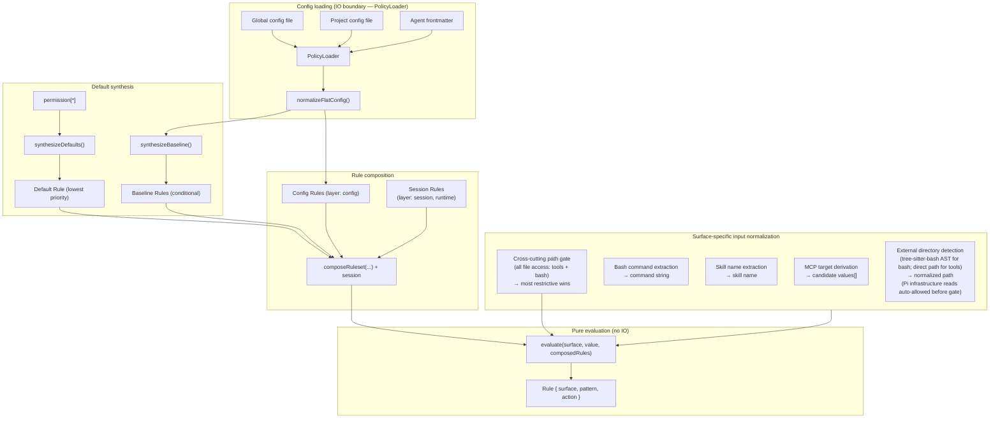
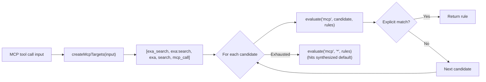
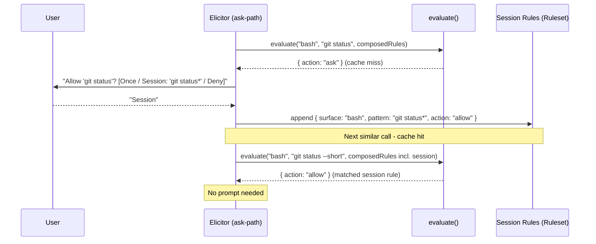

# Architecture

This document describes the internal design of the permission system, informed by [OpenCode's permission model](https://opencode.ai/docs/permissions/).

## Design principles

1. **Unified rule model** - one `Rule` type, one evaluation function, all surfaces.
2. **Pure evaluation** - permission decisions are pure functions of (surface, pattern, rules).
   IO stays at the edges.
3. **Session approvals are just more rules** - no separate matching engine, no separate pre-check.
4. **MCP stays special** - multi-name target derivation is pre-processing, not a special evaluation path.
5. **Defaults are rules** - the universal default (`permission["*"]`) is synthesized as a low-priority rule in the array.
   No side-channel fallbacks.
6. **Flat config format** - the flat `permission: { ... }` object where each key is a surface.
   The config IS the ruleset in human-friendly form.
7. **Preserve the two-phase model** - tool filtering (before_agent_start) and invocation gating (tool_call) remain separate.
8. **Ask = cache miss** - "ask" is the absence of a matching rule.
   The human is the oracle.
   Their decision is a rule.
   Persistence determines lifetime (once / session / config).

## Core data model

### Rule

```typescript
/**
 * Provenance of a rule — which source contributed it.
 *
 * Config scopes: "global", "project", "agent", "project-agent".
 * Synthesized:   "builtin" (universal default / evaluate() fallback),
 *                "baseline" (conditional MCP metadata auto-allow).
 * Runtime:       "session" (session approvals).
 */
type RuleOrigin =
  | "global"
  | "project"
  | "agent"
  | "project-agent"
  | "builtin"
  | "baseline"
  | "session";

interface Rule {
  /** The permission surface: "bash", "edit", "mcp", "skill", "external_directory", "path", etc. */
  surface: string;
  /** The match pattern: a command glob, tool name, file path, skill name, or "*". */
  pattern: string;
  /** The decision. */
  action: PermissionState;
  /**
   * Origin layer — used to derive PermissionCheckResult.source after evaluation.
   * Not used by evaluate(); purely informational metadata.
   */
  layer?: "default" | "baseline" | "config" | "session";
  /** Which source contributed this rule. */
  origin: RuleOrigin;
}
```

Every config entry, default policy, session approval, and agent override normalizes into `Rule[]`.

### Ruleset

```typescript
type Ruleset = Rule[];
```

Merge precedence is array ordering.
The synthesized universal default goes first (lowest priority), then MCP baseline auto-allow rules, then config rules (global → project → agent → project-agent), and finally session rules (highest priority).
Last-match-wins: `evaluate()` scans from the end.

### Evaluate

```typescript
function evaluate(surface: string, value: string, rules: Ruleset): Rule {
  for (let i = rules.length - 1; i >= 0; i--) {
    const rule = rules[i];
    if (wildcardMatch(rule.surface, surface) && wildcardMatch(rule.pattern, value)) {
      return rule;
    }
  }
  // Unreachable when defaults are synthesized - the catch-all always matches.
  return { surface, pattern: value, action: "ask" };
}
```

The entire decision engine.
When defaults are synthesized into the array, the catch-all `{ surface: "*", pattern: "*", action: "ask" }` always matches - the fallback return is defensive only.

## Composed ruleset

All rule sources are concatenated into a single flat array.
Index position determines priority (higher index wins):

```text
  ┌─────────────────────────────────────────────────────────────────┐
  │                     Composed Ruleset (Rule[])                   │
  │                                                                 │
  │  Index 0: Synthesized universal default (layer: "default")      │
  │    { surface: "*", pattern: "*", action: permission["*"] }      │
  │                                                                 │
  │  Index 1..B: MCP baseline auto-allow (layer: "baseline")        │
  │    (only when any config rule has surface:"mcp" action:"allow") │
  │    { surface: "mcp", pattern: "mcp_status",   action: "allow" } │
  │    { surface: "mcp", pattern: "mcp_list",     action: "allow" } │
  │    { surface: "mcp", pattern: "mcp_search",   action: "allow" } │
  │    { surface: "mcp", pattern: "mcp_describe", action: "allow" } │
  │    { surface: "mcp", pattern: "mcp_connect",  action: "allow" } │
  │                                                                 │
  │  Index B+1..C: Config rules (global → project → agent,         │
  │                   layer: "config", origin: "global"|"project"   │
  │                   |"agent"|"project-agent")                     │
  │    { surface: "bash",  pattern: "*",     action: "allow",       │
  │      origin: "global" }                                         │
  │    { surface: "bash",  pattern: "git *", action: "allow",       │
  │      origin: "global" }                                         │
  │    { surface: "bash",  pattern: "rm *",  action: "deny",        │
  │      origin: "project" }                                        │
  │    { surface: "read",  pattern: "*",     action: "allow",       │
  │      origin: "global" }                                         │
  │    { surface: "mcp",   pattern: "exa:*", action: "allow",       │
  │      origin: "agent" }                                          │
  │                                                                 │
  │  Index C+1..end: Session rules (layer: "session", highest)      │
  │    { surface: "external_directory", pattern: "/other/*",        │
  │      action: "allow" }                                          │
  │                                                                 │
  │  ◄── evaluate() scans from end, first match wins ──►            │
  └─────────────────────────────────────────────────────────────────┘
```

`synthesizeDefaults()` produces a single universal catch-all from `permission["*"]`.
Per-surface catch-alls (e.g. `bash: { "*": "allow" }`) are expressed as regular config rules via `normalizeFlatConfig()` — no separate override layer is needed.

`synthesizeBaseline()` conditionally emits MCP metadata auto-allow rules.

`composeRuleset()` concatenates: defaults + baseline + config rules.
Session rules are concatenated after config rules so `evaluate()` handles them via last-match-wins — no separate per-branch pre-check.

### Default synthesis

```typescript
// Single universal catch-all from permission["*"].
function synthesizeDefaults(universalDefault: PermissionState): Ruleset {
  return [
    { surface: "*", pattern: "*", action: universalDefault, layer: "default" },
  ];
}

// MCP metadata auto-allow - only synthesized when any config rule has
// surface: "mcp" && action: "allow".
function synthesizeBaseline(configRules: Ruleset): Ruleset { ... }

// Concat in priority order: defaults, baseline, config.
function composeRuleset(defaults, baseline, config): Ruleset {
  return [...defaults, ...baseline, ...config];
}
```

## Architecture overview



## Config format

```jsonc
{
  "permission": {
    "*": "ask",
    "read": "allow",
    "bash": { "*": "allow", "git *": "allow", "npm *": "allow", "rm *": "deny" },
    "mcp": { "*": "ask", "exa:*": "allow" },
    "skill": { "*": "ask", "librarian": "allow" },
    "path": { "*": "allow", "*.env": "deny" },
    "external_directory": "ask"
  }
}
```

Each top-level key in `permission` is a surface name.
A string value is shorthand for `{ "*": action }` (surface-level catch-all).
An object value maps patterns to actions.
`permission["*"]` is the universal fallback.

### Normalization to Rule[]

```typescript
function normalizeFlatConfig(permission: FlatPermissionConfig): Ruleset {
  const rules: Ruleset = [];

  for (const [surface, value] of Object.entries(permission)) {
    if (typeof value === "string") {
      // Shorthand: "read": "allow" → { surface: "read", pattern: "*", action: "allow" }
      rules.push({ surface, pattern: "*", action: value as PermissionState });
    } else {
      // Object: "bash": { "*": "ask", "git *": "allow" }
      for (const [pattern, action] of Object.entries(value)) {
        rules.push({ surface, pattern, action: action as PermissionState });
      }
    }
  }

  return rules;
}
```

## MCP pre-processing

MCP is the one surface that requires pre-processing **before** evaluation.
The multi-name target derivation stays, but it feeds candidate values into `evaluate()` rather than a separate code path:



The priority ordering of candidates is preserved.
The evaluation function is unchanged - MCP just calls it multiple times with different values.
MCP target derivation helpers live in `src/mcp-targets.ts`.
Input normalization for all surfaces lives in `src/input-normalizer.ts`.

### Path-bearing tool normalization

For path-bearing tools (`read`, `write`, `edit`, `find`, `grep`, `ls`), `normalizeInput` returns the file path from `input.path` as the match value instead of `"*"`.
This enables per-tool path patterns: `"read": { "*": "allow", "*.env": "deny" }` denies reads of `.env` files while allowing everything else.
When `input.path` is missing or empty, the value falls back to `"*"` (surface-level catch-all), preserving backward compatibility.
`getToolPermission()` is unaffected — it always evaluates with `"*"` to determine whether to inject the tool at agent start.

## Session approvals: the cache-miss model

Session rules are stored as `Ruleset` and are generalized to all surfaces.

`evaluate()` is a **lookup** against cached decisions.
When no rule matches (or the matching rule says "ask"), the system has a cache miss - it needs the human oracle to produce a decision.

The human's response is simultaneously:

1. **The answer** for this request (allow or deny).
2. **A rule** that can be cached for future lookups.

The dialog determines **persistence** - where the rule lives:

```text
  evaluate(surface, value, composedRules)
       │
       ├── match.action = "allow" → proceed (cache hit)
       ├── match.action = "deny"  → block (cache hit)
       │
       └── match.action = "ask"   → cache miss, query oracle
                │
                ▼
           Dialog: "[surface] wants to [value]"
                │
                ├── "Yes"              → allow this request (no persistence)
                ├── "Yes, for session" → allow + store in session layer
                │                        (future lookups hit without asking)
                ├── "No"               → deny this request (no persistence)
                └── (future: "Always") → allow + store in config layer (disk)
```

### Pattern suggestions

When prompting, each surface suggests a **pattern** for the "for session" option.
The pattern determines what class of future requests auto-approve:

| Surface                | Input value                 | Suggested session pattern   | Mechanism                |
| ---------------------- | --------------------------- | --------------------------- | ------------------------ |
| bash                   | `git checkout main`         | `git checkout *`            | Arity table              |
| bash                   | `npm run dev`               | `npm run dev`               | Arity table              |
| tool (read/write/etc.) | tool surface itself         | `*` (all uses of that tool) | Tool-level               |
| mcp                    | `exa:search`                | `exa:*`                     | Server-level wildcard    |
| skill                  | `librarian`                 | `librarian`                 | Exact name               |
| external_directory     | `/other/project/src/foo.ts` | `/other/project/*`          | Directory prefix as glob |

The suggestion is shown in the dialog text so the user sees what they're approving:

```text
  ● Allow once
  ● Allow "git checkout *" for this session
  ● Deny
```

### Implementation



## Two-phase checking

### Phase 1: Tool filtering (`before_agent_start`)

```typescript
function shouldExposeTool(toolName: string, rules: Ruleset): boolean {
  const rule = evaluate(toolName, "*", rules);
  return rule.action !== "deny";
}
```

Uses `evaluate()` with pattern `"*"` - "is this tool denied at the surface level, regardless of specific input?"

### Phase 2: Invocation gating (`tool_call`)

```typescript
// Surface-specific input normalization (what to query)
const { surface, value } = normalizeInput(toolName, input);

// Single evaluation against the composed ruleset (how to decide)
const rule = evaluate(surface, value, composedRules);

if (rule.action === "allow") return proceed;
if (rule.action === "deny") return block;
// rule.action === "ask" - elicit from oracle
const decision = await elicitRule(surface, value, suggestPattern(surface, value));
if (decision.persistence === "session") {
  sessionRules.approve(surface, decision.pattern);
}
return decision.action === "allow" ? proceed : block;
```

Same `evaluate()`, same ruleset.
The only surface-specific logic is input normalization (what `surface` and `value` to look up) and pattern suggestion (what glob to offer for "session" approval).

`checkPermission()` uses a single evaluate path: `normalizeInput()` → `evaluateFirst()` → `deriveSource()` → single result object.

## Subagent detection and permission forwarding

When `ask`-state permissions arise in a headless subagent child process, the extension forwards the dialog to the parent session rather than silently denying.
This requires two detections:

1. **Is the current process a subagent?**
   — `isSubagentExecutionContext()` in `src/subagent-context.ts`.
2. **What is the parent session ID?**
   — `resolvePermissionForwardingTargetSessionId()` in `src/permission-forwarding.ts`.

### Known extension env var inventory

| Extension                                                                           | Child-process env vars                                                                    | Parent-session env var              |
| ----------------------------------------------------------------------------------- | ----------------------------------------------------------------------------------------- | ----------------------------------- |
| pi-agent-router (original)                                                          | `PI_IS_SUBAGENT`, `PI_SUBAGENT_SESSION_ID`, `PI_AGENT_ROUTER_SUBAGENT`                    | `PI_AGENT_ROUTER_PARENT_SESSION_ID` |
| [nicobailon/pi-subagents](https://github.com/nicobailon/pi-subagents)               | `PI_SUBAGENT_CHILD`, `PI_SUBAGENT_RUN_ID`, `PI_SUBAGENT_CHILD_AGENT`, `PI_SUBAGENT_DEPTH` | none set (see #98)                  |
| [tintinweb/pi-subagents](https://github.com/tintinweb/pi-subagents)                 | none — runs fully in-process via `createAgentSession()`                                   | n/a — deferred to #29               |
| [HazAT/pi-interactive-subagents](https://github.com/HazAT/pi-interactive-subagents) | `PI_SUBAGENT_NAME`, `PI_SUBAGENT_ID`, `PI_SUBAGENT_SESSION`, `PI_SUBAGENT_ACTIVITY_FILE`  | none set (see #98)                  |

### Detection (`isSubagentExecutionContext`)

`isSubagentExecutionContext()` checks three sources in priority order:

1. **Explicit registry** — in-process subagent extensions register sessions via `PermissionsService.registerSubagentSession()` before calling `bindExtensions()`.
   The `SubagentSessionRegistry` (keyed by session directory path) is checked first.
2. **Env vars** (`SUBAGENT_ENV_HINT_KEYS`) — returns `true` when any key is set to a non-empty, non-whitespace value.
   Used by process-based subagent extensions.
3. **Filesystem path** — session-directory path-based fallback (child session dir is nested under `subagentSessionsDir`).

### Parent-session resolution (`resolvePermissionForwardingTargetSessionId`)

`resolvePermissionForwardingTargetSessionId()` checks two sources in priority order:

1. **Explicit registry** — if the caller provides a `sessionDir` and `registry`, the registry entry's `parentSessionId` is returned when present.
   Used by in-process subagent extensions.
2. **Env vars** (`SUBAGENT_PARENT_SESSION_ENV_CANDIDATES`) — iterates candidates and returns the first non-empty, non-`"unknown"` value.
   Used by process-based subagent extensions.

Neither nicobailon nor HazAT sets a parent-session env var today, so forwarding still fails for those extensions with an explicit log message pointing to #98.
Adding a new env var candidate when an extension adopts the convention is a one-line change to the array.

### In-process case (resolved)

In-process subagent extensions (e.g. `@gotgenes/pi-subagents`, tintinweb/pi-subagents) call `createAgentSession()` directly — no child process is spawned and no env vars are ever set.
This is now handled by the `SubagentSessionRegistry` API on `PermissionsService`.
The extension registers the child session before `bindExtensions()` and unregisters it in a `finally` block after the session completes.
See `src/subagent-registry.ts` and the [cross-extension API docs](../cross-extension-api.md#registersubagentsession--unregistersubagentsession) for details.

### External convention guide

A [permission frontmatter convention guide](../guides/permission-frontmatter-for-subagent-extensions.md) documents how upstream subagent extensions can adopt the `permission:` frontmatter key as a shared convention.
This is a documentation-only proposal — no code dependency is required.
The guide covers the two-layer model, flat format reference, composition examples, and the optional event bus runtime integration.

## Cross-extension service accessor

The primary cross-extension API is a `Symbol.for()`-backed service object on `globalThis`.

Pi's extension loader creates a fresh jiti instance per extension with `moduleCache: false`, isolating module-scoped state.
`Symbol.for()` and `globalThis` are process-global by spec, so they survive this isolation.

The extension factory publishes a `PermissionsService` object via `publishPermissionsService()` during startup.
Other extensions retrieve it with `getPermissionsService()` from `import("@gotgenes/pi-permission-system")`.
The `package.json` `exports` field points to `src/service.ts`, which contains the interface, the accessor functions, the `Symbol.for()` key, and the `SubagentSessionInfo` type — no extension machinery.

The `PermissionsService` interface exposes four methods:

- `checkPermission(surface, value?, agentName?)` — full policy query.
- `getToolPermission(toolName, agentName?)` — tool-level permission state (`allow`/`deny`/`ask`) for pre-filtering.
- `registerSubagentSession(sessionKey, info)` — register an in-process subagent session for detection and forwarding.
- `unregisterSubagentSession(sessionKey)` — remove a registered session.

The event-bus RPC (`permissions:rpc:check`) remains as a zero-dependency fallback for consumers who do not want to add an optional peer dep.
It is deprecated in favor of the service accessor.

`permissions:decision` broadcasts and `permissions:rpc:prompt` remain on the event bus — fire-and-forget observation and async prompt forwarding are the right abstractions for those channels.

## Module structure

```text
src/
├── rule.ts                   Rule type, Ruleset type, evaluate()
├── normalize.ts              Config → Ruleset normalization (flat format)
├── synthesize.ts             Universal default + MCP baseline → Ruleset
├── wildcard-matcher.ts       Compiled glob matching
├── mcp-targets.ts            MCP multi-name target derivation
├── input-normalizer.ts       Surface-specific input normalization → NormalizedInput
├── pattern-suggest.ts        Per-surface approval pattern suggestions
├── bash-arity.ts             Command arity table for bash pattern suggestions
├── expand-home.ts            ~/$HOME expansion for patterns
├── session-rules.ts          Session approval store (Ruleset wrapper)
├── policy-loader.ts          PolicyLoader interface + FilePolicyLoader (file I/O, mtime caching)
├── permission-manager.ts     Policy merge + checkPermission(); delegates I/O to PolicyLoader
├── permission-gate.ts        Pure deny/ask/allow gate (injected IO)
├── permission-prompter.ts    Yolo-mode, review logging, UI/forwarding branch; PromptPermissionDetails type
├── permission-dialog.ts      Dialog options (once / session / deny)
│
├── permission-session.ts     PermissionSession class — encapsulates all mutable session state
├── handlers/                 Handler classes with narrow constructor injection
│   ├── index.ts              Barrel re-exports
│   ├── lifecycle.ts          SessionLifecycleHandler (session + cleanupRpc)
│   ├── before-agent-start.ts AgentPrepHandler (session + toolRegistry); shouldExposeTool pure helper
│   ├── permission-gate-handler.ts PermissionGateHandler (session + events + toolRegistry); getEventInput + extractSkillNameFromInput pure helpers
│   └── gates/               Pure descriptor factories + runner
│       ├── types.ts          GateOutcome, ToolCallContext
│       ├── descriptor.ts     GateDescriptor (with DenialContext), GateBypass, GateResult, GateRunnerDeps types
│       ├── runner.ts         runGateCheck() — single site for check→log→emit→approve; constructs messages from DenialContext via denial-messages.ts
│       ├── helpers.ts        deriveDecisionValue, deriveResolution
│       ├── skill-read.ts     describeSkillReadGate — pure descriptor factory
│       ├── external-directory.ts describeExternalDirectoryGate — pure descriptor/bypass factory
│       ├── external-directory-messages.ts External-directory ask-prompt formatting (denial messages moved to denial-messages.ts)
│       ├── bash-external-directory.ts describeBashExternalDirectoryGate — pure descriptor/bypass factory
│       ├── bash-path.ts      describeBashPathGate — async descriptor/bypass factory for bash path rules
│       ├── bash-path-extractor.ts Tree-sitter-bash AST parser + external/rule path extraction; cd-aware: when the command begins with `cd <dir> &&`, relative paths are resolved against `<dir>` (if it stays within cwd) rather than cwd, matching actual shell behavior
│       ├── path.ts           describePathGate — pure descriptor factory for cross-cutting path rules
│       ├── tool.ts           describeToolGate — pure descriptor factory
│       └── index.ts          Barrel re-exports
│
├── index.ts                  Extension factory - event wiring, service publish
├── service.ts                PermissionsService interface, Symbol.for() accessor (cross-extension API)
├── permission-events.ts      Event channel constants, payload types, emit helpers
├── permission-event-rpc.ts   permissions:rpc:check (deprecated) and permissions:rpc:prompt handlers
├── runtime.ts                ExtensionRuntime context object, config refresh/save
├── config-loader.ts          File I/O, format detection
├── config-paths.ts           Path derivation
├── config-reporter.ts        Structured log entries for resolved config
├── config-modal.ts           /permission-system slash command UI
├── extension-config.ts       Runtime knobs (debugLog, yoloMode, etc.)
│
├── permission-merge.ts        Deep-shallow merge for flat permission configs
├── path-utils.ts              Path normalization, within-directory, outside-CWD, safe-system-path, path-bearing-tool, Pi infrastructure read
├── node-modules-discovery.ts  Global node_modules resolution (walk-up + npm root -g fallback)
├── system-prompt-sanitizer.ts Remove denied tools from system prompt
├── skill-prompt-sanitizer.ts  Skill prompt filtering by policy
├── denial-messages.ts         Centralized denial message formatter — DenialContext type, EXTENSION_TAG, formatDenyReason/formatUnavailableReason/formatUserDeniedReason
├── permission-prompts.ts      User-facing ask-prompt formatting + pre-check error messages
├── tool-input-preview.ts      Loggable context from tool inputs
├── tool-registry.ts           ToolRegistry interface + tool name validation
├── active-agent.ts            Agent name detection from session/system prompt
├── subagent-context.ts        Subagent execution context detection (registry + env vars + filesystem)
├── subagent-registry.ts       SubagentSessionRegistry class — in-process subagent session tracking
├── permission-forwarding.ts   Constants for cross-session forwarding (registry + env var resolution)
├── forwarded-permissions/     Poll-based approval forwarding for subagents
├── session-logger.ts          SessionLogger interface + createSessionLogger() factory
├── logging.ts                 JSONL review/debug log writer
├── status.ts                  Footer status bar integration
├── yolo-mode.ts               Auto-approve logic
├── common.ts                  Shared parsing utilities
├── types.ts                   Core type definitions (PermissionState, FlatPermissionConfig, etc.)
└── before-agent-start-cache.ts Memoization for prompt sanitization
```
