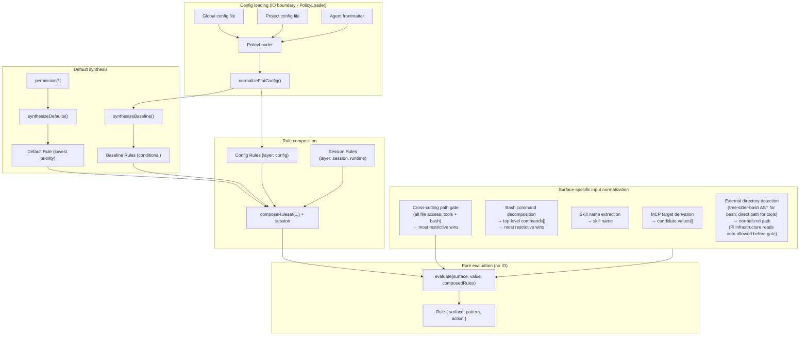
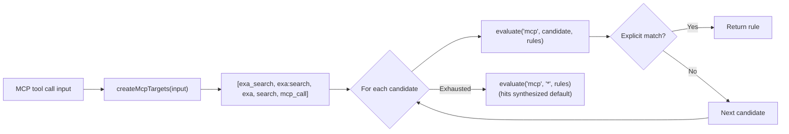
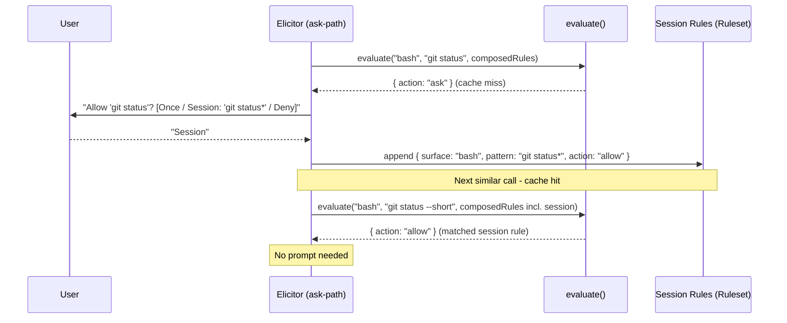
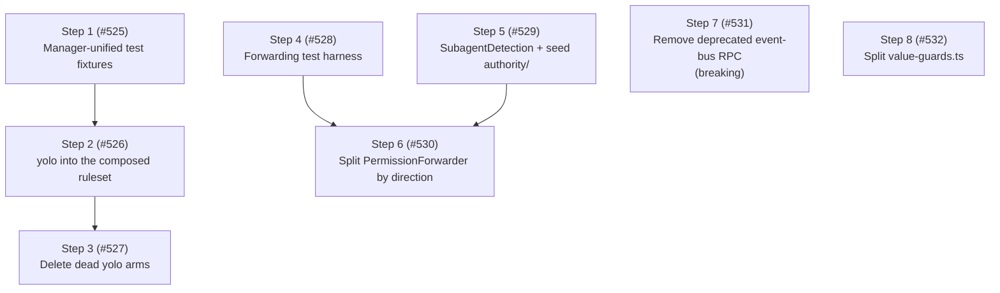

# Architecture

This document describes the internal design of the permission system, informed by [OpenCode's permission model](https://opencode.ai/docs/permissions/).

## Design principles

1. **Unified rule model** - one `Rule` type, one evaluation function, all surfaces.
2. **Pure evaluation** - permission decisions are pure functions of (surface, pattern, rules).
   IO stays at the edges.
3. **Session approvals are just more rules** - no separate matching engine, no separate pre-check.
4. **MCP stays special** - multi-name target derivation is pre-processing, not a special evaluation path.
5. **Defaults are rules** - the universal default (`permission["*"]`) is synthesized as a low-priority rule in the array.
   No side-channel fallbacks.
6. **Flat config format** - the flat `permission: { ... }` object where each key is a surface.
   The config IS the ruleset in human-friendly form.
7. **Preserve the two-phase model** - tool filtering (before_agent_start) and invocation gating (tool_call) remain separate.
8. **Ask = cache miss** - "ask" is the absence of a matching rule.
   The human is the oracle.
   Their decision is a rule.
   Persistence determines lifetime (once / session / config).
9. **Single-agent core, multi-agent by extension** - Pi is single-agent by deliberate design; the notion of multiple named agents is introduced entirely by external extensions (pi-subagents, pi-agent-router, some MasuRii packages), not by Pi itself.
   Per-agent `permission:` frontmatter is therefore an extension bridge layered on this single-agent core, not a core responsibility.
   The package learns the active agent from a generic `<active_agent>` signal (a system-prompt tag or an `active_agent` session entry), never from a hard dependency on any one multi-agent extension, so the bridge works with any tool that emits the signal.

## Core data model

### Rule

```typescript
/**
 * Provenance of a rule - which source contributed it.
 *
 * Config scopes: "global", "project", "agent", "project-agent".
 * Synthesized:   "builtin" (universal default / evaluate() fallback),
 *                "baseline" (conditional MCP metadata auto-allow).
 * Runtime:       "session" (session approvals).
 */
type RuleOrigin =
  | "global"
  | "project"
  | "agent"
  | "project-agent"
  | "builtin"
  | "baseline"
  | "session";

interface Rule {
  /** The permission surface: "bash", "edit", "mcp", "skill", "external_directory", "path", etc. */
  surface: string;
  /** The match pattern: a command glob, tool name, file path, skill name, or "*". */
  pattern: string;
  /** The decision. */
  action: PermissionState;
  /** Custom denial reason for deny rules (optional). */
  reason?: string;
  /**
   * Origin layer - used to derive PermissionCheckResult.source after evaluation.
   * Not used by evaluate(); purely informational metadata.
   */
  layer?: "default" | "baseline" | "config" | "session";
  /** Which source contributed this rule. */
  origin: RuleOrigin;
}
```

Every config entry, default policy, session approval, and agent override normalizes into `Rule[]`.

### Ruleset

```typescript
type Ruleset = Rule[];
```

Merge precedence is array ordering.
The synthesized universal default goes first (lowest priority), then MCP baseline auto-allow rules, then config rules (global → project → agent → project-agent), and finally session rules (highest priority).
Last-match-wins: `evaluate()` scans from the end.

### Evaluate

```typescript
function evaluate(
  surface: string,
  value: string,
  rules: Ruleset,
  platform: NodeJS.Platform,
): Rule {
  for (let i = rules.length - 1; i >= 0; i--) {
    const rule = rules[i];
    // On win32 a path-surface match folds case + separators; `platform` is
    // injected from `PermissionManager` (read once at the composition root,
    // #510), never `process.platform` ambiently.
    if (ruleMatches(rule, surface, value, platform)) {
      return rule;
    }
  }
  // Unreachable when defaults are synthesized - the catch-all always matches.
  return { surface, pattern: value, action: "ask" };
}
```

The entire decision engine.
When defaults are synthesized into the array, the catch-all `{ surface: "*", pattern: "*", action: "ask" }` always matches - the fallback return is defensive only.

## Composed ruleset

All rule sources are concatenated into a single flat array.
Index position determines priority (higher index wins):

```text
  ┌─────────────────────────────────────────────────────────────────┐
  │                     Composed Ruleset (Rule[])                   │
  │                                                                 │
  │  Index 0: Synthesized universal default (layer: "default")      │
  │    { surface: "*", pattern: "*", action: permission["*"] }      │
  │                                                                 │
  │  Index 1..B: MCP baseline auto-allow (layer: "baseline")        │
  │    (only when any config rule has surface:"mcp" action:"allow") │
  │    { surface: "mcp", pattern: "mcp_status",   action: "allow" } │
  │    { surface: "mcp", pattern: "mcp_list",     action: "allow" } │
  │    { surface: "mcp", pattern: "mcp_search",   action: "allow" } │
  │    { surface: "mcp", pattern: "mcp_describe", action: "allow" } │
  │    { surface: "mcp", pattern: "mcp_connect",  action: "allow" } │
  │                                                                 │
  │  Index B+1..C: Config rules (global → project → agent,         │
  │                   layer: "config", origin: "global"|"project"   │
  │                   |"agent"|"project-agent")                     │
  │    { surface: "bash",  pattern: "*",     action: "allow",       │
  │      origin: "global" }                                         │
  │    { surface: "bash",  pattern: "git *", action: "allow",       │
  │      origin: "global" }                                         │
  │    { surface: "bash",  pattern: "rm *",  action: "deny",        │
  │      origin: "project" }                                        │
  │    { surface: "read",  pattern: "*",     action: "allow",       │
  │      origin: "global" }                                         │
  │    { surface: "mcp",   pattern: "exa:*", action: "allow",       │
  │      origin: "agent" }                                          │
  │                                                                 │
  │  Index C+1..end: Session rules (layer: "session", highest)      │
  │    { surface: "external_directory", pattern: "/other/*",        │
  │      action: "allow" }                                          │
  │                                                                 │
  │  ◄── evaluate() scans from end, first match wins ──►            │
  └─────────────────────────────────────────────────────────────────┘
```

`synthesizeDefaults()` produces a single universal catch-all from `permission["*"]`.
Per-surface catch-alls (e.g. `bash: { "*": "allow" }`) are expressed as regular config rules via `normalizeFlatConfig()` - no separate override layer is needed.

`synthesizeBaseline()` conditionally emits MCP metadata auto-allow rules.

`composeRuleset()` concatenates: defaults + baseline + config rules.
Session rules are concatenated after config rules so `evaluate()` handles them via last-match-wins - no separate per-branch pre-check.

### Default synthesis

```typescript
// Single universal catch-all from permission["*"].
function synthesizeDefaults(universalDefault: PermissionState): Ruleset {
  return [
    { surface: "*", pattern: "*", action: universalDefault, layer: "default" },
  ];
}

// MCP metadata auto-allow - only synthesized when any config rule has
// surface: "mcp" && action: "allow".
function synthesizeBaseline(configRules: Ruleset): Ruleset { ... }

// Concat in priority order: defaults, baseline, config.
function composeRuleset(defaults, baseline, config): Ruleset {
  return [...defaults, ...baseline, ...config];
}
```

## Architecture overview



The `Agent frontmatter` input (`AF`) is the per-agent override layer.
It only carries data when an external multi-agent extension is active (see design principle 9): the package resolves the active agent's name from a generic `<active_agent>` signal, then reads the `permission:` sub-document of that agent's definition file at `<cwd>/.pi/agents/<name>.md` (project) or `<agentDir>/agents/<name>.md` (global).
The package does not discover or enumerate agents — it reads one sub-document by name, on demand — and the `<cwd>/.pi/agents` location is a Pi platform convention this package encodes independently (no dependency on pi-subagents, ADR 0002).

## Config format

```jsonc
{
  "permission": {
    "*": "ask",
    "read": "allow",
    "bash": { "*": "allow", "git *": "allow", "npm *": "allow", "rm *": "deny" },
    "mcp": { "*": "ask", "exa:*": "allow" },
    "skill": { "*": "ask", "librarian": "allow" },
    "path": { "*": "allow", "*.env": "deny" },
    "external_directory": "ask"
  }
}
```

Each top-level key in `permission` is a surface name.
A string value is shorthand for `{ "*": action }` (surface-level catch-all).
An object value maps patterns to actions.
`permission["*"]` is the universal fallback.

### Normalization to Rule[]

```typescript
function normalizeFlatConfig(permission: FlatPermissionConfig): Ruleset {
  const rules: Ruleset = [];

  for (const [surface, value] of Object.entries(permission)) {
    if (typeof value === "string") {
      // Shorthand: "read": "allow" → { surface: "read", pattern: "*", action: "allow" }
      rules.push({ surface, pattern: "*", action: value as PermissionState });
    } else {
      // Object: "bash": { "*": "ask", "git *": "allow" }
      for (const [pattern, action] of Object.entries(value)) {
        rules.push({ surface, pattern, action: action as PermissionState });
      }
    }
  }

  return rules;
}
```

## MCP pre-processing

MCP is the one surface that requires pre-processing **before** evaluation.
The multi-name target derivation stays, but it feeds candidate values into `evaluate()` rather than a separate code path:



The priority ordering of candidates is preserved.
The evaluation function is unchanged - MCP just calls it multiple times with different values.
MCP target derivation helpers live in `src/mcp-targets.ts`.
Input normalization for all surfaces lives in `src/input-normalizer.ts`.

### Path-bearing tool normalization

Per-tool path patterns — e.g. `"read": { "*": "allow", "*.env": "deny" }` — are evaluated via the `access-path` intent the per-tool gate emits ([#502]).
When the pipeline calls `resolvePerToolCheck`, a present `input.path` triggers `normalizer.forPath(path)` and an `access-path` intent on the tool-name surface; the resolver unwraps it to `path-values` carrying the lexical ∪ canonical alias set before the manager evaluates the rule.
When `input.path` is missing or empty, the pipeline falls back to a `tool` intent, which `normalizeInput` collapses to `["*"]` (surface catch-all).
Path alias derivation (home-expansion, cwd-relative aliases) lives in `getPathPolicyValues` / `AccessPath` — not in `normalizeInput`, which no longer touches path surfaces (#504).
`getToolPermission()` is unaffected — it always evaluates with `"*"` to determine whether to inject the tool at agent start.

The cross-cutting `path` and `external_directory` gates extract paths for **extension and MCP tools too** (#352): `describePathGate` and `describeExternalDirectoryGate` call `getToolInputPath`, which reads `input.path` for built-ins, `input.arguments.path` for MCP, and a registered `ToolAccessExtractor` (or the default `input.path` convention) for any other tool.
The extractor registry (`src/tool-access-extractor-registry.ts`) is created once in `index.ts` and shared: its lookup side is threaded into `ToolCallGatePipeline`, and its registrar side is exposed cross-extension via `PermissionsService.registerToolAccessExtractor`.
Per-tool path maps for extension tools (a custom extractor key per tool) are a deferred follow-up.

## Session approvals: the cache-miss model

Session rules are stored as `Ruleset` and are generalized to all surfaces.

`evaluate()` is a **lookup** against cached decisions.
When no rule matches (or the matching rule says "ask"), the system has a cache miss - it needs the human oracle to produce a decision.

The human's response is simultaneously:

1. **The answer** for this request (allow or deny).
2. **A rule** that can be cached for future lookups.

The dialog determines **persistence** - where the rule lives:

```text
  evaluate(surface, value, composedRules)
       │
       ├── match.action = "allow" → proceed (cache hit)
       ├── match.action = "deny"  → block (cache hit)
       │
       └── match.action = "ask"   → cache miss, query oracle
                │
                ▼
           Dialog: "[surface] wants to [value]"
                │
                ├── "Yes"              → allow this request (no persistence)
                ├── "Yes, for session" → allow + store in session layer
                │                        (future lookups hit without asking)
                ├── "No"               → deny this request (no persistence)
                └── (future: "Always") → allow + store in config layer (disk)
```

### Pattern suggestions

When prompting, each surface suggests a **pattern** for the "for session" option.
The pattern determines what class of future requests auto-approve:

| Surface                | Input value                 | Suggested session pattern   | Mechanism                |
| ---------------------- | --------------------------- | --------------------------- | ------------------------ |
| bash                   | `git checkout main`         | `git checkout *`            | Arity table              |
| bash                   | `npm run dev`               | `npm run dev`               | Arity table              |
| tool (read/write/etc.) | tool surface itself         | `*` (all uses of that tool) | Tool-level               |
| mcp                    | `exa:search`                | `exa:*`                     | Server-level wildcard    |
| skill                  | `librarian`                 | `librarian`                 | Exact name               |
| external_directory     | `/other/project/src/foo.ts` | `/other/project/*`          | Directory prefix as glob |

The suggestion is shown in the dialog text so the user sees what they're approving:

```text
  ● Allow once
  ● Allow "git checkout *" for this session
  ● Deny
```

### Implementation



## Two-phase checking

### Phase 1: Tool filtering (`before_agent_start`)

```typescript
function shouldExposeTool(toolName: string, rules: Ruleset): boolean {
  const rule = evaluate(toolName, "*", rules);
  return rule.action !== "deny";
}
```

Uses `evaluate()` with pattern `"*"` - "is this tool denied at the surface level, regardless of specific input?"

### Phase 2: Invocation gating (`tool_call`)

```typescript
// Surface-specific input normalization (what to query)
const { surface, value } = normalizeInput(toolName, input);

// Single evaluation against the composed ruleset (how to decide)
const rule = evaluate(surface, value, composedRules);

if (rule.action === "allow") return proceed;
if (rule.action === "deny") return block;
// rule.action === "ask" - elicit from oracle
const decision = await elicitRule(surface, value, suggestPattern(surface, value));
if (decision.persistence === "session") {
  sessionRules.approve(surface, decision.pattern);
}
return decision.action === "allow" ? proceed : block;
```

Same `evaluate()`, same ruleset.
The only surface-specific logic is input normalization (what `surface` and `value` to look up) and pattern suggestion (what glob to offer for "session" approval).

`checkPermission()` uses a single evaluate path: `normalizeInput()` → `evaluateFirst()` → `deriveSource()` → single result object.

## Subagent detection and permission forwarding

When `ask`-state permissions arise in a headless subagent child process, the extension forwards the dialog to the parent session rather than silently denying.
This requires two detections:

1. **Is the current process a subagent?**
   - `isSubagentExecutionContext()` in `src/subagent-context.ts`.
2. **What is the parent session ID?**
   - `resolvePermissionForwardingTargetSessionId()` in `src/permission-forwarding.ts`.

### Known extension env var inventory

| Extension                                                                           | Child-process env vars                                                                    | Parent-session env var              |
| ----------------------------------------------------------------------------------- | ----------------------------------------------------------------------------------------- | ----------------------------------- |
| pi-agent-router (original)                                                          | `PI_IS_SUBAGENT`, `PI_SUBAGENT_SESSION_ID`, `PI_AGENT_ROUTER_SUBAGENT`                    | `PI_AGENT_ROUTER_PARENT_SESSION_ID` |
| [nicobailon/pi-subagents](https://github.com/nicobailon/pi-subagents)               | `PI_SUBAGENT_CHILD`, `PI_SUBAGENT_RUN_ID`, `PI_SUBAGENT_CHILD_AGENT`, `PI_SUBAGENT_DEPTH` | none set (see #98)                  |
| [tintinweb/pi-subagents](https://github.com/tintinweb/pi-subagents)                 | none - runs fully in-process via `createAgentSession()`                                   | n/a - deferred to #29               |
| [HazAT/pi-interactive-subagents](https://github.com/HazAT/pi-interactive-subagents) | `PI_SUBAGENT_NAME`, `PI_SUBAGENT_ID`, `PI_SUBAGENT_SESSION`, `PI_SUBAGENT_ACTIVITY_FILE`  | none set (see #98)                  |

### Detection (`isSubagentExecutionContext`)

`isSubagentExecutionContext()` checks three sources in priority order:

1. **Explicit registry** - `@gotgenes/pi-subagents` emits `subagents:child:session-created` before `bindExtensions()`; the permission system's subscriber writes the entry into `SubagentSessionRegistry` synchronously.
   The registry (keyed by **child session id**) is checked first.
   Each concurrent sibling child of the same parent receives a unique session id from `sessionManager.newSession()`, so siblings occupy distinct keys - one sibling's `disposed` event cannot evict another's entry (fixes #298).
   The registry is a process-global singleton (via `getSubagentSessionRegistry()`, backed by `globalThis` + `Symbol.for()`) because each session's `ResourceLoader` creates its own `pi.events` bus: the parent's instance registers the child over the parent bus, while the child's separate jiti instance reads the same global store to detect itself and resolve its forwarding target.
2. **Env vars** (`SUBAGENT_ENV_HINT_KEYS`) - returns `true` when any key is set to a non-empty, non-whitespace value.
   Used by process-based subagent extensions.
3. **Filesystem path** - session-directory path-based fallback (child session dir is nested under `subagentSessionsDir`).

### Parent-session resolution (`resolvePermissionForwardingTargetSessionId`)

`resolvePermissionForwardingTargetSessionId()` checks two sources in priority order:

1. **Explicit registry** - if the caller provides a `sessionId` and `registry`, the registry entry's `parentSessionId` is returned when present.
   Used by in-process subagent extensions.
2. **Env vars** (`SUBAGENT_PARENT_SESSION_ENV_CANDIDATES`) - iterates candidates and returns the first non-empty, non-`"unknown"` value.
   Used by process-based subagent extensions.

Neither nicobailon nor HazAT sets a parent-session env var today, so forwarding still fails for those extensions with an explicit log message pointing to #98.
Adding a new env var candidate when an extension adopts the convention is a one-line change to the array.

### In-process case (resolved)

In-process subagent extensions (e.g. `@gotgenes/pi-subagents`) call `createAgentSession()` directly - no child process is spawned and no env vars are ever set.
`@gotgenes/pi-subagents` publishes `subagents:child:session-created` (before `bindExtensions()`) and `subagents:child:disposed` (in the run's `finally`); `src/subagent-lifecycle-events.ts` subscribes and writes/removes the entry in `SubagentSessionRegistry` synchronously.
The registry is process-global (see `getSubagentSessionRegistry()` in `src/subagent-registry.ts`) so the child's separate jiti instance reads the same store as the parent.
See `src/subagent-registry.ts` and [Subagent Integration](../subagent-integration.md) for details.

### External convention guide

A [permission frontmatter convention guide](../guides/permission-frontmatter-for-subagent-extensions.md) documents how upstream subagent extensions can adopt the `permission:` frontmatter key as a shared convention.
This is a documentation-only proposal - no code dependency is required.
The guide covers the two-layer model, flat format reference, composition examples, and the optional event bus runtime integration.

## Cross-extension service accessor

The primary cross-extension API is a `Symbol.for()`-backed service object on `globalThis`.

Pi's extension loader creates a fresh jiti instance per extension with `moduleCache: false`, isolating module-scoped state.
`Symbol.for()` and `globalThis` are process-global by spec, so they survive this isolation.

The extension publishes a `PermissionsService` object via `publishPermissionsService()` at `session_start`, gated so an in-process subagent child does not clobber the parent's service (#302).
Other extensions retrieve it with `getPermissionsService()` from `import("@gotgenes/pi-permission-system")`.
The `package.json` `exports` field points to `src/service.ts`, which contains the interface, the accessor functions, and the `Symbol.for()` key - no extension machinery.

The `PermissionsService` interface exposes three methods:

- `checkPermission(surface, value?, agentName?)` - full policy query.
- `getToolPermission(toolName, agentName?)` - tool-level permission state (`allow`/`deny`/`ask`) for pre-filtering.
- `registerToolInputFormatter(toolName, formatter)` - register a custom ask-prompt preview for a tool name; returns a disposer (#283).

The event-bus RPC (`permissions:rpc:check`) remains as a zero-dependency fallback for consumers who do not want to add an optional peer dep.
It is deprecated in favor of the service accessor.

`permissions:decision` broadcasts and `permissions:rpc:prompt` remain on the event bus - fire-and-forget observation and async prompt forwarding are the right abstractions for those channels.

## Target: the authority model

The sections above describe the current implementation.
This section records the organizing concept the package is moving toward — the spine that the elicitation, forwarding, and yolo machinery should collapse into.
It is a target, not current state: today these concerns are spread across `PromptingGateway`, `PermissionPrompter`, `PermissionForwarder`, and `yolo-mode.ts`.

### Why this is worth doing

The consolidation below ("what it consolidates") justifies the spine on internal grounds — dissolving `canConfirm()`, collapsing the elicitation thicket, moving yolo into the ruleset.
Those are real but deferrable: the tangle is survivable and only the maintainers see it.
The stronger reason is external — the spine is the correct model of a real, already-painful relationship: the integration with `@gotgenes/pi-subagents`.

That integration is a genuine cross-package contract ([ADR-0002], the inverted dependency, the process-global `SubagentSessionRegistry`), and it is awkward precisely because it implements the authority recursion *anonymously*.
It forwards a child's `ask` up to the parent without ever naming the thing it is doing: authority is delegated down the session tree, and escalation is the edge back up.
The bug history reads like the symptoms of that missing model — each a cross-session-authority question answered ad hoc in a different module:

- [#296] — the per-session event-bus split meant a child never saw its own registration (a cross-session-identity bug).
- [#298] — a sibling's `disposed` event evicted another sibling's registry entry (a whose-child-is-whose bug).
- [#302] — the service publish had to be child-gated so a subagent did not clobber the parent's service (a who-holds-authority bug).

None is *caused* by the absence of the spine — they are transport-level (jiti isolation, bus mechanics).
But all three are cross-session-authority questions with no single owner, because nothing models "which session is whose parent, and who may decide for whom."
The spine gives that a home and localizes where cross-session correctness must hold.
And it is what makes the [Resolved direction](#resolved-direction) capabilities — grant-scope selection (approve for root vs. parent vs. requesting subagent), the one-hop canary, yolo inheritance down the tree — expressible at all: each is a subagent-relationship feature that falls out of the model and is barely buildable without it.
The directory sketch reflects the same conclusion: there is no peer `subagent/` domain, because the subagent machinery *is* the cross-session edge of `authority/`.

### The spine

Every action resolves against an **authority** — an entity empowered to permit or forbid it.
The only questions are *which* authority and how we reach it.

This sharpens principle 8.
That principle calls the human "the oracle," borrowing the computer-science term for a black box consulted for an answer the system cannot compute.
But a permission decision is not epistemic (who *knows* the answer); it is deontic (who has the *right* to decide).
If a bystander happened to know what the user wanted, their saying "allow" would authorize nothing.
What makes a decision binding is authority, not knowledge — so the organizing concept is authority, and the entity that holds it is an **`Authorizer`**.
The human is merely the `Authorizer` at the interactive root; another agent can hold the role equally well.

### Authority lives in three places

1. **Recorded authority** — the ruleset.
   Config (durable, on disk), session rules (this session), and synthesized defaults/baseline are all prior rulings.
   `evaluate()` *is* "consult recorded authority": an `allow` or `deny` means recorded authority is sufficient, and the decision is final.
2. **Live authority** — reached only on `ask`, when recorded authority is silent.
   An entity empowered to rule *now*, reached through one of three channels (below).
3. **Absent authority** — nothing recorded, nothing reachable.
   Least privilege applies: no authority means the action is unauthorized, so it is denied.

The three are one thing at different lifetimes.
A live ruling, once persisted, *becomes* recorded authority — principle 8's "their decision is a rule."
The "for this session" dialog option writes a session rule; a future "always" writes config.

### The `Authorizer` role

On `ask`, the gate escalates to **one `Authorizer`, selected once per session from context**, and is told the decision.

1. **`LocalUserAuthorizer`** — the session has UI; prompt the human here.
2. **`ParentAuthorizer`** — the session is a subagent; escalate up the tree to the parent's authority.
3. **`DenyingAuthorizer`** — no authority is reachable; deny (least privilege).

There is no "can anyone answer" pre-check.
`canConfirm()` — today a boolean smeared across the gateway, prompter, and forwarder — dissolves: every `Authorizer` answers, the `DenyingAuthorizer` by denying.
The three context predicates (`hasUI`, `isSubagent`, yolo) are evaluated once, at selection, instead of repeatedly down the prompt path.

```text
evaluate(action, recorded authority)
  ├─ allow / deny ------------------> decided (recorded authority sufficient)
  └─ ask (recorded authority silent)
        └─ escalate to the session's Authorizer
              ├─ LocalUserAuthorizer -> prompt the human here
              ├─ ParentAuthorizer    -> forward up the tree, await the parent's ruling
              └─ DenyingAuthorizer    -> deny (no authority reachable)
                    |
              (a persisted ruling becomes recorded authority)
```

### The recursion

Authority is delegated **down** the session tree: the human drives the root, which spawns subagents that hold no inherent authority to approve a novel action.
So an `ask` a subagent cannot answer **escalates up** to where authority resides.
Permission-system instances form a tree mirroring the session tree, and `ParentAuthorizer` is the edge that routes a child's escalation toward the human at the root.
This is the same recursion pi-subagents describes (a subagent is a child Pi), viewed from the permission system's side: the package is itself one of the hooks on that child, and it recurses by forwarding.

### What it consolidates

The model collapses scattered machinery into the spine:

- **`canConfirm()`** disappears — every `Authorizer` answers.
- **`PermissionForwarder` splits by direction of authority flow.**
  `requestApproval` is escalation *up* — it is the `ParentAuthorizer`.
  `processInbox` is serving escalations from *below* — a distinct role (the session acting as authority, or relaying toward it), not an `Authorizer`.
- **The elicitation thicket** (`GatePrompter`, `PromptingGateway`, `PermissionPrompter`, `ApprovalRequester`) becomes the `Authorizer` interface and its three implementations.
- **yolo** leaves the decision path entirely (below).

### yolo is recorded authority

yolo is not a channel and not a live concern — it is a standing authorization, and it belongs in the ruleset, not in the prompt path.
It is a composition-stage rewrite: when enabled, every `ask` action in the composed ruleset is rewritten to `allow`, tagged `origin: "yolo"` so the review log still distinguishes a yolo grant from a policy allow.

```typescript
const effective = yolo
  ? composed.map((r) => (r.action === "ask" ? { ...r, action: "allow", origin: "yolo" } : r))
  : composed;
```

This is faithful to current behavior exactly: explicit `deny` rules are not `ask`, so they pass through untouched — yolo suppresses prompts but **preserves hard denies**.
It honors principle 5 (defaults are rules; no side-channel fallbacks): `evaluate()` runs pure over the rewritten ruleset, and the decision path loses all yolo knowledge (`shouldAutoApprovePermissionState` and `canResolveAskPermissionRequest`'s yolo arm dissolve).
A future "disable everything" mode — overriding denies too — would be a *different*, deliberately named operation: appending a final `{ surface: "*", pattern: "*", action: "allow" }` rule (last-match-wins).
It is not built, and it would be requested by name, never conflated with yolo.

### Discriminating delegation: a model `Authorizer`

Nothing constrains an `Authorizer` to be deterministic.
`LocalUserAuthorizer` is already a non-deterministic oracle — the human — and the determinism principle governs *recorded* authority (`evaluate()`), never the live-authority layer.
A model (e.g. Claude Haiku) can hold the `Authorizer` role on the same terms: it is live authority, so it never touches `evaluate()` or the deterministic core.

Shape it as a **decorator, not a fourth channel**: `ModelTriageAuthorizer(inner)` wraps whichever selection context produced (`LocalUser` / `Parent` / `Denying`), rules `allow` on the asks it judges to be false positives, and delegates every other ask to `inner`.
This is the [recursion](#the-recursion) above with the model's parent being the human — "a node's `Authorizer` is its own `ParentAuthorizer`."

```text
ask -> ModelTriageAuthorizer(inner)
         ├─ model rules "allow"          -> auto-permit (false positive dismissed)
         └─ model escalates / uncertain  -> inner.authorize(...)  // human, Parent, or Denying
```

It is a **discriminating, deny-preserving yolo**, and inherits yolo's safety boundary exactly.
Denies never reach an `Authorizer` — they are decided by recorded authority — so the model *structurally cannot* grant a hard deny; the safeguard for a sensitive resource is an explicit `deny` rule, which survives the model just as it survives the yolo rewrite.
Where yolo rewrites every `ask` to `allow`, the model resolves only the asks it is confident about and escalates the rest — a middle rung between prompt-everything and allow-everything.

Three properties keep it reviewable and fail-closed:

- **Audited** — a model grant is tagged `origin: "authorizer:model"` (with model version and the structured intent) so the review log distinguishes it from a human, policy, or yolo allow, mirroring how yolo grants carry `origin: "yolo"`.
- **Non-persistent** — unlike a human's "for this session" ruling, a model verdict does *not* silently become recorded authority; it stays live-only (or is persisted quarantined for human review), so a probabilistic judgment never hardens into durable config.
- **Fail-closed** — model unreachable, timeout, or low confidence delegates to `inner` (the human, the `ParentAuthorizer`, or `DenyingAuthorizer`), never an auto-allow; bounded delegation (which surfaces the model may auto-allow) is itself ruleset-expressible, with `external_directory` and secret-shaped `path` rules excluded so they always reach the human.

This is the principled successor to the per-command argument-position work deferred from [#509].
Rule-driven promotion ([#509]) produces the `ask` for a bare filename that matches a `path` rule and deliberately accepts a fail-safe false positive (`git grep id_rsa` prompts); that false positive lives on the *ask-producing* side of `evaluate()`, and the `ModelTriageAuthorizer` dismisses it on the *ask-consuming* side without hard-coding per-command file-argument tables.
The two compose cleanly because a promoted token emits the same structured descriptor a prefixed path does, so the `Authorizer` needs no promotion-specific knowledge.

### Resolved direction

These were the open decisions; they are now settled.

1. **Serving is resolution.**
   Serving an escalation from below is identical to resolving an action locally: the serving node runs `evaluate()` against its recorded authority, then escalates to its own `Authorizer` on `ask`.
   `requestApproval` already encodes the three-way `Authorizer` selection; `processInbox` is refactored onto the same pipeline, so the `hasUI` guards and the bespoke serve-time yolo check (`shouldAutoApprovePermissionState`) dissolve into `evaluate()` + selection rather than being separate logic.
2. **Multi-level escalation: admitted, not shipped.**
   The model is recursive — a middle node's `Authorizer` is its own `ParentAuthorizer`, so an unanswerable `ask` re-escalates up with no special-casing.
   In practice the tree is depth-2: pi-subagents' recursion guard removes the subagent tool from children, so there are no grandchildren to escalate.
   The one-hop ceiling is therefore the *shadow* of that guard, external to this package — not a permission-model choice — and if pi-subagents ever allows nesting, no change is needed here.
   A cheap **one-hop canary** (assert/log if a forwarded request arrives from a node that is itself a non-root subagent) turns a future invariant break into a loud failure instead of silent mishandling.
3. **Full delegation of authority down the tree.**
   A subagent inherits its ancestors' authority: parent `allow` and `deny` rules govern a child's escalation, and **yolo inherits** too. yolo is the blunt "accept the risk" instrument by design — per-principal yolo is not a meaningful grant — so enabling it on the root deliberately lets delegates run unprompted on `ask`.
   Because yolo is deny-preserving, the protection for a less-trusted, cheaper delegate is an explicit `deny` in its per-agent frontmatter (which survives the yolo rewrite); an `ask` is *not* a safeguard under inherited yolo.
   This is what makes "parent yolo dissolves for free" true: serving evaluates the parent's composed (yolo-rewritten) ruleset directly, with no separate yolo branch.
4. **Grant scope is human-selectable.**
   When a human approves a forwarded request "for this session," the dialog offers a scope: the **entire session (root)**, the **parent**, or the **requesting subagent** — with the requesting subagent pre-selected (the narrowest, least-privilege default).
   In the current depth-2 tree "parent" and "root" coincide; the three-way choice separates only once trees deepen (the same admitted-not-shipped shape as the escalation chain).

### Remaining design work

**Access-intent extraction** is the one genuinely open piece, and the foundation for the path surface of the decisions above.
The package's center of mass is not the decision engine (tiny, pure) but turning `(toolName, input)` into "what is being accessed" — bash decomposition, MCP target derivation, path extraction, external-directory detection.
This is a distinct domain (access intent) that gates should *emit* and a single `resolve(intent)` should answer, so adding a gate cannot widen the resolver surface.
The [#393] false-green (a stubbed-but-unrouted resolver method silently passing `allow`) was the probe pointing at it: the resolver surface was `resolve` + `resolvePathPolicy`, widening per gate, until Phase 6 Step 6 ([#478]) collapsed it to one `resolve(intent)`.
[#418] is a second probe, from the access-path side: both external-directory gates matched config patterns against the symlink-resolved path because a single `string` carries a path that is simultaneously a containment value (canonical, for the outside-CWD boundary) and a match value (lexical, as the user typed it), with no type distinction — so the canonical form leaked into matching and defeated a configured `/tmp/*` allow.
The same conflation lived in `BashProgram.externalPaths(): string[]`, which returned only the canonical form and so lost the typed value the matcher needed.
The fix's `getExternalDirectoryPolicyValues` helper (the union of lexical aliases and the canonical path) was the embryo of the access-path: `AccessPath` ([#476]) now holds both forms behind distinct `matchValues()` and boundary accessors, making the misuse a compile error; `BashProgram.externalPaths()` now returns `AccessPath[]` and one external-directory policy check can replace the two parallel gates that independently acquired this bug.
The intent must carry **principal identity** (which agent is requesting) so a forwarded request is evaluable on the serving node, and it must define **path portability across cwds** — a subagent in a `pi-subagents-worktrees` worktree resolves paths against a different root than the parent, so cross-session path evaluation is only well-defined once the intent fixes what a path *means*.
Sequencing: extract access-intent first — it unblocks correct cross-session path evaluation and kills the false-green class; non-path serving, yolo inheritance, and the escalation unification can land alongside.
The tractable first slice is the access-path value object seeded by [#418]: it removes the path-representation conflation and the duplicate external-directory gate without waiting on principal identity or cross-session portability.

### Beyond the target: a non-deterministic access-intent classifier

This is a **more distant** direction than the target above — noted as a candidate extension point, not planned work.

Access-intent extraction is deterministic by design: `(toolName, input)` becomes "what is being accessed" through bash decomposition, MCP target derivation, and path rules.
A second, independent place non-determinism could one day enter is a model that *classifies* access intent **before** `evaluate()` — deciding, for instance, that `id_rsa` in `git grep id_rsa` is a search pattern rather than a file, so no path candidate is emitted at all.

The classifier differs from the [`ModelTriageAuthorizer`](#discriminating-delegation-a-model-authorizer) in *where the model sits*.
The classifier feeds **recorded** authority — it shapes the intent `evaluate()` rules on — whereas the Authorizer holds **live** authority and answers the `ask`.
A wrong classifier call is a misread of what is being accessed; a wrong Authorizer call is a mis-granted decision.
Because the classifier changes the *input* to the deterministic core, it weakens the "same `(toolName, input)` yields the same ruling" property more subtly than the Authorizer does — the model output becomes part of the intent — so it warrants its own decision record and is deliberately out of scope for the current target.
The access-intent domain the gates emit into is the natural seam for such a pluggable classifier: deterministic today, model-assisted only if and when that trade is made by name.

### Naming

The concept and the code role take two grammatical forms of one root, each for what it correctly denotes:

- **`authority`** (mass noun) — the right to decide; used for the concept ("recorded authority," "where authority lives").
- **`Authorizer`** (count noun) — the entity that holds it; used for the interface and its implementations.

`Authorizer` is domain-idiomatic: AWS Lambda "authorizers" and OAuth's authorization server return allow/deny, so the term already denotes an entity that can refuse.

## Module structure

```text
src/
├── rule.ts                   Rule type, Ruleset type, evaluate() (takes an injected `platform` for win32 path-surface case-folding, supplied by `PermissionManager`, #510); exports `pathMatchOptions(surface, platform)` — the win32 case/separator fold, reused by `PermissionManager.getPromotablePathTokenMatcher` so bare-token promotion matching agrees with `evaluate()` (#509)
├── normalize.ts              Config → Ruleset normalization (flat format)
├── synthesize.ts             Universal default + MCP baseline → Ruleset
├── wildcard-matcher.ts       Compiled glob matching
├── mcp-targets.ts            MCP multi-name target derivation
├── input-normalizer.ts       Surface-specific input normalization → NormalizedInput
├── pattern-suggest.ts        Per-surface approval pattern suggestions
├── bash-arity.ts             Command arity table for bash pattern suggestions
├── expand-home.ts            ~/$HOME expansion for patterns and path values
├── session-approval.ts        SessionApproval value object - owns the single/multi-pattern union; exposes representativePattern and toGateApproval()
├── session-rules.ts          Session approval store (Ruleset wrapper); `implements SessionApprovalRecorder` — `recordSessionApproval(approval)` fan-out delegates to per-pattern `approve()`; injected directly into `GateRunner` as the recorder role (#341)
├── policy-loader.ts          PolicyLoader interface + FilePolicyLoader (file I/O, mtime caching)
├── scope-merge.ts            Cross-scope permission merge + origin-map bookkeeping
├── permission-manager.ts     Scope loading + rule composition + `check(intent)` (single resolution entry point, #478); delegates I/O to PolicyLoader; `getPromotablePathTokenMatcher(agentName?)` builds a `PathRuleTokenMatcher` predicate from the composed config's specific (non-`*`) `path`-surface deny/ask rules, folding Windows case/separators via `rule.ts`'s `pathMatchOptions` — feeds bash bare-filename promotion (#509)
├── permission-gate.ts        Pure deny/ask/allow gate (injected IO)
├── permission-prompter.ts    Yolo-mode, review logging, UI/forwarding branch; PromptPermissionDetails type
├── permission-dialog.ts      Dialog options (once / session / deny)
├── permission-resolver.ts    `ScopedPermissionResolver` interface - the single `{ resolve(intent) }` role the gate factories / runner / pipeline depend on (#478); `PermissionResolver` concrete class - holds `ScopedPermissionManager` + `SessionRules`, owns `resolve(intent)` (unwraps an `access-path` `AccessIntent` via `matchValues()` before calling `manager.check`) / raw `checkPermission` (implements `SkillPermissionChecker`, no session rules) / `getToolPermission` / `getConfigIssues`; extracted from `PermissionSession` (#340); the query methods (`getToolPermission` / `getConfigIssues`) are now consumed by `AgentPrepHandler` / `SessionLifecycleHandler` (#341)
├── decision-reporter.ts      `DecisionReporter` interface + `GateDecisionReporter` class - owns `SessionLogger` and event bus; writes review-log entries and emits decision events (#322)
├── decision-audit.ts         `DecisionRecorder` / `DecisionSummaryWriter` / `AuditLogger` interfaces + `DecisionAudit` class - per-session decision counters (`recordDecision` / `recordError`); `writeSummary` emits a `permission.session_summary` debug line on shutdown and warns on a `toolCalls != allowed + blocked + errors` invariant violation (#452)
├── gate-prompter.ts          `GatePrompter` interface - `canConfirm()` + `prompt(details)`; the prompting role `GateRunner` needs, bound to context by the implementor (#323)
├── prompting-gateway.ts      `PromptingGateway` class - context-owning `GatePrompter` implementation; owns the stored `ExtensionContext`, the can-prompt policy (UI / subagent / yolo-mode), and `prompt(details)` delegation; `PromptingGatewayLifecycle` interface drives `activate`/`deactivate` from `PermissionSession` (#339)
├── session-approval-recorder.ts `SessionApprovalRecorder` interface - records a granted session-scoped approval into the session ruleset; implemented by `SessionRules` (#323, #341)
│
├── permission-session.ts     `PermissionSession` class - state/lifecycle owner: owns context lifecycle, session-rule lifecycle (`reset`/`shutdown`/`reload`), skill entries, agent-name resolution, the config gateway, the Tell-Don't-Ask gate inputs, and `notify(message)` (Tell-Don't-Ask UI warn over the owned context, no-op before activation — dissolves the `index.ts` forward-reference cycle, #363); `implements ToolCallGateInputs` (the pipeline's input contract); the resolve role moved to `PermissionResolver` (#340), the recorder role to `SessionRules`, and the three fig-leaf handler role interfaces (`GateHandlerSession` / `AgentPrepSession` / `SessionLifecycleSession`) were retired — handlers depend on the concrete class + `PermissionResolver` (#341)
├── path-normalizer.ts        `PathNormalizer` class - the path-interpretation collaborator constructed once at the session edge with the host `platform` and session `cwd` baked in (#510); hands raw tokens, returns prepared values: `forPath`/`forLiteral` (build `AccessPath`s), `isAbsolute`/`resolveBase`/`joinBase` (platform-aware `cd`-fold routing the `BashPathResolver` asks), `isWithinDirectory`/`isOutsideWorkingDirectory` (containment), `comparableValue` (lexical comparison value for skill-prompt matching, [#511]), `isInfrastructureRead` (Pi infra-read containment over an `AccessPath`, [#511]); selects the `win32`/`posix` flavor once and delegates to the platform-parameterized `path-containment` / `path-normalization` / `pi-infrastructure-read` / `AccessPath` primitives, so no consumer reads `process.platform` or threads `cwd`; a facade over those primitives — [#505] dissolved `path-utils.ts` into those cohesive modules, and `isOutsideWorkingDirectory` now canonicalizes its operands here before the pure containment check
├── access-intent/           Domain directory seeded by Phase 6 Step 1 (#473); bash sub-domain completed by Phase 6 Step 3 (#475); `AccessPath` value object added by Phase 6 Step 4 (#476); `AccessIntent` union added by Phase 6 Step 6 (#478); path representation (`path-normalization.ts`) relocated here by Phase 7 Step 4 (#505)
│   ├── path-normalization.ts `AccessPath`'s representation backing (relocated from `path-utils.ts`, [#505]): `normalizePathForComparison` (lexical absolute), `canonicalNormalizePathForComparison` (symlink-resolved + win32-lowercased, [#382]), `normalizePathPolicyLiteral` (literal cleanup), `getPathPolicyValues` (lexical ∪ relative match set) + `PathPolicyValueOptions`; pure derivation, injected `platform`, calls `isPathWithinDirectory` (from `path-containment.ts`) downward for the cwd-relative alias
│   ├── access-intent.ts     `AccessIntent` discriminated union each gate emits: `tool` (raw input the manager normalizes) and `access-path` (an `AccessPath` for every path gate — `path`, `external_directory`, and the per-tool path-bearing surfaces `read`/`write`/`edit`/`grep`/`find`/`ls`, #486, #502); `ResolvedAccessIntent` (`tool | path-values`) is what the manager consumes after the resolver unwraps `access-path` via `matchValues()`, keeping the manager string-based — `path-values` is resolver-internal, not gate-emitted, since #486 (#478, #486)
│   ├── access-path.ts       `AccessPath` value object: `matchValues(): string[]` (lexical alias union ∪ canonical, the [#418] match set), `boundaryValue(): string` (symlink-resolved + win32-lowercased, [#382]), `value(): string` (lexical absolute display form), `resolvedAlias(): string | undefined` (the canonical form only when distinct from the lexical form, for disclosing a symlink target in a prompt/denial message, #507); the surface-neutral `forPath(pathValue, { cwd, resolveBase?, platform })` factory composes `getPathPolicyValues` + `normalizePathForComparison` + `canonicalNormalizePathForComparison` (all from `path-normalization.ts`, [#505]) (resolveBase defaults to cwd; `platform` injected, not read ambiently, #510; serves every path surface, #486), and `forLiteral(literal)` builds a literal-only path with no canonical for the unknown-base bash case ([#393]); type-distinct accessors make the lexical/canonical conflation a compile error (#476)
│   └── bash/
│       ├── parser.ts           Lazy tree-sitter-bash parser: `TSNode` interface (exported), `TSParser` interface (private), `initParser` (private), `getParser = memoizeAsyncWithRetry(initParser)` (exported); dropped from `bash-program.ts` (#473)
│       ├── node-text.ts        Quote-aware AST node-text resolver: `resolveNodeText` (pure; handles `word`, `raw_string`, `string`, `concatenation`, expansions, default fallback), `SKIP_SUBTREE_TYPES` (heredoc/comment sentinel set), `ARG_NODE_TYPES` (argument-value node-type set; peer of `SKIP_SUBTREE_TYPES`); dropped from `bash-program.ts` (#473, #474)
│       ├── token-collection.ts Bash argument/flag tokenizer: `collectPathCandidateTokens`, `collectCommandTokens`, `collectRedirectTokens`, `extractCommandName` (exported); private: `PATTERN_FIRST_COMMANDS` table, `PatternCommandConfig`, `classifyPatternCommandFlag`, `collectPatternCommandTokens`, `collectGenericCommandTokens`; imports `resolveNodeText`, `SKIP_SUBTREE_TYPES`, `ARG_NODE_TYPES` from `node-text.ts`; dropped from `bash-program.ts` (#474)
│       ├── command-enumeration.ts Bash command enumerator: `collectCommands` (exported) + private `collectCommandsInto`, `makeUnit`, `commandUnitText`, `isOpaqueWrapperCommand`, `basename`, `descendCommandChildren`, `collectSubstitutionCommands`; `COMMAND_ENUM_DESCEND` / `COMMAND_ENUM_SKIP` / `NESTED_EXECUTION_CONTEXTS` / `SHELL_WRAPPER_NAMES` tables; owns the `BashCommand` interface (exported), including the `opaque` flag for `bash -c`/`eval` wrappers (#481); strips leading `variable_assignment` prefixes from command units (#481); dropped from `bash-program.ts` (#475)
│       ├── bash-path-resolver.ts  `BashPathResolver` class (constructed with a `PathNormalizer` and an optional `isPromotablePathToken: PathRuleTokenMatcher`, default: promotes nothing, #509): `resolve(rootNode): ResolvedBashPaths` walks the AST once, tagging each path-candidate token with the `EffectiveBase` in force at its position, and returns `{ externalPaths: AccessPath[], ruleCandidates: BashPathRuleCandidate[] }` (#486); routes every path through the injected `PathNormalizer` (no `process.platform`/`cwd` threading, #510); `projectRuleCandidates` falls back to `classifyPromotedRuleCandidate` when the broad shape gate rejects a bare token, promoting it only when `isPromotablePathToken` matches (#509); owns `ResolvedBashPaths` + `BashPathRuleCandidate` (exported), `EffectiveBase` + `PathCandidate` (private); private methods: `walkForCandidates`, `walkCurrentShellSequence`, `walkPipeline`, `foldPipelineFirstStage`, `foldListExceptTerminal`, `isBackgrounded`, `tagTokens`, `foldCd`, `cdLiteralTarget`, `literalTextOf`, `isRelativeCandidate`, `buildRuleCandidatePath` (builds the candidate's `AccessPath` via the normalizer's `forPath`/`forLiteral`, #486); the subtlest region in the package (#307, #454); renamed from `cwd-projection.ts` and converted to a `PathNormalizer`-backed class (#510)
│       ├── token-classification.ts Pure token classifiers: `classifyTokenAsPathCandidate` (strict: `/`, `~/`, `..`, Windows drive-letter `C:/…`/`C:\…`), `classifyTokenAsRuleCandidate` (broader: also dot-files, relative paths, and Windows drive-letter backslash form `D:\…`), and `classifyPromotedRuleCandidate(token, isPromotable: PathRuleTokenMatcher)` — promotes a bare filename (e.g. `id_rsa`) the broad classifier rejects for shape, when the caller-supplied predicate says it matches an active, specific `path` rule (#509); shared `rejectNonPathToken` predicate and private `WINDOWS_DRIVE_PATH_PATTERN`; consumed by `bash-path-resolver.ts`; relocated from `handlers/gates/bash-token-classification.ts` (#475); drive-letter recognition added (#508)
│       └── program.ts         Born-ready `BashProgram` value object: `parse(command, normalizer: PathNormalizer, isPromotablePathToken?: PathRuleTokenMatcher)` eagerly resolves all three slices at construction time, forwarding the optional promotion predicate to `BashPathResolver` (default: promotes nothing, #509); parameter-free getters `commands(): BashCommand[]`, `externalPaths(): AccessPath[]`, `pathRuleCandidates(): BashPathRuleCandidate[]`; `commands()` splits the chain AND descends into command/process substitutions and subshells, emitting each nested command tagged with its execution `context` (never-weaker, #306), strips any leading `variable_assignment` prefix from each unit, and flags opaque-payload wrappers (`bash -c`/`eval`) with `opaque: true` so their decision is floored to `ask` (#481); `externalPaths()` and `pathRuleCandidates()` delegate to a `BashPathResolver` built from the injected `PathNormalizer` (born-ready, #475; normalizer seam, #510); the `ToolCallContext.cwd: string | undefined` widening was corrected to `string` (#475) — `tcc.cwd` is always a `string` at runtime; relocated from `handlers/gates/bash-program.ts` (#475)
├── handlers/                 Handler classes with narrow constructor injection
│   ├── index.ts              Barrel re-exports
│   ├── lifecycle.ts          SessionLifecycleHandler (session: `PermissionSession` + resolver: `PermissionResolver` (getConfigIssues) + serviceLifecycle: `ServiceLifecycle` + audit: `DecisionSummaryWriter`); writes the decision-audit summary on `session_shutdown` (#341, #320, #452)
│   ├── before-agent-start.ts AgentPrepHandler (session: `PermissionSession` + resolver: `PermissionResolver` (getToolPermission / skill check) + toolRegistry); shouldExposeTool pure helper; recomputes the active set + system-prompt override every fire, no memoization (#341, #437)
│   ├── permission-gate-handler.ts PermissionGateHandler (session: `PermissionSession` + toolRegistry + pipeline + skillInputPipeline + runner); `handleToolCall` returns the internal total `GateOutcome` (SDK-shape translation moved to the boundary); `GateRunner` and `GateDecisionReporter` are built in `index.ts` and injected (#325, #329, #341, #452); validateRequestedTool + getEventInput + extractSkillNameFromInput pure helpers
│   ├── tool-call-boundary.ts `createFailClosedToolCall(gate, reporter, audit, tracer)` - the only `pi.on("tool_call")` target and sole `GateOutcome` -> SDK-shape translator; owns the `try/catch -> block` (the SDK's `emitToolCall` does not catch a throwing handler), writes a `gate_error` review entry on throw, and emits a `debugLog`-gated `permission.decision` trace per call; `DecisionTracer` interface + defensive `bestEffort*` event readers (#452)
│   └── gates/               Pure descriptor factories + runner
│       ├── types.ts          GateOutcome, ToolCallContext
│       ├── descriptor.ts     GateDescriptor (with DenialContext), GateBypass, GateResult types
│       ├── runner.ts         GateRunner class — constructed with three distinct collaborators: `ScopedPermissionResolver` (resolver), `SessionApprovalRecorder` (`SessionRules` recorder), `GatePrompter` (`PromptingGateway`), plus `DecisionReporter`; `run(gate, agentName, toolCallId)` dispatches null / bypass / descriptor (#341)
│       ├── tool-call-gate-pipeline.ts `ToolCallGateInputs` interface (query methods: `getActiveSkillEntries`, `getInfrastructureReadDirs`, `getToolPreviewLimits`, `getPathNormalizer`, `getPromotablePathTokenMatcher`) + `ToolCallGatePipeline` class — constructed with `ScopedPermissionResolver` + `ToolCallGateInputs`; owns bash-command extraction + single `BashProgram.parse` (fed the session `PathNormalizer` and the agent-scoped `getPromotablePathTokenMatcher()` predicate, #510, #509), `ToolPreviewFormatter` construction, infra-dir list, the six gate producers, and the run loop; `evaluate(tcc, runner)` returns the first block outcome or allow (#327, #340)
│       ├── skill-input-gate-pipeline.ts `SkillInputGateInputs` + `GateNotifier` interfaces + `SkillInputGatePipeline` class — constructed once in the composition root and injected into `PermissionGateHandler`; owns raw `checkPermission` pre-check, deny notify, `describeSkillInputGate` descriptor, request-id mint (`createSkillInputRequestId`), and `runner.run`; `evaluate(skillName, agentName, notifier, runner)` makes the `input` path symmetric with the `tool_call` path (#329, absorbs #330)
│       ├── helpers.ts        deriveDecisionValue, deriveResolution, buildDecisionEvent
│       ├── skill-read.ts     describeSkillReadGate - pure descriptor factory
│       ├── skill-input.ts    describeSkillInputGate - pure descriptor factory for the skill-input gate; takes a pre-computed check result so the runner reuses the caller's check (#326)
│       ├── external-directory.ts describeExternalDirectoryGate - pure descriptor/bypass factory; builds an `AccessPath`, delegates the policy resolution to `resolveExternalDirectoryPolicy` (external-directory-policy.ts), and uses `accessPath.boundaryValue()` for the outside-CWD boundary and infra-read checks (#418, #476, #477); discloses `accessPath.resolvedAlias()` in the ask prompt and `DenialContext.resolvedPath` when it names a location distinct from the typed path (#507)
│       ├── external-directory-messages.ts External-directory ask-prompt formatting (denial messages moved to denial-messages.ts); both tool and bash prompts append `(resolves to '<canonical>')` via the shared `resolvesToSuffix` helper when the resolved path differs from the displayed one (#507)
│       ├── external-directory-policy.ts Shared external-directory policy check single-sourcing the #418 alias logic for both gates: `resolveExternalDirectoryPolicy(path, resolver, agentName)` emits an `access-path` `AccessIntent` (the resolver unwraps it via `matchValues()`) on the `external_directory` surface; `selectUncoveredExternalPaths(paths, resolver, agentName)` resolves a set, keeps the not-allowed entries, and selects the worst via `pickMostRestrictive` (#477, #478)
│       ├── bash-external-directory.ts describeBashExternalDirectoryGate - pure descriptor/bypass factory over the injected `BashProgram` (`externalPaths()`); delegates the per-path alias matching and worst-uncovered selection to `selectUncoveredExternalPaths` (external-directory-policy.ts) (#418, #477)
│       ├── bash-path.ts      describeBashPathGate - pure descriptor/bypass factory for bash path rules over the injected `BashProgram` (`pathRuleCandidates()`); evaluates each candidate's `AccessPath` by emitting an `access-path` `AccessIntent` to `resolver.resolve` (so the `path` surface matches the canonical form, #486) and selects the worst uncovered token via `pickMostRestrictive`, keeping the raw token for prompts/logs/approvals and `path.value()` for the approval pattern (#393, #478, #486)
│       ├── candidate-check.ts `pickMostRestrictive` - pure deny > ask > allow selection over PermissionCheckResults (first-wins on ties); shared by the bash gates and the external-directory policy helper (external-directory-policy.ts)
│       ├── bash-path-extractor.ts Thin facade (`extractExternalPathsFromBashCommand`) over `BashProgram`
│       ├── bash-command.ts   `resolveBashCommandCheck` - pure combiner over caller-supplied `BashCommand[]` units (the handler decomposes via `BashProgram.commands()`), checks each unit on the `bash` surface, tags the winning result with the offending command's execution `context` (#306), selects via `pickMostRestrictive`; when empty, resolves the whole command only for a trivially-empty command (empty / whitespace / comment-only) and otherwise fails closed to a synthetic `ask` with the `<unparseable-bash-command>` sentinel (#301, #452)
│       ├── path.ts           describePathGate - pure descriptor factory for cross-cutting path rules; builds an `AccessPath` and emits an `access-path` `AccessIntent` on the `path` surface so it matches the canonical (symlink-resolved) form like `external_directory` (#486)
│       ├── tool.ts           describeToolGate - pure descriptor factory for the per-tool gate; for path-bearing built-in tools (`read`/`write`/`edit`/`grep`/`find`/`ls`) the pipeline builds an `AccessPath` and emits an `access-path` intent on the tool-name surface so per-tool rules match lexical ∪ canonical (#502), and the session-approval value derives from `accessPath.value()`; bash/MCP/extension tools keep the raw `tool` intent
│       └── index.ts          Barrel re-exports
│
├── index.ts                  Extension factory - event wiring, collaborator construction (~170 lines after #320; established injection-bag wiring kept inline per anti-procedure-splitting rule)
├── permissions-service.ts    `LocalPermissionsService` class - in-process implementation of `PermissionsService`; injected with narrow collaborator interfaces (a `resolve` + `getToolPermission` resolver view, a `getPathNormalizer` session view, `ToolInputFormatterRegistrar`, `ToolAccessExtractorRegistrar`); routes path-surface queries through the resolver as an `access-path` intent so external policy queries match lexical ∪ canonical like the gates (#320, narrowed #366, extractor #352, AccessPath #503)
├── service-lifecycle.ts      `ServiceLifecycle` interface + `PermissionServiceLifecycle` class — owns the process-global service publish (#302 child-gated), ready emit, and session teardown ordering (#320)
├── service.ts                PermissionsService interface, Symbol.for() accessor (cross-extension API)
├── permission-events.ts      Event channel constants, payload types, emit helpers
├── permission-event-rpc.ts   permissions:rpc:check (deprecated) and permissions:rpc:prompt handlers; the check handler routes path-surface queries through the resolver as an `access-path` intent (canonical parity, #503)
├── permission-ui-prompt.ts   Centralized construction for `permissions:ui_prompt` event payloads - single source for the emitted contract shape
├── config-store.ts           `ConfigStore` class — owns `config` + `lastConfigWarning`; `ConfigReader`, `SessionConfigStore`, `CommandConfigStore` narrow interfaces (#335, #337)
├── config-loader.ts          File I/O, format detection
├── config-paths.ts           Path derivation
├── extension-paths.ts        `ExtensionPaths` value object - immutable path constants derived from `agentDir` (and optional Pi `getPackageDir()`) at startup (`computeExtensionPaths`)
├── config-reporter.ts        Structured log entries for resolved config
├── config-modal.ts           /permission-system slash command UI
├── extension-config.ts       Runtime knobs (debugLog, yoloMode, etc.)
│
├── permission-merge.ts        Deep-shallow merge for flat permission configs
├── async-cache.ts             `memoizeAsyncWithRetry` - memoizes an async factory but drops a rejected result so the next call retries; used by `access-intent/bash/parser.ts` for resilient tree-sitter parser init (#452)
├── canonicalize-path.ts       Best-effort symlink resolution via `realpathSync` — walks up to longest existing ancestor and re-appends non-existent tail; ENOENT/ENOTDIR safe, EACCES/ELOOP fall back to lexical form
├── path-containment.ts        Pure path geometry over already-canonical operands ([#505], dissolved from `path-utils.ts`): `isPathWithinDirectory` (case-insensitive on Windows via `path.relative`; the foundational primitive representation, containment, and infra-read all call) and `isPathOutsideWorkingDirectory` (operands prepared by `PathNormalizer`; no derivation, no filesystem)
├── safe-system-paths.ts       `SAFE_SYSTEM_PATHS` (OS device files: `/dev/null`, `/dev/std{in,out,err}`) + `isSafeSystemPath` ([#505], dissolved from `path-utils.ts`)
├── pi-infrastructure-read.ts  `isPiInfrastructureRead` - read-only-tool auto-allow within infra dirs / project-local `.pi/{npm,git}` ([#505], dissolved from `path-utils.ts`); takes an already-canonical path, calls `isPathWithinDirectory` + `wildcardMatch`
├── tool-input-path.ts         `getToolInputPath` (built-in / MCP / extension path extraction) + `getPathBearingToolPath` (built-in-only) ([#505], dissolved from `path-utils.ts`)
├── path-surfaces.ts           Static surface/tool lookup sets: `PATH_BEARING_TOOLS`, `READ_ONLY_PATH_BEARING_TOOLS`, `PATH_SURFACES` ([#505], dissolved from `path-utils.ts`)
├── node-modules-discovery.ts  Global node_modules resolution (walk-up + npm root -g fallback)
├── system-prompt-sanitizer.ts Narrow Available tools section + filter guidelines to the active set (#437)
├── skill-prompt-sanitizer.ts  Skill prompt filtering by policy
├── denial-messages.ts         Centralized denial message formatter - DenialContext type, EXTENSION_TAG, formatDenyReason/formatUnavailableReason/formatUserDeniedReason
├── permission-prompts.ts      User-facing ask-prompt formatting + pre-check error messages
├── tool-input-preview.ts              Pure tool-input text utilities (truncation, line counting, count formatting), serialization + default constants
├── tool-input-prompt-formatters.ts    Pure per-tool prompt formatters (edit/write/read) + getPromptPath helper (#314)
├── tool-preview-formatter.ts          ToolPreviewFormatter class - config-dependent prompt + log formatting; seam-first dispatch consults ToolInputFormatterLookup before built-in switch (#266, #283)
├── tool-input-formatter-registry.ts   ToolInputFormatter type, ToolInputFormatterLookup + ToolInputFormatterRegistrar interfaces, ToolInputFormatterRegistry class - persistent registry for custom previews (#283, #366)
├── tool-access-extractor-registry.ts  ToolAccessExtractor type, ToolAccessExtractorLookup + ToolAccessExtractorRegistrar interfaces, ToolAccessExtractorRegistry class - persistent registry letting extensions declare a tool's filesystem path for the path/external_directory gates (#352)
├── builtin-tool-input-formatters.ts   Built-in formatters registered at startup: formatMcpInputForPrompt keyed to "mcp" (#283)
├── tool-registry.ts           ToolRegistry interface + tool name validation
├── active-agent.ts            Agent name detection from session/system prompt
├── subagent-context.ts        Subagent execution context detection (registry + env vars + filesystem)
├── subagent-registry.ts       SubagentSessionRegistry class + getSubagentSessionRegistry() process-global accessor - in-process subagent session tracking
├── subagent-lifecycle-events.ts subscribeSubagentLifecycle() - subscribes to @gotgenes/pi-subagents child lifecycle events; registers/unregisters child sessions in SubagentSessionRegistry (ADR 0002)
├── permission-forwarding.ts   Constants for cross-session forwarding (registry + env var resolution)
├── forwarding-manager.ts      `ForwardingController` interface + `ForwardingManager` class - drives the forwarded-permission inbox polling lifecycle; tells `PermissionForwarder.processInbox`
├── forwarded-permissions/     Poll-based approval forwarding for subagents
│   ├── permission-forwarder.ts `PermissionForwarder` class (`ApprovalRequester` + `InboxProcessor`) - owns the forwarding lifecycle: `requestApproval()` polls for the parent's decision, `processInbox()` drains forwarded requests (#315, #316, #317)
│   └── io.ts                  Forwarding filesystem helpers - request/response read-write, location derivation, atomic JSON writes
├── session-logger.ts          `SessionLogger` interface + `PermissionSessionLogger` class; owns JSONL-writer composition, IO-failure warning dedup, and notify sink (#336, [#362])
├── logging.ts                 JSONL review/debug log writer
├── status.ts                  Footer status bar integration
├── yolo-mode.ts               Auto-approve logic
├── value-guards.ts            Runtime type guards (`toRecord`, `getNonEmptyString`, `normalizeOptionalStringArray`, `normalizeOptionalPositiveInt`, `isPermissionState`, `isDenyWithReason`)
├── yaml-frontmatter.ts        Minimal YAML/frontmatter parsing (`parseSimpleYamlMap`, `extractFrontmatter`)
└── types.ts                   Core type definitions (PermissionState, FlatPermissionConfig, etc.)
```

## Improvement roadmap — Phase 8: Tidy first for the authority spine

The [authority model](#target-the-authority-model) is the declared target: an `Authorizer` role selected once per session, yolo as recorded authority, and `PermissionForwarder` split by direction of authority flow.
Phase 8 does not build the spine.
It makes the spine change easy — Kent Beck's "make the change that makes the change easy, then make the easy change" — by landing the preparatory refactorings the discovery trace found between `GateRunner` and the UI/file transport.
The spine itself (the `Authorizer` interface and its three implementations, `canConfirm()` dissolution, serving-as-resolution, grant-scope selection) is Phase 9, and the case-by-case model judge requested in [#472] rides on that spine as the `ModelTriageAuthorizer`, not on this phase.

### Findings

Health score 76 (B); no dead code; average cyclomatic complexity 1.4; maintainability 91.1.
The score deductions are large *test* arrow functions and test-tree duplication — production functions are small, so the remaining debt is structural, not syntactic.
The trace from `GateRunner` down to the UI dialog and forwarding files confirmed the elicitation thicket exactly as the target section describes it, plus the friction that would make the spine diff large:

- **yolo is smeared across the ask path.**
  `shouldAutoApprovePermissionState` is checked in `PermissionPrompter.prompt` and again in the forwarded-inbox serve arm; `canResolveAskPermissionRequest`'s yolo arm sits in `PromptingGateway.canConfirm()`.
  Three modules know about yolo on the decision path; the target says the ruleset should be the only one.
- **The three `Authorizer`s already exist as anonymous branches.**
  `PermissionForwarder.requestApproval` dispatches hasUI → direct dialog (the future `LocalUserAuthorizer`), not-a-subagent → deny (`DenyingAuthorizer`), else → forward (`ParentAuthorizer`) — inside a 591-LOC class that also owns the opposite-direction serving role (`processInbox`).
- **Subagent detection is threaded as a dep triple.**
  (`subagentSessionsDir`, `platform`, `registry`) is threaded into three constructors (`PromptingGateway`, `PermissionForwarder`, `ForwardingManager`), and `isSubagentExecutionContext` is re-evaluated up to three times per ask; the spine's "selected once per session" needs one owner for this predicate.
- **A third elicitation path.**
  The deprecated `permissions:rpc:prompt` event-bus handler is a parallel prompt path (own hasUI check, own review-log entry, own UI-prompt event) the spine would otherwise have to adapt.
- **The test scaffolding the spine will rewrite is duplicated.**
  `permission-manager-unified.test.ts` carries 24 clone groups (305 lines, accelerating churn); `permission-forwarder.test.ts` carries 6 groups including a 43-line clone ×2.

| Metric                                     | Phase 7 close                                | Target after Phase 8                                                 |
| ------------------------------------------ | -------------------------------------------- | -------------------------------------------------------------------- |
| Health score                               | 76 (B)                                       | ≥ 76 (B)                                                             |
| yolo checks on the ask path                | 3 (prompter, gateway, serve arm)             | 1 (composition-stage rewrite) + serve arm (dissolves with the spine) |
| `canConfirm()` predicates                  | hasUI ∨ isSubagent ∨ yolo                    | hasUI ∨ isSubagent (selection-ready)                                 |
| Elicitation paths the spine must adapt     | 3 (gate prompt, forwarded inbox, RPC prompt) | 2                                                                    |
| `PermissionForwarder` roles per class      | 2 (escalation + serving, 591 LOC)            | 1 each (two classes under `src/authority/`)                          |
| Subagent-detection dep-triple constructors | 3                                            | 1 (`SubagentDetection`)                                              |
| fallow refactoring targets                 | 1 (`value-guards.ts`)                        | 0                                                                    |
| Duplication                                | 6.7% (3,129 lines)                           | ≤ 5.5%                                                               |

### Steps

1. **Extract shared fixtures from `permission-manager-unified.test.ts`.**
   ([#525]) Target: `test/permission-manager-unified.test.ts` (3,714 LOC, 24 clone groups / 305 duplicated lines, accelerating churn) — extract the repeated config-harness blocks into `test/helpers/manager-harness.ts` (or a sibling fixture module).
   No production change; tidies the ground Step 2's manager tests land on.
   Smell: Category D (test duplication).
   Outcome: the file's clone groups drop to near zero; test-tree duplication falls measurably.
   Release: independent

2. **Move yolo into recorded authority: composition-stage `ask` → `allow` rewrite.**
   ([#526]) Target: `src/permission-manager.ts` (apply the rewrite over the composed ruleset at check time, keyed off an injected yolo reader; yolo state must join the `resolvedPermissionsCache` key or be applied post-cache), `src/rule.ts` (`RuleOrigin` gains `"yolo"`; update this doc's inline `Rule` listing), `src/handlers/gates/helpers.ts` + `runner.ts` (a yolo-origin `allow` derives resolution `auto_approved`, and the runner writes the `permission_request.auto_approved` review entry so review-log parity holds).
   Display must not change: `getComposedConfigRules` / `/permission-system show` keep showing the configured actions, not the rewrite.
   Faithful to current behavior: explicit `deny` is not `ask`, so yolo suppresses prompts but preserves hard denies (see [yolo is recorded authority](#yolo-is-recorded-authority)).
   Smell: Category C (policy smeared across the prompt path).
   Outcome: `evaluate()` is the only yolo decision point; the prompter and gateway yolo arms become unreachable; review log and decision events keep reporting `auto_approved`.
   Release: batch "yolo-recorded-authority"

3. **Delete the dead yolo arms from the prompt path; dissolve `yolo-mode.ts`.**
   ([#527]) Target: `src/permission-prompter.ts` (drop the auto-approve arm), `src/prompting-gateway.ts` (`canConfirm()` = hasUI ∨ isSubagent; `canResolveAskPermissionRequest` deleted), `src/yolo-mode.ts` (dissolved — `isYoloModeEnabled` and the serve arm's check move next to their config in `extension-config.ts`).
   The forwarded-inbox serve arm keeps its yolo check for now — it dissolves when serving becomes resolution (Phase 9), and is documented as such.
   Smell: Category A (dead code after Step 2).
   Outcome: no yolo knowledge on the prompt path; `canConfirm()` is reduced to the two Authorizer-selection predicates.
   Release: batch "yolo-recorded-authority"

4. **Extract a shared forwarded-permission test harness.**
   ([#528]) Target: `test/permission-forwarder.test.ts` (43-line clone ×2 plus 6 groups / 110 lines), `test/forwarding-manager.test.ts`, `test/permission-forwarding.test.ts` — extract request/response builders, temp forwarding-dir setup, and a fake `ForwarderContext` into `test/helpers/forwarding-fixtures.ts`.
   Smell: Category D (test duplication).
   Outcome: forwarder-family clone groups drop to near zero; Step 6 migrates its per-class tests onto the harness instead of copying scaffolding again.
   Release: independent

5. **Extract a `SubagentDetection` collaborator; seed `src/authority/`.**
   ([#529]) Target: new `src/authority/subagent-detection.ts` — a class constructed once in `index.ts` with (`subagentSessionsDir`, `platform`, `registry`), exposing `isSubagent(ctx)`; move `src/subagent-context.ts` → `src/authority/subagent-context.ts` (its consumers are all rewired by this step anyway).
   `PromptingGateway`, `ForwardingManager`, and `PermissionForwarder` drop the threaded dep triple and take the collaborator.
   Smell: Category C (dep triple threaded through three constructors) + Category E (seeds the authority domain directory).
   Outcome: one construction site for subagent detection — the input the Phase 9 Authorizer selection consumes; `src/authority/` exists.
   Release: independent

6. **Split `PermissionForwarder` by direction of authority flow.**
   ([#530]) Target: `src/forwarded-permissions/permission-forwarder.ts` (591 LOC, both roles) → `src/authority/approval-escalator.ts` (`ApprovalEscalator implements ApprovalRequester` — keeps the three-way dispatch with each branch a named method, plus the request-write/poll machinery) and `src/authority/forwarded-request-server.ts` (`ForwardedRequestServer implements InboxProcessor` — `processInbox` and the per-request serve flow); `src/forwarded-permissions/io.ts` → `src/authority/forwarding-io.ts`; the `forwarded-permissions/` directory dissolves.
   Callers are unchanged: `PermissionPrompter` keeps depending on `ApprovalRequester`, `ForwardingManager` on `InboxProcessor`.
   Smell: Category B/C (dual-role class; the target's declared split).
   Outcome: each class constructs with only its own dependencies; Phase 9 turns the escalator's three named branches into the three `Authorizer`s branch-by-branch instead of dissecting a god class.
   Release: independent

7. **Remove the deprecated `permissions:rpc:check` / `permissions:rpc:prompt` event-bus channel.**
   ([#531]) Target: delete `src/permission-event-rpc.ts` and `test/permission-event-rpc.test.ts`; remove the deprecated request/reply payload types and channel constants from `src/permission-events.ts`; unwire from `index.ts` / `PermissionServiceLifecycle`; update the cross-extension docs to point exclusively at the `Symbol.for()` service accessor.
   Before writing the migration note, verify the named replacement methods on the real `PermissionsService` type.
   Narrows [#309] to the service path only — leave a comment on that issue.
   Smell: Category A (deprecated subsystem) / Category F (duplicate cross-extension surface).
   Outcome: one cross-extension policy/prompt surface; the spine adapts two elicitation paths instead of three; **breaking** for event-bus RPC consumers.
   Release: independent

8. **Split `value-guards.ts` by cohesion.**
   ([#532]) Target: `src/value-guards.ts` (56 LOC, 22 dependents — fallow's sole refactoring target, priority 28.8): keep the generic parsing guards (`toRecord`, `getNonEmptyString`, `normalizeOptionalStringArray`, `normalizeOptionalPositiveInt`); move the domain guards (`isPermissionState`, `isDenyWithReason`) next to the types they guard (`src/types.ts`).
   Smell: Category B (high-impact file) / Category E (mixed cohesion).
   Outcome: fallow refactoring targets 1 → 0; domain guards co-located with their types.
   Release: independent

### Step dependency diagram



### Parallel tracks

- **Track A — yolo becomes recorded authority:** Steps 1 → 2 → 3.
- **Track B — escalation machinery:** Steps 4 and 5 in parallel, then Step 6.
- **Track C — cross-extension surface reduction:** Step 7, independent.
- **Track D — health:** Step 8, independent.

### Release batches

- **Batch "yolo-recorded-authority":** Steps 2, 3 (ship together; tail = Step 3).
  Step 2 relocates the yolo decision with observable review-log/decision-event field changes and Step 3 is its cleanup.
- Independently releasable: Steps 1, 4 (test-only; hidden changelog type), Steps 5, 6, 8 (refactors; auto-batch into the next release), Step 7 (**breaking** — ships as its own major-bump release).

### Non-goals

- **The spine itself.**
  The `Authorizer` interface and its three implementations, `canConfirm()` dissolution, serving-as-resolution, the one-hop canary, grant-scope selection, and yolo inheritance are Phase 9 — this phase only removes the friction in their way.
- **The serve-arm yolo check.**
  It survives Phase 8 (one isolated `if`) and dissolves when `processInbox` is refactored onto `evaluate()` plus Authorizer selection.
- **Principal identity and cross-session path portability.**
  Still the deferred access-intent design work; the forwarded request keeps carrying display fields, not a re-evaluable intent, until then.
- **A big-bang `src/` reorganization.**
  Only the files Phase 8 already rewrites move into `src/authority/`; see the directory sketch below.

### Directory sketch (forward-looking)

Phase 8 seeds `src/authority/` with the modules it rewrites: `subagent-detection.ts` and `subagent-context.ts` (Step 5), then `approval-escalator.ts`, `forwarded-request-server.ts`, and `forwarding-io.ts` (Step 6).
The remaining elicitation modules (`gate-prompter.ts`, `prompting-gateway.ts`, `permission-prompter.ts`, `permission-dialog.ts`, `permission-forwarding.ts`, `subagent-registry.ts`) migrate in Phase 9 as the spine rewrites them into the `Authorizer` interface and its implementations — there is no peer `subagent/` domain, because the subagent machinery is the cross-session edge of `authority/`.

## Improvement roadmap — Phase 7: AccessPath as the universal internal path representation (complete)

Phase 7 finished the direction opened by [#487]: `AccessPath` became the one internal representation for every concrete path the system handles.
Steps 1–2 ([#502], [#503]) brought the per-tool path-bearing gate and the service/RPC policy queries to lexical ∪ canonical parity (breaking, mechanically parallel to [#486]), Step 3 ([#504]) retired `input-normalizer`'s dead path normalization, Step 4 ([#505]) dissolved the `path-utils.ts` grab-bag into six cohesive modules, and Step 5 ([#506]) formalized `path-values` as the manager's deliberate string boundary (`docs/decisions/0002-path-values-string-boundary.md`).
A precursor refactor ([#510]) threaded the injected `PathNormalizer` platform seam behind the recurring Windows-path bugs ([#345], [#382], [#508]), and follow-ups [#511] / [#513] retired the residual `getPlatform()` threading.

All 5 steps are closed: [#502], [#503], [#504], [#505], [#506].

Full findings, step details, dependency diagram, and release batches: [history/phase-7-accesspath-universal-representation.md](history/phase-7-accesspath-universal-representation.md).

## Refactoring history

The architecture above is the product of seven completed improvement phases.
Each phase's findings, numbered plan, dependency graph, and health metrics are preserved in a per-phase history file under [`history/`](history/).

| Phase | Theme                                           | History                                                                                                  |
| ----- | ----------------------------------------------- | -------------------------------------------------------------------------------------------------------- |
| 1     | Preview formatter extension seam                | [phase-1-preview-formatter-seam.md](history/phase-1-preview-formatter-seam.md)                           |
| 2     | Complexity and duplication paydown              | [phase-2-complexity-duplication.md](history/phase-2-complexity-duplication.md)                           |
| 3     | State-owning collaborators                      | [phase-3-collaborator-encapsulation.md](history/phase-3-collaborator-encapsulation.md)                   |
| 4     | Constructibility and god-object decomposition   | [phase-4-constructibility.md](history/phase-4-constructibility.md)                                       |
| 5     | Tell-Don't-Ask and decoupling sweep             | [phase-5-tell-dont-ask-sweep.md](history/phase-5-tell-dont-ask-sweep.md)                                 |
| 6     | Access-intent extraction                        | [phase-6-access-intent-extraction.md](history/phase-6-access-intent-extraction.md)                       |
| 7     | AccessPath as the universal path representation | [phase-7-accesspath-universal-representation.md](history/phase-7-accesspath-universal-representation.md) |

### Phase 1 — Preview formatter extension seam (complete)

Made [#266] (configurable preview limits plus the formatter extension seam) tractable by extracting `ToolPreviewFormatter` ([#282]) from the flat `tool-input-preview.ts` bag, threading it through the gate descriptor chain, and adding numeric config normalization.
Four steps, all closed.

### Phase 2 — Complexity and duplication paydown (complete)

Eliminated the five `fallow` refactoring targets — `handleToolCall`, `resolvePermissions`, `runGateCheck`, `bash-path-extractor.ts`, and `stripJsonComments` — and cut test-tree duplication from 9.1% to 7.1% by extracting shared fixtures.
Six steps ([#285]–[#290]), all closed.

### Phase 3 — State-owning collaborators (complete)

Converted the package's remaining bags-of-state-and-closures into class-based collaborators that own their state and expose behavior (Tell-Don't-Ask): the forwarding subsystem (`PermissionForwarder`), the `McpTargetList` value object, the gate-runner rework (`PermissionResolver` → `DecisionReporter` → `GateRunner` → `ToolCallGatePipeline` / `SkillInputGatePipeline` → narrow handler role interfaces), and the `index.ts` composition root (`LocalPermissionsService`, `PermissionServiceLifecycle`).
Sixteen steps ([#314]–[#331]), all closed.

### Phase 4 — Constructibility and god-object decomposition (complete)

Made the core collaborators independently constructable, then split the two god objects they hid behind: injected a single `PermissionManager` into `PermissionSession` (configured once at `session_start`), extracted a `ConfigStore` and an injectable `SessionLogger`, dissolved the `ExtensionRuntime` god object, collapsed the `index.ts` closure bags, and split `PermissionSession`'s fig-leaf role interfaces into distinct collaborators (`PromptingGateway`, `PermissionResolver`) before slimming it to a state/lifecycle owner; the tail retired the 2,785-line `permission-system.test.ts` catch-all into co-located files.
Nine steps ([#334]–[#342]), all closed.

### Phase 5 — Tell-Don't-Ask and decoupling sweep (complete)

Cleared the residual state-encapsulation and decoupling smells Phase 4 left behind — `fallow`-invisible structural debt: made the session logger a state-owning `SessionLogger` class, added `PermissionSession.notify()` to dissolve the `index.ts` forward-reference cycle (and its sole production `as unknown as` cast), dropped the relay-only `logger` field, encapsulated the agent-start cache keys in a `CacheKeyGate` (collapsing the handler's ask-then-tell pairs), narrowed `LocalPermissionsService` and `PermissionForwarder` to local interfaces to drop forced test casts, and removed the `config-modal` controller reach-through.
Seven steps ([#362]–[#368]), all closed.

### Phase 6 — Access-intent extraction (complete)

Extracted the access-intent domain: decomposed the 1,143-line `bash-program.ts` god file into `src/access-intent/bash/` (parser, node-text, token-collection, command-enumeration, cwd-projection, program facade), introduced the `AccessPath` value object eliminating the [#418] lexical/canonical conflation, collapsed the two external-directory gates onto a single shared policy check, narrowed `ScopedPermissionResolver` to one `resolve(intent)` (killing the [#393] false-green class), dissolved `common.ts` into `value-guards.ts` + `yaml-frontmatter.ts`, and extracted the external-directory test fixture.
Eight steps ([#473]–[#480]), all closed.

### Phase 7 — AccessPath as the universal internal path representation (complete)

Made `AccessPath` the universal internal path representation: migrated the per-tool path-bearing gate and the service/RPC policy queries onto `AccessPath` (closing the symlink-evadability asymmetry), retired the dead lexical-only normalization, dissolved the `path-utils.ts` grab-bag into six cohesive modules, and formalized the resolver-internal `path-values` string boundary in a decision record with a lint guard.
Five steps ([#502]–[#506]), all closed, plus the `PathNormalizer` platform-seam precursor and residual-threading follow-ups.

[#266]: https://github.com/gotgenes/pi-packages/issues/266
[#282]: https://github.com/gotgenes/pi-packages/issues/282
[#285]: https://github.com/gotgenes/pi-packages/issues/285
[#290]: https://github.com/gotgenes/pi-packages/issues/290
[#296]: https://github.com/gotgenes/pi-packages/issues/296
[#298]: https://github.com/gotgenes/pi-packages/issues/298
[#302]: https://github.com/gotgenes/pi-packages/issues/302
[#314]: https://github.com/gotgenes/pi-packages/issues/314
[#331]: https://github.com/gotgenes/pi-packages/issues/331
[#334]: https://github.com/gotgenes/pi-packages/issues/334
[#342]: https://github.com/gotgenes/pi-packages/issues/342
[#362]: https://github.com/gotgenes/pi-packages/issues/362
[#368]: https://github.com/gotgenes/pi-packages/issues/368
[#345]: https://github.com/gotgenes/pi-packages/issues/345
[#382]: https://github.com/gotgenes/pi-packages/issues/382
[#393]: https://github.com/gotgenes/pi-packages/issues/393
[#418]: https://github.com/gotgenes/pi-packages/issues/418
[#309]: https://github.com/gotgenes/pi-packages/issues/309
[#472]: https://github.com/gotgenes/pi-packages/issues/472
[#525]: https://github.com/gotgenes/pi-packages/issues/525
[#526]: https://github.com/gotgenes/pi-packages/issues/526
[#527]: https://github.com/gotgenes/pi-packages/issues/527
[#528]: https://github.com/gotgenes/pi-packages/issues/528
[#529]: https://github.com/gotgenes/pi-packages/issues/529
[#530]: https://github.com/gotgenes/pi-packages/issues/530
[#531]: https://github.com/gotgenes/pi-packages/issues/531
[#532]: https://github.com/gotgenes/pi-packages/issues/532
[#473]: https://github.com/gotgenes/pi-packages/issues/473
[#476]: https://github.com/gotgenes/pi-packages/issues/476
[#478]: https://github.com/gotgenes/pi-packages/issues/478
[#480]: https://github.com/gotgenes/pi-packages/issues/480
[#486]: https://github.com/gotgenes/pi-packages/issues/486
[#487]: https://github.com/gotgenes/pi-packages/issues/487
[#502]: https://github.com/gotgenes/pi-packages/issues/502
[#503]: https://github.com/gotgenes/pi-packages/issues/503
[#504]: https://github.com/gotgenes/pi-packages/issues/504
[#505]: https://github.com/gotgenes/pi-packages/issues/505
[#506]: https://github.com/gotgenes/pi-packages/issues/506
[#508]: https://github.com/gotgenes/pi-packages/issues/508
[#509]: https://github.com/gotgenes/pi-packages/issues/509
[#510]: https://github.com/gotgenes/pi-packages/issues/510
[#511]: https://github.com/gotgenes/pi-packages/issues/511
[#513]: https://github.com/gotgenes/pi-packages/issues/513
[ADR-0002]: https://github.com/gotgenes/pi-packages/blob/main/packages/pi-subagents/docs/decisions/0002-extensions-on-a-minimal-core.md
