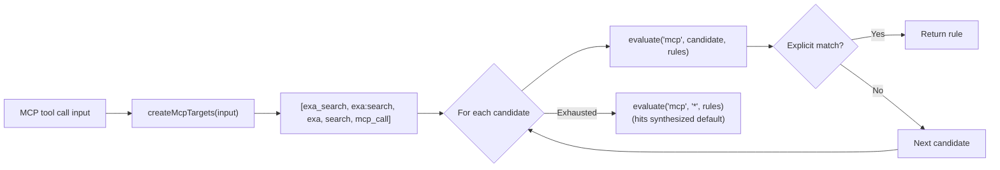
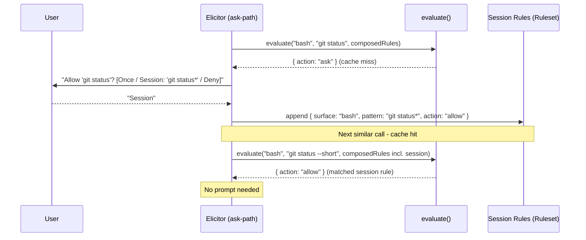
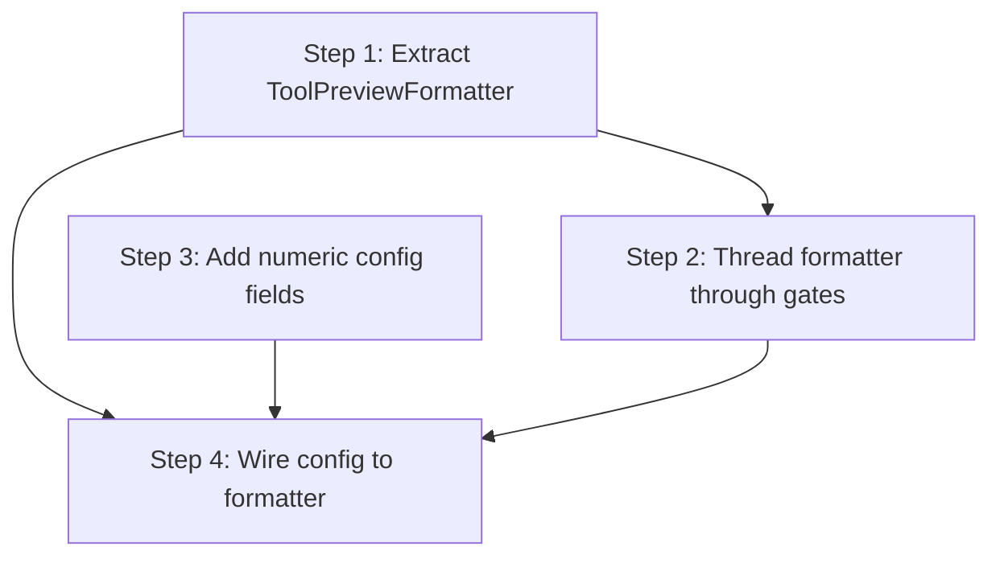
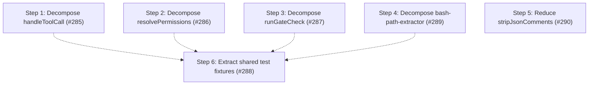
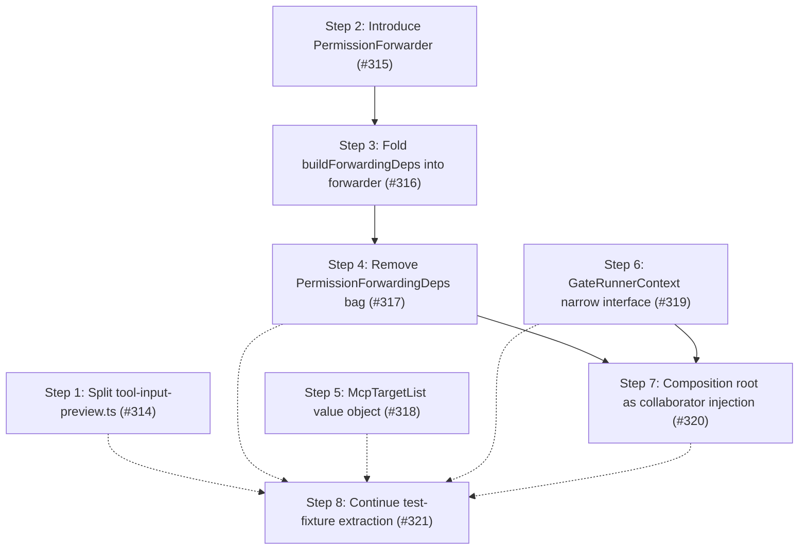

# Architecture

This document describes the internal design of the permission system, informed by [OpenCode's permission model](https://opencode.ai/docs/permissions/).

## Design principles

1. **Unified rule model** - one `Rule` type, one evaluation function, all surfaces.
2. **Pure evaluation** - permission decisions are pure functions of (surface, pattern, rules).
   IO stays at the edges.
3. **Session approvals are just more rules** - no separate matching engine, no separate pre-check.
4. **MCP stays special** - multi-name target derivation is pre-processing, not a special evaluation path.
5. **Defaults are rules** - the universal default (`permission["*"]`) is synthesized as a low-priority rule in the array.
   No side-channel fallbacks.
6. **Flat config format** - the flat `permission: { ... }` object where each key is a surface.
   The config IS the ruleset in human-friendly form.
7. **Preserve the two-phase model** - tool filtering (before_agent_start) and invocation gating (tool_call) remain separate.
8. **Ask = cache miss** - "ask" is the absence of a matching rule.
   The human is the oracle.
   Their decision is a rule.
   Persistence determines lifetime (once / session / config).

## Core data model

### Rule

```typescript
/**
 * Provenance of a rule — which source contributed it.
 *
 * Config scopes: "global", "project", "agent", "project-agent".
 * Synthesized:   "builtin" (universal default / evaluate() fallback),
 *                "baseline" (conditional MCP metadata auto-allow).
 * Runtime:       "session" (session approvals).
 */
type RuleOrigin =
  | "global"
  | "project"
  | "agent"
  | "project-agent"
  | "builtin"
  | "baseline"
  | "session";

interface Rule {
  /** The permission surface: "bash", "edit", "mcp", "skill", "external_directory", "path", etc. */
  surface: string;
  /** The match pattern: a command glob, tool name, file path, skill name, or "*". */
  pattern: string;
  /** The decision. */
  action: PermissionState;
  /**
   * Origin layer — used to derive PermissionCheckResult.source after evaluation.
   * Not used by evaluate(); purely informational metadata.
   */
  layer?: "default" | "baseline" | "config" | "session";
  /** Which source contributed this rule. */
  origin: RuleOrigin;
}
```

Every config entry, default policy, session approval, and agent override normalizes into `Rule[]`.

### Ruleset

```typescript
type Ruleset = Rule[];
```

Merge precedence is array ordering.
The synthesized universal default goes first (lowest priority), then MCP baseline auto-allow rules, then config rules (global → project → agent → project-agent), and finally session rules (highest priority).
Last-match-wins: `evaluate()` scans from the end.

### Evaluate

```typescript
function evaluate(surface: string, value: string, rules: Ruleset): Rule {
  for (let i = rules.length - 1; i >= 0; i--) {
    const rule = rules[i];
    if (wildcardMatch(rule.surface, surface) && wildcardMatch(rule.pattern, value)) {
      return rule;
    }
  }
  // Unreachable when defaults are synthesized - the catch-all always matches.
  return { surface, pattern: value, action: "ask" };
}
```

The entire decision engine.
When defaults are synthesized into the array, the catch-all `{ surface: "*", pattern: "*", action: "ask" }` always matches - the fallback return is defensive only.

## Composed ruleset

All rule sources are concatenated into a single flat array.
Index position determines priority (higher index wins):

```text
  ┌─────────────────────────────────────────────────────────────────┐
  │                     Composed Ruleset (Rule[])                   │
  │                                                                 │
  │  Index 0: Synthesized universal default (layer: "default")      │
  │    { surface: "*", pattern: "*", action: permission["*"] }      │
  │                                                                 │
  │  Index 1..B: MCP baseline auto-allow (layer: "baseline")        │
  │    (only when any config rule has surface:"mcp" action:"allow") │
  │    { surface: "mcp", pattern: "mcp_status",   action: "allow" } │
  │    { surface: "mcp", pattern: "mcp_list",     action: "allow" } │
  │    { surface: "mcp", pattern: "mcp_search",   action: "allow" } │
  │    { surface: "mcp", pattern: "mcp_describe", action: "allow" } │
  │    { surface: "mcp", pattern: "mcp_connect",  action: "allow" } │
  │                                                                 │
  │  Index B+1..C: Config rules (global → project → agent,         │
  │                   layer: "config", origin: "global"|"project"   │
  │                   |"agent"|"project-agent")                     │
  │    { surface: "bash",  pattern: "*",     action: "allow",       │
  │      origin: "global" }                                         │
  │    { surface: "bash",  pattern: "git *", action: "allow",       │
  │      origin: "global" }                                         │
  │    { surface: "bash",  pattern: "rm *",  action: "deny",        │
  │      origin: "project" }                                        │
  │    { surface: "read",  pattern: "*",     action: "allow",       │
  │      origin: "global" }                                         │
  │    { surface: "mcp",   pattern: "exa:*", action: "allow",       │
  │      origin: "agent" }                                          │
  │                                                                 │
  │  Index C+1..end: Session rules (layer: "session", highest)      │
  │    { surface: "external_directory", pattern: "/other/*",        │
  │      action: "allow" }                                          │
  │                                                                 │
  │  ◄── evaluate() scans from end, first match wins ──►            │
  └─────────────────────────────────────────────────────────────────┘
```

`synthesizeDefaults()` produces a single universal catch-all from `permission["*"]`.
Per-surface catch-alls (e.g. `bash: { "*": "allow" }`) are expressed as regular config rules via `normalizeFlatConfig()` — no separate override layer is needed.

`synthesizeBaseline()` conditionally emits MCP metadata auto-allow rules.

`composeRuleset()` concatenates: defaults + baseline + config rules.
Session rules are concatenated after config rules so `evaluate()` handles them via last-match-wins — no separate per-branch pre-check.

### Default synthesis

```typescript
// Single universal catch-all from permission["*"].
function synthesizeDefaults(universalDefault: PermissionState): Ruleset {
  return [
    { surface: "*", pattern: "*", action: universalDefault, layer: "default" },
  ];
}

// MCP metadata auto-allow - only synthesized when any config rule has
// surface: "mcp" && action: "allow".
function synthesizeBaseline(configRules: Ruleset): Ruleset { ... }

// Concat in priority order: defaults, baseline, config.
function composeRuleset(defaults, baseline, config): Ruleset {
  return [...defaults, ...baseline, ...config];
}
```

## Architecture overview


## Config format

```jsonc
{
  "permission": {
    "*": "ask",
    "read": "allow",
    "bash": { "*": "allow", "git *": "allow", "npm *": "allow", "rm *": "deny" },
    "mcp": { "*": "ask", "exa:*": "allow" },
    "skill": { "*": "ask", "librarian": "allow" },
    "path": { "*": "allow", "*.env": "deny" },
    "external_directory": "ask"
  }
}
```

Each top-level key in `permission` is a surface name.
A string value is shorthand for `{ "*": action }` (surface-level catch-all).
An object value maps patterns to actions.
`permission["*"]` is the universal fallback.

### Normalization to Rule[]

```typescript
function normalizeFlatConfig(permission: FlatPermissionConfig): Ruleset {
  const rules: Ruleset = [];

  for (const [surface, value] of Object.entries(permission)) {
    if (typeof value === "string") {
      // Shorthand: "read": "allow" → { surface: "read", pattern: "*", action: "allow" }
      rules.push({ surface, pattern: "*", action: value as PermissionState });
    } else {
      // Object: "bash": { "*": "ask", "git *": "allow" }
      for (const [pattern, action] of Object.entries(value)) {
        rules.push({ surface, pattern, action: action as PermissionState });
      }
    }
  }

  return rules;
}
```

## MCP pre-processing

MCP is the one surface that requires pre-processing **before** evaluation.
The multi-name target derivation stays, but it feeds candidate values into `evaluate()` rather than a separate code path:



The priority ordering of candidates is preserved.
The evaluation function is unchanged - MCP just calls it multiple times with different values.
MCP target derivation helpers live in `src/mcp-targets.ts`.
Input normalization for all surfaces lives in `src/input-normalizer.ts`.

### Path-bearing tool normalization

For path-bearing tools (`read`, `write`, `edit`, `find`, `grep`, `ls`), `normalizeInput` returns the file path from `input.path` as the match value instead of `"*"`.
This enables per-tool path patterns: `"read": { "*": "allow", "*.env": "deny" }` denies reads of `.env` files while allowing everything else.
When `input.path` is missing or empty, the value falls back to `"*"` (surface-level catch-all), preserving backward compatibility.
`getToolPermission()` is unaffected — it always evaluates with `"*"` to determine whether to inject the tool at agent start.

## Session approvals: the cache-miss model

Session rules are stored as `Ruleset` and are generalized to all surfaces.

`evaluate()` is a **lookup** against cached decisions.
When no rule matches (or the matching rule says "ask"), the system has a cache miss - it needs the human oracle to produce a decision.

The human's response is simultaneously:

1. **The answer** for this request (allow or deny).
2. **A rule** that can be cached for future lookups.

The dialog determines **persistence** - where the rule lives:

```text
  evaluate(surface, value, composedRules)
       │
       ├── match.action = "allow" → proceed (cache hit)
       ├── match.action = "deny"  → block (cache hit)
       │
       └── match.action = "ask"   → cache miss, query oracle
                │
                ▼
           Dialog: "[surface] wants to [value]"
                │
                ├── "Yes"              → allow this request (no persistence)
                ├── "Yes, for session" → allow + store in session layer
                │                        (future lookups hit without asking)
                ├── "No"               → deny this request (no persistence)
                └── (future: "Always") → allow + store in config layer (disk)
```

### Pattern suggestions

When prompting, each surface suggests a **pattern** for the "for session" option.
The pattern determines what class of future requests auto-approve:

| Surface                | Input value                 | Suggested session pattern   | Mechanism                |
| ---------------------- | --------------------------- | --------------------------- | ------------------------ |
| bash                   | `git checkout main`         | `git checkout *`            | Arity table              |
| bash                   | `npm run dev`               | `npm run dev`               | Arity table              |
| tool (read/write/etc.) | tool surface itself         | `*` (all uses of that tool) | Tool-level               |
| mcp                    | `exa:search`                | `exa:*`                     | Server-level wildcard    |
| skill                  | `librarian`                 | `librarian`                 | Exact name               |
| external_directory     | `/other/project/src/foo.ts` | `/other/project/*`          | Directory prefix as glob |

The suggestion is shown in the dialog text so the user sees what they're approving:

```text
  ● Allow once
  ● Allow "git checkout *" for this session
  ● Deny
```

### Implementation



## Two-phase checking

### Phase 1: Tool filtering (`before_agent_start`)

```typescript
function shouldExposeTool(toolName: string, rules: Ruleset): boolean {
  const rule = evaluate(toolName, "*", rules);
  return rule.action !== "deny";
}
```

Uses `evaluate()` with pattern `"*"` - "is this tool denied at the surface level, regardless of specific input?"

### Phase 2: Invocation gating (`tool_call`)

```typescript
// Surface-specific input normalization (what to query)
const { surface, value } = normalizeInput(toolName, input);

// Single evaluation against the composed ruleset (how to decide)
const rule = evaluate(surface, value, composedRules);

if (rule.action === "allow") return proceed;
if (rule.action === "deny") return block;
// rule.action === "ask" - elicit from oracle
const decision = await elicitRule(surface, value, suggestPattern(surface, value));
if (decision.persistence === "session") {
  sessionRules.approve(surface, decision.pattern);
}
return decision.action === "allow" ? proceed : block;
```

Same `evaluate()`, same ruleset.
The only surface-specific logic is input normalization (what `surface` and `value` to look up) and pattern suggestion (what glob to offer for "session" approval).

`checkPermission()` uses a single evaluate path: `normalizeInput()` → `evaluateFirst()` → `deriveSource()` → single result object.

## Subagent detection and permission forwarding

When `ask`-state permissions arise in a headless subagent child process, the extension forwards the dialog to the parent session rather than silently denying.
This requires two detections:

1. **Is the current process a subagent?**
   — `isSubagentExecutionContext()` in `src/subagent-context.ts`.
2. **What is the parent session ID?**
   — `resolvePermissionForwardingTargetSessionId()` in `src/permission-forwarding.ts`.

### Known extension env var inventory

| Extension                                                                           | Child-process env vars                                                                    | Parent-session env var              |
| ----------------------------------------------------------------------------------- | ----------------------------------------------------------------------------------------- | ----------------------------------- |
| pi-agent-router (original)                                                          | `PI_IS_SUBAGENT`, `PI_SUBAGENT_SESSION_ID`, `PI_AGENT_ROUTER_SUBAGENT`                    | `PI_AGENT_ROUTER_PARENT_SESSION_ID` |
| [nicobailon/pi-subagents](https://github.com/nicobailon/pi-subagents)               | `PI_SUBAGENT_CHILD`, `PI_SUBAGENT_RUN_ID`, `PI_SUBAGENT_CHILD_AGENT`, `PI_SUBAGENT_DEPTH` | none set (see #98)                  |
| [tintinweb/pi-subagents](https://github.com/tintinweb/pi-subagents)                 | none — runs fully in-process via `createAgentSession()`                                   | n/a — deferred to #29               |
| [HazAT/pi-interactive-subagents](https://github.com/HazAT/pi-interactive-subagents) | `PI_SUBAGENT_NAME`, `PI_SUBAGENT_ID`, `PI_SUBAGENT_SESSION`, `PI_SUBAGENT_ACTIVITY_FILE`  | none set (see #98)                  |

### Detection (`isSubagentExecutionContext`)

`isSubagentExecutionContext()` checks three sources in priority order:

1. **Explicit registry** — `@gotgenes/pi-subagents` emits `subagents:child:session-created` before `bindExtensions()`; the permission system's subscriber writes the entry into `SubagentSessionRegistry` synchronously.
   The registry (keyed by **child session id**) is checked first.
   Each concurrent sibling child of the same parent receives a unique session id from `sessionManager.newSession()`, so siblings occupy distinct keys — one sibling's `disposed` event cannot evict another's entry (fixes #298).
   The registry is a process-global singleton (via `getSubagentSessionRegistry()`, backed by `globalThis` + `Symbol.for()`) because each session's `ResourceLoader` creates its own `pi.events` bus: the parent's instance registers the child over the parent bus, while the child's separate jiti instance reads the same global store to detect itself and resolve its forwarding target.
2. **Env vars** (`SUBAGENT_ENV_HINT_KEYS`) — returns `true` when any key is set to a non-empty, non-whitespace value.
   Used by process-based subagent extensions.
3. **Filesystem path** — session-directory path-based fallback (child session dir is nested under `subagentSessionsDir`).

### Parent-session resolution (`resolvePermissionForwardingTargetSessionId`)

`resolvePermissionForwardingTargetSessionId()` checks two sources in priority order:

1. **Explicit registry** — if the caller provides a `sessionId` and `registry`, the registry entry's `parentSessionId` is returned when present.
   Used by in-process subagent extensions.
2. **Env vars** (`SUBAGENT_PARENT_SESSION_ENV_CANDIDATES`) — iterates candidates and returns the first non-empty, non-`"unknown"` value.
   Used by process-based subagent extensions.

Neither nicobailon nor HazAT sets a parent-session env var today, so forwarding still fails for those extensions with an explicit log message pointing to #98.
Adding a new env var candidate when an extension adopts the convention is a one-line change to the array.

### In-process case (resolved)

In-process subagent extensions (e.g. `@gotgenes/pi-subagents`) call `createAgentSession()` directly — no child process is spawned and no env vars are ever set.
`@gotgenes/pi-subagents` publishes `subagents:child:session-created` (before `bindExtensions()`) and `subagents:child:disposed` (in the run's `finally`); `src/subagent-lifecycle-events.ts` subscribes and writes/removes the entry in `SubagentSessionRegistry` synchronously.
The registry is process-global (see `getSubagentSessionRegistry()` in `src/subagent-registry.ts`) so the child's separate jiti instance reads the same store as the parent.
See `src/subagent-registry.ts` and [Subagent Integration](../subagent-integration.md) for details.

### External convention guide

A [permission frontmatter convention guide](../guides/permission-frontmatter-for-subagent-extensions.md) documents how upstream subagent extensions can adopt the `permission:` frontmatter key as a shared convention.
This is a documentation-only proposal — no code dependency is required.
The guide covers the two-layer model, flat format reference, composition examples, and the optional event bus runtime integration.

## Cross-extension service accessor

The primary cross-extension API is a `Symbol.for()`-backed service object on `globalThis`.

Pi's extension loader creates a fresh jiti instance per extension with `moduleCache: false`, isolating module-scoped state.
`Symbol.for()` and `globalThis` are process-global by spec, so they survive this isolation.

The extension publishes a `PermissionsService` object via `publishPermissionsService()` at `session_start`, gated so an in-process subagent child does not clobber the parent's service (#302).
Other extensions retrieve it with `getPermissionsService()` from `import("@gotgenes/pi-permission-system")`.
The `package.json` `exports` field points to `src/service.ts`, which contains the interface, the accessor functions, and the `Symbol.for()` key — no extension machinery.

The `PermissionsService` interface exposes three methods:

- `checkPermission(surface, value?, agentName?)` — full policy query.
- `getToolPermission(toolName, agentName?)` — tool-level permission state (`allow`/`deny`/`ask`) for pre-filtering.
- `registerToolInputFormatter(toolName, formatter)` — register a custom ask-prompt preview for a tool name; returns a disposer (#283).

The event-bus RPC (`permissions:rpc:check`) remains as a zero-dependency fallback for consumers who do not want to add an optional peer dep.
It is deprecated in favor of the service accessor.

`permissions:decision` broadcasts and `permissions:rpc:prompt` remain on the event bus — fire-and-forget observation and async prompt forwarding are the right abstractions for those channels.

## Module structure

```text
src/
├── rule.ts                   Rule type, Ruleset type, evaluate()
├── normalize.ts              Config → Ruleset normalization (flat format)
├── synthesize.ts             Universal default + MCP baseline → Ruleset
├── wildcard-matcher.ts       Compiled glob matching
├── mcp-targets.ts            MCP multi-name target derivation
├── input-normalizer.ts       Surface-specific input normalization → NormalizedInput
├── pattern-suggest.ts        Per-surface approval pattern suggestions
├── bash-arity.ts             Command arity table for bash pattern suggestions
├── expand-home.ts            ~/$HOME expansion for patterns
├── session-approval.ts        SessionApproval value object — owns the single/multi-pattern union; exposes representativePattern and toGateApproval()
├── session-rules.ts          Session approval store (Ruleset wrapper); record(approval) fan-out delegates to per-pattern approve()
├── policy-loader.ts          PolicyLoader interface + FilePolicyLoader (file I/O, mtime caching)
├── scope-merge.ts            Cross-scope permission merge + origin-map bookkeeping
├── permission-manager.ts     Scope loading + rule composition + checkPermission(); delegates I/O to PolicyLoader
├── permission-gate.ts        Pure deny/ask/allow gate (injected IO)
├── permission-prompter.ts    Yolo-mode, review logging, UI/forwarding branch; PromptPermissionDetails type
├── permission-dialog.ts      Dialog options (once / session / deny)
│
├── permission-session.ts     PermissionSession class — encapsulates all mutable session state
├── handlers/                 Handler classes with narrow constructor injection
│   ├── index.ts              Barrel re-exports
│   ├── lifecycle.ts          SessionLifecycleHandler (session + cleanupRpc)
│   ├── before-agent-start.ts AgentPrepHandler (session + toolRegistry); shouldExposeTool pure helper
│   ├── permission-gate-handler.ts PermissionGateHandler (session + events + toolRegistry); parses the bash command once per `tool_call` and injects the shared `BashProgram` into the three bash gates (#308); validateRequestedTool + getEventInput + extractSkillNameFromInput pure helpers
│   └── gates/               Pure descriptor factories + runner
│       ├── types.ts          GateOutcome, ToolCallContext
│       ├── descriptor.ts     GateDescriptor (with DenialContext), GateBypass, GateResult, GateRunnerDeps types
│       ├── runner.ts         runGateCheck() — thin orchestration: phase 1 inline, phases 2+5 via buildDecisionEvent, phase 6 via deps.recordSessionApproval tell
│       ├── helpers.ts        deriveDecisionValue, deriveResolution, buildDecisionEvent
│       ├── skill-read.ts     describeSkillReadGate — pure descriptor factory
│       ├── external-directory.ts describeExternalDirectoryGate — pure descriptor/bypass factory
│       ├── external-directory-messages.ts External-directory ask-prompt formatting (denial messages moved to denial-messages.ts)
│       ├── bash-external-directory.ts describeBashExternalDirectoryGate — pure descriptor/bypass factory over the injected `BashProgram` (`externalPaths(cwd)`); selects the worst uncovered path via `pickMostRestrictive`
│       ├── bash-path.ts      describeBashPathGate — pure descriptor/bypass factory for bash path rules over the injected `BashProgram` (`pathTokens()`); selects the worst uncovered token via `pickMostRestrictive`
│       ├── candidate-check.ts `pickMostRestrictive` — pure deny > ask > allow selection over PermissionCheckResults (first-wins on ties); shared by the bash gates
│       ├── bash-token-classification.ts Pure token classifiers — `classifyTokenAsPathCandidate` (strict: `/`, `~/`, `..`) and `classifyTokenAsRuleCandidate` (broader: also dot-files and relative paths); shared `rejectNonPathToken` predicate
│       ├── bash-program.ts   `BashProgram` value object — parses a bash command once (tree-sitter-bash) and exposes typed slices (`pathTokens()`, cwd-projecting `externalPaths(cwd)`, `commands(): BashCommand[]`); `commands()` splits the chain AND descends into command/process substitutions and subshells, emitting each nested command as an additional `BashCommand` tagged with its execution `context` (never-weaker, #306); `externalPaths(cwd)` projects a running effective working directory across a sequence of current-shell `cd`s, scoping subshells (frame stack) / pipelines / backgrounded commands and persisting brace-group `cd`s, and conservatively flags relative paths after a non-literal `cd` (#307, retiring the single `leadingCdTarget`); `pathTokens()` is cwd-independent and unchanged; owns the AST walker and `cd`-fold projection; classifiers imported from `bash-token-classification.ts`
│       ├── bash-path-extractor.ts Thin facades (`extractTokensForPathRules`, `extractExternalPathsFromBashCommand`) over `BashProgram`
│       ├── bash-command.ts   `resolveBashCommandCheck` — pure combiner over caller-supplied `BashCommand[]` units (the handler decomposes via `BashProgram.commands()`), checks each unit on the `bash` surface, tags the winning result with the offending command's execution `context` (#306), selects via `pickMostRestrictive`, and falls back to the whole command when empty (#301)
│       ├── path.ts           describePathGate — pure descriptor factory for cross-cutting path rules
│       ├── tool.ts           describeToolGate — pure descriptor factory
│       └── index.ts          Barrel re-exports
│
├── index.ts                  Extension factory - event wiring, service publish
├── service.ts                PermissionsService interface, Symbol.for() accessor (cross-extension API)
├── permission-events.ts      Event channel constants, payload types, emit helpers
├── permission-event-rpc.ts   permissions:rpc:check (deprecated) and permissions:rpc:prompt handlers
├── runtime.ts                ExtensionRuntime context object, config refresh/save
├── config-loader.ts          File I/O, format detection
├── config-paths.ts           Path derivation
├── config-reporter.ts        Structured log entries for resolved config
├── config-modal.ts           /permission-system slash command UI
├── extension-config.ts       Runtime knobs (debugLog, yoloMode, etc.)
│
├── permission-merge.ts        Deep-shallow merge for flat permission configs
├── path-utils.ts              Path normalization, within-directory, outside-CWD, safe-system-path, path-bearing-tool, Pi infrastructure read
├── node-modules-discovery.ts  Global node_modules resolution (walk-up + npm root -g fallback)
├── system-prompt-sanitizer.ts Remove denied tools from system prompt
├── skill-prompt-sanitizer.ts  Skill prompt filtering by policy
├── denial-messages.ts         Centralized denial message formatter — DenialContext type, EXTENSION_TAG, formatDenyReason/formatUnavailableReason/formatUserDeniedReason
├── permission-prompts.ts      User-facing ask-prompt formatting + pre-check error messages
├── tool-input-preview.ts              Pure tool-input text utilities (truncation, line counting, count formatting), serialization + default constants
├── tool-input-prompt-formatters.ts    Pure per-tool prompt formatters (edit/write/read) + getPromptPath helper (#314)
├── tool-preview-formatter.ts          ToolPreviewFormatter class — config-dependent prompt + log formatting; seam-first dispatch consults ToolInputFormatterLookup before built-in switch (#266, #283)
├── tool-input-formatter-registry.ts   ToolInputFormatter type, ToolInputFormatterLookup interface, ToolInputFormatterRegistry class — persistent registry for custom previews (#283)
├── builtin-tool-input-formatters.ts   Built-in formatters registered at startup: formatMcpInputForPrompt keyed to "mcp" (#283)
├── tool-registry.ts           ToolRegistry interface + tool name validation
├── active-agent.ts            Agent name detection from session/system prompt
├── subagent-context.ts        Subagent execution context detection (registry + env vars + filesystem)
├── subagent-registry.ts       SubagentSessionRegistry class + getSubagentSessionRegistry() process-global accessor — in-process subagent session tracking
├── permission-forwarding.ts   Constants for cross-session forwarding (registry + env var resolution)
├── forwarded-permissions/     Poll-based approval forwarding for subagents
├── session-logger.ts          SessionLogger interface + createSessionLogger() factory
├── logging.ts                 JSONL review/debug log writer
├── status.ts                  Footer status bar integration
├── yolo-mode.ts               Auto-approve logic
├── common.ts                  Shared parsing utilities
├── types.ts                   Core type definitions (PermissionState, FlatPermissionConfig, etc.)
└── before-agent-start-cache.ts Memoization for prompt sanitization
```

## Improvement roadmap — Phase 1

Goal: make issue [#266] (configurable preview limits + future formatter extension seam) easy to implement.

Today, `tool-input-preview.ts` uses module-level constants (`TOOL_INPUT_PREVIEW_MAX_LENGTH = 200`, `TOOL_TEXT_SUMMARY_MAX_LENGTH = 80`) and there is no path for extension config to reach the formatting layer.
The call chain from handler → gate descriptor → prompt → formatting spans 5 pure-function layers with no config parameter.
The config normalizer only handles booleans and arrays — no pattern exists for optional numeric fields.

### Current health metrics

| Metric               | Value                |
| -------------------- | -------------------- |
| Health score         | 74 B                 |
| LOC                  | 30,893               |
| Dead files / exports | 0%                   |
| Avg cyclomatic       | 1.4                  |
| p90 cyclomatic       | 2                    |
| Maintainability      | 91.2 (good)          |
| Duplication          | 9.3% (2,853 lines)   |
| Churn hotspots       | 41 files             |
| Refactoring targets  | 5 (4 medium, 1 high) |

### Findings

Filtered to what blocks or complicates [#266]:

| #   | Finding                                                                                                                                                                                                     | Category                           | Files                                                                                     | Impact | Risk | Priority |
| --- | ----------------------------------------------------------------------------------------------------------------------------------------------------------------------------------------------------------- | ---------------------------------- | ----------------------------------------------------------------------------------------- | ------ | ---- | -------- |
| 1   | `tool-input-preview.ts` is a flat bag of 15 exports (3 constants + 12 functions) mixing prompt formatting, log formatting, and text utilities — no cohesive object to receive config                        | B: oversized / C: coupling         | `tool-input-preview.ts`                                                                   | 5      | 2    | 20       |
| 2   | No config path to gate descriptors — `describeToolGate(tcc, check)` and `formatAskPrompt(result, agent, input)` are pure functions with no config parameter; adding one requires threading through 5 layers | C: parameter relay                 | `permission-gate-handler.ts`, `tool.ts`, `permission-prompts.ts`, `tool-input-preview.ts` | 4      | 2    | 16       |
| 3   | Config normalizer (`normalizePermissionSystemConfig`) has no pattern for optional numeric fields with defaults and bounds checking — only booleans and arrays                                               | C: coupling (missing abstraction)  | `extension-config.ts`                                                                     | 3      | 1    | 15       |
| 4   | `formatToolInputForPrompt` switch statement is the natural home for the future formatter extension seam but is buried in a utility module with no object to hang a `register()` method on                   | C: coupling (missing collaborator) | `tool-input-preview.ts`                                                                   | 4      | 2    | 16       |
| 5   | `permission-prompts.ts` test mocks `tool-input-preview` at module level — extracting a formatter object would let the test inject it directly, removing the `vi.mock()`                                     | D: testability                     | `permission-prompts.test.ts`                                                              | 2      | 1    | 10       |

### Steps

1. ✅ **Extract `ToolPreviewFormatter` class from `tool-input-preview.ts`** ([#282])
   - Created `tool-preview-formatter.ts` with `ToolPreviewFormatter` class accepting `ToolPreviewFormatterOptions` in its constructor
   - Moved 7 config-dependent methods onto the class: `formatToolInputForPrompt`, `formatJsonInputForPrompt`, `formatSearchInputForPrompt`, `sanitizeInlineText`, `formatGenericToolInputForLog`, `getToolInputPreviewForLog`, `getPermissionLogContext`
   - `tool-input-preview.ts` retains 8 pure utilities + 3 default constants
   - Outcome: formatter is a single injectable object; [#266] passes config by constructing the formatter with user-configured limits

2. ✅ **Thread `ToolPreviewFormatter` through the gate descriptor chain** ([#282])
   - `describeToolGate(tcc, check, formatter)` — accepts the formatter as third parameter
   - `formatAskPrompt(result, agentName, input, formatter?)` — accepts an optional formatter
   - `PermissionGateHandler.handleToolCall` constructs the formatter with default constant values and passes it to the tool gate producer
   - `permission-prompts.test.ts` `vi.mock` removed — formatter is injected directly
   - Outcome: config reaches formatting with one parameter instead of threading through 5 layers

3. ✅ **Add numeric config normalization to `extension-config.ts`** ([#266])
   - Added `normalizeOptionalPositiveInt` helper (exported; validates positive integer)
   - Added `toolInputPreviewMaxLength` and `toolTextSummaryMaxLength` as optional fields to `PermissionSystemExtensionConfig`
   - Updated `normalizePermissionSystemConfig` to parse both fields (omit when invalid/absent)
   - Updated `permissions.schema.json` (`type: "integer"`, `minimum: 1`) and `config.example.json`
   - Outcome: config system handles numeric fields; fallback to 200/80 constants when fields are absent
   - Commit: `feat: add toolInputPreviewMaxLength and toolTextSummaryMaxLength config fields (#266)`

4. ✅ **Wire config to `ToolPreviewFormatter` construction** ([#266])
   - Added `resolveToolPreviewLimits(config)` to `tool-preview-formatter.ts` (narrow `Pick` param; applies `??` fallbacks to the three formatter options)
   - `PermissionGateHandler.handleToolCall` now constructs the formatter with `resolveToolPreviewLimits(this.session.config)`
   - `session.config` is read fresh on every tool call — config reloads take effect automatically
   - Outcome: user-configured limits take effect at runtime; [#266] is complete
   - Commit: `feat: use configured preview limits in permission prompts (#266)`

### Step dependency diagram



### Tracks

| Track                | Steps | Description                                                |
| -------------------- | ----- | ---------------------------------------------------------- |
| Formatter extraction | 1 → 2 | Extract the collaborator, thread it through the call chain |
| Config schema        | 3     | Add numeric fields to config (independent of extraction)   |
| Integration          | 4     | Wire config to formatter (depends on both tracks)          |

## Improvement roadmap — Phase 2

Goal: pay down the complexity and duplication debt that `fallow` flags but no issue tracks.

Phase 1 is scoped to enabling [#266] (the preview formatter).
Phase 2 is a distinct theme: it eliminates the five `fallow` refactoring targets and drives down the test-tree duplication.
Four of the five targets sit on the security-critical `tool_call` decision path, where high untested complexity is a correctness risk, not only a maintainability one.

The two phases are otherwise independent and can run in either order, with one exception: do [#285] before Phase 1 step 2, since both modify the `describeToolGate` call site inside `handleToolCall`, and decomposing that function first lets the formatter thread through a clean pipeline.

### Current health metrics

| Metric               | Value                                                                                                  |
| -------------------- | ------------------------------------------------------------------------------------------------------ |
| Health score         | 74 B                                                                                                   |
| LOC                  | 31,416                                                                                                 |
| Dead files / exports | 0%                                                                                                     |
| Avg cyclomatic       | 1.4                                                                                                    |
| Maintainability      | 91.2 (good)                                                                                            |
| Duplication          | 9.2% (after [#286])                                                                                    |
| Refactoring targets  | 3 (2 medium, 1 high) — after [#290]; `config-loader.ts` no longer a target                             |
| Worst CRAP risk      | `permission-gate-handler.ts` 79.4 (handleInput) — after [#290]                                         |

### Findings

All findings are `fallow`-confirmed and untracked before this phase.

| #   | Finding                                                                                                                                                                                              | Category                         | Files                                   | Impact | Risk | Priority |
| --- | ---------------------------------------------------------------------------------------------------------------------------------------------------------------------------------------------------- | -------------------------------- | --------------------------------------- | ------ | ---- | -------- |
| 1   | `handleToolCall` runs six gates with a repeated bypass/runner/short-circuit shape — cognitive 52, CRAP 172, the package's worst                                                                      | B: god function                  | `handlers/permission-gate-handler.ts`   | 5      | 2    | 20       |
| 2   | ✅ `resolvePermissions` interleaves scope merge with parallel origin-map bookkeeping — cognitive 33, CRAP 97 — resolved by [#286]                                                                    | B: god function                  | `permission-manager.ts`                 | 4      | 2    | 16       |
| 3   | ✅ `runGateCheck` carried the full check→log→emit→approve cycle as six inline phases — cognitive 32 — resolved by [#287]                                                                             | B: god function                  | `handlers/gates/runner.ts`              | 4      | 2    | 16       |
| 4   | ✅ Two token classifiers share a 31-line rejection prelude (production clone); `collectPathCandidateTokens` (37) and `collectPatternCommandTokens` (33) are complexity hotspots — resolved by [#289] | A: duplication / B: god function | `handlers/gates/bash-path-extractor.ts` | 4      | 3    | 12       |
| 5   | ✅ `stripJsonComments` is a five-variable character scanner — cognitive 31 — resolved by [#290]                                                                                                      | B: god function                  | `config-loader.ts`                      | 2      | 2    | 8        |
| 6   | ✅ 9.1% duplication concentrated in the test tree — the single largest health deduction (-4.1) — resolved by [#288]                                                                                  | D: test duplication              | `test/` (clone families)                | 3      | 1    | 15       |

### Steps

1. ✅ **Decompose `handleToolCall`** ([#285]) — **completed**
   - Extracted `validateRequestedTool` (pure, exported) for the tool-name validation prelude.
   - Extracted `runGate` closure (inside `handleToolCall`) for the unified bypass/runner/short-circuit shape.
   - Collapsed the body to validate → build context → ordered producer-array pipeline.
   - Outcome: `handleToolCall` no longer appears as a refactoring target; CRAP risk for the file dropped from 172 → 79.4 (now `handleInput`); refactoring targets 5 → 4.

2. ✅ **Decompose `resolvePermissions`** ([#286]) — **completed**
   - Extracted `mergeScopesWithOrigins(scopes)` (into new `src/scope-merge.ts`) returning `{ mergedPermission, origins }`, isolating origin-map bookkeeping from the resolve pipeline.
   - The remaining body reads as load scopes → merge with origins → extract universal fallback → build config rules → compose.
   - Outcome: `resolvePermissions` no longer appears as a refactoring target; `permission-manager.ts` dropped from the CRAP-risk list.

3. ✅ **Thin `runGateCheck`** ([#287]) — **completed**
   - Introduced `SessionApproval` value object (`src/session-approval.ts`) owning the `{pattern}|{patterns}` union; exposed `representativePattern` and `toGateApproval()`.
   - `SessionRules.record(approval)` absorbs the per-pattern loop; `GateRunnerDeps` seam renamed to `recordSessionApproval(approval)` — runner tells the store, never interrogates the union.
   - Extracted `buildDecisionEvent` into `helpers.ts` to deduplicate the `origin/agentName/matchedPattern ?? null` normalization across both emit sites.
   - Outcome: `runner.ts` no longer appears as a refactoring target; refactoring targets 4 → 3.

4. ✅ **Decompose `bash-path-extractor.ts`** ([#289]) — **completed**
   - Extracted pure token classifiers into new `src/handlers/gates/bash-token-classification.ts`; private `rejectNonPathToken` predicate eliminates the 31-line rejection-prelude clone.
   - Extracted `classifyPatternCommandFlag` (returns a `PatternCommandFlagDirective` discriminated union) to replace the inline flag state machine in `collectPatternCommandTokens`.
   - Extracted `collectCommandTokens`, `collectGenericCommandTokens`, `collectRedirectTokens` from `collectPathCandidateTokens`; converted both walkers from output-argument accumulator to return-based `string[]`.
   - Category: A + B (production clone + god functions)
   - Outcome: clone removed; `collectPathCandidateTokens` and `collectPatternCommandTokens` decomposed into focused helpers; `bash-token-classification.ts` has dedicated unit tests (43 tests) covering every rejection and acceptance branch.

5. ✅ **Reduce `stripJsonComments` complexity** ([#290]) — **completed**
   - Replaced the five-flag single-loop scanner with a stateless dispatcher delegating to three private consume helpers: `consumeLineComment`, `consumeBlockComment`, and `consumeString`, each returning a `ScanSegment` value (`{ output, nextIndex }`).
   - Added 14 direct unit tests for `stripJsonComments` (the function was exported but had no dedicated coverage) to pin the contract before the refactor.
   - Category: B (god function)
   - Outcome: `stripJsonComments` no longer appears as a refactoring target; `config-loader.ts` dropped from the CRAP-risk list; refactoring targets 4 → 3.
   - Commits: `test: add direct stripJsonComments unit tests`, `refactor: model stripJsonComments as consume helpers`

6. ✅ **Extract shared test fixtures** ([#288]) — **completed**
   - Created `test/helpers/handler-fixtures.ts` (`makeCtx`, `makeEvents`, `makeSession`, `makeToolRegistry`, `makeToolCallEvent`, `makeCheckResult`, `makeHandler`, `getDecisionEvents`), `test/helpers/gate-fixtures.ts` (`makeDescriptor`, `makeRunnerDeps`, `makeTcc`, `makeGateCheckResult`), and `test/helpers/manager-harness.ts` (`createManager`).
   - Migrated handler-event clone family (`tool-call-events.test.ts`, `tool-call.test.ts`, `input-events.test.ts`, `input.test.ts`, `permission-session.test.ts`), external-directory family, gate family (`runner.test.ts`, `bash-path.test.ts`, `path.test.ts`), manager harness (`permission-system.test.ts`), and lifecycle setup (`before-agent-start.test.ts`, `lifecycle.test.ts`).
   - Category: D (test duplication)
   - Outcome: duplication 9.1% → 7.1%; clone groups 122 → 113; health deduction -4.1 → -2.1.

### Step dependency diagram

Steps 1-5 are independent.
Step 6 is best sequenced after the production refactors whose tested call sites it touches (dashed edges) — those refactors are behavior-preserving, so the soft ordering only avoids re-migrating fixtures, it does not block.



### Tracks

| Track                       | Steps   | Description                                                              |
| --------------------------- | ------- | ------------------------------------------------------------------------ |
| A: Decision-path complexity | 1, 2, 3 | Decompose the three `tool_call` hotspots (independent, parallel)         |
| B: bash-path-extractor      | 4       | Remove the production clone and reduce the two collect-function hotspots |
| C: config-loader            | 5       | Reduce `stripJsonComments` complexity (lowest priority)                  |
| D: Duplication              | 6       | Extract shared test fixtures; best sequenced after Tracks A and B        |

## Improvement roadmap — Phase 3

Goal: convert the package's remaining bags-of-state-and-closures into class-based collaborators that own their state and expose behavior (Tell-Don't-Ask), then clear the one outstanding `fallow` cohesion target and the test-tree duplication.

Phases 1 and 2 already gave the core domain good collaborators — `PermissionSession`, `ForwardingManager`, `SessionRules`, `SessionApproval`, `BashProgram`, `PermissionManager`.
Phase 3 finishes that arc where it stalled: the forwarding subsystem got a lifecycle class (`ForwardingManager`) but its behavior still lives as free functions reaching into a `PermissionForwardingDeps` bag that is assembled in two places.
The lens for this phase is not "extract a function" but "which stateful owner is missing, such that a caller reaches into a bag instead of telling an object?".

Phase 3 is independent of any open feature issue — it is a pure debt-reduction round.

### Current health metrics

| Metric                 | Value                                             |
| ---------------------- | ------------------------------------------------- |
| Health score           | 75 B                                              |
| LOC                    | 35,515                                            |
| Dead files / exports   | 0%                                                |
| Avg cyclomatic         | 1.4                                               |
| p90 cyclomatic         | 2                                                 |
| Maintainability        | 91.3 (good)                                       |
| Duplication            | 7.6% (2,700 lines, all in `test/`)                |
| Churn hotspots         | 41 files                                          |
| Refactoring targets    | 0                                                 |
| Dominant churn hotspot | `index.ts` 45.5 (accelerating) — 4× the next file |

Measurement note: `bash-token-classification.ts` reports the highest src CRAP (37.1, one function above threshold), but this is an artifact — `rejectNonPathToken` is a private helper, so `fallow` estimates 0% coverage and inflates its CRAP even though the module carries 43 dedicated unit tests.
It is not a real finding and gets no step.

### Findings

The headline findings are coupling smells (Category C) — anemic behavior, mutable closure state, and relay-only dependency bags — that `fallow`'s complexity metrics under-weight but the composition-root and forwarding code make obvious.

| #   | Finding                                                                                                                                                                                                                                                                                                                                                                                                                                                                                               | Category                                            | Files                                                                    | Impact | Risk | Priority |
| --- | ----------------------------------------------------------------------------------------------------------------------------------------------------------------------------------------------------------------------------------------------------------------------------------------------------------------------------------------------------------------------------------------------------------------------------------------------------------------------------------------------------- | --------------------------------------------------- | ------------------------------------------------------------------------ | ------ | ---- | -------- |
| 1   | Anemic forwarding subsystem: the forwarding lifecycle has a class (`ForwardingManager`) but its behavior is three free functions (`confirmPermission`, `waitForForwardedPermissionApproval` 132 lines, `processForwardedPermissionRequests` 144 lines) that reach into a `PermissionForwardingDeps` bag (8 members). The bag is assembled in `index.ts` and re-synthesized in `PermissionPrompter.buildForwardingDeps()` with divergent values and a cluster of `eslint-disable unbound-method` lines | C: anemic / mutable closure state / relay-only deps | `forwarded-permissions/polling.ts`, `permission-prompter.ts`, `index.ts` | 5      | 3    | 15       |
| 2   | ✅ Resolved ([#314]) — `tool-input-preview.ts` was a flat bag of 8 functions mixing prompt formatting (`format{Edit,Write,Read}InputForPrompt`, `getPromptPath`), text utilities (`truncateInlineText`, `countTextLines`, `formatCount`), and serialization (`serializeToolInputPreview`) — density 0.33, 6 dependents; `fallow`'s only refactoring target. Prompt formatters split into `tool-input-prompt-formatters.ts`; `tool-input-preview.ts` is no longer a refactoring target.                | B: oversized / E: cohesion                          | `tool-input-preview.ts`                                                  | 4      | 2    | 16       |
| 3   | 7.6% duplication, entirely in the test tree, is the largest single health deduction; the biggest clone families are `external-directory-integration.test.ts` (17 groups, 164 lines), `bash-path.test.ts` (9 groups, 120 lines), `runner.test.ts` (9 groups, 105 lines), and `tool-call.test.ts` (6 groups, 108 lines)                                                                                                                                                                                 | D: test duplication                                 | `test/` (clone families)                                                 | 3      | 1    | 15       |
| 4   | `createMcpPermissionTargets` collects results through a `pushTarget` closure that mutates a local array and dedups via `includes` — mutable closure state with no owner; the surrounding 71-line if-return chain (cognitive 26, CRAP 17.6) repeats the push/dedup sequence per mode                                                                                                                                                                                                                   | C: mutable closure state                            | `mcp-targets.ts`                                                         | 3      | 2    | 12       |
| 5   | `piPermissionSystemExtension` is a 149-line composition root with ~30 adapter closures and two overlapping forwarding bags; it is the #1 churn hotspot (45.5, accelerating, 4× the next file). Once the forwarding collaborator lands, the remaining job is injecting collaborators, not assembling closure bags                                                                                                                                                                                      | C: adapter closure density / E: wiring overhead     | `index.ts`                                                               | 4      | 3    | 12       |
| 6   | `handleToolCall` hand-assembles a 7-member `GateRunnerDeps` closure bag where 6 members relay straight to `this.session` (`checkPermission`, `getSessionRuleset`, `recordSessionApproval`, `canConfirm`→`canPrompt`, `promptPermission`→`prompt`) — relay-only dependencies. The narrow-function shape is a deliberate test seam, so the fix is a narrow interface the session implements, not passing the concrete class                                                                             | C: relay-only dependencies                          | `handlers/permission-gate-handler.ts`, `handlers/gates/descriptor.ts`    | 3      | 3    | 9        |

### Steps

1. ✅ **Split `tool-input-preview.ts` into cohesive modules** ([#314])
   - Target: `src/tool-input-preview.ts` (the sole `fallow` refactoring target).
   - Extracted the three prompt formatters plus `getPromptPath` into a new `src/tool-input-prompt-formatters.ts`; left the text utilities (`truncateInlineText`, `countTextLines`, `formatCount`), `serializeToolInputPreview`, and the three limit constants in `tool-input-preview.ts`.
   - Repointed the sole production consumer (`tool-preview-formatter.ts`) and relocated the moved functions' unit coverage into `test/tool-input-prompt-formatters.test.ts`; all four new exports are consumed, so `fallow` flags no dead re-export.
   - Smell category: B (oversized) / E (cohesion).
   - Outcome: `tool-input-preview.ts` dropped off the refactoring-target list; refactoring targets 1 → 0 (confirmed by `fallow health --targets`).

2. ✅ **Introduce a `PermissionForwarder` collaborator (own the state)** ([#315])
   - Target: new `src/forwarded-permissions/permission-forwarder.ts`; `forwarding-manager.ts`; `index.ts`.
   - Added a `PermissionForwarder` class exposing `requestApproval(ctx, message, options?, forwarded?)` and `processInbox(ctx)`; for this lift-and-shift step it holds the `PermissionForwardingDeps` bag privately (`shouldAutoApprove` supplied once at construction) and delegates to the existing `polling.ts` free functions, so behavior is unchanged.
   - Wired `ForwardingManager` to a narrow `InboxProcessor` seam (the manager only calls `processInbox`, mirroring the existing `ForwardingController` convention and dropping the test's `as unknown as` cast); constructed the single forwarder in `index.ts` and injected it.
   - Smell category: C (anemic domain model — give the forwarding behavior an owner).
   - Outcome: one forwarder instance replaces the threaded `index.ts` forwarding bag; `ForwardingManager` tells the forwarder instead of threading a deps bag.
     The bag interface itself is dismantled in [#317].

3. ✅ **Fold `PermissionPrompter.buildForwardingDeps()` into the injected forwarder** ([#316])
   - Target: `src/permission-prompter.ts`; `src/forwarded-permissions/permission-forwarder.ts`; `index.ts`.
   - Added the `ApprovalRequester` narrow seam (alongside `InboxProcessor`) to `permission-forwarder.ts`; narrowed `PermissionPrompterDeps` from 7 fields to 4 (removing `subagentSessionsDir`, `forwardingDir`, `registry`, `requestPermissionDecisionFromUi`); replaced the `confirmPermission(…, this.buildForwardingDeps(), …)` call with `this.deps.forwarder.requestApproval(…)` and deleted `buildForwardingDeps()` and its `eslint-disable unbound-method` cluster; reordered `index.ts` to construct the single forwarder before the prompter and inject it.
   - Smell category: C (relay-only deps / duplicated bag construction).
   - Outcome: the forwarding dependency set is constructed exactly once; the prompter depends on a one-method interface instead of re-deriving a bag; `PermissionForwardingDeps` bag is dismantled in [#317].

4. **Remove `PermissionForwardingDeps`; inline the polling logic as forwarder methods** ([#317])
   - Target: `src/forwarded-permissions/polling.ts` → `permission-forwarder.ts` (sequence after Steps 2–3).
   - Move the bodies of `waitForForwardedPermissionApproval` and `processForwardedPermissionRequests` into the forwarder as private methods reading `this` state; extract `processSingleForwardedRequest`, `buildForwardedRequest`, and `pollForForwardedResponse` as private methods.
     Delete the `PermissionForwardingDeps` interface once no caller threads it.
   - Smell category: C + B (the two god functions decompose as a consequence of the state having an owner).
   - Outcome: the 144-line and 132-line free functions become focused methods; `PermissionForwardingDeps` is gone; the forwarding subsystem is fully class-based.

5. **Introduce an `McpTargetList` value object** ([#318])
   - Target: `src/mcp-targets.ts`.
   - Replace the `pushTarget` closure and local array with a small `McpTargetList` value object (`add(value)` dedups internally, `toArray()` returns the ordered result); the per-mode branches tell the list to add rather than asking `includes`.
   - Smell category: C (mutable closure state → value object).
   - Outcome: `createMcpPermissionTargets` cognitive complexity drops below 15; dedup logic lives in one place; `mcp-targets.ts` leaves the CRAP-risk top of the src list.

6. **Replace `GateRunnerDeps` with a narrow `GateRunnerContext` interface** ([#319])
   - Target: `src/handlers/gates/descriptor.ts`; `handlers/permission-gate-handler.ts`; `handlers/gates/runner.ts`.
   - Define a narrow `GateRunnerContext` interface (the operations the runner actually needs) that `PermissionSession` implements directly; pass the session (typed as the interface) plus the event bus instead of hand-assembling 7 relay closures in `handleToolCall`.
   - Keep the seam narrow (interface, not the concrete class) so gate unit tests still inject a plain mock.
   - Smell category: C (relay-only dependencies).
   - Outcome: the 7-closure bag in `handleToolCall` collapses to one interface reference; the runner tells the session instead of relaying through closures.

7. **Reframe the `index.ts` composition root as collaborator injection** ([#320])
   - Target: `src/index.ts` (sequence after Steps 2–4 and 6).
   - With the forwarder and gate-context collaborators in place, the remaining factory work is constructing collaborators and injecting them; group what is left into a small number of construction sites and keep only genuine SDK-boundary glue (tool registry, `pi.on` arrows) as closures.
   - Verify wiring with `test/composition-root.test.ts` (`make-fake-pi.ts` harness): handler registration, the `session_start`-gated service publish, and the synchronous lifecycle subscription must be unchanged.
   - Smell category: C (adapter closure density) / E (wiring overhead).
   - Outcome: `piPermissionSystemExtension` falls well under 100 lines; new wiring touches a collaborator, not a 149-line factory, cooling the `index.ts` hotspot.

8. **Continue shared test-fixture extraction** ([#321])
   - Target: the four largest remaining clone families — `external-directory-integration.test.ts`, `bash-path.test.ts`, `runner.test.ts`, `tool-call.test.ts`.
   - Migrate them onto the existing `test/helpers/` fixtures (`handler-fixtures.ts`, `gate-fixtures.ts`, `manager-harness.ts`), extending those helpers where a shape is not yet covered rather than redefining factories inline.
   - Smell category: D (test duplication).
   - Outcome: duplication 7.6% → target < 6%; the test-duplication health deduction shrinks below -2.0.

### Step dependency diagram

The forwarding collaborator is a lift-and-shift sequence: Step 2 introduces the class, Step 3 removes the duplicated bag, Step 4 inlines the logic and deletes the interface (introduce-new-alongside-old, remove-old-last).
Step 7 depends on the forwarding collaborator (Steps 2–4) and the gate-context interface (Step 6) being in place.
Step 8 is best sequenced after the production refactors whose tested call sites it touches (dashed edges) — those refactors are behavior-preserving, so the soft ordering only avoids re-migrating fixtures, it does not block.



### Tracks

| Track                      | Steps     | Description                                                                                          |
| -------------------------- | --------- | ---------------------------------------------------------------------------------------------------- |
| A: Module cohesion         | 1         | Split the `tool-input-preview.ts` bag (independent)                                                  |
| B: Forwarding collaborator | 2 → 3 → 4 | Give the forwarding behavior a stateful owner; delete the duplicated bag (sequential lift-and-shift) |
| C: State encapsulation     | 5, 6      | `McpTargetList` value object and `GateRunnerContext` narrow interface (independent, parallel)        |
| D: Composition root        | 7         | Reframe `index.ts` as collaborator injection (after Tracks B and C)                                  |
| E: Test duplication        | 8         | Migrate the four largest clone families onto shared fixtures (best last)                             |

[#266]: https://github.com/gotgenes/pi-packages/issues/266
[#282]: https://github.com/gotgenes/pi-packages/issues/282
[#285]: https://github.com/gotgenes/pi-packages/issues/285
[#286]: https://github.com/gotgenes/pi-packages/issues/286
[#287]: https://github.com/gotgenes/pi-packages/issues/287
[#288]: https://github.com/gotgenes/pi-packages/issues/288
[#289]: https://github.com/gotgenes/pi-packages/issues/289
[#290]: https://github.com/gotgenes/pi-packages/issues/290
[#314]: https://github.com/gotgenes/pi-packages/issues/314
[#315]: https://github.com/gotgenes/pi-packages/issues/315
[#316]: https://github.com/gotgenes/pi-packages/issues/316
[#317]: https://github.com/gotgenes/pi-packages/issues/317
[#318]: https://github.com/gotgenes/pi-packages/issues/318
[#319]: https://github.com/gotgenes/pi-packages/issues/319
[#320]: https://github.com/gotgenes/pi-packages/issues/320
[#321]: https://github.com/gotgenes/pi-packages/issues/321
