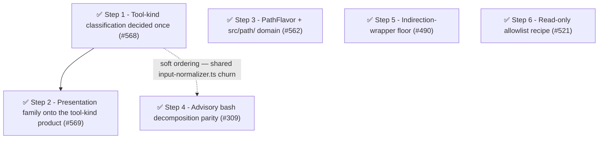

# Phase 10: Decide-once dispatch and bash-surface hardening

Phase 10 cleared the two repeated-discriminator families filed as planning input against the [target architecture](../architecture.md#target-the-authority-model) — tool-kind dispatch and the win32 path flavor — plus scheduled bash-surface work (advisory decomposition parity, indirection-wrapper flooring) and a documentation recipe.

## Findings (planned 2026-07-10)

Phase 9 completed the declared [authority model](../architecture.md#target-the-authority-model) target, so Phase 10 planning started from the doc's one remaining first-principles gap: the cross-session access intent ([remaining design work](../architecture.md#remaining-design-work) — principal identity and path portability across cwds).
Deep-tracing corroborated that gap as live code, not theory: `ForwardedPermissionRequest` is a stringly `(surface?, value?)` payload, the serving node's `ServingPolicy` normalizes a child's forwarded value against the **parent's** `PathNormalizer`/cwd, and pi-subagents' `WorkspaceProvider` seam makes cross-cwd children real.
The owner chose to defer that spine to a later phase (it remains the leading Phase 11 candidate) and focus Phase 10 on the two repeated-discriminator families filed as planning input ([#561], [#562]) plus scheduled bash-surface work ([#309], [#490]) and a docs recipe ([#521]).

Both discriminator families are cause-level Category C coupling flaws traced to the decide-once principle (OCP), not fallow findings — fallow is structurally blind to scattered one-line comparisons; the repeated-discriminator grep sweep found them.
[#562] additionally carries the must-agree security property: a leaf that misses the win32 case/separator fold is a silent permission bypass (the [#382]/[#508] class).

### Health metrics

| Metric                                                               | Baseline (2026-07-10)               | Phase 10 target                                                                                                                                                                 |
| -------------------------------------------------------------------- | ----------------------------------- | ------------------------------------------------------------------------------------------------------------------------------------------------------------------------------- |
| Tool-kind discriminator sites (`src/`)                               | 21                                  | ≤ 4, all in `access-intent/tool-kind.ts` (met: 2, Step 2)                                                                                                                       |
| `platform === "win32"` sites (`src/`)                                | 13                                  | 1 (the `PathFlavor` construction) (met: 1, Step 3)                                                                                                                              |
| win32 match-fold derivations (`caseInsensitive` occurrences, `src/`) | 6                                   | ≤ 2 (met: 1 derivation — the sole `PathFlavor` literal; the grep reports 4, the other 3 being the intrinsic `WildcardMatchOptions` definition in `wildcard-matcher.ts`, Step 3) |
| Advisory bash fidelity                                               | whole-string match                  | decomposed parity with the gate (test-gated)                                                                                                                                    |
| Indirection-wrapper coverage                                         | inline-shell wrappers only ([#481]) | all listed wrappers floored to `ask` (`<indirection-bash-wrapper>`)                                                                                                             |
| Flat `src/` root modules                                             | 62                                  | ≤ 59 (`src/path/` seeded) (met: 59, Step 3)                                                                                                                                     |
| fallow health score                                                  | 88 (A)                              | ≥ 88                                                                                                                                                                            |
| Production duplication                                               | 0.2%                                | ≤ 0.2%                                                                                                                                                                          |

Recompute commands (run from the repo root):

- Tool-kind sites: `grep -rE 'toolName === "(bash|mcp)"|source === "mcp"' packages/pi-permission-system/src --include="*.ts" | wc -l`
- win32 sites: `grep -r 'platform === "win32"' packages/pi-permission-system/src --include="*.ts" | wc -l`
- Match-fold derivations: `grep -r 'caseInsensitive' packages/pi-permission-system/src --include="*.ts" | wc -l`
- Root modules: `ls packages/pi-permission-system/src | grep -c '\.ts$'`
- Health/duplication: `pnpm fallow health --score --workspace @gotgenes/pi-permission-system` / `pnpm fallow dupes --workspace @gotgenes/pi-permission-system`

### Open-issue sweep dispositions

- [#23] — closed as resolved-by-events (2026-07-10): the "no real-world consumers" premise is stale — `@gotgenes/pi-subagents` emits `<active_agent name="…"/>` in child system prompts, so the per-agent override system is live.
- [#561] — superseded by Steps 1–2 below; closed at issue-filing time with a pointer to the step issues.
- [#562], [#309], [#490], [#521] — scheduled as Steps 3–6 below.
- [#564] — mislabeled for this package: its targets are `packages/pi-github-tools/src/lib/ci.ts`; the `pkg:pi-permission-system` label was removed.
- [#519] — explicit deferral (recorded, not a silent sweep): blocked on Pi SDK UIContext surface evolution; revisit when the SDK exposes a custom-UI approval channel.
- [#472] — remains deferred by name; the Phase 9 spine is its extension point, and it warrants its own decision record before scheduling.
- [#565] — stays open as the non-gating post-ship observation of [#557].

## Steps

### ✅ Step 1: Introduce a tool-kind classification decided once at the normalize boundary ([#568])

**Cause:** the extraction question — "what does this invocation access: a bash command, an MCP target, or a path?"
— is a domain decision re-derived by silent string comparison at every consumer instead of decided once where the invocation enters the system ([#561]).
The 21 grep sites are the symptom; the cause is the missing dispatch point.

- **Smell:** Category C (repeated discriminator / OCP).
- **Target:** new `src/access-intent/tool-kind.ts` (the classification and its per-kind extraction product); migrate the extraction consumers: `input-normalizer.ts`, `tool-input-path.ts`, `handlers/gates/tool.ts`, `handlers/gates/tool-call-gate-pipeline.ts`, `permission-manager.ts`.
  Constraint: `permission-manager.ts` stays string-based per `docs/decisions/0002-path-values-string-boundary.md`; the classification value is plain data, safe to consume there.
- **Outcome:** extraction-family `toolName === "bash"`/`"mcp"` sites drop to 0 outside `access-intent/tool-kind.ts`; total family sites 21 → ≤ 12 (presentation family remains until Step 2).
- **Landed:** `access-intent/tool-kind.ts` (`ToolKind` + `classifyToolKind`) added; the five extraction consumers migrated onto it; total family 21 → 12 (all remaining sites are the presentation family Step 2 clears, plus one docstring inside `tool-kind.ts`). `getToolPermission`'s dead per-kind branches collapsed to a single `evaluate(…, "*", …)` in the same pass.
- **Impact 4 / Risk 2 / Priority 16.**

Release: batch "tool-kind-dispatch"

### ✅ Step 2: Move the presentation family onto the tool-kind product ([#569])

**Cause:** the same discriminator on the presentation side — prompt, preview, denial-message, and decision-value projections each re-decide the kind per formatter, including a private `isMcpCheck()` helper that two sibling call sites re-derive instead of sharing.

- **Smell:** Category C (repeated discriminator / OCP).
- **Target:** `tool-preview-formatter.ts`, `permission-prompts.ts`, `denial-messages.ts` (delete `isMcpCheck`), `handlers/gates/helpers.ts` (`deriveDecisionValue`).
- **Outcome:** total family sites 21 → ≤ 4, all inside `access-intent/tool-kind.ts` (the recompute command above hits the target).
- **Landed:** `isMcpCheck` promoted from a private `denial-messages.ts` helper to a shared export in `access-intent/tool-kind.ts` (keeps the `source === "mcp"` disjunct that `classifyToolKind` cannot express); the four presentation consumers (`denial-messages`, `permission-prompts`, `tool-preview-formatter`, `deriveDecisionValue`) migrated onto `classifyToolKind`/`isMcpCheck`, with the `&& target` guard hoisted to the call sites that display it.
  Recompute 12 → 2 (both inside `tool-kind.ts`: the docstring and the `isMcpCheck` disjunct); `deriveDecisionValue` became an exhaustive `switch`; suite +4 (`isMcpCheck` unit tests).
- **Impact 3 / Risk 1 / Priority 15.**

Release: batch "tool-kind-dispatch"

### ✅ Step 3: `PathFlavor` — pass the resolved win32 capability, not the raw platform ([#562])

**Cause:** the win32 path-interpretation mapping (path impl, case fold, separator fold, match options) is re-derived from a raw `platform: NodeJS.Platform` parameter at 13 sites; connascence of algorithm where one divergent leaf is a silent permission bypass (the [#382]/[#508] class).
The [#505]/[#510] seam fixed *where the platform is read* but threaded the raw discriminator instead of the resolved product.

- **Smell:** Category C (thread decisions, not discriminators).
- **Target:** new `src/path/path-flavor.ts`; relocate the co-rewritten leaves `path-containment.ts`, `canonicalize-path.ts`, `pi-infrastructure-read.ts` into `src/path/` (tidy-first: touched files reach their final home); edit `path-normalizer.ts`, `access-intent/path-normalization.ts`, `authority/subagent-context.ts`, `rule.ts` (`pathMatchOptions`), `permission-manager.ts`, and `index.ts` (single `PathFlavor` construction from the one `process.platform` read).
- **Outcome:** `platform === "win32"` sites 13 → 1; `caseInsensitive` derivations 6 → ≤ 2; flat `src/` root 62 → 59.
- **Landed:** `src/path/path-flavor.ts` added — `PathFlavor` is a behavioral collaborator (the platform's path *language*: `impl`, `matchOptions`, `fold`, `comparable`, `isWithin`, `hasPathSeparator`, `bashTokenShape`) resolved by `pathFlavorForPlatform` into one of two cached singletons holding the package's only `=== "win32"` comparison.
  `path-containment.ts` / `canonicalize-path.ts` / `pi-infrastructure-read.ts` relocated into `src/path/` (flat `src/` root 62 → 59); the standalone `isPathWithinDirectory` was dissolved onto `PathFlavor.isWithin` and `PathNormalizer.usesWindowsSeparators()` onto `PathFlavor.hasPathSeparator`.
  The flavor is injected once from `index.ts` into `PermissionManager` / `PermissionSession` (→ `PathNormalizer`) / `SubagentDetection`; `PathNormalizer` dropped both `!== "win32"` bash-token guards via `bashTokenShape` and now holds no platform discriminator.
  `platform === "win32"` code comparisons 13 → 1; the win32 match-options literal derivation 2 → 1; suite +16 (`path-flavor.test.ts`), net −5 across removed `usesWindowsSeparators`/duplicate classifier tests.
  Follow-up [#571] filed for the deferred `subagent-context` containment unification.
- **Impact 4 / Risk 2 / Priority 16.**

Release: independent

### ✅ Step 4: Advisory bash decomposition parity ([#309])

**Cause:** two answers to one question — the advisory `PermissionsService.checkPermission("bash", …)` matches the whole string while the gate decomposes, because the sync-by-contract service cannot await tree-sitter init; decision fidelity depends on which door you ask at.
Feasibility probe passed: `TSParser.parse` is synchronous once initialized (`BashProgram.parse` is async only for `await getParser()`), and the async `before_agent_start` hook precedes any tool call, so a warm-then-sync path exists.

- **Smell:** Category C (dual fidelity at a public boundary).
- **Target:** `access-intent/bash/parser.ts` (warm-up + sync accessor), `handlers/before-agent-start.ts` (warm-up trigger), `permissions-service.ts` / `input-normalizer.ts` (route bash advisory queries through `BashProgram.commands()` + `resolveBashCommandCheck`); the cold-start fallback stays whole-string.
- **Outcome:** an advisory chained-command query returns the gate's decomposed decision (test-gated); the public-semantics strengthening is noted in the release notes.
- **Impact 2 / Risk 3 / Priority 6** — scheduled by owner decision (2026-07-10) despite the low score; no external consumer exercises bash advisory queries yet.

Release: independent

### ✅ Step 5: Floor indirection wrappers ([#490])

**Cause:** enforcement authority is evadable through a wrapper — `sudo <cmd>` / `env VAR=x <cmd>` make the gated inner command an argument, so the rule that should decide never matches (least-privilege flaw, the [#481] class).
Direction confirmed 2026-07-12, superseding the earlier 2026-07-10 re-target proposal: floor **all** listed wrappers to `ask` like the opaque wrappers, rather than re-targeting prefix wrappers at the inner command — re-targeting would need a per-wrapper option-arity table whose errors silently under-match (a bypass), while the uniform floor needs none.

- **Smell:** Category C (boundary flaw in bash command enumeration).
- **Target:** `access-intent/bash/command-enumeration.ts` (the `wrapperKind` discriminant + `INDIRECTION_WRAPPER_NAMES` / `EXEC_CONDITIONAL_WRAPPERS` tables), `handlers/gates/bash-command.ts` (the `WRAPPER_SENTINEL` map), `docs/configuration.md` / `README.md` / this file / the package skill (+ tests).
- **Outcome:** `sudo`/`env`/`xargs`/`time`/`nohup`/`timeout`/`nice` and `find`/`fd` (with an exec flag) cannot ride a permissive allow — their `allow` is floored to `ask` with the `<indirection-bash-wrapper>` sentinel (test-gated); a bare `find`/`fd` search is unaffected.
- **Landed:** #481's `BashCommand.opaque?: boolean` generalized to a `wrapperKind?: "opaque-payload" | "indirection"` discriminant (byte-identical `<opaque-bash-wrapper>` sentinel preserved); `isOpaqueWrapperCommand` → `classifyWrapperCommand` gains `INDIRECTION_WRAPPER_NAMES` (always-invoke) and `EXEC_CONDITIONAL_WRAPPERS` (`find`/`fd` exec-flag-gated); the floor maps the kind to its sentinel via `WRAPPER_SENTINEL`.
  Follow-up [#575] filed to survey other exec-capable CLI rewrites.
- **Impact 4 / Risk 3 / Priority 12.**

Release: independent

### ✅ Step 6: Read-only bash allowlist recipe ([#521])

**Cause:** none (documentation) — answers a standing user question with a config pattern instead of new runtime mechanism, per the package's mechanism-is-forever preference.

- **Smell:** n/a (documentation).
- **Target:** `docs/configuration.md` (a "read-only command allowlist" recipe enumerating read-only commands as bash allow rules); close [#521] on ship.
- **Outcome:** documented recipe; issue closed.
- **Landed:** added the "Read-Only Bash Command Allowlist" recipe to `docs/configuration.md`'s Common Recipes — a conservative curated allowlist (file inspection, listing/metadata, search, comparison/hashing, system info, and enumerated `git` read subcommands) paired with `write`/`edit` deny and a `path` deny block.
  The prose documents the four safety nets that keep it safe (redirect gating on the `path` surface, the `find`/`fd` exec-flag floor, chain most-restrictive, and the wrapper floors), directly answering [#521]'s `find *` + `-exec` + chains question; `echo`/`printf`/`tee`/`sort`/`sed`/`awk` are omitted with a stated rationale.
- **Impact 2 / Risk 1 / Priority 10.**

Release: independent

## Step dependency diagram

## Parallel tracks

- **Track A — tool-kind dispatch:** Steps 1 → 2.
- **Track B — win32 flavor:** Step 3.
- **Track C — bash surface:** Steps 4 and 5 (independent of each other; Step 4 prefers landing after Step 1 to avoid `input-normalizer.ts` churn, a soft ordering only).
- **Track D — docs:** Step 6.

## Release batches

- **Batch "tool-kind-dispatch":** Steps 1, 2 (ship together; tail = Step 2).
- Independently releasable: Steps 3, 4, 5, 6.

Release-type note: Steps 1–3 are `refactor:` (hidden changelog type — they batch into the next release rather than cutting one); Step 4 and Step 5 are behavior changes (`feat:`/`fix:`) that cut releases; Step 6 is an unhidden `docs:` change.

## Completion

All 6 steps are closed: [#568], [#569], [#562], [#309], [#490], [#521].
Follow-on issues filed during the phase: [#571] (unify `subagent-context` containment onto `PathFlavor.isWithin`) and [#575] (survey other exec-capable CLI rewrites for indirection-wrapper flooring); both remain open and non-gating.
Open issues swept and confirmed out of scope during planning: [#561] (superseded by Steps 1–2), [#564] (mislabeled for this package), [#519] (deferred — SDK `UIContext` evolution), [#472] (deferred — `ModelTriageAuthorizer`), [#565] (stays open — non-gating Phase 9 post-ship observation), [#23] (closed as resolved-by-events).

### Delivered vs. predicted metrics

Recomputed at archive time (`pnpm fallow health --score --workspace @gotgenes/pi-permission-system` / `pnpm fallow dupes --workspace @gotgenes/pi-permission-system`):

| Metric                                                               | Phase 10 target                              | Delivered                                                                                                                                               |
| -------------------------------------------------------------------- | -------------------------------------------- | ------------------------------------------------------------------------------------------------------------------------------------------------------- |
| Tool-kind discriminator sites (`src/`)                               | ≤ 4, all in `access-intent/tool-kind.ts`     | 2 — met                                                                                                                                                 |
| `platform === "win32"` sites (`src/`)                                | 1 (the `PathFlavor` construction)            | 1 — met                                                                                                                                                 |
| win32 match-fold derivations (`caseInsensitive` occurrences, `src/`) | ≤ 2                                          | 4 total occurrences (1 `PathFlavor` derivation + 3 intrinsic to `WildcardMatchOptions`) — met (target scoped to the derivation, not the raw grep count) |
| Advisory bash fidelity                                               | decomposed parity with the gate (test-gated) | delivered, test-gated — met                                                                                                                             |
| Indirection-wrapper coverage                                         | all listed wrappers floored to `ask`         | delivered — met                                                                                                                                         |
| Flat `src/` root modules                                             | ≤ 59 (`src/path/` seeded)                    | 59 at Step 3 landing; 60 at phase close (`bash-advisory-check.ts` added by Step 4) — met at Step 3, expected drift after                                |
| fallow health score                                                  | ≥ 88                                         | 88 (A) — met                                                                                                                                            |
| Production duplication                                               | ≤ 0.2%                                       | 0.2% (58 lines, 2 clone groups) — met                                                                                                                   |

[#23]: https://github.com/gotgenes/pi-packages/issues/23
[#309]: https://github.com/gotgenes/pi-packages/issues/309
[#382]: https://github.com/gotgenes/pi-packages/issues/382
[#472]: https://github.com/gotgenes/pi-packages/issues/472
[#481]: https://github.com/gotgenes/pi-packages/issues/481
[#490]: https://github.com/gotgenes/pi-packages/issues/490
[#505]: https://github.com/gotgenes/pi-packages/issues/505
[#508]: https://github.com/gotgenes/pi-packages/issues/508
[#510]: https://github.com/gotgenes/pi-packages/issues/510
[#519]: https://github.com/gotgenes/pi-packages/issues/519
[#521]: https://github.com/gotgenes/pi-packages/issues/521
[#557]: https://github.com/gotgenes/pi-packages/issues/557
[#561]: https://github.com/gotgenes/pi-packages/issues/561
[#562]: https://github.com/gotgenes/pi-packages/issues/562
[#564]: https://github.com/gotgenes/pi-packages/issues/564
[#565]: https://github.com/gotgenes/pi-packages/issues/565
[#568]: https://github.com/gotgenes/pi-packages/issues/568
[#569]: https://github.com/gotgenes/pi-packages/issues/569
[#571]: https://github.com/gotgenes/pi-packages/issues/571
[#575]: https://github.com/gotgenes/pi-packages/issues/575
