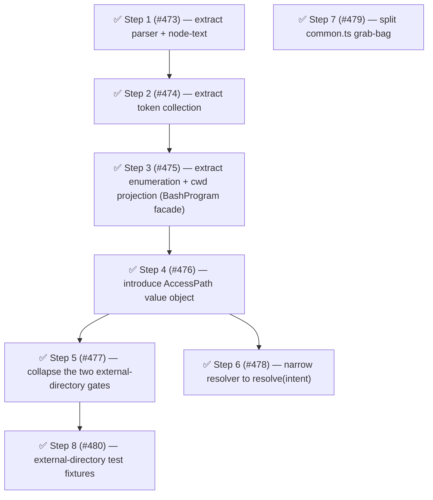

# Phase 6: Access-intent extraction

Goal: extract the access-intent domain — decompose the 1,143-line `bash-program.ts` god file, introduce the `AccessPath` value object, collapse the two external-directory gates, narrow the per-gate resolver surface, dissolve the `common.ts` grab-bag, and extract external-directory test fixtures.

Phase 5 cleared the residual state-encapsulation smells; the remaining structural debt was concentrated in the access-intent domain the "Target: the authority model" section in [architecture.md](../architecture.md) names as the one genuinely open piece.
This phase extracted that domain: it decomposed the 1,143-line `bash-program.ts` god file (the package's #1 churn × complexity hotspot at risk 97), introduced the `AccessPath` value object the [#418] fix seeded, collapsed the two external-directory gates that independently acquired the same lexical/canonical conflation bug, and narrowed the per-gate resolver surface that produced the [#393] false-green.
It was the doc's "tractable first slice" toward the authority model — principal identity and cross-session path portability remain deferred follow-ups, not Phase 6 scope.

Phase 6 also seeded the package's first domain directory.
The `src/` tree was flat (66 top-level modules), and the access-intent work was the natural place to begin domain grouping: the bash engine it decomposed and the `AccessPath` it introduced landed in a new `src/access-intent/` directory rather than flat, so the extracted modules reached their final home the first time instead of being moved twice.
This was a seed, not the whole reorg — see [Module structure](../architecture.md#module-structure) for the broader arc.

## Findings summary

| Metric                                       | Phase 5 close                   | Phase 6 target              | Phase 6 delivered                       |
| -------------------------------------------- | ------------------------------- | --------------------------- | --------------------------------------- |
| Health score                                 | 76 (B)                          | ≥ 80 (B+)                   | 76 (B) — score unchanged (see note)     |
| `program.ts` LOC (was `bash-program.ts`)     | 1,143                           | ≤ 350 (value-object facade) | **102** ✅                              |
| `program.ts` risk (was `bash-program.ts`)    | 97.0                            | < 40                        | < 40 ✅ (fallow no longer lists it)     |
| `common.ts` fallow target (pri / dependents) | 27.1 / 22                       | dissolved (0 targets)       | dissolved ✅ (see note on value-guards) |
| External-directory gate duplication          | 2 gates, [#418] logic twice     | 1 shared policy check       | 1 shared policy check ✅                |
| `ScopedPermissionResolver` surface           | `resolve` + `resolvePathPolicy` | `resolve(intent)`           | `resolve(intent)` ✅                    |
| Duplication                                  | 6.9%                            | ≤ 6.5%                      | 3.6% ✅                                 |
| Dead code                                    | 0%                              | 0%                          | 0% ✅                                   |
| Test files / tests                           | —                               | —                           | 104 files / 2,124 tests                 |
| Source files                                 | —                               | —                           | 101 `src/` files, 12,726 LOC            |

**Health score note:** The score held at 76 despite the god-file decomposition and duplication reduction.
The structural improvements did not register as a composite-score gain — the score reflects LOC-weighted complexity, and spreading LOC across more focused files can keep the raw number flat.

**value-guards note:** `common.ts` was correctly dissolved into `value-guards.ts` and `yaml-frontmatter.ts`, but `value-guards.ts` inherited the same 22-dependent high-fan-in profile.
Fallow reports `value-guards.ts` as its single refactoring target (pri 28.9, score 9.6) — identical amplitude to the original `common.ts` target.
The Step 7 outcome predicted "the fallow refactoring-targets list drops to zero"; in practice the grab-bag concern migrated rather than dissolved.
Further splitting `value-guards.ts` is a candidate for the next phase.

## Steps

### Track A — bash-program decomposition (Steps 1, 2, 3)

All three steps landed.
The bash engine lives in `src/access-intent/bash/` and `BashProgram` is born-ready (102 LOC facade).

### Step 1 ✅ — Extract the tree-sitter parser and AST node-text resolver from `bash-program.ts` ([#473])

Lifted the lazy tree-sitter-bash parser (`getParser`, the `TSNode` / `TSParser` interfaces) and the quote-aware node-text resolver (`resolveNodeText`, `SKIP_SUBTREE_TYPES`) into their own modules, leaving `bash-program.ts` importing them.
Pure lift-and-shift, no behavior change.

- Target: `src/handlers/gates/bash-program.ts` lines 18–58 (parser) and 273–333 (`resolveNodeText`) → `src/access-intent/bash/parser.ts` + `src/access-intent/bash/node-text.ts` (seeds the new domain directory).
- Smell: Category B (god file — 1,143 LOC mixing parser bootstrap, AST traversal, and value-object API).
- Outcome: ~120 LOC moved out; the parser and node-text resolver are independently testable; `bash-program.ts` drops below ~1,020 LOC.
- Release: batch "bash-program-decomposition"

### Step 2 ✅ — Extract bash token collection (pattern-first command config) from `bash-program.ts` ([#474])

Moved the pattern-first command table (`PATTERN_FIRST_COMMANDS`, `PatternCommandConfig`), the flag classifier (`classifyPatternCommandFlag`), and the token collectors (`collectPatternCommandTokens`, `collectGenericCommandTokens`, `collectRedirectTokens`, `collectCommandTokens`, `collectPathCandidateTokens`) into `src/access-intent/bash/token-collection.ts`.
This was the single largest cohesive block in the file.
Two symbols shared with the staying cwd-projection were placed by layer: `ARG_NODE_TYPES` (tree-sitter grammar mechanics) → `node-text.ts` alongside `SKIP_SUBTREE_TYPES`; `extractCommandName` (bash-domain command-identity query) → `token-collection.ts` (name kept).

- Target: `src/handlers/gates/bash-program.ts` lines 334–687 → `src/access-intent/bash/token-collection.ts`.
- Smell: Category B (god file — argument/flag tokenization is a distinct concern from the value-object API).
- Outcome: ~350 LOC moved out; the per-command flag table is editable without touching the `BashProgram` class; `bash-program.ts` actual post-Step-2 LOC: 695 (Step 3 supersedes this).
- Release: batch "bash-program-decomposition"

### Step 3 ✅ — Extract command enumeration and cwd projection; slim `BashProgram` to a value-object facade ([#475])

Moved command enumeration (`collectCommands`, `collectCommandsInto`, subshell / substitution descent) and the effective-working-directory `cd`-fold projection (`collectPathCandidates`, `walkCurrentShellSequence`, `walkPipeline`, `foldCd`, and helpers) into focused modules, then relocated the slimmed `BashProgram` (and `bash-token-classification.ts`) so the whole bash sub-domain lives under `src/access-intent/bash/`, leaving `BashProgram` a thin facade that parses once and exposes typed slices.
The `cd`-fold logic is the subtlest region (#307, #454) — extracted it whole, behavior-preserving, with its tests following it.
Moving `program.ts` out of `handlers/gates/` sharpened the dependency direction: the gates consume the access-intent engine, not the reverse.

- Target: `src/handlers/gates/bash-program.ts` lines 688–1143 → `src/access-intent/bash/command-enumeration.ts` + `src/access-intent/bash/cwd-projection.ts`; `bash-program.ts` → `src/access-intent/bash/program.ts`; `bash-token-classification.ts` → `src/access-intent/bash/token-classification.ts`.
- Smell: Category B (god file) + Category E (flat directory — the bash engine becomes the first cohesive domain group).
- Outcome: `access-intent/bash/program.ts` 102 LOC (born-ready `BashProgram` facade, three parameter-free getters); `cwd-projection.ts` 493 LOC (the full projection lifecycle, encapsulated); risk score < 40; `ToolCallContext.cwd` narrowed to `string`; bash sub-domain co-located; bash gates and tests import from `#src/access-intent/bash/...`.
- Release: batch "bash-program-decomposition"

### Track B — access-path unification (Steps 4, 5, 6)

All three steps landed.
The [#418] / [#393] semantic fixes shipped, `AccessPath` exists, the two external-directory gates are collapsed, and the resolver is narrowed to one `resolve(intent)`.

### Step 4 ✅ — Introduce the `AccessPath` value object ([#476])

Replaced the raw-string pairing that carries a path's two meanings (lexical as-typed for matching, canonical symlink-resolved for the outside-CWD boundary) with an `AccessPath` value object exposing distinct `matchValues()` and boundary accessors.
This made the [#418] conflation — a single `string` silently used for both — a compile-time distinction, and converted `getExternalDirectoryPolicyValues` / `canonicalNormalizePathForComparison` from free helpers into `AccessPath` factories.
`BashProgram.externalPaths(cwd)` returns `AccessPath[]` instead of lexical strings.

- Target: new `src/access-intent/access-path.ts`; `src/path-utils.ts` (`getExternalDirectoryPolicyValues`, `canonicalNormalizePathForComparison`); `BashProgram.externalPaths`.
- Smell: Category C (primitive obsession / platform-type threading — one `string` carries a containment value and a match value with no type distinction).
- Outcome: `AccessPath` type; the lexical/canonical misuse is a compile error; 5 `getExternalDirectoryPolicyValues` call sites route through the value object.
- Release: batch "access-path-unification"

### Step 5 ✅ — Collapse the two external-directory gates onto one `AccessPath` policy check ([#477])

`describeExternalDirectoryGate` (single tool path) and `describeBashExternalDirectoryGate` (multi bash path) each independently re-derived aliases, called `resolver.resolvePathPolicy(..., "external_directory")`, and picked the worst uncovered path — and each independently acquired the [#418] bug.
Routed both through one shared external-directory policy check over `AccessPath[]`, so the alias/boundary logic exists once.

- Target: `src/handlers/gates/external-directory.ts`, `src/handlers/gates/bash-external-directory.ts` (both import `AccessPath` from `#src/access-intent/access-path`); new shared helper.
- Smell: Category A/C (production duplication — the same [#418]-prone logic in two gates — plus a Law-of-Demeter reach-through into path aliasing).
- Outcome: one external-directory policy check; both gate factories delegate; the [#418] alias logic is single-sourced; ~60 LOC of duplication removed.
- Release: batch "access-path-unification"

### Step 6 ✅ — Narrow `ScopedPermissionResolver` to a single `resolve(intent)` ([#478])

Each gate called either `resolve(surface, input)` or `resolvePathPolicy(values, ..., surface)`; the surface widened per gate, and a stubbed-but-unrouted method silently passed `allow` (the [#393] false-green).
Introduced a minimal `AccessIntent` (a three-variant discriminated union — `tool | path-values | access-path`) that each gate emits, and collapsed the two resolver entry points into one `resolve(intent)`.
The `access-path` variant lets `AccessPath` flow into the resolver, which unwraps it via `matchValues()` before handing a string-based `ResolvedAccessIntent` to the manager's single `check(intent)`; the low-level manager never imports the value object.
Scope was the surface narrowing only — `AccessIntent` carries no principal identity, and cross-session path portability stays a deferred follow-up ([#309] tracks the related advisory-path unification).
The broader "every path becomes an `AccessPath`" direction and the open question of whether the `path` surface should also match the canonical form are tracked in [#487] / [#486].

- Target: `src/access-intent/access-intent.ts` (new `AccessIntent` union); `src/permission-resolver.ts` (`ScopedPermissionResolver`); `src/permission-manager.ts` (`checkPermission` + `checkPathPolicy` → `check`); all gate descriptor factories.
- Smell: Category C/D (widening interface per gate + testability false-green from an unrouted stub).
- Outcome: `ScopedPermissionResolver` exposes one `resolve(intent)` and `ScopedPermissionManager` one `check(intent)`; adding a gate cannot widen the resolver surface; the [#393] false-green class is structurally impossible (no second method to forget).
- Release: independent
- Landed: three-variant `AccessIntent` union; resolver unwraps `access-path` via `matchValues()`, manager stays string-based; `PermissionResolver implements SkillPermissionChecker` for the raw no-session-rules path; follow-ups [#486] / [#487] filed.

### Track C — independent cleanup (Steps 7, 8)

Both steps landed.
The `common.ts` split landed at [#479] and the external-directory test fixtures landed at [#480].

### Step 7 ✅ — Split the `common.ts` grab-bag ([#479])

`common.ts` (fallow's #1 refactoring target, pri 27.1, 22 dependents) mixed unrelated concerns: runtime type guards (`toRecord`, `getNonEmptyString`, `normalizeOptionalStringArray`, `normalizeOptionalPositiveInt`, `isPermissionState`, `isDenyWithReason`) and minimal YAML/frontmatter parsing (`parseSimpleYamlMap`, `extractFrontmatter`).
Split into a type-guards module and a yaml-frontmatter module so the 22-dependent fan-in stops amplifying every unrelated change.

- Target: `src/common.ts` → `src/value-guards.ts` + `src/yaml-frontmatter.ts`.
- Smell: Category E (grab-bag — unclear module boundary with high fan-in amplification).
- Outcome: `common.ts` dissolved; two cohesive modules; the `common.ts` fallow target eliminated.
  Note: `value-guards.ts` inherited the 22-dependent fan-in and became the new fallow target (pri 28.9) — splitting the type guards into a more coherent home is a candidate for the next phase.
- Release: independent

### Step 8 ✅ — Extract shared fixtures for the external-directory integration tests ([#480])

The external-directory test files duplicated setup heavily: `external-directory-integration.test.ts` (21 clone groups, 214 lines), `external-directory-session-dedup.test.ts` (3 groups, 86 lines), and the 880-line arrow in `bash-external-directory.test.ts`.
Extracted a shared fixture into `test/helpers/` once the gates were unified (Phase 6 Step 5), so the fixture targets the single collapsed policy check.

- Target: `test/handlers/external-directory-integration.test.ts`, `test/handlers/external-directory-session-dedup.test.ts`, `test/bash-external-directory.test.ts` → new `test/helpers/external-directory-fixtures.ts`.
- Smell: Category D (test duplication — the worst clone family after the gate unification).
- Outcome: external-directory test duplication down by ~300 lines; one fixture per the collapsed gate; package duplication fell to 3.6% (well below the ≤ 6.5% target).
- Release: independent

## Step dependency diagram

Step 7 has no dependencies and runs in parallel with everything.

## Tracks

- **Track A — bash-program decomposition** (Steps 1, 2, 3): ✅ complete — all three steps landed; the bash engine lives in `src/access-intent/bash/` and `BashProgram` is born-ready (102 LOC facade).
- **Track B — access-path unification** (Steps 4, 5, 6): ✅ complete — all three steps landed; the [#418] / [#393] semantic fixes shipped, `AccessPath` exists, the two external-directory gates are collapsed, and the resolver is narrowed to one `resolve(intent)`.
- **Track C — independent cleanup** (Steps 7, 8): ✅ complete — the `common.ts` split landed at [#479] and the external-directory test fixtures landed at [#480].

## Release batches

- **Batch "bash-program-decomposition":** Steps 1, 2, 3 (shipped together; tail = Step 3).
  Each was a behavior-preserving extraction, batched to release the decomposition once rather than three internal-only patch releases.
- **Batch "access-path-unification":** Steps 4, 5 (shipped together; tail = Step 5).
  Step 4 alone left both the new `AccessPath` type and the old free helpers in place — a transitional state — so it shipped with Step 5.
- Independently releasable: Steps 6, 7, 8.

[#309]: https://github.com/gotgenes/pi-packages/issues/309
[#393]: https://github.com/gotgenes/pi-packages/issues/393
[#418]: https://github.com/gotgenes/pi-packages/issues/418
[#473]: https://github.com/gotgenes/pi-packages/issues/473
[#474]: https://github.com/gotgenes/pi-packages/issues/474
[#475]: https://github.com/gotgenes/pi-packages/issues/475
[#476]: https://github.com/gotgenes/pi-packages/issues/476
[#477]: https://github.com/gotgenes/pi-packages/issues/477
[#478]: https://github.com/gotgenes/pi-packages/issues/478
[#479]: https://github.com/gotgenes/pi-packages/issues/479
[#480]: https://github.com/gotgenes/pi-packages/issues/480
[#486]: https://github.com/gotgenes/pi-packages/issues/486
[#487]: https://github.com/gotgenes/pi-packages/issues/487
