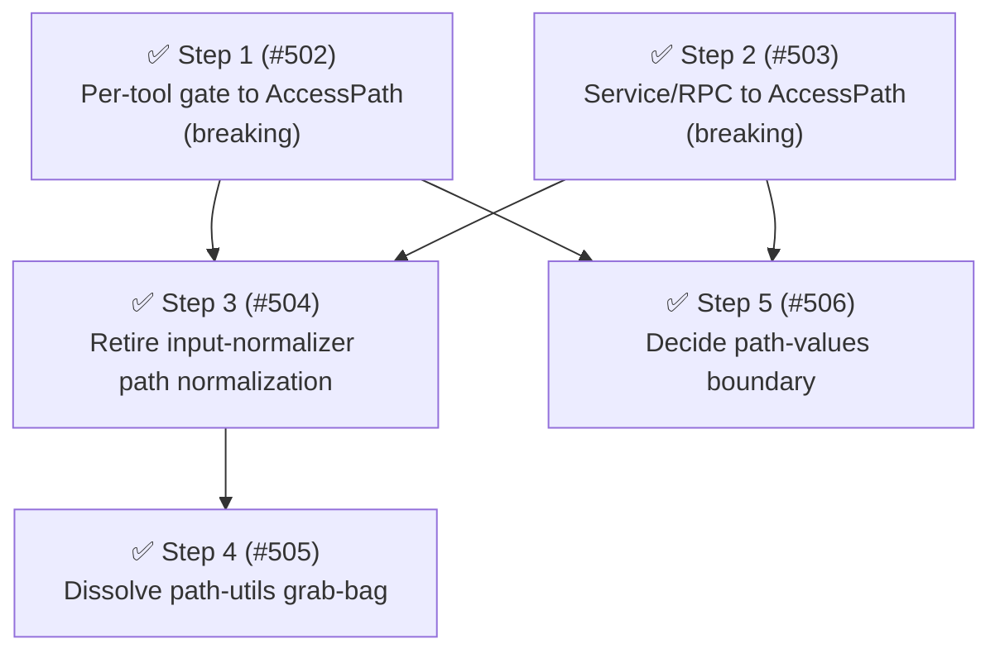

# Phase 7: AccessPath as the universal internal path representation

Phase 7 finished the direction opened by [#487]: make `AccessPath` the one internal representation for every concrete path the system handles.
Phase 6 introduced `AccessPath` for the `external_directory` surface; follow-on [#486] brought the `path` surface and the bash-path tokens to lexical ∪ canonical parity and collapsed the gate-emitted `path-values` variant.
Two ad-hoc path-derivation paths once normalized lexically only — the per-tool path-bearing gate (`read`/`write`/`edit`/`grep`/`find`/`ls`) and the service/RPC policy-query path — so a per-tool rule (`read: deny *.env`) was symlink-evadable while the cross-cutting `path` rule was not.
Steps 1 ([#502]) and 2 ([#503]) routed both onto `AccessPath` (closing the asymmetry, a breaking change); Phase 7 also retired the now-dead lexical-only normalization, consolidated the `path-utils.ts` derivation hub behind the value object, and formalized the resolver-internal `path-values` boundary.

This was a direction-driven phase: [#487] set the framing, and the discovery confirmed the residual surface rather than proposing an unrelated health sweep.

## Findings

Health score 76 (B); no dead code; duplication 6.6% overall (3.6% in tests); maintainability 91.2.
The single relevant structural signal was `path-utils.ts` — an accelerating churn hotspot (266 churn over 6 months, 13 fan-in, ▲), the ad-hoc path-derivation grab-bag the [#487] vision exists to consolidate.

| Metric                            | Before                                        | After Phase 7                                                     |
| --------------------------------- | --------------------------------------------- | ----------------------------------------------------------------- |
| `path-utils.ts` fan-in            | 13 (one grab-bag)                             | ✅ distributed across six cohesive modules ([#505])               |
| Lexical-only path normalizers     | 2 (per-tool gate, service/RPC)                | ✅ 0 (single `AccessPath` derivation)                             |
| Symlink-resistant path surfaces   | `path`, `external_directory`, bash            | ✅ all path surfaces incl. per-tool and RPC                       |
| Emitted/internal path-value forms | `access-path` emitted, `path-values` internal | ✅ `path-values` formalized as the string seam (`decisions/0002`) |

The residual ad-hoc path handling (the "re-derive their representations ad hoc" [#487] names):

- Per-tool path-bearing gate: `ToolCallGatePipeline` emitted `kind: "tool"` → `normalizeInput` → `normalizePathSurfaceValues` → `getPathPolicyValues` (lexical only) — closed by Steps 1–3 ([#502], [#504]): Step 1 migrated the gate to emit `access-path`; Step 3 removed `normalizePathSurfaceValues` and the path branches from `normalizeInput`.
- Service/RPC queries: `permissions-service.ts` / `permission-event-rpc.ts` — closed by Step 2 ([#503]): both build an `AccessPath` via `buildAccessIntentForSurface` and route an `access-path` intent through the resolver (was a lexical `tool` intent for `path` / `external_directory`).
- `path-utils.ts`: the loose `getPathPolicyValues` / `normalizePathForComparison` / `normalizePathPolicyLiteral` derivations that `AccessPath` should own — ✅ closed by Step 4 ([#505]): relocated into `access-intent/path-normalization.ts` and the grab-bag dissolved into focused modules.
- ✅ `path-values`: formalized as the manager's deliberate string boundary by Step 5 ([#506]; `docs/decisions/0002-path-values-string-boundary.md`) — the manager stays string-based and never imports `AccessPath`, now guarded by a `no-restricted-imports` lint rule on `permission-manager.ts`.

## Steps

1. ✅ **Migrate the per-tool path-bearing tool gate onto `AccessPath` (canonical parity).**
   ([#502]) Target: `src/handlers/gates/tool-call-gate-pipeline.ts` (build `AccessPath.forPath` and emit `kind: "access-path"` with `surface: toolName` for path-bearing tools, keeping non-path tools on the `tool` intent), `src/handlers/gates/tool.ts` (derive the session-approval value from `accessPath.value()`).
   The resolver already unwraps `access-path` → `path-values` and the manager's path-value branch already routes `PATH_BEARING_TOOLS` through `evaluateAnyValue`, so the only behavior change is the canonical alias joining the match set — mechanically parallel to [#486].
   Smell: Category C (coupling / match asymmetry).
   Outcome: `read`/`write`/`edit`/`grep`/`find`/`ls` per-tool rules match lexical ∪ canonical (symlink-resistant); **breaking**.
   Release: batch "symlink-resistant-path-matching"

2. ✅ **Migrate the service/RPC path queries onto `AccessPath` (canonical parity).**
   ([#503]) Target: `src/permissions-service.ts`, `src/permission-event-rpc.ts`, `src/input-normalizer.ts` (`buildAccessIntentForSurface`).
   For `path` / `external_directory` / path-bearing surface queries, build an `AccessPath` and route an `access-path` intent through the resolver instead of a lexical `tool` intent to the manager; non-path surfaces keep the existing path.
   Routing through the resolver (not a second `path-values` producer) keeps it the sole `matchValues()` unwrap site, the premise Step 5 ([#506]) decides against.
   Also fixed a latent gap: the `path` and path-bearing service/RPC queries dropped their value (collapsing to `["*"]`) and now evaluate the supplied path.
   Smell: Category C (coupling / match asymmetry).
   Outcome: external policy queries match the same lexical ∪ canonical set the gates do; **breaking** for external consumers.
   Release: batch "symlink-resistant-path-matching"

3. ✅ **Retire `input-normalizer`'s path normalization.**
   ([#504]) Removed `normalizePathSurfaceValues`, the special-surface (`path` / `external_directory`) branch, and the `PATH_BEARING_TOOLS` branch from `normalizeInput`; dropped the `platform` / `cwd` parameters; removed the `currentCwd` field from `PermissionManager`.
   After Steps 1 and 2, these branches had no callers; the missing-path case falls through to the generic `["*"]` branch.
   Smell: Category A (dead / redundant code).
   Outcome: `normalizeInput` handles only bash / skill / mcp / extension surfaces; a single `AccessPath` path-derivation entry remains.
   Release: batch "symlink-resistant-path-matching"

4. ✅ **Consolidate path derivation behind `AccessPath`: dissolve the `path-utils.ts` grab-bag.**
   ([#505]) Relocated the lexical/canonical/policy-value derivation (`normalizePathForComparison`, `canonicalNormalizePathForComparison`, `getPathPolicyValues`, `normalizePathPolicyLiteral`, and the two private absolute/relative helpers) into `src/access-intent/path-normalization.ts` as `AccessPath`'s backing; kept containment (`isPathWithinDirectory`, `isPathOutsideWorkingDirectory`) together in `src/path-containment.ts`, and split infra-read (`pi-infrastructure-read.ts`), tool-input extraction (`tool-input-path.ts`), safe-system paths (`safe-system-paths.ts`), and the surface/tool sets (`path-surfaces.ts`) into focused modules.
   A "tidy first" prep refactor made `isPathOutsideWorkingDirectory` pure geometry over prepared operands (canonicalization moved up to `PathNormalizer`), which dissolved the apparent representation↔containment cycle so the literal grouping held.
   Smell: Category B / E (god module, accelerating churn hotspot).
   Outcome: `path-utils.ts` dissolved into cohesive modules; path derivation owned by the access-intent domain; non-breaking.
   Release: independent

5. ✅ **Decide and formalize the `path-values` boundary.**
   ([#506]) Target: `src/access-intent/access-intent.ts`, `src/permission-resolver.ts`, `src/permission-manager.ts`.
   With the resolver the sole `path-values` producer after Steps 1 and 2, decide between formalizing `path-values` as the manager's intentional string seam (document why the manager stays string-based) and moving the `matchValues()` unwrap into the manager (the manager imports `AccessPath`, dropping the string-boundary invariant).
   This is the [#487] "collapse the `path-values` variant" item, resolved as an explicit decision rather than a pre-committed mechanical change.
   Smell: Category C (clarify boundary).
   Decided: **formalize** — kept `path-values` as the string seam, recorded in `docs/decisions/0002-path-values-string-boundary.md`, and guarded the invariant with a `no-restricted-imports` lint rule on `permission-manager.ts`; non-breaking.
   Release: independent

## Step dependency diagram

## Parallel tracks

- **Track A — access-side canonical parity:** Steps 1 and 2 proceed in parallel (different consumers), both feed Step 3 (dead-code removal), and both unblock Step 5 (the boundary decision).
- **Track B — structural consolidation:** Step 4 follows Step 3 (fewer loose `path-utils.ts` consumers makes the relocation mechanical) and is otherwise independent.

## Release batches

- **Batch "symlink-resistant-path-matching":** Steps 1, 2, 3 (ship together; tail = Step 3).
  Steps 1 and 2 are breaking parity changes and Step 3 is their cleanup — they form one coherent "paths now match symlink-resistantly on every surface" major-bump release.
- Independently releasable: Step 4 (a refactor that auto-batches into the next release), Step 5 (a decision / docs change).

## Non-goals

- **Config patterns onto `AccessPath`.**
  Patterns are matched as pure regex (`*` compiles to `.*` with the dotall flag and crosses path segments — `wildcard-matcher.ts`), so a glob is a matching *mode*, not a *value* with a canonical form.
  The symlink protection [#487] wants is delivered on the access side: an accessed path's `matchValues()` carries both its lexical "source" and canonical "target", and a rule fires on either — so a rule on the symlink path or on the real file both match.
  The only uncovered case is a glob pattern whose directory *prefix* is a symlink (e.g. `~/linkdir/*` accessed via the real target): not closable on the pattern side, because `*` crossing segments leaves no reliable resolvable-prefix decomposition.
  Documented guidance: key glob rules on the real location, not a symlink-dir alias.
- **Canonicalizing concrete symlink patterns at rule-load.**
  Feasible only for fully-concrete (non-glob) patterns and a narrow case; evaluated and dropped (the high-value protective patterns are globs, which this cannot help).
- **Principal identity and cross-session path portability.**
  Still deferred (the broader access-intent design work), out of Phase 7 scope.

## Related: PathNormalizer platform seam ([#510])

A precursor refactor (not one of the five steps above) threaded a single injected `PathNormalizer` collaborator through the bash path pipeline, completing the half-built platform seam behind the recurring Windows-path bugs ([#382], [#345], [#418], [#508]).
The host `platform` is read once at the composition root (`index.ts`) and injected: into `PermissionManager` (rule-matching case-fold), into `PermissionSession` (which builds the `PathNormalizer` from `platform` + the session `cwd` and exposes it via `getPathNormalizer()`), and into the subagent-context detection.
No interior `src/` module reads `process.platform` — an ESLint `no-restricted-syntax` guard scoped to `pi-permission-system/src` (exempting `index.ts`) enforces this, so every `path-containment` / `path-normalization` / canonicalize / rule / subagent-context leaf takes an injected `platform` rather than a `= process.platform` default.
`PathNormalizer` is a facade *over* the platform-parameterized `path-containment` / `path-normalization` / `AccessPath` primitives: Phase 7 Step 4 ([#505]) dissolved `path-utils.ts` into those cohesive modules (the seam was untouched — the facade kept the same leaf calls under new module names).
The change is behavior-preserving on POSIX (every converted op already used the host `node:path`); the `win32` flavor is newly exercised by injected-platform unit tests, and [#508] then lands the drive-letter routing fix on the seam.

### Residual `getPlatform()` threading (follow-up [#511])

The seam left five call sites threading `platform` *directly* rather than through `PathNormalizer`, because they call raw path-leaf functions that are not `AccessPath` operations.
`PermissionSession.getPlatform()` (and the `ToolCallGateInputs.getPlatform()` it backed) existed only to feed them; it has been retired now that every consumer is folded, while the leaf `platform` parameters in the relocated path modules (`path-containment.ts`, `path-normalization.ts`, `pi-infrastructure-read.ts`) persist.
How each relates to the Phase 7 steps above:

- **Per-tool gate suggestion value** (`handlers/gates/tool.ts` `deriveSuggestionValue` → `normalizePathForComparison`) — ✅ retired by **Step 1 ([#502])**: `deriveSuggestionValue` now derives the session-approval value from `accessPath.value()`, dropping the `platform` thread into `describeToolGate`.
- **`input-normalizer` path-policy values** (`normalizePathSurfaceValues` → `getPathPolicyValues`) — ✅ retired by **Steps 2–3 ([#503], [#504])**: Step 2 migrated the service/RPC path queries onto `AccessPath`; Step 3 removed the path-bearing/special-surface branches from `normalizeInput` entirely ([#504]).
- **Infra-read containment** (`handlers/gates/external-directory.ts`) — ✅ routed through `PathNormalizer.isInfrastructureRead` ([#511]): the gate already holds the normalizer, which now answers the containment question over the already-built `AccessPath`.
  Step 4 ([#505]) still keeps `isPiInfrastructureRead` (`pi-infrastructure-read.ts`) and `isPathWithinDirectory` / `isPathOutsideWorkingDirectory` (`path-containment.ts`) as platform-taking leaf predicates that the normalizer delegates to.
- **Skill-prompt sanitization** (`skill-prompt-sanitizer.ts` `createResolvedSkillEntry` / `findSkillPathMatch`; reached from `before-agent-start.ts` and `handlers/gates/skill-read.ts`) — ✅ routed through `PathNormalizer.comparableValue` / `isWithinDirectory` ([#511]).
  Skill entries still cache `normalizedLocation` / `normalizedBaseDir` as lexical strings (matching stays lexical, no new filesystem access), but they are now computed by the normalizer rather than by direct `normalizePathForComparison` calls.

✅ `getPlatform()` has been removed: with both [#511] and Step 1 ([#502]) landed, `ToolCallGatePipeline.evaluate` no longer reads it, so `PermissionSession.getPlatform()` and `ToolCallGateInputs.getPlatform()` were dropped ([#513] resolved).
The leaf `platform` parameters in `path-containment.ts` / `pi-infrastructure-read.ts` persist (the containment / infra-read predicates still take it).

[#345]: https://github.com/gotgenes/pi-packages/issues/345
[#382]: https://github.com/gotgenes/pi-packages/issues/382
[#418]: https://github.com/gotgenes/pi-packages/issues/418
[#486]: https://github.com/gotgenes/pi-packages/issues/486
[#487]: https://github.com/gotgenes/pi-packages/issues/487
[#502]: https://github.com/gotgenes/pi-packages/issues/502
[#503]: https://github.com/gotgenes/pi-packages/issues/503
[#504]: https://github.com/gotgenes/pi-packages/issues/504
[#505]: https://github.com/gotgenes/pi-packages/issues/505
[#506]: https://github.com/gotgenes/pi-packages/issues/506
[#508]: https://github.com/gotgenes/pi-packages/issues/508
[#510]: https://github.com/gotgenes/pi-packages/issues/510
[#511]: https://github.com/gotgenes/pi-packages/issues/511
[#513]: https://github.com/gotgenes/pi-packages/issues/513
