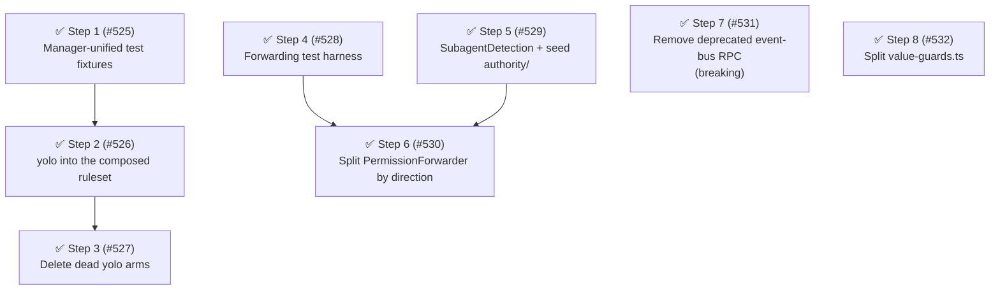

# Phase 8: Tidy first for the authority spine

The [authority model](../architecture.md#target-the-authority-model) is the declared target: an `Authorizer` role selected once per session, yolo as recorded authority, and `PermissionForwarder` split by direction of authority flow.
Phase 8 does not build the spine.
It makes the spine change easy — Kent Beck's "make the change that makes the change easy, then make the easy change" — by landing the preparatory refactorings the discovery trace found between `GateRunner` and the UI/file transport.
The spine itself (the `Authorizer` interface and its three implementations, `canConfirm()` dissolution, serving-as-resolution, grant-scope selection) is Phase 9, and the case-by-case model judge requested in [#472] rides on that spine as the `ModelTriageAuthorizer`, not on this phase.

## Findings

Health score 76 (B); no dead code; average cyclomatic complexity 1.4; maintainability 91.1.
The score deductions are large *test* arrow functions and test-tree duplication — production functions are small, so the remaining debt is structural, not syntactic.
The trace from `GateRunner` down to the UI dialog and forwarding files confirmed the elicitation thicket exactly as the target section describes it, plus the friction that would make the spine diff large:

- **yolo is smeared across the ask path.**
  `shouldAutoApprovePermissionState` is checked in `PermissionPrompter.prompt` and again in the forwarded-inbox serve arm; `canResolveAskPermissionRequest`'s yolo arm sits in `PromptingGateway.canConfirm()`.
  Three modules know about yolo on the decision path; the target says the ruleset should be the only one.
- **The three `Authorizer`s already exist as anonymous branches.**
  `PermissionForwarder.requestApproval` dispatches hasUI → direct dialog (the future `LocalUserAuthorizer`), not-a-subagent → deny (`DenyingAuthorizer`), else → forward (`ParentAuthorizer`) — inside a 591-LOC class that also owns the opposite-direction serving role (`processInbox`).
- **Subagent detection is threaded as a dep triple.**
  (`subagentSessionsDir`, `platform`, `registry`) is threaded into three constructors (`PromptingGateway`, `PermissionForwarder`, `ForwardingManager`), and `isSubagentExecutionContext` is re-evaluated up to three times per ask; the spine's "selected once per session" needs one owner for this predicate.
- **A third elicitation path.**
  The deprecated `permissions:rpc:prompt` event-bus handler is a parallel prompt path (own hasUI check, own review-log entry, own UI-prompt event) the spine would otherwise have to adapt.
- **The test scaffolding the spine will rewrite is duplicated.**
  `permission-manager-unified.test.ts` carries 24 clone groups (305 lines, accelerating churn); `permission-forwarder.test.ts` carries 6 groups including a 43-line clone ×2.

| Metric                                     | Phase 7 close                                | Target after Phase 8                                                       |
| ------------------------------------------ | -------------------------------------------- | -------------------------------------------------------------------------- |
| Health score                               | 76 (B)                                       | ≥ 76 (B)                                                                   |
| yolo checks on the ask path                | 3 (prompter, gateway, serve arm)             | ✅ 1 (composition-stage rewrite) + serve arm (dissolves with the spine)    |
| `canConfirm()` predicates                  | hasUI ∨ isSubagent ∨ yolo                    | ✅ hasUI ∨ isSubagent (selection-ready)                                    |
| Elicitation paths the spine must adapt     | 3 (gate prompt, forwarded inbox, RPC prompt) | ✅ 2 (gate prompt, forwarded inbox)                                        |
| `PermissionForwarder` roles per class      | 2 (escalation + serving, 591 LOC)            | ✅ 1 each (two classes under `src/authority/`)                             |
| Subagent-detection dep-triple constructors | 3                                            | ✅ 1 (`SubagentDetection`)                                                 |
| fallow refactoring targets                 | 1 (`value-guards.ts`)                        | 1 (`value-guards.ts`; fan-in from `toRecord`/`getNonEmptyString` persists) |
| Duplication                                | 6.7% (3,129 lines)                           | ≤ 5.5%                                                                     |

## Steps

1. ✅ **Extract shared fixtures from `permission-manager-unified.test.ts`.**
   ([#525]) Target: `test/permission-manager-unified.test.ts` (3,714 LOC, 24 clone groups / 305 duplicated lines, accelerating churn) — extract the repeated config-harness blocks into `test/helpers/manager-harness.ts` (or a sibling fixture module).
   No production change; tidies the ground Step 2's manager tests land on.
   Smell: Category D (test duplication).
   Outcome: the file's clone groups drop to near zero; test-tree duplication falls measurably.
   Landed: the seven config-harness factories plus the `sessionRule` builder now live in `test/helpers/manager-harness.ts`; the test file drops from 3,745 to 3,481 LOC with one intentional act/assert clone remaining (agent-frontmatter, kept per the plan's Non-Goals).
   Release: independent

2. ✅ **Move yolo into recorded authority: composition-stage `ask` → `allow` rewrite.**
   ([#526]) Target: `src/permission-manager.ts` (apply the rewrite over the composed ruleset at check time, keyed off an injected yolo reader; yolo state must join the `resolvedPermissionsCache` key or be applied post-cache), `src/rule.ts` (`RuleOrigin` gains `"yolo"`; update this doc's inline `Rule` listing), `src/handlers/gates/helpers.ts` + `runner.ts` (a yolo-origin `allow` derives resolution `auto_approved`, and the runner writes the `permission_request.auto_approved` review entry so review-log parity holds).
   Display must not change: `getComposedConfigRules` / `/permission-system show` keep showing the configured actions, not the rewrite.
   Faithful to current behavior: explicit `deny` is not `ask`, so yolo suppresses prompts but preserves hard denies (see [yolo is recorded authority](../architecture.md#yolo-is-recorded-authority)).
   Smell: Category C (policy smeared across the prompt path).
   Outcome: `evaluate()` is the only yolo decision point; the prompter and gateway yolo arms become unreachable; review log and decision events keep reporting `auto_approved`.
   Landed: `rewriteAsksToYolo` (pure `Ruleset` transform in `rule.ts`) is applied post-cache in `PermissionManager.check` behind an injected `isYoloEnabled` reader, wired in `index.ts` to `isYoloModeEnabled(configStore.current())`; `deriveResolution` maps a yolo-origin `allow` to `auto_approved` and `GateRunner` gained a yolo fast-path that writes the `permission_request.auto_approved` review entry (runner `logContext` shape, `toolCallId` not `requestId`).
   Skill-reads under yolo resolve to `allow` via the yolo-aware sanitizer and log `policy_allow`/`origin: "builtin"` — an accepted parity nuance (the prompter arm still auto-approves nothing new).
   The `yolo checks on the ask path` metric is not yet flipped; the prompter/gateway arms are removed in Step 3.
   Release: batch "yolo-recorded-authority"

3. ✅ **Delete the dead yolo arms from the prompt path; dissolve `yolo-mode.ts`.**
   ([#527]) Target: `src/permission-prompter.ts` (drop the auto-approve arm), `src/prompting-gateway.ts` (`canConfirm()` = hasUI ∨ isSubagent; `canResolveAskPermissionRequest` deleted), `src/yolo-mode.ts` (dissolved — `isYoloModeEnabled` and the serve arm's check move next to their config in `extension-config.ts`).
   The forwarded-inbox serve arm keeps its yolo check for now — it dissolves when serving becomes resolution (Phase 9), and is documented as such.
   Smell: Category A (dead code after Step 2).
   Outcome: no yolo knowledge on the prompt path; `canConfirm()` is reduced to the two Authorizer-selection predicates.
   Landed: `PermissionPrompter.prompt()` dropped the auto-approve arm and its `config` dependency; `PromptingGateway.canConfirm()` is now `hasUI ∨ isSubagentExecutionContext(...)`, and `canResolveAskPermissionRequest` / `AskPermissionResolutionOptions` are deleted; `isYoloModeEnabled` moved into `extension-config.ts` and `yolo-mode.ts` is deleted; the forwarded-inbox serve arm re-points at `isYoloModeEnabled` with a comment noting it dissolves in the Phase 9 spine work.
   Release: batch "yolo-recorded-authority"

4. ✅ **Extract a shared forwarded-permission test harness.**
   ([#528]) Target: `test/permission-forwarder.test.ts` (43-line clone ×2 plus 6 groups / 110 lines), `test/forwarding-manager.test.ts`, `test/permission-forwarding.test.ts` — extract request/response builders, temp forwarding-dir setup, and a fake `ForwarderContext` into `test/helpers/forwarding-fixtures.ts`.
   Smell: Category D (test duplication).
   Outcome: forwarder-family clone groups drop to near zero; Step 6 migrates its per-class tests onto the harness instead of copying scaffolding again.
   Landed: `test/helpers/forwarding-fixtures.ts` holds `createForwardingTempDir` (handle + `cleanup`, with a `writeRequest` writer), `makeForwarderDeps`, `makeForwarderContext`, `makeUiDecision`, and `makeSubagentRegistry`; `permission-forwarder.test.ts` migrated fully (every `try/finally` temp-dir block gone, `makeEvents` reused from `handler-fixtures`) and `permission-forwarding.test.ts` onto `makeSubagentRegistry`.
   `forwarding-manager.test.ts` was left unchanged — its `ExtensionContext`-cast ctx, mocked `subagent-context`, and fake-timer polling do not overlap the harness (per the plan's Non-Goals).
   Release: independent

5. ✅ **Extract a `SubagentDetection` collaborator; seed `src/authority/`.**
   ([#529]) Target: new `src/authority/subagent-detection.ts` — a class constructed once in `index.ts` with (`subagentSessionsDir`, `platform`, `registry`), exposing `isSubagent(ctx)`; move `src/subagent-context.ts` → `src/authority/subagent-context.ts` (its consumers are all rewired by this step anyway).
   `PromptingGateway`, `ForwardingManager`, and `PermissionForwarder` drop the threaded dep triple and take the collaborator.
   Smell: Category C (dep triple threaded through three constructors) + Category E (seeds the authority domain directory).
   Outcome: one construction site for subagent detection — the input the Phase 9 Authorizer selection consumes; `src/authority/` exists.
   Landed: `src/authority/subagent-detection.ts` holds `SubagentDetection` (implements `SubagentDetector` + `RegisteredChildDetector`), constructed once in `index.ts` and shared; it delegates to the pure functions in the moved `src/authority/subagent-context.ts`, which keep their test file intact.
   `PromptingGateway`, `ForwardingManager`, and `PermissionForwarder` took the `SubagentDetector` seam (the forwarder keeps `registry` for target resolution only), and the scope widened to `PermissionServiceLifecycle`, which took the `RegisteredChildDetector` seam and dropped its raw registry field — so all subagent-detection predicates now have one owner.
   Release: independent

6. ✅ **Split `PermissionForwarder` by direction of authority flow.**
   ([#530]) Target: `src/forwarded-permissions/permission-forwarder.ts` (591 LOC, both roles) → `src/authority/approval-escalator.ts` (`ApprovalEscalator implements ApprovalRequester` — keeps the three-way dispatch with each branch a named method, plus the request-write/poll machinery) and `src/authority/forwarded-request-server.ts` (`ForwardedRequestServer implements InboxProcessor` — `processInbox` and the per-request serve flow); `src/forwarded-permissions/io.ts` → `src/authority/forwarding-io.ts`; the `forwarded-permissions/` directory dissolves.
   Callers are unchanged: `PermissionPrompter` keeps depending on `ApprovalRequester`, `ForwardingManager` on `InboxProcessor`.
   Smell: Category B/C (dual-role class; the target's declared split).
   Outcome: each class constructs with only its own dependencies; Phase 9 turns the escalator's three named branches into the three `Authorizer`s branch-by-branch instead of dissecting a god class.
   Landed: `src/authority/forwarder-context.ts` holds the shared `ForwarderContext` read-interface and `getSessionId`; `ApprovalEscalator` (escalation-up, `ApprovalRequester`) and `ForwardedRequestServer` (serving-down, `InboxProcessor`) each construct with only their own dependencies — the escalator dropped `config`/`events`, the server dropped `detection`/`registry`; `src/forwarded-permissions/` and `test/forwarded-permissions/` both dissolved.
   Release: independent

7. ✅ **Remove the deprecated `permissions:rpc:check` / `permissions:rpc:prompt` event-bus channel.**
   ([#531]) Target: delete `src/permission-event-rpc.ts` and `test/permission-event-rpc.test.ts`; remove the deprecated request/reply payload types and channel constants from `src/permission-events.ts`; unwire from `index.ts` / `PermissionServiceLifecycle`; update the cross-extension docs to point exclusively at the `Symbol.for()` service accessor.
   Before writing the migration note, verify the named replacement methods on the real `PermissionsService` type.
   Narrows [#309] to the service path only — leave a comment on that issue.
   Smell: Category A (deprecated subsystem) / Category F (duplicate cross-extension surface).
   Outcome: one cross-extension policy/prompt surface; the spine adapts two elicitation paths instead of three; **breaking** for event-bus RPC consumers.
   Landed: deleted `src/permission-event-rpc.ts` and its test; removed the RPC channel constants, request/reply payload types, the shared `PermissionsRpcReply` envelope, and `PERMISSIONS_PROTOCOL_VERSION` from `src/permission-events.ts`; removed the dead `rpc_prompt` UI-prompt source, `buildRpcUiPrompt`, and the `UI_PROMPT_SOURCES` whitelist entry; unwired registration and the two unsub handles from `src/index.ts`; repointed `docs/cross-extension-api.md` exclusively at the `Symbol.for()` service accessor; commented on [#309] narrowing its scope to the service path.
   Release: independent

8. ✅ **Split `value-guards.ts` by cohesion.**
   ([#532]) Target: `src/value-guards.ts`: keep the generic parsing guards (`toRecord`, `getNonEmptyString`); move the domain guards (`isPermissionState`, `isDenyWithReason`) next to the types they guard (`src/types.ts`).
   Note: [#547] already removed the config-only guards (`normalizeOptionalStringArray`, `normalizeOptionalPositiveInt`) when zod took over config validation, shrinking this target.
   Smell: Category B (high-impact file) / Category E (mixed cohesion).
   Outcome: domain guards co-located with their types; **fallow refactoring targets did not clear to 0** — `value-guards.ts` still reports as a target (19 dependents) because the fan-in came from the retained generic guards (`toRecord`/`getNonEmptyString`), not the relocated domain guards.
   Landed: moved `isPermissionState` and `isDenyWithReason` from `src/value-guards.ts` to `src/types.ts`, beside `PermissionState`/`DenyWithReason`; repointed the three domain-guard consumers (`permission-manager.ts`, `normalize.ts`, `config-loader.ts`) to import from `./types`; moved the guard tests from `test/value-guards.test.ts` into a new `test/types.test.ts`.
   Release: independent

## Step dependency diagram

## Parallel tracks

- **Track A — yolo becomes recorded authority:** Steps 1 → 2 → 3.
- **Track B — escalation machinery:** Steps 4 and 5 in parallel, then Step 6.
- **Track C — cross-extension surface reduction:** Step 7, independent.
- **Track D — health:** Step 8, independent.

## Release batches

- **Batch "yolo-recorded-authority":** Steps 2, 3 (ship together; tail = Step 3).
  Step 2 relocates the yolo decision with observable review-log/decision-event field changes and Step 3 is its cleanup.
- Independently releasable: Steps 1, 4 (test-only; hidden changelog type), Steps 5, 6, 8 (refactors; auto-batch into the next release), Step 7 (**breaking** — ships as its own major-bump release).

## Non-goals

- **The spine itself.**
  The `Authorizer` interface and its three implementations, `canConfirm()` dissolution, serving-as-resolution, the one-hop canary, grant-scope selection, and yolo inheritance are Phase 9 — this phase only removes the friction in their way.
- **The serve-arm yolo check.**
  It survives Phase 8 (one isolated `if`) and dissolves when `processInbox` is refactored onto `evaluate()` plus Authorizer selection.
- **Principal identity and cross-session path portability.**
  Still the deferred access-intent design work; the forwarded request keeps carrying display fields, not a re-evaluable intent, until then.
- **A big-bang `src/` reorganization.**
  Only the files Phase 8 already rewrites move into `src/authority/`; see the directory sketch below.

## Directory sketch (forward-looking)

Phase 8 seeds `src/authority/` with the modules it rewrites: `subagent-detection.ts` and `subagent-context.ts` (Step 5), then `approval-escalator.ts`, `forwarded-request-server.ts`, and `forwarding-io.ts` (Step 6).
The remaining elicitation modules (`gate-prompter.ts`, `prompting-gateway.ts`, `permission-prompter.ts`, `permission-dialog.ts`, `permission-forwarding.ts`, `subagent-registry.ts`) migrate in Phase 9 as the spine rewrites them into the `Authorizer` interface and its implementations — there is no peer `subagent/` domain, because the subagent machinery is the cross-session edge of `authority/`.

[#309]: https://github.com/gotgenes/pi-packages/issues/309
[#472]: https://github.com/gotgenes/pi-packages/issues/472
[#525]: https://github.com/gotgenes/pi-packages/issues/525
[#526]: https://github.com/gotgenes/pi-packages/issues/526
[#527]: https://github.com/gotgenes/pi-packages/issues/527
[#528]: https://github.com/gotgenes/pi-packages/issues/528
[#529]: https://github.com/gotgenes/pi-packages/issues/529
[#530]: https://github.com/gotgenes/pi-packages/issues/530
[#531]: https://github.com/gotgenes/pi-packages/issues/531
[#532]: https://github.com/gotgenes/pi-packages/issues/532
[#547]: https://github.com/gotgenes/pi-packages/issues/547
