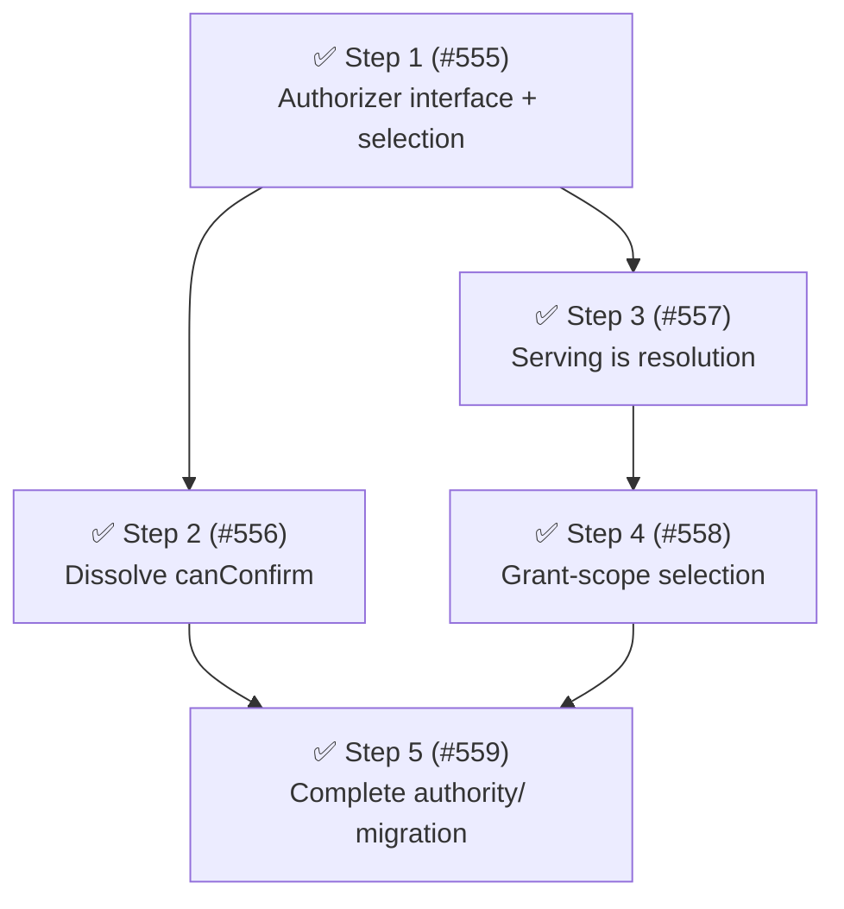

# Phase 9: The Authorizer spine

Phase 9 builds the [authority model](../architecture.md#target-the-authority-model) spine that Phase 8 tidied for: the `Authorizer` interface and its three implementations, `canConfirm()` dissolution, serving-as-resolution, human-selectable grant-scope, and the mechanical completion of the `authority/` directory migration.

## Findings

The cause is first-principles, not tool-sourced: the live-authority path — what happens on `ask` — has no single owner.
The deontic question "who may decide, and how do we reach them" is answered by an accretion of collaborators: `GateRunner` asks `GatePrompter.canConfirm()`, `PromptingGateway` computes it from `hasUI || isSubagent`, `ApprovalEscalator.requestApproval` re-branches on the same predicates per prompt, and `PermissionPrompter.prompt` reads `ctx.hasUI` a third time for event emission.
"No authority reachable" is represented twice with different logging (`applyPermissionGate`'s `ask` + `!canConfirm` arm and `requestApproval`'s not-a-subagent arm).
The serving side (`ForwardedRequestServer.processSingleForwardedRequest`) answers escalations with bespoke logic — its own yolo check (the last one outside the composed ruleset) and no `evaluate()` — so a parent `allow`/`deny` rule does not govern a child's escalation.
Fallow corroborates the symptoms: the three largest non-test functions after the composition root are exactly the ask-path modules (`runDescriptor` 130 lines, `processSingleForwardedRequest` 117, `waitForForwardedApproval` 77); dead code is 0 and duplication is 0.4%.

| Metric                                                                                  | Phase 8 exit                 | Phase 9 target   |
| --------------------------------------------------------------------------------------- | ---------------------------- | ---------------- |
| Health score                                                                            | 78 B                         | ≥ 78             |
| Dead exports / files                                                                    | 0                            | 0                |
| Ask-path role interfaces (`GatePrompter`, `PermissionPrompterApi`, `ApprovalRequester`) | 3                            | 1 (`Authorizer`) |
| `canConfirm` occurrences in `src/`                                                      | 15 across 5 modules          | 0                |
| `hasUI` / `isSubagent` evaluations per ask                                              | 3+ per prompt                | once per session |
| Yolo checks outside the composed ruleset                                                | 1 (`ForwardedRequestServer`) | 0                |
| `processSingleForwardedRequest`                                                         | 117 lines                    | < 60 lines       |
| Flat `src/` root modules                                                                | ~67                          | ~62              |

Scope decisions from planning: grant-scope selection ([resolved direction](../architecture.md#resolved-direction) 4) is included as the tail step; the `ModelTriageAuthorizer` ([#472]) is deferred to a later phase with its own decision record — the Step 1 seam is its extension point.
The two production clone groups (58 lines total, unrelated to the spine) score polish-tier (Priority ≤ 10) and are deferred.
Open issues swept and out of scope: [#309] (advisory bash-path fidelity), [#490] (indirection-wrapper flooring), [#520] (win32 backslash-relative bug), [#521] (read-only command allowlisting), [#519] (SDK UIContext clarification), [#23] (upstream-fork per-agent override evaluation).

## Steps

1. **✅ Introduce the `Authorizer` spine: interface, three implementations, once-per-session selection.**
   ([#555]) Cause: the three-way "who decides" dispatch is buried inside `ApprovalEscalator.requestApproval` and re-derived per prompt; the fallow signal (`waitForForwardedApproval` at 77 lines inside a class that also owns dispatch) is a symptom.
   Target: new `src/authority/authorizer.ts` (`Authorizer` interface — `authorize(details): Promise<PermissionPromptDecision>` — plus `selectAuthorizer(ctx, detection)`), new `src/authority/local-user-authorizer.ts` (owns `ctx.ui` + `requestPermissionDecisionFromUi` + direct UI-prompt event emission), new `src/authority/denying-authorizer.ts` (least-privilege deny), `src/authority/approval-escalator.ts` (sheds its `hasUI` and not-a-subagent arms; its forwarding machinery becomes the `ParentAuthorizer`), `src/prompting-gateway.ts` rewritten as the selection owner at `src/authority/authorizer-selection.ts` (context stored at `activate`, authorizer selected once per session), `src/permission-prompter.ts` → `src/authority/permission-prompter.ts` (keeps review-log bracketing, delegates to the selected `Authorizer`, drops per-call `ctx` threading).
   Smell: Category C (missing domain concept; relay chain of 4 role interfaces to reach one dialog).
   Outcome: the `hasUI`/`isSubagent`/deny dispatch exists in exactly one place (`selectAuthorizer`); predicates evaluated once per session activation; behavior-neutral — existing review-log and decision-event tests pass unchanged.
   Landed: `src/authority/authorizer.ts` (`Authorizer` interface, `AuthorizerSelectionDeps`, `selectAuthorizer`), `local-user-authorizer.ts`, `denying-authorizer.ts`, and `authorizer-selection.ts` (`AuthorizerSelection`, the `PromptingGateway` rewrite) landed in one commit alongside the moved `authority/permission-prompter.ts` and the wired `index.ts`; a second commit folded `ApprovalEscalator` directly into `ParentAuthorizer` (`approval-escalator.ts`), removing the transitional wrapper, the dead `hasUI`/`!isSubagent` arms, and the now-unused `ApprovalRequester` interface and `detection` dependency.
   `GatePrompter.canConfirm()` survives unchanged, as planned — dissolved next in Step 2.
   Impact 5 / Risk 3 / Priority 15.
   Release: independent

2. ✅ **Dissolve `canConfirm()`: the ask path always escalates.**
   ([#556]) Cause: "can anyone answer" is a pre-check duplicating the selection knowledge; with `DenyingAuthorizer`, absent authority is an authorizer that answers, not a boolean smeared across the gateway, gate, and runner.
   Target: delete `src/gate-prompter.ts`; `src/permission-gate.ts` drops the `canConfirm` param (`ask` always awaits `promptForApproval`); `src/handlers/gates/runner.ts` drops the pre-check; `src/handlers/gates/helpers.ts` derives `confirmation_unavailable` from a marker on the `DenyingAuthorizer`'s decision (mirroring the existing `autoApproved` marker).
   Landed: `GatePrompter` deleted and replaced by the single-method `AskEscalator` seam (`escalate(details)`, `authorizer-selection.ts`); `permission-gate.ts`/`runner.ts`/`helpers.ts` shed the `canConfirm` plumbing; `DenyingAuthorizer` denies with a `confirmationUnavailable` marker and `PermissionPrompter` surfaces it as the denied entry's `resolution`.
   Smell: Category C (scattered boolean policy) / Category A (parameter dead after Step 1).
   Outcome: `canConfirm` occurrences in `src/` drop 15 → 0; `runDescriptor` sheds the pre-check plumbing.
   The ask path now escalates uniformly — the `DenyingAuthorizer` is bracketed like any authorizer — so the unavailable path is recorded as the prompter's `waiting`/`denied` entries (`resolution: confirmation_unavailable`, preserved via the marker) rather than a standalone gate-written `blocked` entry; the `confirmation_unavailable` decision event is unchanged.
   This is a deliberate design decision (uniform escalation over byte-identical review-log shape), so the review log differs from Step 1's target wording.
   Impact 4 / Risk 2 / Priority 16.
   Release: independent

3. **✅ Serving is resolution: rebuild `processInbox` on `evaluate()` + the serving session's `Authorizer`.**
   ([#557]) Cause: the serving node answers escalations without consulting its own recorded authority ([resolved direction](../architecture.md#resolved-direction) 1), so parent policy cannot govern a child's escalation and yolo needs the bespoke serve-time check.
   Target: `src/authority/forwarded-request-server.ts` — inject a policy view + the `AskEscalator` seam; a request carrying `(surface, value)` resolves against the serving node's composed base ruleset (`agentName` undefined — the child applied its own per-agent overrides before forwarding; `allow`, including yolo-rewritten, auto-approves — yolo inheritance for free; `deny` auto-denies; `ask` or missing fields escalates through the seam); the escalated ask carries its forwarded provenance (requester agent/session, original `source`/`surface`/`value`) as data on `PromptPermissionDetails`, so `LocalUserAuthorizer` emits the non-degraded forwarded `permissions:ui_prompt` broadcast and the server sheds its bespoke emit + dialog path; remove `isYoloModeEnabled` + the `ConfigReader` dep; add the one-hop canary (loud warning when a request arrives from a requester whose registered parent is not the serving session).
   Smell: Category C (duplicate policy enforcement; single source of truth) / Category A (bespoke yolo arm).
   Outcome: zero yolo checks outside the composed ruleset; `processSingleForwardedRequest` < 60 lines; one `permissions:ui_prompt` emit site (`LocalUserAuthorizer`); behavior change (ships as `feat:`): parent `allow`/`deny` rules now govern children's escalations.
   Invariant (pinned by test): the forwarded `permissions:ui_prompt` broadcast stays non-degraded — original `source` and `surface`/`value` projection preserved, `forwarding` context populated — per the [#292] contract hardening documented in `docs/cross-extension-api.md`; rerouting the prompt through the `Authorizer` must not regress it.
   Landed: `ForwardedRequestServer` resolves each request on the injected `ServingPolicy` (recorded authority) and escalates `ask`/field-less requests through the `AskEscalator` seam; `LocalUserAuthorizer` became the single `permissions:ui_prompt` emit site rendering forwarded provenance from `PromptPermissionDetails` (the `buildDirectUiPrompt`/`buildForwardedUiPrompt` split folded into `buildUiPrompt`); the bespoke yolo check + `ConfigReader` dep are gone and the one-hop canary warns on a multi-hop/misrouted requester.
   Design recorded in `docs/decisions/0005-serving-authorizer-provenance.md`; post-ship validation in [#565].
   Impact 5 / Risk 3 / Priority 15.
   Release: independent

4. **✅ Grant-scope selection on forwarded approvals.**
   ([#558]) Cause: [resolved direction](../architecture.md#resolved-direction) 4 — a forwarded "for this session" grant can today land only on the requesting subagent; the human cannot choose the serving scope.
   Target: `src/permission-forwarding.ts` (request carries the child's suggested session pattern), `src/authority/approval-escalator.ts` (rides the existing `sessionApproval` suggestion along), `src/authority/forwarded-request-server.ts` (threads the scope choice into the escalated ask's details — after Step 3 the forwarded dialog is shown by `LocalUserAuthorizer` via the threaded provenance, not server-local prompting), `src/authority/local-user-authorizer.ts` + `src/permission-dialog.ts` (scope-aware dialog options — requesting subagent pre-selected as the least-privilege default); a whole-session grant records into the serving node's own `SessionRules`.
   Smell: completes the Category C authority model (feature riding the spine).
   Outcome: the forwarded dialog offers "this subagent only" (default) vs "whole session"; a whole-session grant suppresses future prompts for the parent and all children (verified by a composition-root round-trip test).
   Landed: the child rides its `SessionApproval` on `PromptPermissionDetails.sessionApproval` → `ForwardedPermissionRequest.sessionApproval` (tolerant read); `LocalUserAuthorizer` offers a two-step scope select (`buildForwardedScopeLabels`) for a forwarded ask carrying a suggestion; a whole-session choice returns the serving-node-internal `approved_for_serving_session` state, which `ForwardedRequestServer.applyGrantScope` records into the serving `SessionRules` and translates to a plain `approved` (child records nothing, re-forwards, auto-approves).
   Design recorded in `docs/decisions/0006-forwarded-grant-scope-selection.md`.
   Impact 3 / Risk 3 / Priority 9.
   Release: independent

5. ✅ **Complete the `authority/` migration.**
   ([#559]) Cause: Phase 8's forward-looking directory sketch names the elicitation and subagent modules as `authority/` residents; Steps 1–4 rewrite most of them into place, and this step moves the mechanical remainder so the domain is closed and files move once.
   Target: `src/permission-dialog.ts`, `src/permission-forwarding.ts`, `src/subagent-registry.ts`, `src/subagent-lifecycle-events.ts`, `src/forwarding-manager.ts` → `src/authority/`; imports rewritten via the `#src/` aliases.
   Smell: Category E (flat directory).
   Outcome: all escalation/forwarding/subagent modules live under `src/authority/`; flat `src/` root drops ~67 → ~62 modules; no behavior change.
   Landed: all five modules relocated via `git mv`; parent-relative imports rewritten to `#src/authority/…` aliases (mechanically verified by `tsc` + eslint's `no-parent-relative-imports` rule); five test files moved into `test/authority/` to match the established layout; no logic changes.
   Impact 2 / Risk 1 / Priority 10.
   Release: independent

## Step dependency diagram

## Parallel tracks

- **Track A — spine:** Step 1 → Step 2.
- **Track B — serving:** Step 1 → Step 3 → Step 4 (parallel to Track A after Step 1; disjoint files).
- **Track C — organization:** Step 5, after both tracks land.

## Release batches

- No multi-step batch: every step leaves the package consistent on its own.
- Independently releasable: Steps 1, 2, 5 (refactors; hidden changelog type, auto-batch into the next release), Steps 3, 4 (`feat:` — each cuts a release on landing).

## Completion

All 5 steps are closed: [#555], [#556], [#557], [#558], [#559].
Follow-on issue [#565] (validate serving-is-resolution decisions post-ship) was opened alongside Step 3 to track live validation of the new parent-governs-child-escalation behavior; it is non-gating and remains open for that follow-up observation.
Open issues swept and confirmed out of scope during planning: [#309], [#490], [#520], [#521], [#519], [#23].
The `ModelTriageAuthorizer` ([#472]) remains deferred to a later phase with its own decision record.

### Delivered vs. predicted metrics

Recomputed at archive time (`pnpm fallow:health` / `pnpm fallow:dupes --workspace @gotgenes/pi-permission-system`):

| Metric                                   | Phase 9 target            | Delivered                                                                    |
| ---------------------------------------- | ------------------------- | ---------------------------------------------------------------------------- |
| Health score                             | ≥ 78                      | 78 (B) — met                                                                 |
| Dead exports / files                     | 0                         | 0.0% / 0.0% — met                                                            |
| Ask-path role interfaces                 | 1 (`Authorizer`)          | 1 (`Authorizer`, three implementations) — met                                |
| `canConfirm` occurrences in `src/`       | 0                         | 0 functional occurrences (one explanatory comment) — met                     |
| Yolo checks outside the composed ruleset | 0                         | 0 — met                                                                      |
| `processSingleForwardedRequest`          | < 60 lines                | 39 lines — met                                                               |
| Flat `src/` root modules                 | ~62                       | 62 — met                                                                     |
| Duplication                              | (not separately targeted) | 0.2% (58 lines, 2 clone groups, unrelated to the spine; deferred as planned) |

[#23]: https://github.com/gotgenes/pi-packages/issues/23
[#292]: https://github.com/gotgenes/pi-packages/issues/292
[#309]: https://github.com/gotgenes/pi-packages/issues/309
[#472]: https://github.com/gotgenes/pi-packages/issues/472
[#490]: https://github.com/gotgenes/pi-packages/issues/490
[#519]: https://github.com/gotgenes/pi-packages/issues/519
[#520]: https://github.com/gotgenes/pi-packages/issues/520
[#521]: https://github.com/gotgenes/pi-packages/issues/521
[#555]: https://github.com/gotgenes/pi-packages/issues/555
[#556]: https://github.com/gotgenes/pi-packages/issues/556
[#557]: https://github.com/gotgenes/pi-packages/issues/557
[#558]: https://github.com/gotgenes/pi-packages/issues/558
[#559]: https://github.com/gotgenes/pi-packages/issues/559
[#565]: https://github.com/gotgenes/pi-packages/issues/565
