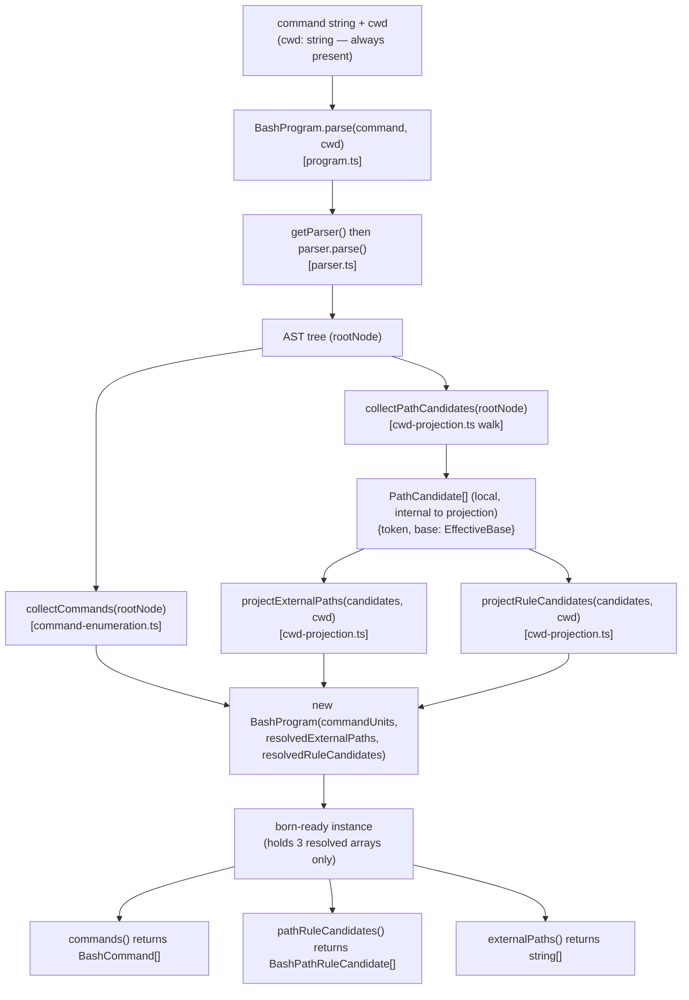
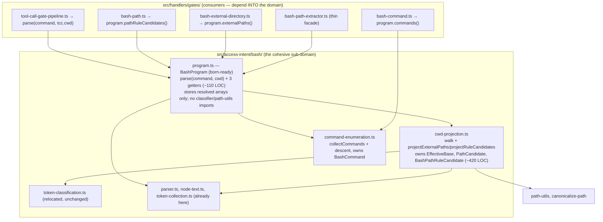

# Extract command enumeration and cwd projection; relocate the bash sub-domain (born-ready BashProgram + cwd type fix)

## Release Recommendation

**Release:** ship now — batch "bash-program-decomposition" tail (this issue completes the batch)

This is Step 3 of the Phase 6 access-intent roadmap and the tail of the `bash-program-decomposition` batch (Steps 1 [#473], 2 [#474], 3 [#475]).
Steps 1 and 2 already landed on `main` with their releases deferred per the mid-batch marker.
Landing Step 3 completes the batch, so the release-please PR should merge rather than stay open.

Caveat to confirm at ship time: every commit here is `refactor:` / `docs:` with no user-facing behavior change (the extension's permission decisions, config surface, and outputs are identical), so release-please will not derive a version bump from the batch alone.
"Ship now" means "nothing is holding the batch back" — if no bumping commit has accumulated, no release is cut, which is correct for an internal-only refactor.
Do not fabricate a `fix:`/`feat:` to force a bump.

## Problem Statement

After Steps 1 and 2, `src/handlers/gates/bash-program.ts` is down to ~695 LOC but still mixes three distinct concerns:

1. the `BashProgram` value-object API (parse once, expose typed slices),
2. command enumeration — chain/substitution/subshell descent that emits each executed command unit, and
3. the effective-working-directory `cd`-fold projection — the stateful AST walk that tags each path candidate with the working directory in force at its position, plus the per-candidate resolution that turns those tagged candidates into external paths and policy values.

The `cd`-fold projection is the subtlest region in the package (the home of the [#307] and [#454] fixes).
It and the command enumeration are each independently testable concerns that do not belong in the value-object file.
The file also still lives under `handlers/gates/`, which inverts the intended dependency direction: the gates should consume the access-intent engine, not host it.

Two design problems surfaced while planning this relocation, and both are folded into this issue:

- **`BashProgram` is not born-ready.**
  `parse(command)` stores intermediate `PathCandidate[]` state, then `externalPaths(cwd)` / `pathRuleCandidates(cwd)` re-supply `cwd` on every call to finish the resolution lazily.
  But `cwd` is always available at parse time (it is `tcc.cwd`, threaded from `ExtensionContext.cwd`).
  An object should be constructed with all the state it needs; `parse(command, cwd)` can resolve eagerly and hand callers finished answers.
- **The `cwd` type is wrongly widened.**
  `ToolCallContext.cwd` is typed `string | undefined`, but `ExtensionContext.cwd` is `string` in the SDK (non-optional — the same interface marks `model` and `signal` as `| undefined`, so `cwd`'s presence is deliberate).
  The `| undefined` is a type-widening error introduced in this package.
  It spawned dead `cwd`-undefined branches in five gates that obscure the real invariant: *if we are evaluating a tool call, `tcc.cwd` is a `string`.*

## Goals

- Extract command enumeration into `src/access-intent/bash/command-enumeration.ts`.
- Extract the `cd`-fold projection — the walk *and* the per-candidate resolution — into `src/access-intent/bash/cwd-projection.ts` (Option B: projection owns the whole lifecycle; `EffectiveBase` / `PathCandidate` never leave the module).
- Make `BashProgram` born-ready: `parse(command, cwd: string)` resolves eagerly; `commands()` / `externalPaths()` / `pathRuleCandidates()` become parameter-free getters over stored resolved arrays.
- Fix the `cwd` type widening: narrow `ToolCallContext.cwd` to `string`, and remove the now-dead `cwd`-undefined branches and obsolete tests across all five gates.
- Relocate the slimmed `BashProgram` to `src/access-intent/bash/program.ts` and `bash-token-classification.ts` to `src/access-intent/bash/token-classification.ts`.
- Repoint all bash gates and tests at `#src/access-intent/bash/...`.
- Sharpen the dependency direction: `handlers/gates/` depends into `access-intent/bash/`, never the reverse.

This is **not a breaking change** to the extension's user-facing surface — no public command, config field, default, schema, or permission output changes.
The changes are internal (module layout, in-package types, computation timing, dead-code removal).
All commits are `refactor:` / `docs:`.

## Non-Goals

- No change to permission decisions, enumeration semantics, the `cd`-fold projection results, classification, or policy resolution — outputs are identical; only *when* they are computed (eager vs lazy) and the internal API shape change.
- No collapse of `BashProgram` from a class to a function-returning-record.
  Under eager resolution the class is close to a data holder, but reshaping the value object belongs with Phase 6 Step 4 ([#476]), which already retypes `BashProgram.externalPaths` for the `AccessPath` value object.
- No introduction of the `AccessPath` value object — Step 4.
- No collapse of the two external-directory gates — Step 5.
- No new `index.ts` barrel for `access-intent/bash/` — consumers import the relocated modules directly (matching `parser.ts` / `node-text.ts` / `token-collection.ts`), so fallow does not flag speculative re-exports.
- No migration of the package-level path helpers (`path-utils`, `canonicalize-path`) into `access-intent/` — a later phase.

## Background

Relevant existing modules (all under `packages/pi-permission-system/src/`):

- `handlers/gates/bash-program.ts` — the file being decomposed.
  Exports `BashProgram` (class), `BashCommand` (interface), `BashPathRuleCandidate` (interface).
  Private: `EffectiveBase`, `PathCandidate`, the enumeration functions, the projection walk, and the per-candidate resolution helpers.
- `access-intent/bash/parser.ts` — lazy tree-sitter-bash parser (`getParser`, `TSNode`).
  Seeded by Step 1.
- `access-intent/bash/node-text.ts` — `resolveNodeText`, `SKIP_SUBTREE_TYPES`, `ARG_NODE_TYPES`.
  Seeded by Steps 1–2.
- `access-intent/bash/token-collection.ts` — `collectCommandTokens`, `collectPathCandidateTokens`, `collectRedirectTokens`, `extractCommandName`.
  Seeded by Step 2.
- `handlers/gates/bash-token-classification.ts` — `classifyTokenAsPathCandidate` (strict), `classifyTokenAsRuleCandidate` (broad), shared `rejectNonPathToken`.

The `cwd` invariant (verified during planning):

- `ExtensionContext.cwd: string` (`@earendil-works/pi-coding-agent`) — non-optional.
- `permission-gate-handler.ts` builds `ToolCallContext` with `cwd: ctx.cwd`, so `tcc.cwd` is always a `string` at runtime.
- The widened `ToolCallContext.cwd: string | undefined` produced dead `cwd`-undefined handling in five gates: `bash-external-directory.ts` (`|| !tcc.cwd` guard), `external-directory.ts` (`if (!tcc.cwd) return null`), `skill-read.ts` (`if (tcc.cwd === undefined) return null`), `path.ts` (`tcc.cwd ? … : filePath` ternary), `tool.ts` (`tcc.cwd ? … : path` ternary).
  Two of these have dedicated "returns null when no CWD" tests (`bash-external-directory.test.ts`, `external-directory.test.ts`) exercising an input that cannot occur.

Consumers of `BashProgram` (all in `handlers/gates/` unless noted):

- `tool-call-gate-pipeline.ts` — calls `BashProgram.parse`, passes the program to the bash gates.
- `bash-command.ts` — imports the `BashCommand` type; the handler decomposes via `program.commands()`.
- `bash-path.ts` — `describeBashPathGate` calls `program.pathRuleCandidates(tcc.cwd)`.
- `bash-external-directory.ts` — `describeBashExternalDirectoryGate` calls `program.externalPaths(tcc.cwd)`.
- `bash-path-extractor.ts` — thin facade `extractExternalPathsFromBashCommand(command, cwd: string)` over `BashProgram` (already types `cwd: string`).

AGENTS.md / skill constraints that apply:

- `package-pi-permission-system` skill: the parser is module-scoped state that persists across same-cwd session switches ([earendil-works/pi#5905]); this change does not touch that.
  SKILL.md references the classifiers by name (`classifyTokenAsPathCandidate` / `classifyTokenAsRuleCandidate`) but not by file path, so no SKILL.md edit is needed.
- `docs/architecture/architecture.md` carries a source-tree layout block and a Mermaid roadmap graph that reference `bash-program.ts` and `bash-token-classification.ts` by path — those must be updated when the files move.
- Deferred-to-tail work from [#474]: its architecture `Outcome:` line still reads "drops below ~670 LOC" against the actual 695.
  Fold the correction into this plan's doc step.

## Design Overview

The design has three parts: the `cwd` type fix (a self-contained correctness change that lands first), the born-ready eager-resolution model, and the Option-B module split.
The facade-scope question (where the projection lives) is resolved to **Option B** because born-ready makes it the only coherent choice — once `parse()` resolves eagerly, there is no call-time orchestration left for the facade to retain, so the projection lives wholly in `cwd-projection.ts`.

### Born-ready data flow — eager resolution at parse time

`parse(command, cwd)` does all the work; the instance stores only finished answers.
`PathCandidate[]` and `EffectiveBase` are local to the projection call and never reach the instance.



The expensive tree-sitter parse still happens once; the projection (cheap, pure) now also runs once at parse time instead of on every slice call.
Outputs are byte-for-byte identical to the lazy design — the slices were already pure functions of `(candidates, cwd)`, and `cwd` is fixed for the call.

### Module layout — Option B, born-ready



`EffectiveBase` / `PathCandidate` / `BashPathRuleCandidate` live in `cwd-projection.ts`; `BashCommand` lives in `command-enumeration.ts` (its producer); `program.ts` imports only what its three getters return.

### cwd type fix — dead branches removed

Narrowing `ToolCallContext.cwd` to `string` makes the type checker enforce the invariant and turns five gate branches into compile errors-if-kept (they read a property that is now always present):

| File                         | Dead branch removed                                                  | Replacement                                     |
| ---------------------------- | -------------------------------------------------------------------- | ----------------------------------------------- |
| `bash-external-directory.ts` | `\|\| !tcc.cwd` in the guard                                         | `if (tcc.toolName !== "bash") return null;`     |
| `external-directory.ts`      | `if (!tcc.cwd) return null;`                                         | removed (guard above it still applies)          |
| `skill-read.ts`              | `if (tcc.cwd === undefined) return null;`                            | removed                                         |
| `path.ts`                    | `tcc.cwd ? normalizePathForComparison(filePath, tcc.cwd) : filePath` | `normalizePathForComparison(filePath, tcc.cwd)` |
| `tool.ts`                    | `tcc.cwd ? normalizePathForComparison(path, tcc.cwd) : path`         | `normalizePathForComparison(path, tcc.cwd)`     |

The `getPolicyValuesForRuleCandidate` `if (!cwd) { literal-only }` branch is likewise dead under born-ready (the projection always has `cwd`) and is removed with it.

### Born-ready BashProgram sketch

```typescript
export class BashProgram {
  private constructor(
    private readonly commandUnits: readonly BashCommand[],
    private readonly resolvedExternalPaths: readonly string[],
    private readonly resolvedRuleCandidates: readonly BashPathRuleCandidate[],
  ) {}

  static async parse(command: string, cwd: string): Promise<BashProgram> {
    const parser = await getParser();
    const tree = parser.parse(command);
    if (!tree) return new BashProgram([], [], []);
    try {
      const candidates = collectPathCandidates(tree.rootNode);
      return new BashProgram(
        collectCommands(tree.rootNode),
        projectExternalPaths(candidates, cwd),
        projectRuleCandidates(candidates, cwd),
      );
    } finally {
      tree.delete();
    }
  }

  commands(): BashCommand[] { return [...this.commandUnits]; }
  externalPaths(): string[] { return [...this.resolvedExternalPaths]; }
  pathRuleCandidates(): BashPathRuleCandidate[] { return [...this.resolvedRuleCandidates]; }
}
```

Consumer call sites get *simpler* (no `cwd` argument on the getters):

```typescript
// tool-call-gate-pipeline.ts
const bashProgram =
  tcc.toolName === "bash" && command
    ? await BashProgram.parse(command, tcc.cwd) // tcc.cwd is now string
    : null;
// bash-external-directory.ts → program.externalPaths()
// bash-path.ts             → program.pathRuleCandidates()
// bash-path-extractor.ts   → (await BashProgram.parse(command, cwd)).externalPaths()
```

### Alternatives considered

- **Facade scope A (facade retains the projection orchestration) and C (a `resolveCandidateBase()` helper)** — both kept the per-candidate loop in the facade with the methods taking `cwd`.
  Born-ready eager resolution removes all call-time orchestration, so A/C no longer have anything to retain; Option B is the only coherent layout.
- **Collapse `BashProgram` to a function returning a record** — under eager resolution the class is close to a data holder, so this is a legitimate direction.
  Deferred to Step 4 ([#476]), which already reshapes this value object (retyping `externalPaths` for `AccessPath`); doing it here would pre-empt that step.
- **Split the `cwd` type fix into its own prerequisite issue** — considered; the operator chose to land it in #475 (all-in), since born-ready couples the `ToolCallContext` narrowing at the pipeline seam and the five-gate cleanup is small and mechanical.

## Module-Level Changes

New files (all under `src/access-intent/bash/`):

- `command-enumeration.ts` — `collectCommands`, `collectCommandsInto`, `makeUnit`, `descendCommandChildren`, `collectSubstitutionCommands`, the `COMMAND_ENUM_DESCEND` / `COMMAND_ENUM_SKIP` / `NESTED_EXECUTION_CONTEXTS` tables, and the `BashCommand` interface (the type moves to its producer).
  Imports `TSNode` from `parser.ts` and `BashCommandContext` from `#src/types`.
  Exports `collectCommands` and `BashCommand`.
- `cwd-projection.ts` — the projection walk (`collectPathCandidates`, `walkForCandidates`, `walkCurrentShellSequence`, `walkPipeline`, `foldPipelineFirstStage`, `foldListExceptTerminal`, `isBackgrounded`, `tagTokens`, `foldCd`, `cdLiteralTarget`, `literalTextOf`, `CWD_BASE`, `UNKNOWN_BASE`), the per-candidate helpers (`getPolicyValuesForRuleCandidate`, `isRelativeCandidate`, both taking `cwd: string`), and the two projection functions `projectExternalPaths(candidates, cwd: string)` / `projectRuleCandidates(candidates, cwd: string)`.
  Owns the `EffectiveBase`, `PathCandidate`, and `BashPathRuleCandidate` types.
  Drops the dead `if (!cwd)` literal-only branch from `getPolicyValuesForRuleCandidate`.
  Imports `TSNode` from `parser.ts`, `ARG_NODE_TYPES` / `SKIP_SUBTREE_TYPES` from `node-text.ts`, the collectors + `extractCommandName` from `token-collection.ts`, the classifiers from `token-classification.ts`, plus `path-utils` and `canonicalize-path`.
  Exports `collectPathCandidates`, `projectExternalPaths`, `projectRuleCandidates`, and `BashPathRuleCandidate`.
- `program.ts` — the born-ready `BashProgram` class only (see sketch).
  Private constructor takes the three resolved arrays; `parse(command, cwd: string)` resolves eagerly; the three getters are parameter-free.
  Imports `getParser` from `parser.ts`, `collectCommands` + `BashCommand` from `command-enumeration.ts`, and `collectPathCandidates` + `projectExternalPaths` + `projectRuleCandidates` + `BashPathRuleCandidate` from `cwd-projection.ts`.
- `token-classification.ts` — relocated `bash-token-classification.ts`, content unchanged except the doc-comment phrase "consumed by `bash-program.ts`" → "consumed by `cwd-projection.ts`".

Removed files:

- `src/handlers/gates/bash-program.ts` — content distributed across the three new files.
- `src/handlers/gates/bash-token-classification.ts` — relocated to `token-classification.ts`.

Changed files — cwd type fix (lands first, Step 1):

- `src/handlers/gates/types.ts` — `ToolCallContext.cwd: string | undefined` → `string`.
- `src/handlers/gates/bash-external-directory.ts` — drop `|| !tcc.cwd` from the guard.
- `src/handlers/gates/external-directory.ts` — remove `if (!tcc.cwd) return null;`.
- `src/handlers/gates/skill-read.ts` — remove `if (tcc.cwd === undefined) return null;`.
- `src/handlers/gates/path.ts` — collapse the `tcc.cwd ? … : filePath` ternary.
- `src/handlers/gates/tool.ts` — collapse the `tcc.cwd ? … : path` ternary.
- `test/helpers/gate-fixtures.ts` — `makeTcc` `cwd` override no longer accepts `undefined` (its default `"/test/project"` stands).
- `test/handlers/gates/bash-external-directory.test.ts` — remove the "returns null when no CWD" test (`makeTcc({ cwd: undefined })`).
- `test/handlers/gates/external-directory.test.ts` — remove the "returns null when no CWD" test.

Grep `ToolCallContext` object literals before the narrowing — only `permission-gate-handler.ts` (uses `ctx.cwd: string`) and `makeTcc` construct one; both already supply a `string`.

Changed files — born-ready signatures (Step 3, with the projection extraction):

- `src/handlers/gates/bash-external-directory.ts` — `program.externalPaths()` (drop `tcc.cwd` arg; `tcc.cwd` is still read for `getExternalDirectoryPolicyValues` and the descriptor `cwd` field).
- `src/handlers/gates/bash-path.ts` — `program.pathRuleCandidates()` (drop `tcc.cwd` arg).
- `src/handlers/gates/bash-path-extractor.ts` — `(await BashProgram.parse(command, cwd)).externalPaths()`; signature unchanged.
- `src/handlers/gates/tool-call-gate-pipeline.ts` — `BashProgram.parse(command, tcc.cwd)`.

Changed files — import repoints (Step 4, relocation):

- `src/handlers/gates/bash-command.ts` — `BashCommand` import to `#src/access-intent/bash/command-enumeration`.
- `src/handlers/gates/bash-external-directory.ts`, `bash-path.ts`, `bash-path-extractor.ts`, `tool-call-gate-pipeline.ts` — `BashProgram` import to `#src/access-intent/bash/program`.

Test files — relocate and/or repoint (Step 4):

- `test/handlers/gates/bash-program.test.ts` to `test/access-intent/bash/program.test.ts`; import to `#src/access-intent/bash/program`.
- `test/handlers/gates/bash-token-classification.test.ts` to `test/access-intent/bash/token-classification.test.ts`; import to `#src/access-intent/bash/token-classification`.
- `test/handlers/gates/bash-external-directory.test.ts`, `bash-path.test.ts`, `bash-command-metamorphic.test.ts`, `test/handlers/external-directory-symlink-acceptance.test.ts` — `BashProgram` import repoints.
- `test/handlers/gates/tool-call-gate-pipeline.test.ts` — the `vi.mock("#src/handlers/gates/bash-program", …)` factory path to `#src/access-intent/bash/program`; the mock's three methods become zero-arg (no signature change to the mock shape — they already return `[]`).

Born-ready test updates (Step 3): `program.test.ts` (née `bash-program.test.ts`) call sites change from `BashProgram.parse(cmd)` + `.externalPaths(cwd)` / `.pathRuleCandidates(cwd)` to `BashProgram.parse(cmd, cwd)` + parameter-free getters; the "returns the literal token only when no cwd is provided" test is removed (the no-cwd path no longer exists).
`extractExternalPathsFromBashCommand(command, cwd)` keeps its signature, so the ~90 call sites in `test/bash-external-directory.test.ts` are untouched.

Doc updates (`docs/architecture/architecture.md`, Step 5):

- Source-tree layout block: under `access-intent/bash/` add `command-enumeration.ts`, `cwd-projection.ts`, `program.ts`, `token-classification.ts`; remove `bash-program.ts` and `bash-token-classification.ts` from the `handlers/gates/` block.
  Update the `program.ts` entry to describe the born-ready value object (parse-time resolution, parameter-free slices).
- Inline `ToolCallContext` listing, if present in the doc's copied gate types, updated to `cwd: string`.
- Mark Phase 6 Step 3 complete: `✅` on the Step 3 heading and the `S3` Mermaid roadmap node.
- Track A narrative note: update to reflect Step 3 landed.
- Fold in the [#474] deferred fix: correct the Step 2 `Outcome:` "drops below ~670 LOC" line.
- Health metrics table: rename the `bash-program.ts` LOC / risk rows to `program.ts` with post-Step-3 actuals.

## Test Impact Analysis

1. **New unit tests the extraction enables.**
   Low value, as in Steps 1–2: `command-enumeration.ts` and `cwd-projection.ts` consume parse-derived `TSNode` trees and `PathCandidate[]`, so isolated tests would mean hand-building tree/candidate fixtures.
   The parse-driven `program.test.ts` exercises the walk + projection end to end.
   No new isolated unit-test files are required.
2. **Tests that change shape.**
   `program.test.ts` parse + slice call sites adopt the born-ready signatures (`parse(cmd, cwd)` + parameter-free getters).
   This is mechanical and touches only that file (plus the removed no-cwd case).
3. **Tests removed (dead inputs).**
   Three tests assert behavior for `cwd === undefined`, which the narrowed type makes impossible: `bash-external-directory.test.ts` "returns null when no CWD", `external-directory.test.ts` "returns null when no CWD", and `bash-program.test.ts` "returns the literal token only when no cwd is provided".
   Removing them is correct — they document an input the SDK never produces.
4. **Tests that must stay as-is.**
   Every projection / enumeration / classification assertion pins current behavior; the relocation and born-ready change must keep them green (only call-site shape and import paths change).

## Invariants at risk

A behavior-preserving move must keep every documented invariant green:

- The `cd`-fold projection invariants from [#307] (conservative flagging after a non-literal `cd`) and [#454] (folding a leading current-shell `cd` across a redirect-then-pipe) — pinned by the `externalPaths` cases in `program.test.ts`.
- The never-weaker nested-command enumeration from [#306] — pinned by the `commands()` cases.
- The lexical-vs-canonical return contract from [#418] and cd-aware policy values from [#393] — pinned by the `externalPaths` / `pathRuleCandidates` cases.

These live in tests, not just prose; the eager-resolution change must produce identical arrays.
The removed `cwd`-undefined branches were verified dead against `ExtensionContext.cwd: string`, so their removal does not change production behavior — only the (impossible) undefined-input tests go.

## TDD Order

Each cycle keeps the suite green (behavior-preserving); there is no red phase.
Because the born-ready signature change and the type narrowing each break consumers at the type level, those steps fold the source change, all consumer updates, and all consumer-test updates into one commit.

1. **Fix the `cwd` type widening.**
   Narrow `ToolCallContext.cwd` to `string`; remove the dead `cwd`-undefined branches in `bash-external-directory.ts`, `external-directory.ts`, `skill-read.ts`, `path.ts`, `tool.ts`; update `makeTcc`; remove the two "returns null when no CWD" tests.
   Run `pnpm run check` + full suite.
   Commit `refactor(pi-permission-system): narrow ToolCallContext.cwd to string and drop dead cwd-undefined gate branches`.
2. **Extract command enumeration.**
   Create `command-enumeration.ts` with the enumeration functions, tables, and `BashCommand`; remove them from `bash-program.ts`, importing `collectCommands` + `BashCommand` back; repoint `bash-command.ts`'s `BashCommand` import.
   Run `pnpm run check` + full suite.
   Commit `refactor(pi-permission-system): extract bash command enumeration to its own module`.
3. **Extract the cwd projection and make `BashProgram` born-ready.**
   Create `cwd-projection.ts` with the walk, the per-candidate helpers, `projectExternalPaths` / `projectRuleCandidates` (all taking `cwd: string`), and the `EffectiveBase` / `PathCandidate` / `BashPathRuleCandidate` types; drop the dead `if (!cwd)` literal branch.
   Rewrite `BashProgram` to born-ready: `parse(command, cwd: string)`, three-array constructor, parameter-free getters.
   Update all callers — `bash-external-directory.ts`, `bash-path.ts`, `bash-path-extractor.ts`, `tool-call-gate-pipeline.ts` — and `bash-program.test.ts` (born-ready call sites; remove the no-cwd test).
   Run `pnpm run check` + full suite.
   Commit `refactor(pi-permission-system): extract bash cwd projection and make BashProgram born-ready`.
4. **Relocate the facade and classifiers into the sub-domain.**
   Move `bash-program.ts` to `access-intent/bash/program.ts` and `bash-token-classification.ts` to `access-intent/bash/token-classification.ts`; repoint `cwd-projection.ts`'s classifier import and all gate consumers; relocate `bash-program.test.ts` to `test/access-intent/bash/program.test.ts` and `bash-token-classification.test.ts` to `test/access-intent/bash/token-classification.test.ts`; repoint the remaining test imports and the `tool-call-gate-pipeline.test.ts` `vi.mock` path.
   Run `pnpm run check` + full suite + `pnpm run lint` + `pnpm fallow dead-code`.
   Commit `refactor(pi-permission-system): relocate bash sub-domain under access-intent/bash`.
5. **Update the architecture doc.**
   Apply the layout-block, born-ready `program.ts` description, `ToolCallContext` type note, Step 3 `✅`, Track A, [#474]-deferred `Outcome:` fix, and health-metrics edits.
   Commit `docs(pi-permission-system): record Phase 6 Step 3 bash sub-domain relocation`.

Steps 2–4 may merge if a green intermediate state is awkward, but keep Step 1 first (it is independent and unblocks born-ready) and the doc update (Step 5) last.

## Risks and Mitigations

- **Risk: the born-ready signature change ripples to many call sites.**
  `parse` gains a parameter and the three getters lose one, breaking every consumer and test at the type level.
  Mitigation: fold the projection extraction, all gate-caller updates, and `program.test.ts` updates into Step 3; `tsc` after the step confirms none were missed.
- **Risk: removing a `cwd`-undefined branch that is actually reachable.**
  Mitigation: the invariant is verified against the SDK type (`ExtensionContext.cwd: string`); the narrowed `ToolCallContext.cwd` makes any reachable use a compile error, so `tsc` proves the branches dead.
- **Risk: an import cycle between the new modules.**
  Mitigation: every type lives with its producer (`BashCommand` → enumeration, `EffectiveBase`/`PathCandidate`/`BashPathRuleCandidate` → projection), so the graph is acyclic (`program.ts` → both; both → `parser.ts`).
  `pnpm run check` after each step confirms.
- **Risk: silently dropping a moved symbol during the large block moves.**
  Mitigation: anchor edits on adjacent unique code lines (not decorative rules), re-read each moved region, rely on Biome `noRedeclare` / `noUnusedImports` + `tsc`.
- **Risk: a stale `vi.mock` path silently mocks nothing.**
  Mitigation: repoint the `tool-call-gate-pipeline.test.ts` `vi.mock` factory path in Step 4 and confirm the pipeline tests still pass against the mock.

## Open Questions

- None blocking.
  Facade scope is resolved to **Option B** (born-ready forces it); the `cwd`-fix scope is resolved to **all-in #475**; the class→function reshape is deferred to Step 4 ([#476]).
- No follow-up issues are filed by this plan: Step 4 ([#476]) covers the `AccessPath` value object and the `BashProgram` reshape; the external-directory gate collapse is Phase 6 Step 5.

[#306]: https://github.com/gotgenes/pi-packages/issues/306
[#307]: https://github.com/gotgenes/pi-packages/issues/307
[#393]: https://github.com/gotgenes/pi-packages/issues/393
[#418]: https://github.com/gotgenes/pi-packages/issues/418
[#454]: https://github.com/gotgenes/pi-packages/issues/454
[#473]: https://github.com/gotgenes/pi-packages/issues/473
[#474]: https://github.com/gotgenes/pi-packages/issues/474
[#476]: https://github.com/gotgenes/pi-packages/issues/476
[earendil-works/pi#5905]: https://github.com/earendil-works/pi/issues/5905
