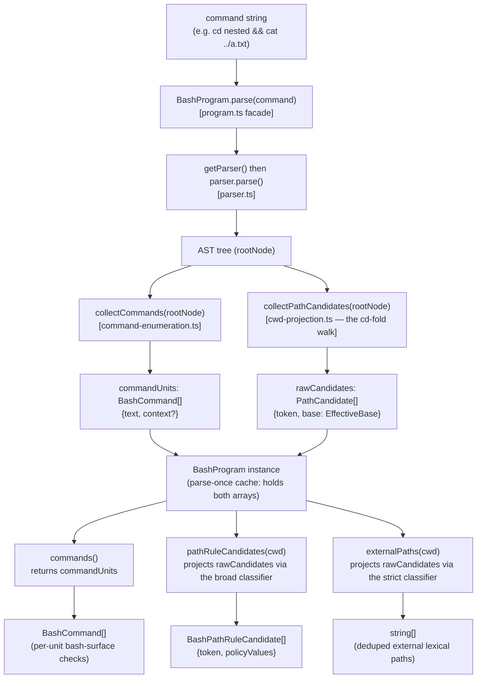
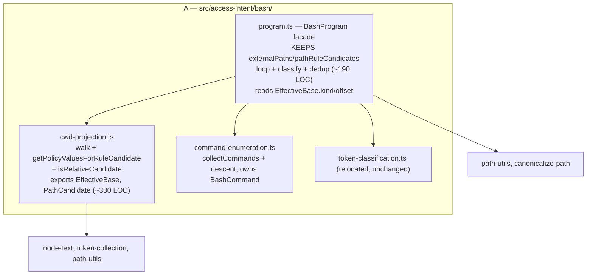
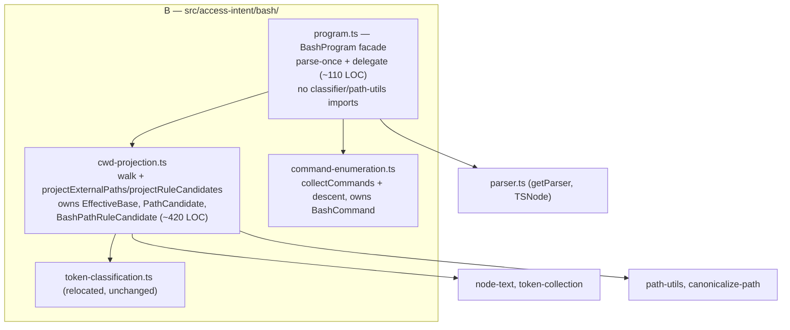
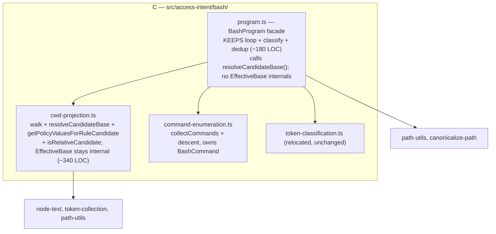

# Extract command enumeration and cwd projection; relocate the bash sub-domain

## Release Recommendation

**Release:** ship now — batch "bash-program-decomposition" tail (this issue completes the batch)

This is Step 3 of the Phase 6 access-intent roadmap and the tail of the `bash-program-decomposition` batch (Steps 1 [#473], 2 [#474], 3 [#475]).
Steps 1 and 2 already landed on `main` with their releases deferred per the mid-batch marker.
Landing Step 3 completes the batch, so the release-please PR should merge rather than stay open.

Caveat to confirm at ship time: all three batch members are pure `refactor:` moves with no behavior change, so release-please will not derive a version bump from them alone.
"Ship now" here means "nothing is holding the batch back" — if no bumping commit has accumulated, no release is cut, which is correct for an internal-only refactor.
Do not fabricate a `fix:`/`feat:` to force a bump.

## Problem Statement

After Steps 1 and 2, `src/handlers/gates/bash-program.ts` is down to ~695 LOC but still mixes three distinct concerns:

1. the `BashProgram` value-object API (parse once, expose typed slices),
2. command enumeration — chain/substitution/subshell descent that emits each executed command unit, and
3. the effective-working-directory `cd`-fold projection — the stateful AST walk that tags each path candidate with the working directory in force at its position, plus the per-candidate resolution that turns those tagged candidates into external paths and policy values.

The `cd`-fold projection is the subtlest region in the package (the home of the [#307] and [#454] fixes).
It and the command enumeration are each independently testable concerns that do not belong in the value-object file.

The file also still lives under `handlers/gates/`, which inverts the intended dependency direction: the gates should consume the access-intent engine, not host it.

## Goals

- Extract command enumeration into `src/access-intent/bash/command-enumeration.ts`.
- Extract the `cd`-fold projection into `src/access-intent/bash/cwd-projection.ts`, moved whole and behavior-preserving with its tests following it.
- Relocate the slimmed `BashProgram` to `src/access-intent/bash/program.ts`, leaving it a thin value-object facade that parses once and exposes typed slices.
- Relocate `bash-token-classification.ts` to `src/access-intent/bash/token-classification.ts` so the whole bash sub-domain is co-located.
- Repoint all bash gates and tests at `#src/access-intent/bash/...`.
- Sharpen the dependency direction: `handlers/gates/` depends into `access-intent/bash/`, never the reverse.

This is not a breaking change — no public API, config field, default, or output shape changes.
All commits are `refactor:` / `docs:`.

## Non-Goals

- No behavior change to enumeration, the `cd`-fold projection, classification, or policy resolution — this is a structural lift-and-shift.
- No introduction of the `AccessPath` value object — that is Phase 6 Step 4 ([#476]), which builds on the settled `BashProgram` this issue produces.
- No collapse of the two external-directory gates — Phase 6 Step 5.
- No new `index.ts` barrel for `access-intent/bash/` — consumers import the relocated modules directly (matching how `parser.ts` / `node-text.ts` / `token-collection.ts` are imported), so fallow does not flag speculative re-exports.
- No migration of the package-level path helpers (`path-utils`, `canonicalize-path`) into `access-intent/` — deferred to a later phase.

## Background

Relevant existing modules (all under `packages/pi-permission-system/src/`):

- `handlers/gates/bash-program.ts` — the file being decomposed.
  Exports `BashProgram` (class), `BashCommand` (interface), `BashPathRuleCandidate` (interface).
  Private: `EffectiveBase`, `PathCandidate`, the enumeration functions, the projection walk, and the per-candidate resolution helpers.
- `access-intent/bash/parser.ts` — lazy tree-sitter-bash parser (`getParser`, `TSNode`).
  Seeded by Step 1.
- `access-intent/bash/node-text.ts` — `resolveNodeText`, `SKIP_SUBTREE_TYPES`, `ARG_NODE_TYPES`.
  Seeded by Steps 1–2.
- `access-intent/bash/token-collection.ts` — `collectCommandTokens`, `collectPathCandidateTokens`, `collectRedirectTokens`, `extractCommandName`.
  Seeded by Step 2.
- `handlers/gates/bash-token-classification.ts` — `classifyTokenAsPathCandidate` (strict), `classifyTokenAsRuleCandidate` (broad), shared `rejectNonPathToken`.

Consumers of `BashProgram` (all in `handlers/gates/` unless noted):

- `tool-call-gate-pipeline.ts` — calls `BashProgram.parse`, passes the program to the bash gates.
- `bash-command.ts` — imports the `BashCommand` type; the handler decomposes via `program.commands()`.
- `bash-path.ts` — `describeBashPathGate` calls `program.pathRuleCandidates(cwd)`.
- `bash-external-directory.ts` — `describeBashExternalDirectoryGate` calls `program.externalPaths(cwd)`.
- `bash-path-extractor.ts` — thin facade `extractExternalPathsFromBashCommand` over `BashProgram`.

AGENTS.md / skill constraints that apply:

- `package-pi-permission-system` skill: the parser is module-scoped state that now persists across same-cwd session switches ([earendil-works/pi#5905]); this move does not touch that.
  SKILL.md references the classifiers by name (`classifyTokenAsPathCandidate` / `classifyTokenAsRuleCandidate`) but not by file path, so no SKILL.md edit is needed.
- `docs/architecture/architecture.md` carries a source-tree layout block and a Mermaid roadmap graph that reference `bash-program.ts` and `bash-token-classification.ts` by path — those must be updated when the files move.
- Deferred-to-tail work from [#474]: its architecture `Outcome:` line still reads "drops below ~670 LOC" against the actual 695.
  Fold the correction into this plan's doc step.

## Design Overview

The decomposition is behavior-preserving.
The interesting decision is **how thin the relocated `BashProgram` facade becomes** and **where the `EffectiveBase` projection state is encapsulated** — three options (A/B/C) are presented below for visual comparison.
The shared data flow is identical across all three; only the module that owns the per-candidate projection differs.

### Shared data flow — one parse, three slices (identical for A/B/C)



Parse happens once (the expensive tree-sitter step), producing two cached arrays.
The three public slices are guaranteed to agree because they derive from the same walk.

How the three slices differ:

| Slice                     | Classifier used                                           | What it computes                                                      | Output                    |
| ------------------------- | --------------------------------------------------------- | --------------------------------------------------------------------- | ------------------------- |
| `commands()`              | none                                                      | identity (returns cached units)                                       | `BashCommand[]`           |
| `pathRuleCandidates(cwd)` | `classifyTokenAsRuleCandidate` (broad: dotfiles, any `/`) | per-token cd-aware policy values                                      | `BashPathRuleCandidate[]` |
| `externalPaths(cwd)`      | `classifyTokenAsPathCandidate` (strict: `/`, `~/`, `..`)  | resolve against effective base, canonicalize, keep outside-cwd, dedup | `string[]`                |

`EffectiveBase` is the `cd`-fold state: as the walk crosses `cd nested && …`, the base accumulates `nested`; a non-literal `cd "$X"` makes it `unknown`.
Both `externalPaths` and `pathRuleCandidates` resolve their tokens against this base — that shared base-interpretation (`base.kind === "known" ? resolve(cwd, base.offset) : cwd`) is the duplication the option choice decides where to place.

### Option A — strict lift-and-shift (issue-literal, lowest risk)

`cwd-projection.ts` owns the AST walk plus the per-candidate policy helper (`getPolicyValuesForRuleCandidate`) and `isRelativeCandidate`, and exports the `EffectiveBase` / `PathCandidate` types.
`BashProgram.externalPaths` / `pathRuleCandidates` keep their loop + classify + dedup orchestration in `program.ts` and import those helpers/types — so `program.ts` reads `EffectiveBase.kind` / `.offset` across the new module boundary, and the `resolveBase` ternary stays duplicated (in the facade and in `getPolicyValuesForRuleCandidate`).



Smallest diff, purest behavior-preserving move; weakest encapsulation (the projection state leaks into the facade).

### Option B — thin facade, projection moves out (recommended)

`externalPaths` / `pathRuleCandidates` bodies move into `cwd-projection.ts` as free functions `projectExternalPaths(candidates, cwd)` / `projectRuleCandidates(candidates, cwd)`; `BashProgram` methods delegate.
`EffectiveBase` / `PathCandidate` / `BashPathRuleCandidate` stay fully encapsulated in `cwd-projection.ts` and never cross a module boundary.
`cwd-projection.ts` imports the token classifiers; `program.ts` imports neither the classifiers nor `path-utils`.



Cleanest encapsulation and a single owner for the `cd`-projection concern (AST to candidates to resolved paths/policy values), end to end.
Tradeoff: `cwd-projection.ts` becomes the ~420-LOC weight-bearing module holding the subtlest [#307] / [#454] logic; `program.ts` drops to a thin cache.
Note: the "more testable" benefit is modest — the projection functions' natural input is parse output, so the existing parse-driven tests stay as facade coverage rather than converting to isolated unit tests (see Test Impact Analysis).
B's real win is cohesion/encapsulation, not new test surface.

### Option C — A plus a `resolveCandidateBase()` helper (middle ground)

Option A's orchestration stays in the facade, but `cwd-projection.ts` exports `resolveCandidateBase(base, cwd)` that collapses the duplicated base-interpretation ternary and stops `program.ts` reaching into `EffectiveBase` internals.



Middle ground: facade keeps orchestration, but `EffectiveBase` is encapsulated and the ternary collapses to one place.
One small design improvement beyond pure lift-and-shift; weight split more evenly than B.

### Recommendation and pending decision

Recommended: **Option B**, on the operator's stated inclination toward a single module owning the projection lifecycle, and because it gives the cleanest encapsulation (`EffectiveBase` never leaves `cwd-projection.ts`) and the sharpest facade.
This plan is written for B in Module-Level Changes and TDD Order below; deltas for A/C are noted inline.

The facade-scope choice is **pending visual review** of the three diagrams above — confirm A/B/C before TDD execution begins.
If A or C is chosen, the only differences are: which file holds the `externalPaths` / `pathRuleCandidates` bodies (facade vs `cwd-projection.ts`), where `EffectiveBase` / `PathCandidate` / `BashPathRuleCandidate` are declared, and whether `program.ts` imports the classifiers + `path-utils` (A/C: yes; B: no).
The module set, the relocation, the consumer/test repoints, and the doc updates are identical across all three.

### Consumer call-site sketch (unchanged by this move, B shown)

```typescript
// tool-call-gate-pipeline.ts — parse once, hand the program to the gates
const program = await BashProgram.parse(command);
// bash-external-directory.ts
const paths = program.externalPaths(cwd); // delegates to projectExternalPaths
// bash-path.ts
const candidates = program.pathRuleCandidates(cwd); // delegates to projectRuleCandidates
// bash-command.ts
const units = program.commands(); // returns cached BashCommand[]
```

The public surface (`parse`, `commands`, `pathRuleCandidates`, `externalPaths`) is byte-for-byte identical; only the import path changes (`#src/handlers/gates/bash-program` to `#src/access-intent/bash/program`).

## Module-Level Changes

New files (all under `src/access-intent/bash/`):

- `command-enumeration.ts` — `collectCommands`, `collectCommandsInto`, `makeUnit`, `descendCommandChildren`, `collectSubstitutionCommands`, the `COMMAND_ENUM_DESCEND` / `COMMAND_ENUM_SKIP` / `NESTED_EXECUTION_CONTEXTS` tables, and the `BashCommand` interface (the type moves to its producer).
  Imports `TSNode` from `parser.ts` and `BashCommandContext` from `#src/types`.
  Exports `collectCommands` and `BashCommand`.
- `cwd-projection.ts` — the projection walk (`collectPathCandidates`, `walkForCandidates`, `walkCurrentShellSequence`, `walkPipeline`, `foldPipelineFirstStage`, `foldListExceptTerminal`, `isBackgrounded`, `tagTokens`, `foldCd`, `cdLiteralTarget`, `literalTextOf`, `CWD_BASE`, `UNKNOWN_BASE`), the per-candidate helpers (`getPolicyValuesForRuleCandidate`, `isRelativeCandidate`), and — **for B** — the two projection functions `projectExternalPaths` / `projectRuleCandidates`.
  Owns the `EffectiveBase`, `PathCandidate`, and `BashPathRuleCandidate` types.
  Imports `TSNode` from `parser.ts`, `ARG_NODE_TYPES` / `SKIP_SUBTREE_TYPES` from `node-text.ts`, the collectors + `extractCommandName` from `token-collection.ts`, the classifiers from `token-classification.ts`, plus `path-utils` and `canonicalize-path`.
  Exports `collectPathCandidates`, `projectExternalPaths`, `projectRuleCandidates`, and `BashPathRuleCandidate`.
- `program.ts` — the slimmed `BashProgram` class only.
  `parse()` calls `getParser` + `collectCommands` + `collectPathCandidates`; `commands()` returns the cached units; `pathRuleCandidates(cwd)` / `externalPaths(cwd)` delegate to the `cwd-projection.ts` functions (**B**).
  Imports `getParser` from `parser.ts`, `collectCommands` + `BashCommand` from `command-enumeration.ts`, and `collectPathCandidates` + `projectExternalPaths` + `projectRuleCandidates` + `BashPathRuleCandidate` from `cwd-projection.ts`.
  Re-exports `BashCommand` is not needed — `bash-command.ts` imports it from `command-enumeration.ts` directly.
- `token-classification.ts` — relocated `bash-token-classification.ts`, content unchanged.
  The doc-comment phrase "consumed by `bash-program.ts`" updates to reflect the new consumer (`cwd-projection.ts`).

A/C delta: under A/C the `externalPaths` / `pathRuleCandidates` bodies stay in `program.ts`; `BashPathRuleCandidate` is declared in `program.ts`; `program.ts` additionally imports the classifiers + `path-utils` + `canonicalize-path`; `cwd-projection.ts` does not export `projectExternalPaths` / `projectRuleCandidates`.
Under C, `cwd-projection.ts` also exports `resolveCandidateBase` and keeps `EffectiveBase` internal.

Removed files:

- `src/handlers/gates/bash-program.ts` — content distributed across the three new files.
- `src/handlers/gates/bash-token-classification.ts` — relocated to `token-classification.ts`.

Changed files — import repoints only (no logic change):

- `src/handlers/gates/bash-command.ts` — `BashCommand` import path to `#src/access-intent/bash/command-enumeration`.
- `src/handlers/gates/bash-external-directory.ts` — `BashProgram` type import to `#src/access-intent/bash/program`.
- `src/handlers/gates/bash-path.ts` — `BashProgram` type import to `#src/access-intent/bash/program`.
- `src/handlers/gates/bash-path-extractor.ts` — `BashProgram` import to `#src/access-intent/bash/program`.
- `src/handlers/gates/tool-call-gate-pipeline.ts` — `BashProgram` import to `#src/access-intent/bash/program`.

Test files — relocate and/or repoint:

- `test/handlers/gates/bash-program.test.ts` to `test/access-intent/bash/program.test.ts`; import to `#src/access-intent/bash/program`.
- `test/handlers/gates/bash-token-classification.test.ts` to `test/access-intent/bash/token-classification.test.ts`; import to `#src/access-intent/bash/token-classification`.
- `test/handlers/gates/bash-external-directory.test.ts` — `BashProgram` import repoint.
- `test/handlers/gates/bash-path.test.ts` — `BashProgram` import repoint.
- `test/handlers/gates/bash-command-metamorphic.test.ts` — `BashProgram` import repoint.
- `test/handlers/external-directory-symlink-acceptance.test.ts` — `BashProgram` import repoint.
- `test/handlers/gates/tool-call-gate-pipeline.test.ts` — the `vi.mock("#src/handlers/gates/bash-program", …)` factory path to `#src/access-intent/bash/program`.

Doc updates (`docs/architecture/architecture.md`):

- Source-tree layout block: under `access-intent/bash/` add `command-enumeration.ts`, `cwd-projection.ts`, `program.ts`, `token-classification.ts` entries; remove the `bash-program.ts` and `bash-token-classification.ts` entries from the `handlers/gates/` block.
- Mark Phase 6 Step 3 complete: `✅` on the Step 3 heading and on the `S3` Mermaid roadmap node.
- Track A narrative note: update to reflect Step 3 landed.
- Fold in the [#474] deferred fix: the Step 2 `Outcome:` line reading "drops below ~670 LOC" — correct it (the post-Step-2 actual was 695; Step 3 supersedes it).
- Health metrics table: rename the `bash-program.ts` LOC / risk rows to `program.ts` and record the post-Step-3 actuals.

`grep` confirmation performed during planning: no `src/`, `test/`, or `SKILL.md` reference to any moved symbol exists beyond the consumers listed above; SKILL.md references the classifiers by name only (no file-path edit needed).

## Test Impact Analysis

1. **New unit tests the extraction enables.**
   In principle, `command-enumeration.ts` and `cwd-projection.ts` could each get isolated unit tests.
   In practice the value is low: the projection functions consume parse-derived `PathCandidate[]` carrying `EffectiveBase`, and the enumeration consumes a `TSNode` tree — both natural inputs come from parsing, so isolated tests would mean hand-building tree/candidate fixtures.
   The existing coverage is parse-driven through `BashProgram`, which exercises the walk + projection end to end.
   No new isolated unit-test files are required for a behavior-preserving move; the extraction's payoff is cohesion, not new test surface.
2. **Existing tests that become redundant.**
   None.
   `bash-program.test.ts` stays the integration coverage of the facade (renamed `program.test.ts`); it continues to exercise `parse` to slice end to end.
   `bash-token-classification.test.ts` moves intact (`token-classification.test.ts`).
3. **Tests that must stay as-is.**
   All of them — every assertion pins current behavior of enumeration, the `cd`-fold projection, classification, or policy resolution.
   The relocation must keep them green unchanged except for import paths and file location.

## Invariants at risk

This step relocates code that Steps 1 and 2 already refactored and that prior issues hardened.
A behavior-preserving move must keep every documented invariant green:

- The `cd`-fold projection invariants from [#307] (conservative flagging of relative paths after a non-literal `cd`) and [#454] (folding a leading current-shell `cd` across a redirect-then-pipe that tree-sitter-bash mis-groups) — pinned by the `externalPaths` cases in `bash-program.test.ts` (moving to `program.test.ts`).
- The never-weaker nested-command enumeration from [#306] — pinned by the `commands()` cases.
- The lexical-vs-canonical return contract from [#418] and the cd-aware policy values from [#393] — pinned by the `externalPaths` / `pathRuleCandidates` cases.

No new tests are needed — these invariants already live in tests, not just prose.
The relocation must not change a single assertion.

## TDD Order

This is a lift-and-shift, so each cycle is "move, repoint in the same commit, run the full suite + `check`, commit."
Because removing an export breaks every importer at the type level in that commit, each cycle folds the source move and all consumer + consumer-test repoints into one step.
There is no red-then-green: the suite stays green throughout (behavior-preserving).

1. **Extract command enumeration.**
   Create `command-enumeration.ts` with the enumeration functions, tables, and the `BashCommand` interface; remove them from `bash-program.ts` and import `collectCommands` + `BashCommand` back from the new module; repoint `bash-command.ts`'s `BashCommand` import.
   Run `pnpm run check` + full suite.
   Commit `refactor(pi-permission-system): extract bash command enumeration to its own module`.
2. **Extract the cwd projection.**
   Create `cwd-projection.ts` with the walk, the per-candidate helpers, the projection functions (`projectExternalPaths` / `projectRuleCandidates` for B), and the `EffectiveBase` / `PathCandidate` / `BashPathRuleCandidate` types; slim `BashProgram` to delegate (B).
   Run `pnpm run check` + full suite.
   Commit `refactor(pi-permission-system): extract bash cwd projection to its own module`.
3. **Relocate the facade and classifiers into the sub-domain.**
   Move `bash-program.ts` to `access-intent/bash/program.ts` and `bash-token-classification.ts` to `access-intent/bash/token-classification.ts`; repoint `cwd-projection.ts`'s classifier import and all five gate consumers; relocate `bash-program.test.ts` to `test/access-intent/bash/program.test.ts` and `bash-token-classification.test.ts` to `test/access-intent/bash/token-classification.test.ts`; repoint the remaining test imports and the `tool-call-gate-pipeline.test.ts` `vi.mock` path.
   Run `pnpm run check` + full suite + `pnpm run lint` + `pnpm fallow dead-code`.
   Commit `refactor(pi-permission-system): relocate bash sub-domain under access-intent/bash`.
4. **Update the architecture doc.**
   Apply the layout-block, Step 3 `✅`, Track A, [#474]-deferred `Outcome:` fix, and health-metrics edits.
   Commit `docs(pi-permission-system): record Phase 6 Step 3 bash sub-domain relocation`.

Steps 1–3 may be reordered or merged if a green intermediate state is awkward, but keep the doc update (Step 4) last so it reflects the final layout.

## Risks and Mitigations

- **Risk: an import cycle between the new modules.**
  `program.ts` imports runtime functions from `command-enumeration.ts` and `cwd-projection.ts`; those modules import `BashCommand` / types only via `import type` where they reference facade-side names (none do under B — types move down to their producers).
  Mitigation: B places every type with the module that produces it, so the dependency graph is acyclic (`program.ts` to `command-enumeration.ts` / `cwd-projection.ts`, both to `parser.ts`; no back-edges).
  `pnpm run check` after each step confirms.
- **Risk: silently dropping a moved symbol during the large block move.**
  The [#474] retro used a `sed` line-range deletion for the 348-line body and re-read to confirm no enclosing brace was lost.
  Mitigation: anchor edits on adjacent unique code lines (not decorative rules), re-read each moved region, and rely on Biome `noRedeclare` / `noUnusedImports` + `tsc` as the correctness gate.
- **Risk: a stale `vi.mock` path silently mocks nothing.**
  `tool-call-gate-pipeline.test.ts` mocks `BashProgram` by module path; if the path is not repointed, the mock no longer intercepts and the test exercises the real parser.
  Mitigation: repoint the `vi.mock` factory path in Step 3 and confirm the pipeline tests still pass against the mock.
- **Risk: `program.ts` exceeds the ≤ 350 LOC target.**
  Both A (~190) and B (~110) clear it comfortably; the target does not constrain `cwd-projection.ts`.
  Mitigation: none needed — record the actual LOC in the retro.

## Open Questions

- **Facade scope (A/B/C)** — pending the operator's visual review of the three diagrams above.
  The plan recommends and is written for B. Resolving this before TDD execution is the one gate.
- No follow-up issues are filed by this plan: Step 4 ([#476]) already exists for the `AccessPath` value object, and the external-directory gate collapse is tracked as Phase 6 Step 5 in the roadmap.

[#306]: https://github.com/gotgenes/pi-packages/issues/306
[#307]: https://github.com/gotgenes/pi-packages/issues/307
[#393]: https://github.com/gotgenes/pi-packages/issues/393
[#418]: https://github.com/gotgenes/pi-packages/issues/418
[#454]: https://github.com/gotgenes/pi-packages/issues/454
[#473]: https://github.com/gotgenes/pi-packages/issues/473
[#474]: https://github.com/gotgenes/pi-packages/issues/474
[#476]: https://github.com/gotgenes/pi-packages/issues/476
[earendil-works/pi#5905]: https://github.com/earendil-works/pi/issues/5905
