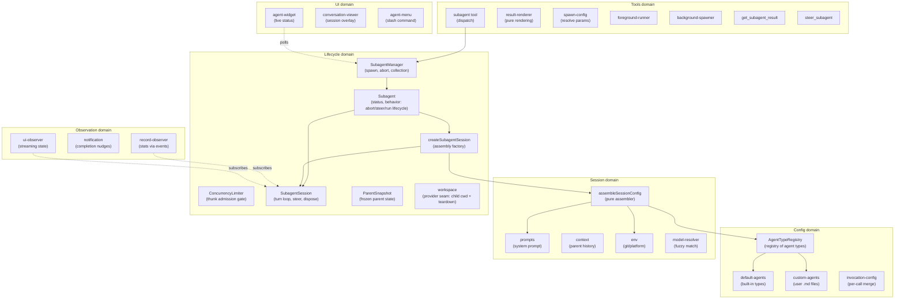
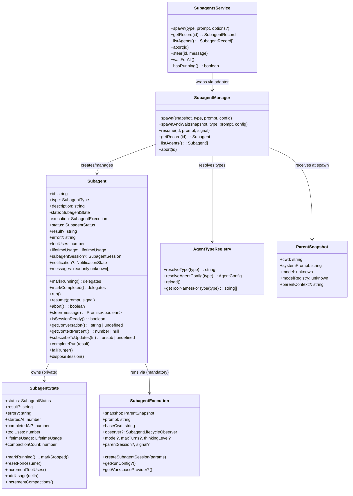
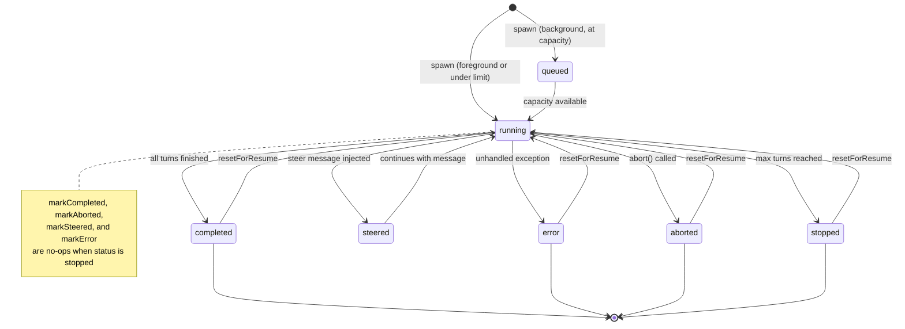
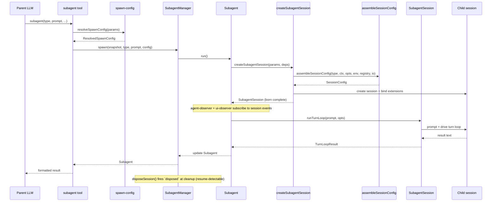
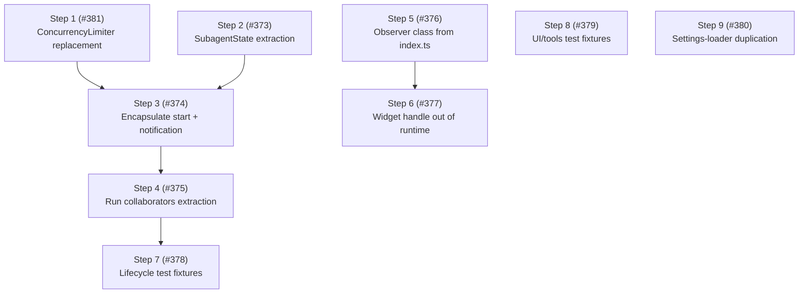

# Architecture

This document describes the architecture of the pi-subagents fork: a focused, composable core with a stable API boundary that other extensions can build on.

## Design principles

1. **Narrow core** — the extension owns agent spawning, execution, and result retrieval.
   Everything else is a consumer.
2. **Composable by default** — other extensions can spawn agents, observe their lifecycle, and display their state without importing this package directly.
3. **Typed API boundary** — this package exports a `SubagentsService` interface and `Symbol.for()` accessors (`publishSubagentsService` / `getSubagentsService`).
   Consumers declare this package as an optional peer dependency and use dynamic import for compile-time types.
   The runtime bridge is `Symbol.for("@gotgenes/pi-subagents:service")` on `globalThis` — no separate API package.
4. **No time-based scheduling** — cron-style timed dispatch (upstream's `schedule.ts` subsystem) is removed from the core (#52).
   Timed dispatch is a separate concern that any extension can implement by calling `spawn()` on the published API.
   The max-concurrent admission gate is not scheduling in this sense — concurrency management stays in core.
5. **UI extraction is deferred** — the widget, conversation viewer, and `/agents` command menu stay in the core for now.
   They are the first candidate for extraction once the API boundary is proven stable.
6. **Snapshot, don't capture** — mutable parent state (ctx, session, model) is read once at spawn time and frozen into a `ParentSnapshot` data object.
   No live references survive past the spawn call.
7. **Subscribe, don't thread** — observation of agent progress uses direct session-event subscription, not callback parameters threaded through multiple layers.
8. **Construct complete** — objects are born with all their dependencies.
   If state isn't available yet, the object that needs it doesn't exist yet.
   No post-construction field writes from external code — if an object can't be instantiated ready-to-go, the prep work hasn't been done and the right dependencies haven't been identified.
9. **State owns its mutations** — mutable state lives in a class whose methods enforce valid transitions and invariants.
   Free functions that mutate module-scoped variables, closure-captured bags-of-functions, and external writes to shared interfaces are replaced by classes that encapsulate the state they manage.
10. **Open for extension, closed for modification** — pi-subagents is a minimal core that publishes events and a service API.
    Other packages (pi-permission-system, a future UI extension, hypothetical OTel integration) hook into these events to add permissions, rendering, or telemetry.
    Pi-subagents has zero knowledge of its consumers — dependency arrows point inward, never outward.

## Domain model

The extension is organized around six domains, each responsible for one aspect of managing agents.



### Key domain types



## Agent lifecycle



Note: `markStopped` always succeeds regardless of current status.
Other terminal transitions guard against overwriting `stopped` — once an agent is stopped, only `resetForResume` can return it to `running`.

## Execution flow



## Module organization

The extension has 58 source files organized into six domains plus entry-point wiring.
All eight domains have directories: `config/`, `session/`, `lifecycle/`, `observation/`, `service/`, `tools/`, `ui/`, and `handlers/`.
Issue #164 moved the 26 previously flat root-level files into five new domain directories, reducing the root to 5 files + 8 directories.

### Current layout

```text
src/
├── index.ts                        entry point, tool registration, event wiring
├── runtime.ts                      SubagentRuntime factory (session-scoped state)
├── types.ts                        shared type definitions
├── settings.ts                     SettingsManager (persistent operational settings)
├── debug.ts                        debug logging utility
│
├── config/                         agent type definitions and resolution
│   ├── agent-types.ts              AgentTypeRegistry class
│   ├── default-agents.ts           built-in agent configs (general-purpose, Explore, Plan)
│   ├── custom-agents.ts            user-defined agent .md file loader
│   └── invocation-config.ts        per-call config merge
│
├── session/                        session assembly and preparation
│   ├── session-config.ts           pure assembler (main entry)
│   ├── prompts.ts                  system prompt building
│   ├── content-items.ts            shared message content parsing (tool-call names, assistant content)
│   ├── context.ts                  parent conversation extraction
│   ├── conversation.ts             render a session's messages as formatted text
│   ├── env.ts                      git/platform detection
│   ├── model-resolver.ts           fuzzy model name resolution
│   └── session-dir.ts              session directory derivation
│
├── lifecycle/                      agent execution and state tracking
│   ├── subagent-manager.ts         collection manager + observer wiring
│   ├── create-subagent-session.ts  assembly factory: session creation, binding, tool filtering
│   ├── subagent-session.ts         born-complete child session: turn loop, steer, dispose
│   ├── turn-limits.ts              normalizeMaxTurns (turn-count policy)
│   ├── subagent.ts                 owns full execution lifecycle (run, abort, steer)
│   ├── subagent-state.ts           lifecycle status + metrics value object (transitions, accumulators)
│   ├── run-listeners.ts            per-run observer-unsub and signal-detach handles
│   ├── workspace-bracket.ts        child workspace prepare/dispose lifecycle
│   ├── concurrency-limiter.ts       background admission gate: schedules run thunks FIFO against the limit
│   ├── parent-snapshot.ts          immutable spawn-time parent state
│   ├── child-lifecycle.ts          child-execution lifecycle event publisher
│   ├── workspace.ts                workspace provider seam (generative extension surface)
│   └── usage.ts                    token usage tracking
│
├── observation/                    progress tracking and notification
│   ├── record-observer.ts          session-event stats observer
│   ├── notification.ts             completion nudges
│   ├── notification-state.ts       per-agent notification tracking
│   └── renderer.ts                 notification TUI component
│
├── service/                        cross-extension API boundary
│   ├── service.ts                  SubagentsService interface + Symbol.for() accessors
│   └── service-adapter.ts          SubagentsServiceAdapter class wrapping SubagentManager
│
├── tools/                          LLM-facing tool implementations
│   ├── agent-tool.ts               subagent tool definition, validation, dispatch
│   ├── result-renderer.ts          pure per-status result rendering
│   ├── spawn-config.ts             pure config resolution
│   ├── foreground-runner.ts        foreground execution loop
│   ├── background-spawner.ts       background spawn setup
│   ├── get-result-tool.ts          get_subagent_result tool
│   ├── steer-tool.ts               steer_subagent tool
│   └── helpers.ts                  shared tool utilities
│
├── ui/                             user-facing presentation
│   ├── agent-widget.ts             above-editor live status widget
│   ├── widget-renderer.ts          pure rendering for widget
│   ├── agent-menu.ts               /agents slash command menu
│   ├── agent-config-editor.ts      agent detail/edit view (AgentConfigEditor class)
│   ├── agent-creation-wizard.ts    agent creation (AgentCreationWizard class)
│   ├── conversation-viewer.ts      scrollable session overlay
│   ├── message-formatters.ts       pure per-message-type formatters (extracted from conversation-viewer)
│   ├── agent-activity-tracker.ts   live activity state tracker
│   ├── agent-file-ops.ts           filesystem abstraction
│   ├── agent-file-writer.ts        overwrite-guard + write + reload + notify helper
│   ├── ui-observer.ts              session-event observer for streaming
│   └── display.ts                  pure formatters and shared types
│
└── handlers/                       event handlers
    ├── index.ts                    barrel re-export
    ├── interrupt.ts                turn_start handler — abort all subagents on parent interrupt (ESC)
    ├── lifecycle.ts                session_start, session_before_switch, session_shutdown
    └── tool-start.ts               tool_execution_start handler
```

### Observation model

Record statistics (tool uses, token usage, compaction counts) are updated by `record-observer.ts`, which subscribes directly to session events.
UI streaming (active tools, response text, turn counts) is handled by `ui/ui-observer.ts`, which subscribes to the same session events independently.
Neither observer wraps or forwards the other — both subscribe directly to the session.

The widget reads agent state by polling a shared `Map<string, AgentActivityTracker>` on `SubagentRuntime` every 80 ms. The conversation viewer subscribes to session events via `Subagent.subscribeToUpdates()` and reads messages via `Subagent.messages` — no direct `AgentSession` reference (#277).

## Cross-extension architecture


Consumers call `getSubagentsService()?.spawn(...)` at runtime.
They declare this package as an optional peer dependency and use dynamic import for compile-time types.

### What the core owns

- The three tools: `subagent` (née `Agent`), `get_subagent_result`, `steer_subagent`.
- `SubagentManager` — spawn, abort, resume, collection management, observer wiring.
- `ConcurrencyLimiter` — background admission gate: schedules run thunks FIFO against a configurable concurrency limit.
- `createSubagentSession` — assembly factory: session creation and extension binding; returns a born-complete `SubagentSession`.
- `SubagentSession` — the born-complete child session: drives the turn loop (`runTurnLoop`/`resumeTurnLoop`), steers, and disposes (firing `disposed` at true session disposal, so resume executions are registry-detected).
- `child-lifecycle` — publishes the child-execution lifecycle (`spawning`, `session-created` before `bindExtensions()`, `completed`, `disposed`) on `pi.events`.
  Reactive consumers subscribe: `@gotgenes/pi-permission-system` registers each child session on `session-created` and unregisters it on `disposed`.
  This replaced the former outbound `permission-bridge` (#261, [ADR-0002]) — the core no longer looks up a named consumer.
- `workspace` — the single generative seam (#262, [ADR-0002]): a registered `WorkspaceProvider` supplies a child's cwd plus bracketed `dispose()` at run-start.
  With no provider, children run in the parent cwd (default unchanged); the git worktree strategy lives behind this seam in `@gotgenes/pi-subagents-worktrees` (#263, the seam's first consumer).
- `session-config` — pure configuration assembler (called by `createSubagentSession`).
- `SubagentRuntime` — session-scoped state bag with methods.
- `ParentSnapshot` — immutable snapshot of parent session state, captured once at spawn time.
- `record-observer` — session-event observer that updates record statistics without callback threading.
- Agent type registry — default agents, custom `.md` file loading.
- Prompt assembly, context extraction, skills, environment.
- Worktree isolation — evicted to `@gotgenes/pi-subagents-worktrees` via the workspace provider seam in Phase 16 (#263, [ADR-0002]); `git` no longer appears in the core.
- Token usage tracking.
- Session directory derivation and persisted `SessionManager` for subagent transcripts.
- Settings persistence.
- Internal UI (widget, conversation viewer, `/agents` menu) — these stay until the API boundary is proven, then move to a separate extension.

### What the core dropped

- **Scheduling** (`schedule.ts`, `schedule-store.ts`, `ui/schedule-menu.ts`) — removed (#52).
- **Ad-hoc RPC** (`cross-extension-rpc.ts`) — replaced by the typed `SubagentsService` published via `Symbol.for()` (#49).
- **Group join** (`group-join.ts`) — removed (#49).
- **Output file** (`output-file.ts`) — replaced by `session-dir.ts` + `SessionManager.create()` (#61).
- **Callback threading** — the three-layer `on*` callback chain was replaced by direct session-event subscriptions (#100).
- **Live `ctx` capture** — replaced by `ParentSnapshot`, an immutable data object captured once at spawn time (#99).

## SubagentsService

The `SubagentsService` interface, accessor functions, and serializable types are exported from `@gotgenes/pi-subagents` via the `./service` export map entry.
No separate API package is needed.

Consumers declare this package as an optional peer dependency:

```json
{
  "peerDependencies": {
    "@gotgenes/pi-subagents": ">=5.0.0"
  },
  "peerDependenciesMeta": {
    "@gotgenes/pi-subagents": { "optional": true }
  }
}
```

At runtime, consumers use dynamic import for type-safe access to the accessor functions:

```typescript
const { getSubagentsService } = await import("@gotgenes/pi-subagents");
const svc = getSubagentsService();
if (svc) {
  svc.spawn("Explore", "Check for stale TODOs");
}
```

Pi's extension loader creates a fresh `jiti` instance per extension with `moduleCache: false`, so module-scoped singletons don't survive across extensions.
The accessor functions use `Symbol.for("@gotgenes/pi-subagents:service")` on `globalThis`, which is process-global by spec, to bridge this gap.
The dynamic import provides compile-time types; the `Symbol.for()` key is the actual runtime channel.

### Interface

See `src/service.ts` for the canonical definition.
Key types:

- `SubagentsService` — `spawn`, `getRecord`, `listAgents`, `abort`, `steer`, `waitForAll`, `hasRunning`.
- `SubagentRecord` — serializable agent snapshot (no live session objects).
- `SpawnOptions` — `description`, `model`, `maxTurns`, `thinkingLevel`, `inheritContext`, `foreground`, `bypassQueue`.
- `SUBAGENT_EVENTS` — channel constants for `pi.events` subscriptions.

### Accessor pattern

```typescript
const SERVICE_KEY = Symbol.for("@gotgenes/pi-subagents:service");

export function publishSubagentsService(service: SubagentsService): void {
  (globalThis as Record<symbol, unknown>)[SERVICE_KEY] = service;
}

export function getSubagentsService(): SubagentsService | undefined {
  return (globalThis as Record<symbol, unknown>)[SERVICE_KEY] as
    | SubagentsService
    | undefined;
}
```

If Pi gains a native service registry ([earendil-works/pi#4207]), these accessors can be updated to delegate to `pi.registerService()` / `pi.getService()` internally while keeping the same consumer API.

### Lifecycle events

The core emits events on `pi.events` that any extension can observe:

| Channel               | Payload                                     | When                 |
| --------------------- | ------------------------------------------- | -------------------- |
| `subagents:started`   | `{ id, type, description }`                 | Agent begins running |
| `subagents:completed` | `{ id, type, status, result?, error? }`     | Agent finishes       |
| `subagents:activity`  | `{ id, toolName?, textDelta?, turnCount? }` | Streaming progress   |

These are fire-and-forget broadcast events — no request IDs, no reply channels.

## Target architecture

The long-term architectural direction is to make pi-subagents a **minimal orchestrator** with inverted dependencies.
The core spawns a child session derived from the parent, runs the turn loop, tracks and streams and collects the result, gates concurrency, supports resume, and **publishes its lifecycle**.
Everything else — permissions, worktree/workspace isolation, UI, telemetry — is an extension that attaches through one of two surfaces and never reaches into the core.

The rationale and the full reasoning chain that led here are recorded in [`docs/decisions/0002-extensions-on-a-minimal-core.md`](../decisions/0002-extensions-on-a-minimal-core.md).

### Two extension surfaces

Extensions attach through exactly two surfaces, distinguished by the direction of information flow.

1. **Lifecycle events (observational) — unlimited.**
   The core emits awaited, ordered events for the child-execution lifecycle (`spawning`, `session-created` pre-`bindExtensions`, `completed`, `disposed`).
   Any number of extensions subscribe; handlers return nothing.
   Reactive concerns live here: permission detection, telemetry, UI, notifications.
   Adding a reactive concern never modifies the core.
2. **Provider seams (generative) — rationed.**
   The rare concern that must _inject_ a value the core consumes synchronously registers a provider the core consults.
   Today there is exactly one: the **workspace provider** (returns the child's working directory plus bracketed setup/teardown).
   A provider seam is the only place the core is "open," so the list is kept as small as possible.

The discriminator when deciding how a concern attaches:

- It only needs to **know** what happened → subscribe to a lifecycle event (observational, unlimited).
- It must **return a value the core consumes** → register a provider (generative, rationed).

The governing rule — **no vacant hooks**: the architecture must _admit_ a seam without _shipping_ it until a concrete consumer exists.
A provider seam with no consumer is a speculative abstraction that taxes every reader and that `fallow` flags as dead.
Latent extensibility is the deliverable; a vacant hook is not.

The [first-principles refinement](#first-principles-refinement-the-deeper-target) below sharpens this two-surface split.
The awaited, behavior-affecting lifecycle events (notably `session-created` before `bindExtensions`) are _hooks_ — the child's own extension surface applied recursively, generative because the core waits on the handler before deciding what to do next.
The observational surface then carries only fire-and-forget broadcasts of immutable snapshots, which no consumer can use to change the core.

### Core responsibilities (keep)

- **Agent definitions** — name, model, thinking, system prompt, tools list.
- **Prompt composition** — system prompt assembly.
- **Session lifecycle** — create child sessions, bind extensions, run conversation loop, track results.
- **Concurrency management** — queue, abort, resume, max concurrency.
- **Recursion guard** — remove pi-subagents' own three tools from child sessions (prevent infinite nesting).
  With `isolated` removed (#264), children always load the parent's resources, so the guard is unconditional rather than gated on `cfg.extensions`.
  This is the core defending its own invariant, keyed off its own tool names — not policy.
- **Lifecycle events** — emit awaited, ordered events when child sessions spawn, are created, complete, and are disposed.
- **Workspace provider seam** — accept a registered `WorkspaceProvider` and consult it for the child's cwd; default to the parent's cwd when none is registered.
- **Service API** — publish `SubagentsService` via `Symbol.for()` for cross-extension access.

### Responsibilities to remove

- **Tool policy** (`disallowed_tools`) — access control belongs in pi-permission-system's `permission:` frontmatter.
- **Extension filtering** (`extensions: string[]` allowlist) — tool visibility is pi-permission-system's job.
- **Worktree isolation** (`worktree.ts`, `worktree-isolation.ts`, `GitWorktreeManager`, the `isolation: "worktree"` spawn mode) — environment policy, not core.
  Git worktrees are one _strategy_ for choosing the child's working directory; containers, throwaway tmpdirs, and remote sandboxes are others.
  Evicted to `@gotgenes/pi-subagents-worktrees` (#263), the first consumer of the workspace provider seam.
- **Extension lifecycle control** (`extensions: false`, `isolated`, `noSkills`) — removed in #264.
  Deny-at-use (the in-child permission layer blocking disallowed tool calls) covers what `isolated` pretended to do for tools.
  Prevent-load (refusing to bind an extension because of load-time side effects, cost, or true sandboxing) is genuinely generative and is left as a _latent_ (un-built) provider seam, added only if a real consumer needs it.

### Composition model

In the target state, pi-subagents publishes events and a provider seam; other packages hook in:

- **pi-permission-system** (observational) subscribes to child-session lifecycle events, detects subagent execution context in the child, and gates tool calls at runtime.
- **pi-subagents-worktrees** (generative) registers a `WorkspaceProvider` that prepares a git worktree at run-start and tears it down after, supplying the child's cwd.
- **pi-subagents-ui** (future, under reconsideration — see the [first-principles refinement](#first-principles-refinement-the-deeper-target)) subscribes to the broadcast and the query/behavior interfaces; whether the inherited widget, conversation viewer, and `/agents` menu survive is judged on our principles, not preserved by default.
- **Any future extension** (OTel, auditing, cost tracking) subscribes to the same events without pi-subagents knowing.

Composition test: install neither extension, only permissions, only workspaces, or both — the core is byte-for-byte identical in all four cases, and the two extensions never reference each other.

This is achieved across phases: Phase 14 (strip policy), Phase 16 (invert dependencies — extensions on a minimal core), and Phase 18 (reconsider UI).

### First-principles refinement (the deeper target)

The two-surface model above is correct but coarse.
Pushing it against our own principles — construct complete, state owns its mutations, tell-don't-ask, dependency inversion — surfaces sharper boundaries that the current code draws through the middle of classes.
This subsection records the deeper target; the steps that realize it are sequenced in later phases.

#### `Subagent` is four conflated domains

The construction duality that motivates Phase 17 — a class that is simultaneously a passive record and an executor — is only the two most visible of four domains fused into one class.
Pulling each apart by asking "who changes this, how often, and who needs to know" surfaces:

1. **Lifecycle state** — status, result, error, timestamps.
   Owned by the subagent; transitions are rare and meaningful; the right outward shape is an immutable snapshot announced on change.
2. **Metrics** — tool uses, token usage, compaction count.
   These are not lifecycle state; they are a projection aggregated over the child session's event stream.
   `record-observer` already computes them — its only error is writing the aggregate back onto the subagent.
3. **The hook surface** — the points where an extension alters or augments the child before and around its run.
   This is the child session's own extension binding (see below), not data on the subagent.
4. **Result delivery** — whether the parent has consumed the result, when to nudge, how the result reaches the caller.
   The homeless `notification.resultConsumed` field belongs to this domain, not to execution.

The ~20 optional constructor fields and the runtime `run()` throws are the pressure these four domains exert on one class.
Separating them is what makes the Phase 17 steps fall out rather than fight back.

#### The subagent is a recursive Pi

A subagent is a child Pi session: created with `createAgentSession`, then `bindExtensions`.
Its extension surface is therefore Pi's extension surface applied recursively — not a bespoke event bus.
What the current doc calls "awaited, ordered lifecycle events" are not observations; they are **hooks**, structurally identical to Pi's own (`session_start`, `tool_execution_start`).
The tell is the awaiting: the core waits for the handler because the handler's completion changes what the core does next — an extension registers before the child binds.
A handler that can change subsequent behavior is generative, not observational, whatever we name the channel.

This splits the current "lifecycle events" surface cleanly in two:

1. **Broadcast** (observational, fire-and-forget) — "this happened; react if you want; you cannot change anything."
   Carries immutable snapshots for telemetry, notification, and any renderer.
   No consumer holds a live `Subagent`.
2. **Hooks** (generative, awaited, ordered) — the recursive Pi extension surface where workspace, permissions, and future concerns attach to the child.
   The `WorkspaceProvider` is one _typed_ hook; the general form is "be an extension of the child session."

The "no vacant hooks" rule still governs the generative side: admit the surface, ship a hook only when a real consumer exists.

#### Reactive versus discrete (not internal versus external)

The axis that decides push versus pull is whether a need is reactive or discrete — never whether the consumer is in-package or out.

- **Reactive** (ambient state that changes underneath you) → subscribe to the broadcast; be told.
  The state-owner announces; the consumer maintains its own read-model; nobody pulls.
- **Discrete** (a one-shot question: current value, full transcript) → pull a query.
  `get_subagent_result`, opening a transcript, and the external `SubagentsService.getRecord` are queries by nature and stay pull, in-package or not.

Behavior is a third interface: **tell by id, with outcomes**.
`steer` and `abort` own their own rules — a non-running agent rejects a steer from inside `steer`, not via a caller's status pre-check — so coordinators never ask-then-tell.

#### Consequences

Two consequences fall straight out, and both cut scope.

1. **The activity/metrics push tier is provisional.**
   Its only reactive consumer is the inherited widget.
   Treated from first principles, metrics are accumulated by an observer, exposed as a discrete query, and folded into the completion snapshot — so the high-frequency stream may not need to exist at all.
   We do not contort the core's event design to feed an inherited consumer.
2. **Phase 18 is "reconsider the UI," not "extract the UI."**
   The widget and `/agents` menu predate the fork; they are consumers to be judged on our principles, not requirements to preserve.
   If a UI survives, it survives as a reactive consumer of the broadcast and a caller of the query/behavior interfaces — built on our terms, possibly smaller, possibly removed.

#### Sibling packages follow the same discipline

`@gotgenes/pi-permission-system` is one of these hooks, and it is subject to the same scrutiny.
Its boundaries deserve the same first-principles treatment: surface its conflated domains, distinguish what it observes from what it injects, and prefer being told over asking.
The recursion principle means a consumer's internal design is not exempt because it lives in another package — the same axes (reactive versus discrete, hook versus broadcast, construct complete) apply across the seam.

#### How we find these boundaries

The boundaries above were not deduced top-down; they were surfaced by friction.
Each place the target got _harder_ to test marked a domain seam drawn through the middle of a class.
That method — testability friction as a boundary probe, with its limits — is recorded in the `improvement-discovery` skill so it outlives this phase.

## Current structural analysis

### Health metrics

| Metric                     | Value                                   |
| -------------------------- | --------------------------------------- |
| Health score               | 78/100 (B)                              |
| Total LOC                  | 8,356 (60 files, as of Phase 17 Step 4) |
| Dead code                  | 0 files, 0 exports                      |
| Maintainability index      | 90.8 (good)                             |
| Avg cyclomatic complexity  | 1.4                                     |
| P90 cyclomatic complexity  | 2                                       |
| Production duplication     | 11 lines (1 internal clone group)       |
| Test duplication           | 42 clone groups, 661 lines              |
| Fallow refactoring targets | 0                                       |

### Dependency bag inventory

These interfaces carry hidden dependencies that obscure true coupling.
Bags with 10+ fields are the highest priority for decomposition.

| Interface                     | Fields                                                       | Consumers                                         | Severity  |
| ----------------------------- | ------------------------------------------------------------ | ------------------------------------------------- | --------- |
| `ResolvedSpawnConfig`         | 3 nested                                                     | foreground-runner, background-spawner, agent-tool | ✓ done    |
| `AgentSpawnConfig`            | 13 → 13 (ParentSessionInfo nested)                           | agent-manager (internal)                          | ✓ done    |
| `CreateSubagentSessionParams` | 6 (snapshot, type, cwd, parentSession, model, thinkingLevel) | create-subagent-session                           | ✓ done    |
| `TurnLoopOptions`             | 4 (maxTurns, defaultMaxTurns, graceTurns, signal)            | subagent-session                                  | ✓ done    |
| `SessionConfig`               | 6 (flat fields; extensions/noSkills/extras removed in #264)  | session-config (output of assembler)              | ✓ done    |
| `NotificationDetails`         | 10                                                           | notification                                      | Low (DTO) |
| `ResourceLoaderOptions`       | 10                                                           | create-subagent-session (SDK bridge)              | Low (SDK) |
| `SubagentSessionIO`           | split → `EnvironmentIO` (3) + `SessionFactoryIO` (5+1)       | create-subagent-session                           | ✓ done    |
| `CreateSessionOptions`        | 9                                                            | create-subagent-session (SDK bridge)              | Low (SDK) |
| `AgentToolDeps`               | 8                                                            | agent-tool                                        | ✓ done    |
| `AgentMenuDeps`               | 8                                                            | agent-menu                                        | ✓ done    |
| `ConversationViewerOptions`   | 8                                                            | conversation-viewer                               | Low       |
| `SubagentInit`                | 5 (id, type, description, invocation, execution, state)      | subagent (one production site)                    | ✓ done    |
| `SubagentExecution`           | 12 (4 mandatory: factory, snapshot, prompt, baseCwd)         | subagent (mandatory collaborator)                 | ✓ done    |

### Complexity hotspots

Functions with cyclomatic complexity ≥ 21 (critical threshold):

No functions remain above the critical threshold — all hotspots resolved in Phase 12. 6 functions remain at HIGH severity (CRAP ≥ 65); 13 at moderate.

### Churn hotspots

Files with highest commit frequency × complexity:

| Score | File                        | Commits | Trend          |
| ----- | --------------------------- | ------- | -------------- |
| 65.0  | `index.ts`                  | 128     | ▲ accelerating |
| 9.1   | `ui/agent-widget.ts`        | 13      | ▼ cooling      |
| 8.4   | `ui/conversation-viewer.ts` | 11      | ─ stable       |
| 6.4   | `runtime.ts`                | 12      | ─ stable       |
| 3.3   | `settings.ts`               | 4       | ─ stable       |
| 2.9   | `handlers/lifecycle.ts`     | 11      | ─ stable       |

Most files have cooled to stable after 13 phases of structural work.
`index.ts` remains the sole accelerating hotspot — expected as the wiring entry point for each refactoring phase.

### Production duplication

The prior clone group between `agent-runner.ts` and `message-formatters.ts` was resolved in #172.
The 20-line clone group between `agent-config-editor.ts` and `agent-creation-wizard.ts` was resolved in #217 — extracted into `ui/agent-file-writer.ts` (`writeAgentFile`).
One 11-line internal clone group remains within `agent-config-editor.ts` (lines 135–145 / 173–183).

### Session encapsulation debt (Law of Demeter) — resolved by [#277] ✔️

All consumer reach-throughs to the raw SDK `AgentSession` via `Subagent.session` have been eliminated.
`Subagent.session` is removed; `SubagentSession.session` is marked `@internal` (lifecycle use only).
The intent-revealing replacements added by [#277]:

| Reach-through                            | Sites                                                                              | Replacement                                        |
| ---------------------------------------- | ---------------------------------------------------------------------------------- | -------------------------------------------------- |
| Steer buffer-or-deliver (was duplicated) | `service-adapter.ts`, `steer-tool.ts`                                              | `Subagent.steer(message)`                          |
| Conversation viewing                     | `get-result-tool.ts`, `agent-menu.ts`, `conversation-viewer.ts`                    | `Subagent.getConversation()` / `Subagent.messages` |
| Session-readiness guard                  | `agent-tool.ts`, `subagent-manager.ts`                                             | `Subagent.isSessionReady()`                        |
| Context-window stats                     | `steer-tool.ts`, `get-result-tool.ts`, `notification.ts`, `conversation-viewer.ts` | `Subagent.getContextPercent()`                     |
| Live updates (subscription)              | `conversation-viewer.ts`                                                           | `Subagent.subscribeToUpdates(fn)`                  |
| Observer callback session param          | `background-spawner.ts`, `foreground-runner.ts`                                    | `subagent.subagentSession` (narrowed callback)     |
| Session disposal                         | `subagent-manager.ts`                                                              | `SubagentSession.dispose()` — resolved by [#265]   |

### Proposed bag decompositions

#### ResolvedSpawnConfig (15 fields → 3 value objects)

This bag mixes three concerns: who the agent is, how it should run, and how it should be displayed.
Each consumer uses a different subset.

```typescript
/** Who this agent is — type resolution result. */
interface SpawnIdentity {
  subagentType: string;
  rawType: SubagentType;
  fellBack: boolean;
  displayName: string;
}

/** How the agent should run — execution parameters. */
interface SpawnExecution {
  prompt: string;
  description: string;
  model: Model<any> | undefined;
  effectiveMaxTurns: number | undefined;
  thinking: ThinkingLevel | undefined;
  inheritContext: boolean;
  runInBackground: boolean;
  agentInvocation: AgentInvocation;
}

/** How the agent is presented — display metadata. */
interface SpawnPresentation {
  modelName: string | undefined;
  agentTags: string[];
  detailBase: Pick<AgentDetails, ...>;
}
```

`foreground-runner` and `background-spawner` primarily consume `SpawnExecution` + `SpawnIdentity`.
`agent-tool` uses all three to build the `AgentSpawnConfig` and the result text.
After decomposition, each consumer declares its real dependencies explicitly.

#### AgentSpawnConfig — ParentSessionInfo extracted (done, [#166][166])

The `parentSessionFile`, `parentSessionId`, and `toolCallId` fields were grouped into `ParentSessionInfo`:

```typescript
/** Parent session identity — always travel together from the tool boundary. */
export interface ParentSessionInfo {
  parentSessionFile?: string;
  parentSessionId?: string;
  toolCallId?: string;
}
```

`AgentSpawnConfig` now carries `parentSession?: ParentSessionInfo` instead of three flat optional fields.

#### RunOptions (12 fields → extract RunContext) — done ([#169][169]), updated by [#231]

`RunContext` was extracted and nested as `RunOptions.context` in #169.
Issue #231 moved the two static dependencies (`exec`, `registry`) to `RunnerDeps` on `ConcreteAgentRunner`, leaving `RunContext` with only per-call fields:

```typescript
/** Per-call execution context — fields that vary per spawn. */
export interface RunContext {
  cwd?: string;
  parentSession?: ParentSessionInfo;
}
```

The remaining `RunOptions` fields (`model`, `maxTurns`, `signal`, `thinkingLevel`, `defaultMaxTurns`, `graceTurns`, `onSessionCreated`) are genuine execution parameters.
`RunOptions` now has 9 fields: 1 nested `context: RunContext` (2 per-call fields) plus 8 flat execution fields.

#### SessionConfig (11 fields → extract ToolFilterConfig) — done ([#168][168])

The tool-filtering cluster (`toolNames`, `disallowedSet`, `extensions`) was extracted into `ToolFilterConfig` and nested as `SessionConfig.toolFilter`.
`filterActiveTools` now accepts a single `ToolFilterConfig` argument instead of three positional parameters.
`SessionConfig` reduced from 10 to 8 top-level fields.

#### RunnerIO (9 methods → 2 focused interfaces) — done ([#167][167])

The IO boundary was split into two focused interfaces:

```typescript
/** Environment discovery — detect runtime context and resolve directories. */
export interface EnvironmentIO {
  detectEnv: (exec: ShellExec, cwd: string) => Promise<EnvInfo>;
  getAgentDir: () => string;
  deriveSessionDir: (
    parentSessionFile: string | undefined,
    effectiveCwd: string,
  ) => string;
}

/** Session factory — create SDK objects for a child agent session. */
export interface SessionFactoryIO {
  createResourceLoader: (opts: ResourceLoaderOptions) => ResourceLoaderLike;
  createSessionManager: (cwd: string, sessionDir: string) => SessionManagerLike;
  createSettingsManager: (cwd: string, agentDir: string) => SettingsManager;
  createSession: (
    opts: CreateSessionOptions,
  ) => Promise<{ session: AgentSession }>;
  assemblerIO: AssemblerIO;
}

/** Backward-compatible intersection of the two focused interfaces. */
export type RunnerIO = EnvironmentIO & SessionFactoryIO;
```

`RunnerIO` is kept as a type alias for the intersection.
All existing consumers satisfy both sub-interfaces via structural typing with no call-site changes.

## Phase 11 (complete)

Phase 11 converted all closure factories to classes, eliminating adapter closure density in `index.ts`.
Four layers: SessionContext typing → runtime query methods → interface alignment → class conversions → index.ts simplification.
See [phase-11-closure-to-class.md](history/phase-11-closure-to-class.md) for details.

## Phase 12 (complete)

Phase 12 decomposed the three remaining high-complexity UI functions and extracted shared test fixtures.
All four steps are closed: [#205], [#206], [#207], [#208].

## Phase 13 (complete)

Phase 13 addressed remaining closure factories, the last fallow refactoring target, oversized methods, production duplication, SDK boundary coupling, and test clone families.
All six steps are closed: [#214], [#215], [#216], [#217], [#218], [#219].
See [phase-13-remaining-smells.md](history/phase-13-remaining-smells.md) for details.

## Phase 14 (complete)

Phase 14 removed tool and extension policy enforcement from pi-subagents, eliminating overlap with pi-permission-system.
All four steps are closed: [#237], [#238], [#239], [#242].
See [phase-14-strip-policy.md](history/phase-14-strip-policy.md) for details.

[#237]: https://github.com/gotgenes/pi-packages/issues/237
[#238]: https://github.com/gotgenes/pi-packages/issues/238
[#239]: https://github.com/gotgenes/pi-packages/issues/239
[#242]: https://github.com/gotgenes/pi-packages/issues/242

## Phase 15 (complete)

Phase 15 evolved `Agent` from a passive state machine (`AgentRecord`) into an object that owns its entire execution lifecycle.
Before Phase 15, `AgentManager` orchestrated everything: calling the runner, handling session creation, wiring observers, and cleaning up worktrees — reaching into Agent 10+ times across `spawn()` and `startAgent()`.
After Phase 15, Agent is born complete with all dependencies and configuration, owns `run()` and `resume()`, and manages its own observer and worktree lifecycle.
All six steps are closed: [#227], [#228], [#231], [#229], [#230], [#232].
See [phase-15-domain-model-evolution.md](history/phase-15-domain-model-evolution.md) for details.

## Phase 16 (complete)

Phase 16 inverted the core's outbound dependencies: worktree isolation joined permissions as an _extension_ on a minimal core, leaving pi-subagents a pure child-session orchestrator.
The core now attaches extensions through exactly two surfaces — observational lifecycle events (unlimited) and rationed generative provider seams (today only the workspace provider) — and has zero knowledge of its consumers.
The "runner" concept is gone: `createSubagentSession()` returns a born-complete `SubagentSession` that owns turn driving, steering, and disposal, and `Subagent.run()` is coordination, not assembly.
The decision and the full reasoning chain are recorded in [ADR-0002]; the two-surface extension model is described under [Target architecture](#target-architecture).
All five steps are closed: [#261], [#262], [#263], [#264], [#265].
The earlier "agent collaborator architecture" framing (#256 superseded, #257 parked, #258 and #259 closed not-planned) was abandoned; its structural win was reached cleanly via the workspace seam.
See [phase-16-invert-dependencies.md](history/phase-16-invert-dependencies.md) for details.

## Improvement roadmap (Phase 17 — core consolidation)

Phase 17 consolidates the core's remaining structural debt before the UI reconsideration (now Phase 18).
The findings come from the standard discovery pass — fallow suite, entry-point trace, design-review checklist, and test-constructibility audit — run after Phase 16 landed.

Phase 17 is the consolidation slice of the [first-principles refinement](#first-principles-refinement-the-deeper-target), not the full domain split.
It lands the first cut of the lifecycle-state domain (Step 2's `SubagentState`) plus the wiring, queue, and duplication cleanups.
The fuller four-domain split — metrics as a projection, result delivery as its own domain, the hook/broadcast reclassification, and the push/pull (DIP) inversion — is recorded in the refinement and sequenced into later phases.

### Findings summary

Updated health metrics (fallow, package-wide including tests):

| Metric                     | Phase 16 baseline              | Current                                       |
| -------------------------- | ------------------------------ | --------------------------------------------- |
| Health score               | 78/100 (B)                     | 78/100 (B)                                    |
| Source LOC                 | 7,778 (57 files)               | 8,356 (60 files, landed Phase 17 Step 4)      |
| Dead code                  | 0 files, 0 exports             | 0 files, 0 exports                            |
| Maintainability index      | 90.8 (good)                    | 90.8 (good)                                   |
| Avg / P90 cyclomatic       | 1.4 / 2                        | 1.4 / 2                                       |
| Production duplication     | 11 lines (1 internal group)    | 34 lines (1 internal + 1 cross-package group) |
| Test duplication           | 42 groups, 661 lines           | 44 groups, ~750 lines                         |
| Fallow refactoring targets | 0                              | 0                                             |
| Top churn hotspot          | `index.ts` 65.0 ▲ accelerating | `index.ts` 31.3 ▼ cooling                     |

The syntactic metrics are healthy and stable — the remaining debt is structural, mostly invisible to fallow, and concentrated in three places:

1. **`Subagent` construction duality.**
   `SubagentInit` carries ~20 fields, nearly all optional with "required for run(), optional for tests" semantics, and `run()` compensates with runtime throws ("not configured for execution").
   This violates principle 8 (construct complete): the class is simultaneously a passive record (tests build display-only snapshots) and an executor (production wires factory, observer, run config, workspace provider).
   The symptoms are in the tests: external writes `record.promise = …` (manager, queue callback, four test files) and `record.notification = new NotificationState(…)` (seven test sites) are output-argument smells on fields the object should own.
   This duality is the two most visible of four domains fused into `Subagent`; Phase 17 resolves it (Step 2) and defers the remaining split (metrics, result delivery) to a later phase per the [first-principles refinement](#first-principles-refinement-the-deeper-target).
2. **Wiring debt in `index.ts`.**
   Two forward references (settings → queue, queue → manager) are replicated with an `eslint-disable prefer-const` dance in `test/lifecycle/subagent-manager.test.ts`; the queue's start callback (`record.promise = record.run()` after a status check) is duplicated verbatim between `index.ts` and the test helper.
   A ~70-line inline `SubagentManagerObserver` literal mixes three concerns (event emission, `appendEntry` persistence, notification dispatch).
   `runtime.widget` is assigned post-construction behind five relay-only delegation methods on `SubagentRuntime`.
3. **Duplication.**
   A 23-line cross-package production clone (`settings.ts:198-211` ↔ `pi-subagents-worktrees/src/config.ts:51-73`: the layered global/project settings-file loader) and 44 test clone groups (~750 lines), with clone families concentrated in `test/lifecycle/` and `test/ui/`.

Deferred findings (scored below the priority cut, tracked here rather than as steps): the `resolveModel` error-as-string union return (callers branch on `typeof resolved === "string"`), the file-top SDK `eslint-disable` headers in 14 files (re-audit when the Pi SDK exports improve), missing unit tests for `observation/renderer.ts` (the top CRAP-risk file), and the 11-line internal clone in `ui/agent-config-editor.ts` (folds into the Phase 18 UI extraction).

### Steps

Priority = Impact × (6 − Risk).

| Step | Title                                                                                | Category | Impact | Risk | Priority |
| ---- | ------------------------------------------------------------------------------------ | -------- | ------ | ---- | -------- |
| 1    | Replace ConcurrencyQueue with a thunk-based ConcurrencyLimiter                       | A/C      | 4      | 2    | 16       |
| 2    | Extract `SubagentState`; make `Subagent` execution deps mandatory                    | B/D      | 4      | 3    | 12       |
| 3    | Encapsulate run start and notification attachment on Subagent                        | C        | 3      | 2    | 12       |
| 4    | Extract run-listener and workspace-bracket collaborators from Subagent               | B/C      | 3      | 2    | 12       |
| 5    | Extract the manager observer from index.ts into a class                              | B/E      | 3      | 2    | 12       |
| 6    | Split widget delegation out of SubagentRuntime                                       | C        | 3      | 3    | 9        |
| 7    | Consolidate lifecycle test fixtures                                                  | D        | 3      | 1    | 15       |
| 8    | Consolidate UI and tools test fixtures                                               | D        | 2      | 1    | 10       |
| 9    | Resolve the cross-package settings-loader duplication                                | A        | 2      | 2    | 8        |

#### Step 1 — Replace ConcurrencyQueue with a thunk-based ConcurrencyLimiter ([#381]) ✅ Complete

- Targets: `src/lifecycle/concurrency-queue.ts` (→ `concurrency-limiter.ts`), `src/lifecycle/subagent-manager.ts`, `src/index.ts`, `test/lifecycle/concurrency-queue.test.ts`, `test/lifecycle/subagent-manager.test.ts`.
- Smell: Category C (forward references: the queue's ID-registry design forces a start callback that reaches back into the manager, duplicated between `index.ts` and the test helper) and Category A (dual counting: the queue's `running` counter is fed by `markStarted`/`markFinished` relays in the manager's observer, mirroring state the agents already carry).
- Change: replace the ID-registry queue with a `ConcurrencyLimiter` that schedules thunks FIFO against a dynamic `getLimit()` — the injected limiter knows nothing about agents, IDs, or the manager.
  Spawn gates background runs with `limiter.schedule(() => record.start())` — `start()` owns the abort-while-queued status guard and stores the promise internally; foreground and `bypassQueue` runs invoke `record.start()` directly.
  The settings `onMaxConcurrentChanged` hook wires to `limiter.recheck()` in `index.ts`; `dispose()` calls `limiter.clear()` to drop pending thunks.
- Outcome: dependency direction is strictly manager → limiter (no callback back-edge; the `prefer-const` eslint-disable in the test helper is deleted); the observer's two queue relays are gone; every spawned agent has a `promise` at spawn, collapsing `waitForAll`'s `while (true)` drain loop and its eslint-disable.

#### Step 2 — Extract `SubagentState`; make `Subagent` execution deps mandatory ([#373]) ✅ Complete

- Targets: `src/lifecycle/subagent.ts` (state fields, transition/accumulation methods, constructor, `run()` guards), `src/lifecycle/subagent-manager.ts` (`spawn`), `test/helpers/make-subagent.ts`, `test/lifecycle/subagent.test.ts`, `test/observation/record-observer.test.ts`.
- Smell: Category B (god interface — ~20 fields) and Category D (constructibility: "optional for tests" fields with compensating runtime throws).
  The record/executor duality is the two most visible of the four conflated domains (see [First-principles refinement](#first-principles-refinement-the-deeper-target)).
- Change: extract the passive-record state — status, result, error, timestamps, and the stats (toolUses, lifetimeUsage, compactionCount) — into a `SubagentState` value object that owns the transition and accumulation methods.
  `Subagent` holds one privately; its existing getters and `markX`/`incrementX`/`addUsage` methods become one-line delegations, so the ~40 read sites and the mutation callers are unchanged.
  This is not reach-through: `SubagentState` is a private owned value, not a foreign collaborator (contrast [#277], which removed reach-through to the raw SDK session).
  With the readable state extracted, the remaining execution inputs (snapshot, prompt, model, maxTurns, thinkingLevel, parentSession, signal, createSubagentSession, observer, getRunConfig, getWorkspaceProvider, baseCwd) collapse into a single **mandatory** `SubagentExecution` collaborator: production always supplies it (the one `spawn()` site), the passive-record construction moves entirely into `make-subagent.ts`, and `run()`'s two "not configured" throws vanish by construction.
- Outcome: state-machine and observer tests target `SubagentState` directly (no stub execution); `Subagent` is construct-complete with no optional execution fields and no runtime throws (grep-verifiable: no "not configured for execution" in `subagent.ts`); the record-vs-executor duality is resolved, not type-encoded.
- Scope boundary: stats stay on `SubagentState` for now.
  Hoisting **metrics** into a projection over the child session's event stream and extracting **result delivery** (`notification`/`resultConsumed`) into its own domain are the remaining two of the four domains, deferred to a later phase per the refinement.
- Landed: `SubagentState` (`src/lifecycle/subagent-state.ts`) owns status/result/error/timestamps/stats and the transition/accumulation methods; `Subagent` delegates getters and `markX`/`incrementX`/`addUsage` to it.
  `subscribeSubagentObserver` targets `SubagentState`, so observer and state-machine tests no longer stub execution.
  `SubagentExecution` is a mandatory constructor collaborator (production wires it in the single `spawn()` site; passive records build via `make-subagent.ts`), and the two `run()` throws are gone.

#### Step 3 — Encapsulate run start and notification attachment on Subagent ([#374]) ✅ Complete

- Targets: `src/lifecycle/subagent.ts`, `src/lifecycle/subagent-manager.ts`, `test/tools/get-result-tool.test.ts`, `test/lifecycle/subagent-manager.test.ts`, `test/service/service-adapter.test.ts`, `test/observation/notification.test.ts`, `test/helpers/make-subagent.test.ts`, `test/lifecycle/subagent.test.ts`.
- Smell: Category C — output arguments: external writes to `record.promise` (2 production sites in `subagent-manager.ts`, 4 test sites) and `record.notification` (7 test sites; the production path was resolved in Step 2 — the constructor creates `notification` from `execution.parentSession?.toolCallId`, so Step 3's remaining work is making the field read-only and updating tests to supply it via `parentSession`).
- Change: add `Subagent.start()` that runs and stores its own promise (plus an awaitable accessor for `spawnAndWait`/`waitForAll`); make `promise` and `notification` externally read-only (private `_promise`/`_notification` fields backed by public getters); the abort-while-queued status guard folds into `start()`, removing the inline check from the limiter callback; tests use `createTestSubagent({ toolCallId })` or spawn with `parentSession.toolCallId` instead of post-construction assignment.
- Outcome: zero external writes to `Subagent` fields outside its own methods (grep-verifiable: `\.promise =` and `\.notification =` appear only inside `subagent.ts`); 6 new unit tests for `start()` behaviour; test count +6 (975 → 981).
- Landed: `Subagent.start()` (immediate path) and `Subagent.scheduleVia(schedule)` (queued path) own the promise and the shared `guardedRun()` status guard; `SubagentManager.spawn()` calls one or the other; `TestSubagentOptions.toolCallId` wires notification state via the constructor path.
- Correction (post-merge): the first cut used `void this.limiter.schedule(() => record.start())`, which left a queued agent's `promise` unset until its slot opened — silently regressing Step 1's "every spawned agent has a `promise` at spawn" invariant.
  Fixed by inverting control: `scheduleVia` captures the limiter promise eagerly inside the agent (no external `.promise =` write), restoring the invariant.
  Lesson: a step's acceptance criteria must include the cross-step invariants it could regress, not only its own grep-verifiable outcome.

#### Step 4 — Extract run-listener and workspace-bracket collaborators from Subagent ([#375]) ✅ Complete

- Targets: `src/lifecycle/subagent.ts` (455 LOC after Step 2 extracted SubagentState — still the largest source file).
- Smell: Category B (oversized class; per-run listener fields declared mid-class) and Category C (state owns its mutations: workspace dispose logic appears in `run()`'s catch, `completeRun`, and `failRun`).
- Change: extract a `RunListeners` object owning the observer-unsubscribe and signal-detach handles (`wireSignal`/`attachObserver`/`release`), and a `WorkspaceBracket` collaborator owning prepare/dispose-with-addendum, centralising the dispose logic.
- Outcome: `subagent.ts` ≤ 450 LOC; workspace disposal logic in exactly one place; listener handles no longer raw nullable fields.
- Landed: `RunListeners` (`src/lifecycle/run-listeners.ts`) owns the signal-detach and observer-unsub handles with a single `release()` call; `WorkspaceBracket` (`src/lifecycle/workspace-bracket.ts`) owns prepare-at-run-start and dispose-with-addendum — `completeRun` and `failRun` call `workspaceBracket.dispose(outcome)` and receive the addendum string (or `""`) without reaching through to the workspace object directly.
  `Subagent.wireSignal`, `attachObserver`, and `releaseListeners` are removed.
  `subagent.ts`: 488 → 448 LOC.
  Test count: 982 → 994 (+12: 7 RunListeners + 13 WorkspaceBracket − 8 redundant Subagent listener tests).

#### Step 5 — Extract the manager observer from index.ts into a class ([#376])

- Targets: `src/index.ts` (inline `SubagentManagerObserver` literal, ~70 lines), new module under `src/observation/`.
- Smell: Category B/E — `index.ts` is the dominant churn hotspot (31.3, 91 commits); the literal mixes event emission, record persistence (`appendEntry`), and notification dispatch; principle 9 (state and behavior belong in classes, not closure-captured literals).
- Change: extract a class (e.g. `SubagentEventsObserver`) constructed with narrow deps (`emit`, `appendEntry`, the `NotificationSystem`).
- Outcome: `index.ts` < 170 lines; the observer's three concerns unit-tested directly without booting the extension.

#### Step 6 — Split widget delegation out of SubagentRuntime ([#377])

- Targets: `src/runtime.ts`, `src/tools/agent-tool.ts` (`AgentToolRuntime`), `src/tools/foreground-runner.ts`, `src/tools/background-spawner.ts`, `src/observation/notification.ts` (`NotificationManager` constructor), `src/index.ts`.
- Smell: Category C — relay-only dependency (five delegation methods that only forward to `widget`) and a post-construction `runtime.widget =` write violating principle 8.
- Change: pass the existing `WidgetLike` handle directly to the consumers that need it (tool deps, `NotificationManager`) and construct the widget before them; remove the `widget` field and the five relay methods from `SubagentRuntime`.
- Outcome: `SubagentRuntime` has zero widget knowledge; no post-construction field writes in `index.ts`; tool fixtures stub a 5-method `WidgetLike` instead of widget methods on the runtime mock.

#### Step 7 — Consolidate lifecycle test fixtures ([#378])

- Targets: `test/lifecycle/subagent-manager.test.ts` (766 LOC), `test/lifecycle/subagent.test.ts`, `test/lifecycle/subagent-session.test.ts`, `test/lifecycle/create-subagent-session.test.ts`, `test/lifecycle/create-subagent-session-extension-tools.test.ts`, `test/lifecycle/concurrency-limiter.test.ts`, `test/helpers/`.
- Smell: Category D — fallow reports five clone families across the lifecycle tests.
- Change: extract the repeated spawn/run/factory arrangements into shared helpers, migrating incrementally (lift-and-shift, never a single-step rewrite of a large test file).
- Outcome: lifecycle clone families 5 → ≤ 1; package test duplication below 600 lines.

#### Step 8 — Consolidate UI and tools test fixtures ([#379])

- Targets: `test/ui/agent-creation-wizard.test.ts`, `test/ui/agent-config-editor.test.ts`, `test/ui/ui-observer.test.ts`, `test/tools/foreground-runner.test.ts`, `test/tools/background-spawner.test.ts`, `test/session/session-config.test.ts`.
- Smell: Category D — remaining clone families outside the lifecycle tree.
- Change: extract per-file repeated arrangements into local helpers or `test/helpers/` where shared across files.
- Outcome: package clone groups 44 → ≤ 25; overall duplication ≤ 0.6%.

#### Step 9 — Resolve the cross-package settings-loader duplication ([#380])

- Targets: `src/settings.ts:198-211`, `packages/pi-subagents-worktrees/src/config.ts:51-73`.
- Smell: Category A — 23-line production clone: the layered global/project JSON read-sanitize-warn-merge loader.
- Change: decide explicitly between (a) exporting a small `loadLayeredSettings` helper from pi-subagents' public surface for worktrees to consume, and (b) documenting the duplication as intentional (separate release cadences, registry-resolved dependency) with a recorded fallow suppression.
  The issue weighs the public-API cost (type bundle, `verify:public-types`, docs for third-party authors) against living with the flag.
- Outcome: `pnpm fallow:dupes` no longer reports the pair, via extraction or recorded suppression.

### Step dependencies



Steps 8 and 9 have no dependencies and can run at any point.

### Tracks

| Track                         | Steps         | Theme                                                                              |
| ----------------------------- | ------------- | ---------------------------------------------------------------------------------- |
| A — Subagent constructibility | 2 → 3 → 4 → 7 | Construct complete; encapsulate run state; then consolidate the tests that churned |
| B — Wiring debt               | 1, 5 → 6      | Shrink index.ts; eliminate forward references and relay delegation                 |
| C — Test hygiene              | 8             | Clone families outside the lifecycle tree                                          |
| D — Duplication policy        | 9             | Cross-package clone decision                                                       |

Tracks A and B intersect only at Step 3 (which needs Step 1's queue relocation); otherwise they proceed in parallel.
Tracks C and D are fully independent.

## Refactoring history

Phases 1–5, 7–16 are complete.
Phase 6 (UI extraction to a separate package) is deferred → Phase 18.
Detailed records are preserved in per-phase history files:

| Phase | Title                                               | Status              | History                                                                              |
| ----- | --------------------------------------------------- | ------------------- | ------------------------------------------------------------------------------------ |
| 1     | Export SubagentsService API boundary                | Complete            | [phase-1-api-boundary.md](history/phase-1-api-boundary.md)                           |
| 2     | Remove scheduling subsystem                         | Complete            | [phase-2-remove-scheduling.md](history/phase-2-remove-scheduling.md)                 |
| 3     | Remove group-join, RPC; replace output-file         | Complete            | [phase-3-remove-rpc-groupjoin.md](history/phase-3-remove-rpc-groupjoin.md)           |
| 4     | Implement and publish SubagentsService              | Complete            | [phase-4-implement-service.md](history/phase-4-implement-service.md)                 |
| 5     | Decompose index.ts                                  | Complete            | [phase-5-decompose-index.md](history/phase-5-decompose-index.md)                     |
| 6     | Extract UI to separate package                      | Deferred → Phase 18 | —                                                                                    |
| 7     | Encapsulation and dependency narrowing              | Complete            | [phase-7-encapsulation.md](history/phase-7-encapsulation.md)                         |
| 8     | Testability, display extraction, menu decomposition | Complete            | [phase-8-testability.md](history/phase-8-testability.md)                             |
| 9     | Observation consolidation, ctx elimination          | Complete            | [phase-9-observation-ctx.md](history/phase-9-observation-ctx.md)                     |
| 10    | Domain organization, bag decomposition, complexity  | Complete            | [phase-10-structural-decomposition.md](history/phase-10-structural-decomposition.md) |
| 11    | Closure factories to classes                        | Complete            | [phase-11-closure-to-class.md](history/phase-11-closure-to-class.md)                 |
| 12    | Complexity reduction and test fixture extraction    | Complete            | [phase-12-complexity-test-fixtures.md](history/phase-12-complexity-test-fixtures.md) |
| 13    | Remaining structural smells                         | Complete            | [phase-13-remaining-smells.md](history/phase-13-remaining-smells.md)                 |
| 14    | Strip policy from core                              | Complete            | [phase-14-strip-policy.md](history/phase-14-strip-policy.md)                         |
| 15    | Domain model evolution                              | Complete            | [phase-15-domain-model-evolution.md](history/phase-15-domain-model-evolution.md)     |
| 16    | Invert dependencies (extensions on a minimal core)  | Complete            | [phase-16-invert-dependencies.md](history/phase-16-invert-dependencies.md)           |
| 17    | Core consolidation                                  | Planned             | —                                                                                    |
| 18    | Reconsider UI (first principles)                    | Planned             | —                                                                                    |

### Structural refactoring issues

| Phase                | Issue                                                      | Summary                                                                                                                                                    |
| -------------------- | ---------------------------------------------------------- | ---------------------------------------------------------------------------------------------------------------------------------------------------------- |
| Foundation           | #69, #71, #76, #80                                         | SubagentRuntime, pure assembler, cwd injection, config consolidation                                                                                       |
| Core decomposition   | #84, #72, #87, #70                                         | WorktreeManager, AgentManager DI, runtime methods, handler extraction                                                                                      |
| Interface polish     | #66, #77                                                   | SDK types, projectAgentsDir                                                                                                                                |
| Features             | #61                                                        | JSONL session transcripts                                                                                                                                  |
| AgentManager         | #98, #99, #100, #102                                       | Record state machine, ParentSnapshot, session-event observation, test factory                                                                              |
| Encapsulation        | #108, #109, #110, #111, #112, #113, #114, #115, #116, #118 | Registry, settings, activity tracker, record lifecycle, observer, spawn options, deps narrowing, tool split, type housekeeping                             |
| Testability          | #131, #132, #133, #134, #135, #136                         | Shared fixtures, session-config IO, runner SDK boundary, as-any reduction, display extraction, menu decomposition                                          |
| Observation/ctx      | #144, #145, #146, #147, #148                               | Observation consolidation, execute decomposition, UI context, text wrapping injection, widget rendering split                                              |
| Phase 10             | #164, #165, #166, #167, #168, #169, #170, #171, #172       | Domain directories, ResolvedSpawnConfig, ParentSessionInfo, RunnerIO split, ToolFilterConfig, RunContext, buildContentLines, renderResult, content-items   |
| Phase 11             | #192, #193, #194, #195, #196                               | SessionContext, runtime queries, interface alignment, tool classes, runner/menu classes, index.ts simplification                                           |
| Phase 12             | #205, #206, #207, #208                                     | renderWidgetLines, showAgentDetail, widget update, shared test fixtures                                                                                    |
| Phase 13             | #214, #215, #216, #217, #218, #219                         | Closure-to-class, buildParentContext, startAgent decomp, overwrite guard, settings SDK, test duplication                                                   |
| Phase 14             | #237, #238, #239, #242                                     | Remove disallowed_tools, remove extensions filtering, collapse filterActiveTools, rename Agent to subagent                                                 |
| Phase 15             | #227, #228, #231, #229, #230, #232                         | Agent domain model, async startAgent, runner self-contained, Agent.run(), ConcurrencyQueue, Agent.resume()                                                 |
| Phase 16             | #261, #262, #263, #264, #265                               | Lifecycle events (retire permission-bridge), WorkspaceProvider seam, extract worktrees package, remove isolated, born-complete execution / dissolve runner |
| Phase 16 (abandoned) | #256 (superseded), #257 (parked), #258, #259 (not planned) | Agent collaborator architecture — replaced by the inversion approach above ([ADR-0002])                                                                    |

The remaining open issue is #22 (parent-session resolution), a cross-extension track that does not gate the structural work.

## Relationship with upstream

This fork (`@gotgenes/pi-subagents` in the [gotgenes/pi-packages] monorepo) is a hard fork of [tintinweb/pi-subagents].
The decomposition diverges materially from upstream's direction.

The three upstream PRs (#71, #72, #73) remain open.
If they land, upstream gains the peer-dep fix and the two RepOne patches.
This fork continues independently regardless.

Upstream fixes and ideas are cherry-picked when they align with this fork's scope.
The upstream test suite is run periodically as a regression canary for the session assembly core.

[earendil-works/pi#4207]: https://github.com/earendil-works/pi/issues/4207
[gotgenes/pi-packages]: https://github.com/gotgenes/pi-packages
[tintinweb/pi-subagents]: https://github.com/tintinweb/pi-subagents
[166]: https://github.com/gotgenes/pi-packages/issues/166
[167]: https://github.com/gotgenes/pi-packages/issues/167
[168]: https://github.com/gotgenes/pi-packages/issues/168
[169]: https://github.com/gotgenes/pi-packages/issues/169
[#205]: https://github.com/gotgenes/pi-packages/issues/205
[#206]: https://github.com/gotgenes/pi-packages/issues/206
[#207]: https://github.com/gotgenes/pi-packages/issues/207
[#208]: https://github.com/gotgenes/pi-packages/issues/208
[#214]: https://github.com/gotgenes/pi-packages/issues/214
[#215]: https://github.com/gotgenes/pi-packages/issues/215
[#216]: https://github.com/gotgenes/pi-packages/issues/216
[#217]: https://github.com/gotgenes/pi-packages/issues/217
[#218]: https://github.com/gotgenes/pi-packages/issues/218
[#219]: https://github.com/gotgenes/pi-packages/issues/219
[#227]: https://github.com/gotgenes/pi-packages/issues/227
[#228]: https://github.com/gotgenes/pi-packages/issues/228
[#229]: https://github.com/gotgenes/pi-packages/issues/229
[#230]: https://github.com/gotgenes/pi-packages/issues/230
[#231]: https://github.com/gotgenes/pi-packages/issues/231
[#232]: https://github.com/gotgenes/pi-packages/issues/232
[#261]: https://github.com/gotgenes/pi-packages/issues/261
[#262]: https://github.com/gotgenes/pi-packages/issues/262
[#263]: https://github.com/gotgenes/pi-packages/issues/263
[#264]: https://github.com/gotgenes/pi-packages/issues/264
[#265]: https://github.com/gotgenes/pi-packages/issues/265
[#277]: https://github.com/gotgenes/pi-packages/issues/277
[#373]: https://github.com/gotgenes/pi-packages/issues/373
[#374]: https://github.com/gotgenes/pi-packages/issues/374
[#375]: https://github.com/gotgenes/pi-packages/issues/375
[#376]: https://github.com/gotgenes/pi-packages/issues/376
[#377]: https://github.com/gotgenes/pi-packages/issues/377
[#378]: https://github.com/gotgenes/pi-packages/issues/378
[#379]: https://github.com/gotgenes/pi-packages/issues/379
[#380]: https://github.com/gotgenes/pi-packages/issues/380
[#381]: https://github.com/gotgenes/pi-packages/issues/381
[ADR-0002]: ../decisions/0002-extensions-on-a-minimal-core.md
