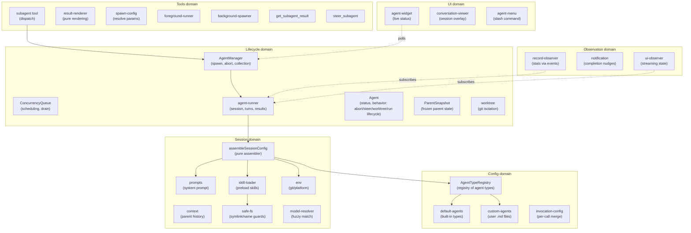
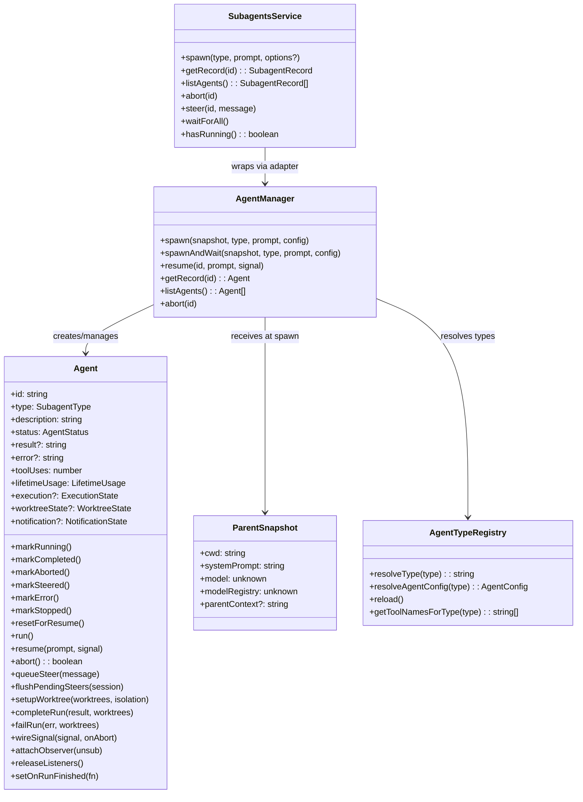
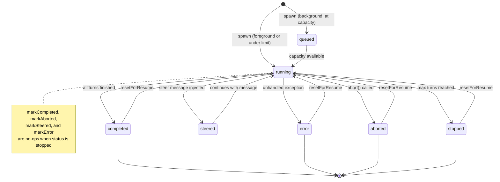
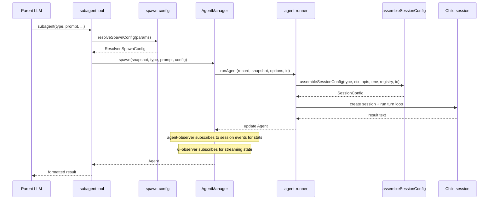
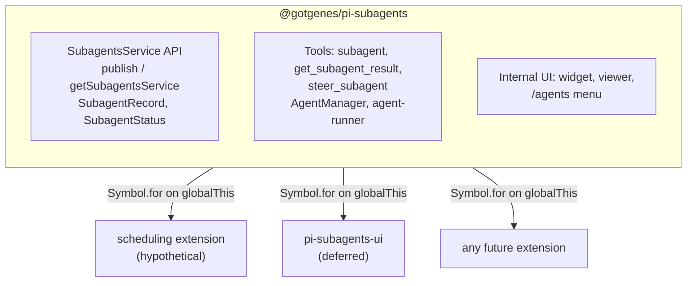
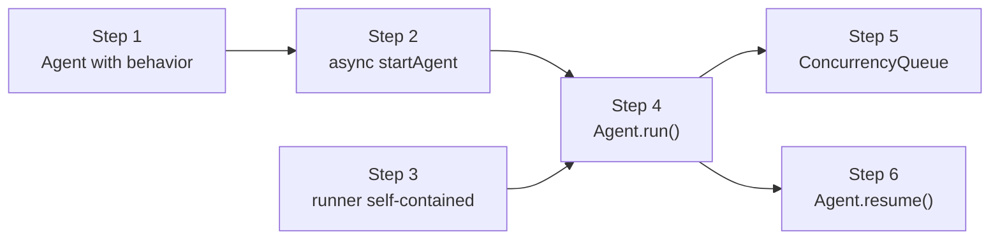

# Architecture

This document describes the architecture of the pi-subagents fork: a focused, composable core with a stable API boundary that other extensions can build on.

## Design principles

1. **Narrow core** — the extension owns agent spawning, execution, and result retrieval.
   Everything else is a consumer.
2. **Composable by default** — other extensions can spawn agents, observe their lifecycle, and display their state without importing this package directly.
3. **Typed API boundary** — this package exports a `SubagentsService` interface and `Symbol.for()` accessors (`publishSubagentsService` / `getSubagentsService`).
   Consumers declare this package as an optional peer dependency and use dynamic import for compile-time types.
   The runtime bridge is `Symbol.for("@gotgenes/pi-subagents:service")` on `globalThis` — no separate API package.
4. **No scheduling** — in-process scheduling is removed from the core.
   Scheduling is a separate concern that any extension can implement by calling `spawn()` on the published API.
5. **UI extraction is deferred** — the widget, conversation viewer, and `/agents` command menu stay in the core for now.
   They are the first candidate for extraction once the API boundary is proven stable.
6. **Snapshot, don't capture** — mutable parent state (ctx, session, model) is read once at spawn time and frozen into a `ParentSnapshot` data object.
   No live references survive past the spawn call.
7. **Subscribe, don't thread** — observation of agent progress uses direct session-event subscription, not callback parameters threaded through multiple layers.
8. **Construct complete** — objects are born with all their dependencies.
   If state isn't available yet, the object that needs it doesn't exist yet.
   No post-construction field writes from external code — if an object can't be instantiated ready-to-go, the prep work hasn't been done and the right dependencies haven't been identified.
9. **State owns its mutations** — mutable state lives in a class whose methods enforce valid transitions and invariants.
   Free functions that mutate module-scoped variables, closure-captured bags-of-functions, and external writes to shared interfaces are replaced by classes that encapsulate the state they manage.
10. **Open for extension, closed for modification** — pi-subagents is a minimal core that publishes events and a service API.
    Other packages (pi-permission-system, a future UI extension, hypothetical OTel integration) hook into these events to add permissions, rendering, or telemetry.
    Pi-subagents has zero knowledge of its consumers — dependency arrows point inward, never outward.

## Domain model

The extension is organized around six domains, each responsible for one aspect of managing agents.



### Key domain types



## Agent lifecycle



Note: `markStopped` always succeeds regardless of current status.
Other terminal transitions guard against overwriting `stopped` — once an agent is stopped, only `resetForResume` can return it to `running`.

## Execution flow



## Module organization

The extension has 56 source files organized into six domains plus entry-point wiring.
All eight domains have directories: `config/`, `session/`, `lifecycle/`, `observation/`, `service/`, `tools/`, `ui/`, and `handlers/`.
Issue #164 moved the 26 previously flat root-level files into five new domain directories, reducing the root to 5 files + 8 directories.

### Current layout

```text
src/
├── index.ts                        entry point, tool registration, event wiring
├── runtime.ts                      SubagentRuntime factory (session-scoped state)
├── types.ts                        shared type definitions
├── settings.ts                     SettingsManager (persistent operational settings)
├── debug.ts                        debug logging utility
│
├── config/                         agent type definitions and resolution
│   ├── agent-types.ts              AgentTypeRegistry class
│   ├── default-agents.ts           built-in agent configs (general-purpose, Explore, Plan)
│   ├── custom-agents.ts            user-defined agent .md file loader
│   └── invocation-config.ts        per-call config merge
│
├── session/                        session assembly and preparation
│   ├── session-config.ts           pure assembler (main entry)
│   ├── prompts.ts                  system prompt building
│   ├── content-items.ts            shared message content parsing (tool-call names, assistant content)
│   ├── context.ts                  parent conversation extraction
│   ├── safe-fs.ts                  symlink rejection and safe file reads
│   ├── skill-loader.ts             skill preloading
│   ├── env.ts                      git/platform detection
│   ├── model-resolver.ts           fuzzy model name resolution
│   └── session-dir.ts              session directory derivation
│
├── lifecycle/                      agent execution and state tracking
│   ├── agent-manager.ts            collection manager + observer wiring
│   ├── agent-runner.ts             session creation, turn loop, tool filtering
│   ├── agent.ts                    owns full execution lifecycle (run, abort, steer, worktree)
│   ├── concurrency-queue.ts        background agent scheduling with configurable concurrency limit
│   ├── parent-snapshot.ts          immutable spawn-time parent state
│   ├── execution-state.ts          session/output phase state
│   ├── permission-bridge.ts        optional bridge to pi-permission-system registry
│   ├── worktree.ts                 git worktree isolation
│   ├── worktree-state.ts           worktree phase state
│   └── usage.ts                    token usage tracking
│
├── observation/                    progress tracking and notification
│   ├── record-observer.ts          session-event stats observer
│   ├── notification.ts             completion nudges
│   ├── notification-state.ts       per-agent notification tracking
│   └── renderer.ts                 notification TUI component
│
├── service/                        cross-extension API boundary
│   ├── service.ts                  SubagentsService interface + Symbol.for() accessors
│   └── service-adapter.ts          SubagentsServiceAdapter class wrapping AgentManager
│
├── tools/                          LLM-facing tool implementations
│   ├── agent-tool.ts               subagent tool definition, validation, dispatch
│   ├── result-renderer.ts          pure per-status result rendering
│   ├── spawn-config.ts             pure config resolution
│   ├── foreground-runner.ts        foreground execution loop
│   ├── background-spawner.ts       background spawn setup
│   ├── get-result-tool.ts          get_subagent_result tool
│   ├── steer-tool.ts               steer_subagent tool
│   └── helpers.ts                  shared tool utilities
│
├── ui/                             user-facing presentation
│   ├── agent-widget.ts             above-editor live status widget
│   ├── widget-renderer.ts          pure rendering for widget
│   ├── agent-menu.ts               /agents slash command menu
│   ├── agent-config-editor.ts      agent detail/edit view (AgentConfigEditor class)
│   ├── agent-creation-wizard.ts    agent creation (AgentCreationWizard class)
│   ├── conversation-viewer.ts      scrollable session overlay
│   ├── message-formatters.ts       pure per-message-type formatters (extracted from conversation-viewer)
│   ├── agent-activity-tracker.ts   live activity state tracker
│   ├── agent-file-ops.ts           filesystem abstraction
│   ├── agent-file-writer.ts        overwrite-guard + write + reload + notify helper
│   ├── ui-observer.ts              session-event observer for streaming
│   └── display.ts                  pure formatters and shared types
│
└── handlers/                       event handlers
    ├── index.ts                    barrel re-export
    ├── lifecycle.ts                session_start, session_before_switch, session_shutdown
    └── tool-start.ts               tool_execution_start handler
```

### Observation model

Record statistics (tool uses, token usage, compaction counts) are updated by `record-observer.ts`, which subscribes directly to session events.
UI streaming (active tools, response text, turn counts) is handled by `ui/ui-observer.ts`, which subscribes to the same session events independently.
Neither observer wraps or forwards the other — both subscribe directly to the session.

The widget reads agent state by polling a shared `Map<string, AgentActivityTracker>` on `SubagentRuntime` every 80 ms. The conversation viewer subscribes directly to `AgentSession` objects.

## Cross-extension architecture



Consumers call `getSubagentsService()?.spawn(...)` at runtime.
They declare this package as an optional peer dependency and use dynamic import for compile-time types.

### What the core owns

- The three tools: `subagent` (née `Agent`), `get_subagent_result`, `steer_subagent`.
- `AgentManager` — spawn, abort, resume, collection management, observer wiring.
- `ConcurrencyQueue` — background agent scheduling with configurable concurrency limit.
- `agent-runner` — session creation, turn loop, extension binding.
- `permission-bridge` — optional cross-extension bridge to `@gotgenes/pi-permission-system`; registers each child session with `SubagentSessionRegistry` before `bindExtensions()` so the permission system detects in-process children deterministically.
  Scheduled for removal in Phase 16 — replaced by lifecycle events that consumers listen for.
- `session-config` — pure configuration assembler (extracted from `agent-runner`).
- `SubagentRuntime` — session-scoped state bag with methods.
- `ParentSnapshot` — immutable snapshot of parent session state, captured once at spawn time.
- `record-observer` — session-event observer that updates record statistics without callback threading.
- Agent type registry — default agents, custom `.md` file loading.
- Prompt assembly, context extraction, skills, environment.
- Worktree isolation.
- Token usage tracking.
- Session directory derivation and persisted `SessionManager` for subagent transcripts.
- Settings persistence.
- Internal UI (widget, conversation viewer, `/agents` menu) — these stay until the API boundary is proven, then move to a separate extension.

### What the core dropped

- **Scheduling** (`schedule.ts`, `schedule-store.ts`, `ui/schedule-menu.ts`) — removed (#52).
- **Ad-hoc RPC** (`cross-extension-rpc.ts`) — replaced by the typed `SubagentsService` published via `Symbol.for()` (#49).
- **Group join** (`group-join.ts`) — removed (#49).
- **Output file** (`output-file.ts`) — replaced by `session-dir.ts` + `SessionManager.create()` (#61).
- **Callback threading** — the three-layer `on*` callback chain was replaced by direct session-event subscriptions (#100).
- **Live `ctx` capture** — replaced by `ParentSnapshot`, an immutable data object captured once at spawn time (#99).

## SubagentsService

The `SubagentsService` interface, accessor functions, and serializable types are exported from `@gotgenes/pi-subagents` via the `./service` export map entry.
No separate API package is needed.

Consumers declare this package as an optional peer dependency:

```json
{
  "peerDependencies": {
    "@gotgenes/pi-subagents": ">=5.0.0"
  },
  "peerDependenciesMeta": {
    "@gotgenes/pi-subagents": { "optional": true }
  }
}
```

At runtime, consumers use dynamic import for type-safe access to the accessor functions:

```typescript
const { getSubagentsService } = await import("@gotgenes/pi-subagents");
const svc = getSubagentsService();
if (svc) {
  svc.spawn("Explore", "Check for stale TODOs");
}
```

Pi's extension loader creates a fresh `jiti` instance per extension with `moduleCache: false`, so module-scoped singletons don't survive across extensions.
The accessor functions use `Symbol.for("@gotgenes/pi-subagents:service")` on `globalThis`, which is process-global by spec, to bridge this gap.
The dynamic import provides compile-time types; the `Symbol.for()` key is the actual runtime channel.

### Interface

See `src/service.ts` for the canonical definition.
Key types:

- `SubagentsService` — `spawn`, `getRecord`, `listAgents`, `abort`, `steer`, `waitForAll`, `hasRunning`.
- `SubagentRecord` — serializable agent snapshot (no live session objects).
- `SpawnOptions` — `description`, `model`, `maxTurns`, `thinkingLevel`, `isolated`, `inheritContext`, `foreground`, `bypassQueue`, `isolation`.
- `SUBAGENT_EVENTS` — channel constants for `pi.events` subscriptions.

### Accessor pattern

```typescript
const SERVICE_KEY = Symbol.for("@gotgenes/pi-subagents:service");

export function publishSubagentsService(service: SubagentsService): void {
  (globalThis as Record<symbol, unknown>)[SERVICE_KEY] = service;
}

export function getSubagentsService(): SubagentsService | undefined {
  return (globalThis as Record<symbol, unknown>)[SERVICE_KEY] as
    | SubagentsService
    | undefined;
}
```

If Pi gains a native service registry ([earendil-works/pi#4207]), these accessors can be updated to delegate to `pi.registerService()` / `pi.getService()` internally while keeping the same consumer API.

### Lifecycle events

The core emits events on `pi.events` that any extension can observe:

| Channel               | Payload                                     | When                 |
| --------------------- | ------------------------------------------- | -------------------- |
| `subagents:started`   | `{ id, type, description }`                 | Agent begins running |
| `subagents:completed` | `{ id, type, status, result?, error? }`     | Agent finishes       |
| `subagents:activity`  | `{ id, toolName?, textDelta?, turnCount? }` | Streaming progress   |

These are fire-and-forget broadcast events — no request IDs, no reply channels.

## Target architecture

The long-term architectural direction is to make pi-subagents a **minimal core** with inverted dependencies.
Today, pi-subagents reaches outward to pi-permission-system via a bridge module and owns tool/extension filtering logic that duplicates permission-system responsibilities.
The target state eliminates this overlap and flips the dependency direction.

### Core responsibilities (keep)

- **Agent definitions** — name, model, thinking, system prompt, tools list.
- **Prompt composition** — system prompt assembly, skill preloading into prompt.
- **Session lifecycle** — create child sessions, bind extensions, run conversation loop, track results.
- **Concurrency management** — queue, abort, resume, max concurrency.
- **Recursion guard** — remove pi-subagents' own three tools from child sessions (prevent infinite nesting).
- **Lifecycle events** — emit events on `pi.events` when child sessions are created, completed, etc.
- **Service API** — publish `SubagentsService` via `Symbol.for()` for cross-extension access.

### Responsibilities to remove

- **Tool policy** (`disallowed_tools`) — access control belongs in pi-permission-system's `permission:` frontmatter.
- **Extension filtering** (`extensions: string[]` allowlist) — tool visibility is pi-permission-system's job.
- **Permission bridge** (`permission-bridge.ts`) — outbound coupling to pi-permission-system.
  Replaced by lifecycle events that pi-permission-system listens for.
- **Extension lifecycle control** (`extensions: false`, `isolated`) — extensions provide behavioral layers (permissions, formatting, context management) that benefit all agents.
  Blanket-disabling them is a blunt instrument with no clear use case; tool restrictions belong in the permission system.

### Composition model

In the target state, pi-subagents publishes events and other packages hook in:

- **pi-permission-system** listens for child session lifecycle events, applies per-agent policy (allow/ask/deny), gates tool calls at runtime.
- **pi-subagents-ui** (future) subscribes to the service API, renders the widget, conversation viewer, and `/agents` menu.
- **Any future extension** (OTel, auditing, cost tracking) hooks into the same events without pi-subagents knowing.

This is achieved across three phases: Phase 14 (strip policy), Phase 16 (invert dependencies), and Phase 17 (extract UI).

## Current structural analysis

### Health metrics

| Metric                     | Value                             |
| -------------------------- | --------------------------------- |
| Health score               | 78/100 (B)                        |
| Total LOC                  | 7,778 (57 files)                  |
| Dead code                  | 0 files, 0 exports                |
| Maintainability index      | 90.8 (good)                       |
| Avg cyclomatic complexity  | 1.4                               |
| P90 cyclomatic complexity  | 2                                 |
| Production duplication     | 11 lines (1 internal clone group) |
| Test duplication           | 42 clone groups, 661 lines        |
| Fallow refactoring targets | 0                                 |

### Dependency bag inventory

These interfaces carry hidden dependencies that obscure true coupling.
Bags with 10+ fields are the highest priority for decomposition.

| Interface                   | Fields                                                 | Consumers                                         | Severity  |
| --------------------------- | ------------------------------------------------------ | ------------------------------------------------- | --------- |
| `ResolvedSpawnConfig`       | 3 nested                                               | foreground-runner, background-spawner, agent-tool | ✓ done    |
| `AgentSpawnConfig`          | 13 → 13 (ParentSessionInfo nested)                     | agent-manager (internal)                          | ✓ done    |
| `RunOptions`                | 9 (`RunContext` nested)                                | agent-runner                                      | ✓ done    |
| `SessionConfig`             | 8 (flat fields, ToolFilterConfig removed)              | agent-runner (output of assembler)                | ✓ done    |
| `NotificationDetails`       | 10                                                     | notification                                      | Low (DTO) |
| `ResourceLoaderOptions`     | 10                                                     | agent-runner (SDK bridge)                         | Low (SDK) |
| `RunnerIO`                  | split → `EnvironmentIO` (3) + `SessionFactoryIO` (5+1) | agent-runner                                      | ✓ done    |
| `CreateSessionOptions`      | 9                                                      | agent-runner (SDK bridge)                         | Low (SDK) |
| `AgentToolDeps`             | 8                                                      | agent-tool                                        | ✓ done    |
| `AgentMenuDeps`             | 8                                                      | agent-menu                                        | ✓ done    |
| `ConversationViewerOptions` | 8                                                      | conversation-viewer                               | Low       |
| `AgentInit`                 | 8                                                      | agent                                             | Low       |

### Complexity hotspots

Functions with cyclomatic complexity ≥ 21 (critical threshold):

No functions remain above the critical threshold — all hotspots resolved in Phase 12. 6 functions remain at HIGH severity (CRAP ≥ 65); 13 at moderate.

### Churn hotspots

Files with highest commit frequency × complexity:

| Score | File                        | Commits | Trend          |
| ----- | --------------------------- | ------- | -------------- |
| 65.0  | `index.ts`                  | 128     | ▲ accelerating |
| 9.1   | `ui/agent-widget.ts`        | 13      | ▼ cooling      |
| 8.4   | `ui/conversation-viewer.ts` | 11      | ─ stable       |
| 6.4   | `runtime.ts`                | 12      | ─ stable       |
| 3.3   | `settings.ts`               | 4       | ─ stable       |
| 2.9   | `handlers/lifecycle.ts`     | 11      | ─ stable       |

Most files have cooled to stable after 13 phases of structural work.
`index.ts` remains the sole accelerating hotspot — expected as the wiring entry point for each refactoring phase.

### Production duplication

The prior clone group between `agent-runner.ts` and `message-formatters.ts` was resolved in #172.
The 20-line clone group between `agent-config-editor.ts` and `agent-creation-wizard.ts` was resolved in #217 — extracted into `ui/agent-file-writer.ts` (`writeAgentFile`).
One 11-line internal clone group remains within `agent-config-editor.ts` (lines 135–145 / 173–183).

### Proposed bag decompositions

#### ResolvedSpawnConfig (15 fields → 3 value objects)

This bag mixes three concerns: who the agent is, how it should run, and how it should be displayed.
Each consumer uses a different subset.

```typescript
/** Who this agent is — type resolution result. */
interface SpawnIdentity {
  subagentType: string;
  rawType: SubagentType;
  fellBack: boolean;
  displayName: string;
}

/** How the agent should run — execution parameters. */
interface SpawnExecution {
  prompt: string;
  description: string;
  model: Model<any> | undefined;
  effectiveMaxTurns: number | undefined;
  thinking: ThinkingLevel | undefined;
  inheritContext: boolean;
  runInBackground: boolean;
  isolated: boolean;
  isolation: IsolationMode | undefined;
  agentInvocation: AgentInvocation;
}

/** How the agent is presented — display metadata. */
interface SpawnPresentation {
  modelName: string | undefined;
  agentTags: string[];
  detailBase: Pick<AgentDetails, ...>;
}
```

`foreground-runner` and `background-spawner` primarily consume `SpawnExecution` + `SpawnIdentity`.
`agent-tool` uses all three to build the `AgentSpawnConfig` and the result text.
After decomposition, each consumer declares its real dependencies explicitly.

#### AgentSpawnConfig — ParentSessionInfo extracted (done, [#166][166])

The `parentSessionFile`, `parentSessionId`, and `toolCallId` fields were grouped into `ParentSessionInfo`:

```typescript
/** Parent session identity — always travel together from the tool boundary. */
export interface ParentSessionInfo {
  parentSessionFile?: string;
  parentSessionId?: string;
  toolCallId?: string;
}
```

`AgentSpawnConfig` now carries `parentSession?: ParentSessionInfo` instead of three flat optional fields.

#### RunOptions (12 fields → extract RunContext) — done ([#169][169]), updated by [#231]

`RunContext` was extracted and nested as `RunOptions.context` in #169.
Issue #231 moved the two static dependencies (`exec`, `registry`) to `RunnerDeps` on `ConcreteAgentRunner`, leaving `RunContext` with only per-call fields:

```typescript
/** Per-call execution context — fields that vary per spawn. */
export interface RunContext {
  cwd?: string;
  parentSession?: ParentSessionInfo;
}
```

The remaining `RunOptions` fields (`model`, `maxTurns`, `signal`, `isolated`, `thinkingLevel`, `defaultMaxTurns`, `graceTurns`, `onSessionCreated`) are genuine execution parameters.
`RunOptions` now has 9 fields: 1 nested `context: RunContext` (2 per-call fields) plus 8 flat execution fields.

#### SessionConfig (11 fields → extract ToolFilterConfig) — done ([#168][168])

The tool-filtering cluster (`toolNames`, `disallowedSet`, `extensions`) was extracted into `ToolFilterConfig` and nested as `SessionConfig.toolFilter`.
`filterActiveTools` now accepts a single `ToolFilterConfig` argument instead of three positional parameters.
`SessionConfig` reduced from 10 to 8 top-level fields.

#### RunnerIO (9 methods → 2 focused interfaces) — done ([#167][167])

The IO boundary was split into two focused interfaces:

```typescript
/** Environment discovery — detect runtime context and resolve directories. */
export interface EnvironmentIO {
  detectEnv: (exec: ShellExec, cwd: string) => Promise<EnvInfo>;
  getAgentDir: () => string;
  deriveSessionDir: (
    parentSessionFile: string | undefined,
    effectiveCwd: string,
  ) => string;
}

/** Session factory — create SDK objects for a child agent session. */
export interface SessionFactoryIO {
  createResourceLoader: (opts: ResourceLoaderOptions) => ResourceLoaderLike;
  createSessionManager: (cwd: string, sessionDir: string) => SessionManagerLike;
  createSettingsManager: (cwd: string, agentDir: string) => SettingsManager;
  createSession: (
    opts: CreateSessionOptions,
  ) => Promise<{ session: AgentSession }>;
  assemblerIO: AssemblerIO;
}

/** Backward-compatible intersection of the two focused interfaces. */
export type RunnerIO = EnvironmentIO & SessionFactoryIO;
```

`RunnerIO` is kept as a type alias for the intersection.
All existing consumers satisfy both sub-interfaces via structural typing with no call-site changes.

## Phase 11 (complete)

Phase 11 converted all closure factories to classes, eliminating adapter closure density in `index.ts`.
Four layers: SessionContext typing → runtime query methods → interface alignment → class conversions → index.ts simplification.
See [phase-11-closure-to-class.md](history/phase-11-closure-to-class.md) for details.

## Phase 12 (complete)

Phase 12 decomposed the three remaining high-complexity UI functions and extracted shared test fixtures.
All four steps are closed: [#205], [#206], [#207], [#208].

## Phase 13 (complete)

Phase 13 addressed remaining closure factories, the last fallow refactoring target, oversized methods, production duplication, SDK boundary coupling, and test clone families.
All six steps are closed: [#214], [#215], [#216], [#217], [#218], [#219].
See [phase-13-remaining-smells.md](history/phase-13-remaining-smells.md) for details.

## Phase 14 (complete)

Phase 14 removed tool and extension policy enforcement from pi-subagents, eliminating overlap with pi-permission-system.
All four steps are closed: [#237], [#238], [#239], [#242].
See [phase-14-strip-policy.md](history/phase-14-strip-policy.md) for details.

[#237]: https://github.com/gotgenes/pi-packages/issues/237
[#238]: https://github.com/gotgenes/pi-packages/issues/238
[#239]: https://github.com/gotgenes/pi-packages/issues/239
[#242]: https://github.com/gotgenes/pi-packages/issues/242

## Improvement roadmap (Phase 15 — domain model evolution)

Phase 15 evolves `Agent` from a passive state machine into an object that **owns its entire execution lifecycle**.

Steps 1–2 (complete) moved per-agent behavior from `AgentManager` onto `Agent`: abort, steer buffering, worktree setup, and run lifecycle methods (`completeRun`, `failRun`).
However, Agent still cannot *run itself*.
`AgentManager.startAgent()` orchestrates the entire execution: calling the runner, handling session creation, wiring observers, and cleaning up worktrees.
The manager reaches into Agent 10 times across `spawn()` + `startAgent()` — writing to `notification`, `execution`, and `promise` after construction, passing its own `worktrees` and `runner` as method arguments, and threading `onSessionCreated` callbacks through three layers.

The remaining steps address this by making **Agent born complete**: constructed with all dependencies and configuration, owning its entire execution lifecycle.

### Architecture target

Agent receives three concerns at construction:

| Concern     | Fields                                                                        | Lifetime                  |
| ----------- | ----------------------------------------------------------------------------- | ------------------------- |
| Identity    | id, type, description, invocation                                             | Immutable                 |
| Run config  | snapshot, prompt, model, isolation, maxTurns, thinking, signal, parentSession | Immutable per-run         |
| Shared deps | runner, worktrees                                                             | Shared service references |

`Agent.run()` encapsulates the full execution lifecycle:

1. Set up worktree internally (knows its own isolation mode, has worktrees).
2. Call `this.runner.run()` (has the runner).
3. Handle session creation internally: set `execution`, flush pending steers, attach record-observer.
4. Notify lifecycle observer (started, session created, completed, compacted).
5. Clean up worktree on completion or error.
6. Transition status.

`AgentManager` becomes a collection manager + observer wiring:

- Creates complete Agent objects, stores them in the map.
- Decides when to run (immediate or queue) and calls `agent.run()`.
- Provides high-level actions: abort, list, cleanup.
- Does *not* own the runner, worktrees, or any run-orchestration logic.

The queue stores agent IDs, not `SpawnArgs`.
When capacity opens, the manager looks up the agent and calls `agent.run()` — the agent already has everything.

The `onSessionCreated` callback that currently threads through `AgentSpawnConfig` → `startAgent` → `RunOptions` → runner disappears.
Agent handles session creation internally during `run()` and notifies external observers via the lifecycle observer pattern.

The synchronous-throw contract for worktree failure (introduced in Step 2's hoist) is replaced by a uniform async error surface.
Worktree failures inside `agent.run()` propagate through the promise.
For background agents, errors surface via `get_subagent_result` and appear in `/agents`.
For foreground agents, `spawnAndWait` awaits the promise naturally.

The scheduling concern (queue, concurrency counter, drain) is tangled into `AgentManager` alongside collection management and run orchestration.
`notifyConcurrencyChanged()` is a scheduling method exposed as a public API so settings can poke the queue — a cross-concern leak.

### Findings summary

| Finding                                                                | Category     | Impact | Risk | Priority |
| ---------------------------------------------------------------------- | ------------ | ------ | ---- | -------- |
| ~~`AgentRecord` is anemic — no behavior, manager reaches in 37×~~      | B: Oversized | 5      | 3    | ✅       |
| ~~Agent cannot run itself — manager orchestrates 10 external touches~~ | C: Coupling  | 5      | 3    | ✅       |
| ~~Scheduling tangled into `AgentManager` (3 fields, 3 methods)~~       | A: Coupling  | 4      | 2    | ✅       |
| ~~`startAgent` uses `.then()`/`.catch()` instead of async/await~~      | C: Callbacks | 3      | 2    | ✅       |
| ~~`onSessionCreated` callback flows through 3 layers~~                 | C: Callbacks | 3      | 2    | subsumed |
| ~~`resume()` duplicates observer subscribe/unsubscribe pattern~~       | A: Redundant | 2      | 1    | ✅       |
| ~~`exec`/`registry` relay-only deps on `AgentManager`~~                | C: Coupling  | 2      | 1    | ✅       |

### Step 1: Evolve AgentRecord into Agent with behavior — [#227] ✅ Complete

Rename `AgentRecord` → `Agent` (or wrap it).
Move per-agent behavior from `AgentManager` into the agent:

1. `Agent.abort()` — absorbs status-check + controller.abort + markStopped.
2. `Agent.queueSteer(message)` / `Agent.flushPendingSteers(session)` — moves pending steers from manager map to per-agent array.
3. `Agent.setupWorktree(worktrees, isolation)` — moves worktree creation into the agent.

- Target: `src/lifecycle/agent-record.ts` → `src/lifecycle/agent.ts`, `src/lifecycle/agent-manager.ts`
- Smell: B (anemic domain model) + C (manager reaching into records)
- Outcome: `AgentManager` delegates via Tell-Don't-Ask; per-agent state lives on the agent

### Step 2: Convert startAgent to async/await — [#228] ✅ Complete

Converted `startAgent` to `async` with `try/catch` and dissolved `RunHandle` into `Agent` methods.
`spawn()` assigns `record.promise = this.startAgent(...)` instead of calling `startAgent()` synchronously.
`Agent` gained run lifecycle methods: `completeRun`, `failRun`, `wireSignal`, `attachObserver`, `releaseListeners`, `setOnRunFinished`.
Worktree setup was hoisted to callers (`spawn`, `drainQueue`) to preserve the synchronous-throw contract.

- Depends on: #227
- Target: `src/lifecycle/agent-manager.ts`, `src/lifecycle/agent.ts`
- Smell: C (raw promise callbacks)
- Outcome: zero `.then()`/`.catch()` in `agent-manager.ts`; `RunHandle` deleted; Agent owns run lifecycle

### Step 3: Push exec/registry relay deps to runner construction — [#231] ✅

`exec` and `registry` moved from `AgentManager` to `ConcreteAgentRunner` via a new `RunnerDeps` interface.
`RunContext` shrunk from 4 to 2 per-call fields (`cwd`, `parentSession`).
`AgentManagerOptions` shrunk from 7 to 5 fields.

- Target: `src/lifecycle/agent-manager.ts`, `src/lifecycle/agent-runner.ts`, `src/index.ts`
- Smell: C (relay-only dependencies)
- Outcome: `AgentManager` loses 2 fields; `AgentManagerOptions` shrinks from 7 to 5 fields; runner is self-contained

### Step 4: Agent born complete — Agent.run() absorbs startAgent — [#229] ✅

Agent receives `runner`, `worktrees`, and a lifecycle observer at construction.
Agent creates its own `AbortController` and `NotificationState` from `parentSession.toolCallId` — no external writes.
`Agent.run()` encapsulates the entire execution lifecycle: worktree setup, runner invocation, session-creation handling, observer wiring, worktree cleanup, and status transitions.
`startAgent` is deleted from `AgentManager`.
The `onSessionCreated` callback is removed from `AgentSpawnConfig` — replaced by `AgentLifecycleObserver` passed at construction.
`SpawnArgs` is deleted — Agent has its config from construction.
The queue is simplified from `{ id, args }[]` to `string[]` (agent IDs only).

`AgentManager.spawn()` becomes: create complete Agent, put in map, call `agent.run()` or queue the agent ID.

- Depends on: #228, #231
- Target: `src/lifecycle/agent.ts`, `src/lifecycle/agent-manager.ts`, `src/tools/background-spawner.ts`, `src/tools/foreground-runner.ts`
- Smell: C (manager orchestrates 10 external touches on Agent) + C (callback flowing through 3 layers)
- Outcome: Agent owns its entire execution lifecycle; `startAgent`, `SpawnArgs`, `onSessionCreated` callback deleted; zero post-construction writes from `AgentManager`

### Step 5: Extract ConcurrencyQueue from AgentManager — [#230]

Extract `queue[]`, `runningBackground`, `_getMaxConcurrent`, `drainQueue()`, `finalizeBackgroundRun()` into a `ConcurrencyQueue` class.
The queue stores agent IDs — not `SpawnArgs`.
Drain calls `agent.run()` directly — no worktree setup, no args threading.
`SettingsManager` talks to the queue directly — `notifyConcurrencyChanged()` is eliminated from `AgentManager`.

- Depends on: #229
- Target: new `src/lifecycle/concurrency-queue.ts`, `src/lifecycle/agent-manager.ts`, `src/index.ts`
- Smell: A (tangled concerns) + C (cross-concern leak via `notifyConcurrencyChanged`)
- Outcome: `AgentManager` loses 3 fields, 3 methods (~40 lines); scheduling is independently testable; queue interface is trivial (agent has everything)

### Step 6: Agent.resume() with internal observer lifecycle — [#232] ✅

Agent has the runner from construction.
`Agent.resume(prompt, signal)` manages its own observer subscription lifecycle using the same internal wiring as `run()`.
`AgentManager.resume()` becomes a one-liner delegation to `agent.resume(prompt, signal)` — no manual `subscribeRecordObserver` / try-finally.

- Depends on: #229
- Target: `src/lifecycle/agent.ts`, `src/lifecycle/agent-manager.ts`
- Smell: A (duplicated observer subscribe/unsubscribe pattern)
- Outcome: `AgentManager.resume()` is a 4-line delegation; observer lifecycle is Agent-internal

### Step dependency diagram



### Tracks

1. **Track A — Foundation** (Step 3): Runner becomes self-contained.
   No dependencies on other Phase 15 steps; can start immediately.
2. **Track B — Agent lifecycle** (Steps 4, 6): Agent born complete, owns run + resume.
   Step 4 depends on Track A + Step 2.
   Step 6 depends on Step 4.
3. **Track C — Scheduling** (Step 5): ConcurrencyQueue extraction.
   Depends on Step 4 (queue drains via `agent.run()`).

## Improvement roadmap (Phase 16 — agent collaborator architecture)

Phase 16 gives Agent proper collaborators so it can do its work without accumulating raw materials.

Phase 15 established the principle: Agent owns its lifecycle, not a manager.
But in practice, Agent received 9 raw config fields and a shared generic runner, then assembled the runner call itself.
The runner (`ConcreteAgentRunner`) is a stateless service — one instance shared across all agents — so every per-agent concern (snapshot, prompt, model, maxTurns, etc.) had to live on Agent as private fields.
The result: `AgentInit` has ~20 optional fields, and Agent stores ~87 `this._` references.

The deeper issue: the "runner" conflates two concerns.
Session *creation* (platform plumbing — resource loaders, extension binding, tool filtering, env detection) is genuinely separate from session *interaction* (prompt, steer, abort, resume).
Pi's own `Agent` class (in `packages/agent/`) already handles the interaction — it owns the transcript, runs the turn loop, executes tools, manages steering queues.
Our extension's novel value is **child session orchestration within a parent session**: creating child sessions with config derived from the parent, managing concurrency, wiring lifecycle across sessions, and enabling resume.
We should leverage the Pi session for interaction and focus on what's novel.

### Target architecture

Agent receives three collaborators at construction, each ready to go:

| Collaborator           | Absorbs                                                                                                            | Agent tells it                                                  |
| ---------------------- | ------------------------------------------------------------------------------------------------------------------ | --------------------------------------------------------------- |
| Session factory        | runner + snapshot + prompt + model + maxTurns + isolated + thinkingLevel + parentSession + getRunConfig (9 fields) | "create me a configured child session"                          |
| WorktreeIsolation      | worktrees + isolation + worktreeState (3 fields)                                                                   | `setup()`, `cleanup(description)`                               |
| AgentLifecycleObserver | (already exists, 0 new fields)                                                                                     | `onStarted`, `onSessionCreated`, `onRunFinished`, `onCompacted` |

After the session factory creates a session, Agent owns it directly — prompt, steer, abort, resume are Agent's verbs, not a collaborator's.
The shared `ConcreteAgentRunner` becomes a factory that produces per-agent session factories.
The "runner" concept dissolves.

`AgentInit` shrinks from ~20 to ~10 fields:

- 4 identity (`id`, `type`, `description`, `invocation`)
- 2 status (`status`, `startedAt` — for tests/restore)
- 3 collaborators (`sessionFactory`, `worktree`, `observer`)
- 1 wiring (`signal`)

Agent's `run()` becomes coordination, not assembly:

```text
mark running → notify observer → wire signal
→ tell worktree to setup
→ tell session factory to create session
→ own the session: flush steers, subscribe observers, prompt, track turns
→ on completion: tell worktree to cleanup, transition status, notify observer
```

Agent's `resume()` is trivially Agent's work — it already has the session:

```text
reset status → re-subscribe observer → prompt the existing session → transition status
```

### What we can commit to

1. **The runner is not a collaborator — it's Agent's core behavior conflated with a session factory.**
   The shared `ConcreteAgentRunner` becomes a factory.
   Each agent receives a per-agent session factory with config already bound.
   Once the session exists, Agent interacts with it directly.

2. **WorktreeIsolation is a genuine collaborator.**
   Created by the factory (AgentManager) only when `isolation === "worktree"`.
   Agent tells it `setup()` and `cleanup()` instead of managing worktree internals.
   The null check (`this.worktree?.setup()`) replaces the mode check (`this._isolation !== "worktree"`).

3. **AgentLifecycleObserver is already a well-designed collaborator.**
   No changes needed — Agent tells it about lifecycle events.

4. **AgentInit must shrink dramatically.**
   ~20 optional fields → ~10, with clear grouping: identity + collaborators + wiring.

### Open investigations

Steps cannot be defined until these questions are resolved.
Each investigation produces a concrete interface or design decision.

1. **`AgentSession` SDK interface.**
   What does Pi's `AgentSession` expose for prompt, steer, abort, subscribe, and resume?
   This determines what Agent absorbs from the runner vs. what the session factory encapsulates.
   Source: `@earendil-works/pi-coding-agent` types + Pi's `packages/agent/src/agent.ts`.

2. **Session factory boundary.**
   What is the input spec (a value object?
   the current `RunOptions` minus per-call fields?).
   What is the output (a configured `AgentSession` + output file path?).
   Where is the seam between "factory assembles the session" and "Agent uses the session"?
   The factory must handle: env detection, config assembly, resource loading, session manager creation, `createAgentSession()`, `bindExtensions()`, tool filtering (recursion guard).

3. **Turn-limit enforcement.**
   Pi's Agent has its own turn loop but does not know about our `maxTurns` / `graceTurns` concept.
   Currently the runner subscribes to session events and steers/aborts on limits.
   This is novel orchestration that should stay on Agent.
   How does Agent wire it — session subscription, or a hook on the session factory output?

4. **Response collection.**
   Currently `collectResponseText()` subscribes to session events in the runner.
   Is this Agent's job (subscribe and collect) or a session factory concern (return a collector handle)?

5. **Permission bridge integration.**
   Currently `registerChildSession()` / `unregisterChildSession()` are called directly in `runAgent()` before/after `bindExtensions()`.
   Options: session factory handles it internally, factory accepts lifecycle hooks, or the bridge is removed entirely (replaced by lifecycle events the permission system listens for).
   This overlaps with the original Phase 16 dependency-inversion plan.

### Relationship to the original Phase 16 plan

The original Phase 16 ("invert dependencies") targeted permission-bridge removal, `extensions: false` removal, and `isolated` dissolution.
The permission-bridge concern folds into investigation #5 above — the session factory is the natural place to resolve it.
The `extensions`/`isolated` concerns are secondary and may move to a later phase once the collaborator architecture is in place.

### Fallow health snapshot (2026-05-28)

| Metric                 | Value                                                               |
| ---------------------- | ------------------------------------------------------------------- |
| Health score           | 78/100 (B) — deductions: hotspots -10, unit size -10, coupling -2.5 |
| Dead code              | 0 files, 0 exports                                                  |
| Production duplication | 11 lines (1 internal clone in `agent-config-editor.ts`)             |
| Test duplication       | 42 clone groups, 661 lines (3.1%)                                   |
| Hotspot #1             | `index.ts` — 70.0, accelerating (128 commits)                       |
| Refactoring targets    | 0                                                                   |

## Improvement roadmap (Phase 17 — extract UI)

Phase 17 is the long-deferred UI extraction (originally Phase 6).
The widget, conversation viewer, and `/agents` command menu move to a separate `pi-subagents-ui` extension that consumes the `SubagentsService` API.
By this point the core is minimal and stable — the API boundary has been proven across Phases 14–16.

## Refactoring history

Phases 1–5, 7–14 are complete.
Phase 6 (UI extraction to a separate package) is deferred.
Detailed records are preserved in per-phase history files:

| Phase    | Title                                               | Status                                                                           | History                                                                              |
| -------- | --------------------------------------------------- | -------------------------------------------------------------------------------- | ------------------------------------------------------------------------------------ |
| 1        | Export SubagentsService API boundary                | Complete                                                                         | [phase-1-api-boundary.md](history/phase-1-api-boundary.md)                           |
| 2        | Remove scheduling subsystem                         | Complete                                                                         | [phase-2-remove-scheduling.md](history/phase-2-remove-scheduling.md)                 |
| 3        | Remove group-join, RPC; replace output-file         | Complete                                                                         | [phase-3-remove-rpc-groupjoin.md](history/phase-3-remove-rpc-groupjoin.md)           |
| 4        | Implement and publish SubagentsService              | Complete                                                                         | [phase-4-implement-service.md](history/phase-4-implement-service.md)                 |
| 5        | Decompose index.ts                                  | Complete                                                                         | [phase-5-decompose-index.md](history/phase-5-decompose-index.md)                     |
| 6        | Extract UI to separate package                      | Deferred → Phase 17                                                              | —                                                                                    |
| 7        | Encapsulation and dependency narrowing              | Complete                                                                         | [phase-7-encapsulation.md](history/phase-7-encapsulation.md)                         |
| 8        | Testability, display extraction, menu decomposition | Complete                                                                         | [phase-8-testability.md](history/phase-8-testability.md)                             |
| 9        | Observation consolidation, ctx elimination          | Complete                                                                         | [phase-9-observation-ctx.md](history/phase-9-observation-ctx.md)                     |
| 10       | Domain organization, bag decomposition, complexity  | Complete                                                                         | [phase-10-structural-decomposition.md](history/phase-10-structural-decomposition.md) |
| 11       | Closure factories to classes                        | Complete                                                                         | [phase-11-closure-to-class.md](history/phase-11-closure-to-class.md)                 |
| 12       | Complexity reduction and test fixture extraction    | Complete                                                                         | [phase-12-complexity-test-fixtures.md](history/phase-12-complexity-test-fixtures.md) |
| 13       | Remaining structural smells                         | Complete                                                                         | [phase-13-remaining-smells.md](history/phase-13-remaining-smells.md)                 |
| 14       | Strip policy from core                              | Complete                                                                         | [phase-14-strip-policy.md](history/phase-14-strip-policy.md)                         |
| 15       | Domain model evolution                              | Complete                                                                         | —                                                                                    |
| 16       | Agent collaborator architecture                     | Investigation                                                                    | —                                                                                    |
| 17       | Extract UI to separate package                      | Planned                                                                          | —                                                                                    |

### Structural refactoring issues

| Phase              | Issue                                                      | Summary                                                                                                                                                  |
| ------------------ | ---------------------------------------------------------- | -------------------------------------------------------------------------------------------------------------------------------------------------------- |
| Foundation         | #69, #71, #76, #80                                         | SubagentRuntime, pure assembler, cwd injection, config consolidation                                                                                     |
| Core decomposition | #84, #72, #87, #70                                         | WorktreeManager, AgentManager DI, runtime methods, handler extraction                                                                                    |
| Interface polish   | #66, #77                                                   | SDK types, projectAgentsDir                                                                                                                              |
| Features           | #61                                                        | JSONL session transcripts                                                                                                                                |
| AgentManager       | #98, #99, #100, #102                                       | Record state machine, ParentSnapshot, session-event observation, test factory                                                                            |
| Encapsulation      | #108, #109, #110, #111, #112, #113, #114, #115, #116, #118 | Registry, settings, activity tracker, record lifecycle, observer, spawn options, deps narrowing, tool split, type housekeeping                           |
| Testability        | #131, #132, #133, #134, #135, #136                         | Shared fixtures, session-config IO, runner SDK boundary, as-any reduction, display extraction, menu decomposition                                        |
| Observation/ctx    | #144, #145, #146, #147, #148                               | Observation consolidation, execute decomposition, UI context, text wrapping injection, widget rendering split                                            |
| Phase 10           | #164, #165, #166, #167, #168, #169, #170, #171, #172       | Domain directories, ResolvedSpawnConfig, ParentSessionInfo, RunnerIO split, ToolFilterConfig, RunContext, buildContentLines, renderResult, content-items |
| Phase 11           | #192, #193, #194, #195, #196                               | SessionContext, runtime queries, interface alignment, tool classes, runner/menu classes, index.ts simplification                                         |
| Phase 12           | #205, #206, #207, #208                                     | renderWidgetLines, showAgentDetail, widget update, shared test fixtures                                                                                  |
| Phase 13           | #214, #215, #216, #217, #218, #219                         | Closure-to-class, buildParentContext, startAgent decomp, overwrite guard, settings SDK, test duplication                                                 |
| Phase 14           | #237, #238, #239, #242                                     | Remove disallowed_tools, remove extensions filtering, collapse filterActiveTools, rename Agent to subagent                                               |
| Phase 15           | #227, #228, #231, #229, #230, #232                         | Agent domain model, async startAgent, runner self-contained, Agent.run(), ConcurrencyQueue, Agent.resume()                                               |

The remaining open issue is #22 (parent-session resolution), a cross-extension track that does not gate the structural work.

## Relationship with upstream

This fork (`@gotgenes/pi-subagents` in the [gotgenes/pi-packages] monorepo) is a hard fork of [tintinweb/pi-subagents].
The decomposition diverges materially from upstream's direction.

The three upstream PRs (#71, #72, #73) remain open.
If they land, upstream gains the peer-dep fix and the two RepOne patches.
This fork continues independently regardless.

Upstream fixes and ideas are cherry-picked when they align with this fork's scope.
The upstream test suite is run periodically as a regression canary for the agent-runner core.

[earendil-works/pi#4207]: https://github.com/earendil-works/pi/issues/4207
[gotgenes/pi-packages]: https://github.com/gotgenes/pi-packages
[tintinweb/pi-subagents]: https://github.com/tintinweb/pi-subagents
[166]: https://github.com/gotgenes/pi-packages/issues/166
[167]: https://github.com/gotgenes/pi-packages/issues/167
[168]: https://github.com/gotgenes/pi-packages/issues/168
[169]: https://github.com/gotgenes/pi-packages/issues/169
[#205]: https://github.com/gotgenes/pi-packages/issues/205
[#206]: https://github.com/gotgenes/pi-packages/issues/206
[#207]: https://github.com/gotgenes/pi-packages/issues/207
[#208]: https://github.com/gotgenes/pi-packages/issues/208
[#214]: https://github.com/gotgenes/pi-packages/issues/214
[#215]: https://github.com/gotgenes/pi-packages/issues/215
[#216]: https://github.com/gotgenes/pi-packages/issues/216
[#217]: https://github.com/gotgenes/pi-packages/issues/217
[#218]: https://github.com/gotgenes/pi-packages/issues/218
[#219]: https://github.com/gotgenes/pi-packages/issues/219
[#227]: https://github.com/gotgenes/pi-packages/issues/227
[#228]: https://github.com/gotgenes/pi-packages/issues/228
[#229]: https://github.com/gotgenes/pi-packages/issues/229
[#230]: https://github.com/gotgenes/pi-packages/issues/230
[#231]: https://github.com/gotgenes/pi-packages/issues/231
[#232]: https://github.com/gotgenes/pi-packages/issues/232
