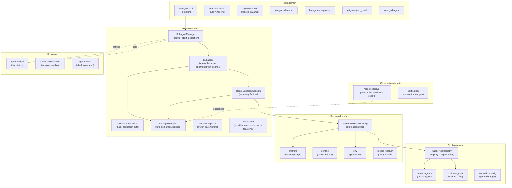
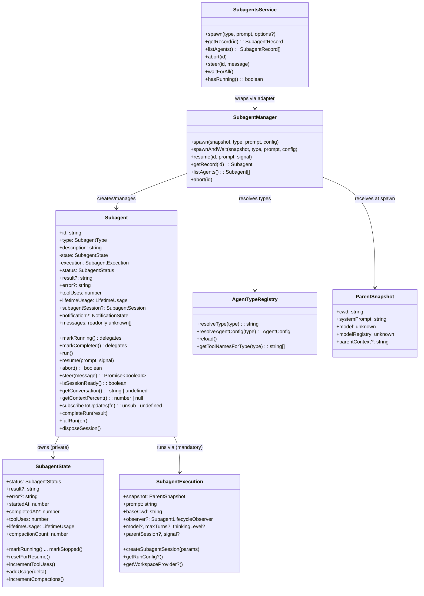
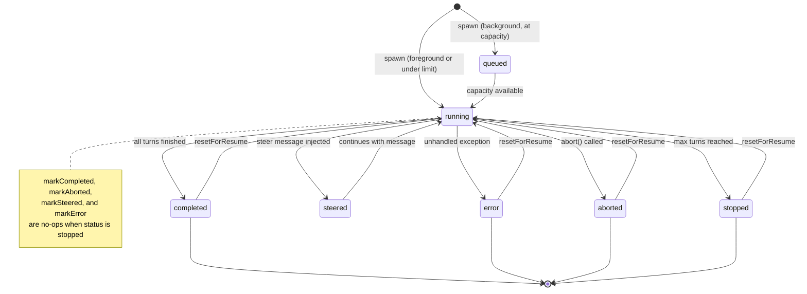
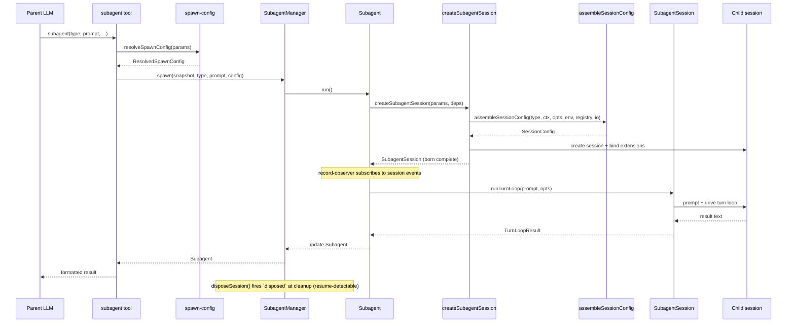
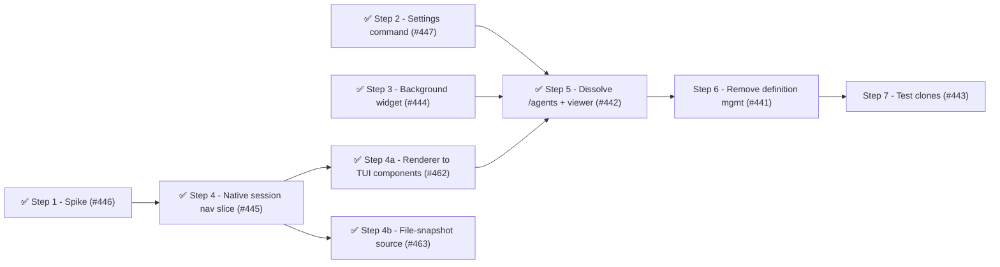

# Architecture

This document describes the architecture of the pi-subagents fork: a focused, composable core with a stable API boundary that other extensions can build on.

## Design principles

1. **Narrow core** — the extension owns agent spawning, execution, and result retrieval.
   Everything else is a consumer.
2. **Composable by default** — other extensions can spawn agents, observe their lifecycle, and display their state without importing this package directly.
3. **Typed API boundary** — this package exports a `SubagentsService` interface and `Symbol.for()` accessors (`publishSubagentsService` / `getSubagentsService`).
   Consumers declare this package as an optional peer dependency and use dynamic import for compile-time types.
   The runtime bridge is `Symbol.for("@gotgenes/pi-subagents:service")` on `globalThis` — no separate API package.
4. **No time-based scheduling** — cron-style timed dispatch (upstream's `schedule.ts` subsystem) is removed from the core (#52).
   Timed dispatch is a separate concern that any extension can implement by calling `spawn()` on the published API.
   The max-concurrent admission gate is not scheduling in this sense — concurrency management stays in core.
5. **UI is an in-core, substitutable consumer** — [ADR-0004](../decisions/0004-reconsider-ui-direction.md) records the per-component decision: the widget shrinks to background agents only, the bespoke conversation viewer is replaced by native session navigation, the `/agents` command is dissolved into focused surfaces, and the surviving UI stays in the core as a reactive consumer (not extracted to a separate package).
   Extraction remains an available future option because the composition invariant holds — the core is byte-for-byte identical with or without a given UI consumer.
6. **Snapshot, don't capture** — mutable parent state (ctx, session, model) is read once at spawn time and frozen into a `ParentSnapshot` data object.
   No live references survive past the spawn call.
7. **Subscribe, don't thread** — observation of agent progress uses direct session-event subscription, not callback parameters threaded through multiple layers.
8. **Construct complete** — objects are born with all their dependencies.
   If state isn't available yet, the object that needs it doesn't exist yet.
   No post-construction field writes from external code — if an object can't be instantiated ready-to-go, the prep work hasn't been done and the right dependencies haven't been identified.
9. **State owns its mutations** — mutable state lives in a class whose methods enforce valid transitions and invariants.
   Free functions that mutate module-scoped variables, closure-captured bags-of-functions, and external writes to shared interfaces are replaced by classes that encapsulate the state they manage.
10. **Open for extension, closed for modification** — pi-subagents is a minimal core that publishes events and a service API.
    Other packages (pi-permission-system, a future UI extension, hypothetical OTel integration) hook into these events to add permissions, rendering, or telemetry.
    Pi-subagents has zero knowledge of its consumers — dependency arrows point inward, never outward.

## Domain model

The extension is organized around six domains, each responsible for one aspect of managing agents.



### Key domain types



## Agent lifecycle



Note: `markStopped` always succeeds regardless of current status.
Other terminal transitions guard against overwriting `stopped` — once an agent is stopped, only `resetForResume` can return it to `running`.

## Execution flow



## Module organization

The extension has 62 source files organized into six domains plus entry-point wiring.
All eight domains have directories: `config/`, `session/`, `lifecycle/`, `observation/`, `service/`, `tools/`, `ui/`, and `handlers/`.
Issue #164 moved the 26 previously flat root-level files into five new domain directories, reducing the root to 5 files + 8 directories.

### Current layout

```text
src/
├── index.ts                        entry point, tool registration, event wiring
├── runtime.ts                      SubagentRuntime factory (session-scoped state)
├── types.ts                        shared type definitions
├── settings.ts                     SettingsManager (persistent operational settings)
├── debug.ts                        debug logging utility
├── layered-settings.ts             loadLayeredSettings helper (published as @gotgenes/pi-subagents/settings)
│
├── config/                         agent type definitions and resolution
│   ├── agent-types.ts              AgentTypeRegistry class
│   ├── default-agents.ts           built-in agent configs (general-purpose, Explore, Plan)
│   ├── custom-agents.ts            user-defined agent .md file loader
│   └── invocation-config.ts        per-call config merge
│
├── session/                        session assembly and preparation
│   ├── session-config.ts           pure assembler (main entry)
│   ├── prompts.ts                  system prompt building
│   ├── content-items.ts            shared message content parsing (tool-call names, assistant content)
│   ├── context.ts                  parent conversation extraction
│   ├── conversation.ts             render a session's messages as formatted text
│   ├── env.ts                      git/platform detection
│   ├── model-resolver.ts           fuzzy model name resolution
│   └── session-dir.ts              session directory derivation
│
├── lifecycle/                      agent execution and state tracking
│   ├── subagent-manager.ts         collection manager + observer wiring
│   ├── create-subagent-session.ts  assembly factory: session creation, binding, tool filtering
│   ├── subagent-session.ts         born-complete child session: turn loop, steer, dispose
│   ├── turn-limits.ts              normalizeMaxTurns (turn-count policy)
│   ├── subagent.ts                 owns full execution lifecycle (run, abort, steer)
│   ├── subagent-state.ts           lifecycle status + metrics value object (transitions, accumulators)
│   ├── run-listeners.ts            per-run observer-unsub and signal-detach handles
│   ├── workspace-bracket.ts        child workspace prepare/dispose lifecycle
│   ├── concurrency-limiter.ts       background admission gate: schedules run thunks FIFO against the limit
│   ├── parent-snapshot.ts          immutable spawn-time parent state
│   ├── child-lifecycle.ts          child-execution lifecycle event publisher
│   ├── workspace.ts                workspace provider seam (generative extension surface)
│   └── usage.ts                    token usage tracking
│
├── observation/                    progress tracking and notification
│   ├── record-observer.ts          session-event stats observer
│   ├── notification.ts             completion nudges
│   ├── notification-state.ts       per-agent notification tracking
│   ├── renderer.ts                 notification TUI component
│   ├── composite-subagent-observer.ts fans manager notifications out to multiple observers
│   └── subagent-events-observer.ts manager lifecycle observer (event emission + persistence + notification)
│
├── service/                        cross-extension API boundary
│   ├── service.ts                  SubagentsService interface + Symbol.for() accessors
│   └── service-adapter.ts          SubagentsServiceAdapter class wrapping SubagentManager
│
├── tools/                          LLM-facing tool implementations
│   ├── agent-tool.ts               subagent tool definition, validation, dispatch
│   ├── result-renderer.ts          pure per-status result rendering
│   ├── spawn-config.ts             pure config resolution
│   ├── foreground-runner.ts        foreground execution loop
│   ├── background-spawner.ts       background spawn setup
│   ├── get-result-tool.ts          get_subagent_result tool
│   ├── steer-tool.ts               steer_subagent tool
│   └── helpers.ts                  shared tool utilities
│
├── ui/                             user-facing presentation
│   ├── agent-widget.ts             above-editor live status widget
│   ├── widget-renderer.ts          pure rendering for widget
│   ├── agent-config-editor.ts      agent detail/edit view (AgentConfigEditor class) ← removing in #441
│   ├── agent-creation-wizard.ts    agent creation (AgentCreationWizard class) ← removing in #441
│   ├── menu-ui.ts                  transient: MenuUI interface (removed with wizard/editor in #441)
│   ├── agent-file-ops.ts           filesystem abstraction ← removing in #441
│   ├── agent-file-writer.ts        overwrite-guard + write + reload + notify helper ← removing in #441
│   ├── display.ts                  pure formatters and shared types
│   ├── subagents-settings.ts       /subagents:settings command handler
│   └── session-navigator.ts        /subagents:sessions command handler
│
└── handlers/                       event handlers
    ├── index.ts                    barrel re-export
    ├── interrupt.ts                turn_start handler — abort all subagents on parent interrupt (ESC)
    ├── lifecycle.ts                session_start, session_before_switch, session_shutdown
    └── tool-start.ts               tool_execution_start handler
```

### Observation model

Record statistics (tool uses, token usage, compaction counts) and live activity (active tools, response text, turn counts) are updated by `record-observer.ts`, which subscribes directly to session events.
This is the single per-child session subscription — all run state lives on the `Subagent` record.

The widget reads agent state by polling the records exposed via `SubagentManager.listAgents()` every 80 ms; that poll loop is now started by the manager's lifecycle notifications (the widget subscribes as a `SubagentManagerObserver` fanned out through `CompositeSubagentObserver`), not by inbound calls from the spawn tools.
The conversation viewer subscribes to session events via `Subagent.subscribeToUpdates()` and reads messages via `Subagent.messages` — no direct `AgentSession` reference (#277).

## Cross-extension architecture


Consumers call `getSubagentsService()?.spawn(...)` at runtime.
They declare this package as an optional peer dependency and use dynamic import for compile-time types.

### What the core owns

- The three tools: `subagent` (née `Agent`), `get_subagent_result`, `steer_subagent`.
- `SubagentManager` — spawn, abort, resume, collection management, observer wiring.
- `ConcurrencyLimiter` — background admission gate: schedules run thunks FIFO against a configurable concurrency limit.
- `createSubagentSession` — assembly factory: session creation and extension binding; returns a born-complete `SubagentSession`.
- `SubagentSession` — the born-complete child session: drives the turn loop (`runTurnLoop`/`resumeTurnLoop`), steers, and disposes (firing `disposed` at true session disposal, so resume executions are registry-detected).
- `child-lifecycle` — publishes the child-execution lifecycle (`spawning`, `session-created` before `bindExtensions()`, `completed`, `disposed`) on `pi.events`.
  Reactive consumers subscribe: `@gotgenes/pi-permission-system` registers each child session on `session-created` and unregisters it on `disposed`.
  This replaced the former outbound `permission-bridge` (#261, [ADR-0002]) — the core no longer looks up a named consumer.
- `workspace` — the single generative seam (#262, [ADR-0002]): a registered `WorkspaceProvider` supplies a child's cwd plus bracketed `dispose()` at run-start.
  With no provider, children run in the parent cwd (default unchanged); the git worktree strategy lives behind this seam in `@gotgenes/pi-subagents-worktrees` (#263, the seam's first consumer).
- `session-config` — pure configuration assembler (called by `createSubagentSession`).
- `SubagentRuntime` — session-scoped state bag with methods.
- `ParentSnapshot` — immutable snapshot of parent session state, captured once at spawn time.
- `record-observer` — session-event observer that updates record statistics without callback threading.
- Agent type registry — default agents, custom `.md` file loading.
- Prompt assembly, context extraction, skills, environment.
- Worktree isolation — evicted to `@gotgenes/pi-subagents-worktrees` via the workspace provider seam in Phase 16 (#263, [ADR-0002]); `git` no longer appears in the core.
- Token usage tracking.
- Session directory derivation and persisted `SessionManager` for subagent transcripts.
- Settings persistence.
- Internal UI (widget, conversation viewer, `/agents` menu) — these stay until the API boundary is proven, then move to a separate extension.

### What the core dropped

- **Scheduling** (`schedule.ts`, `schedule-store.ts`, `ui/schedule-menu.ts`) — removed (#52).
- **Ad-hoc RPC** (`cross-extension-rpc.ts`) — replaced by the typed `SubagentsService` published via `Symbol.for()` (#49).
- **Group join** (`group-join.ts`) — removed (#49).
- **Output file** (`output-file.ts`) — replaced by `session-dir.ts` + `SessionManager.create()` (#61).
- **Callback threading** — the three-layer `on*` callback chain was replaced by direct session-event subscriptions (#100).
- **Live `ctx` capture** — replaced by `ParentSnapshot`, an immutable data object captured once at spawn time (#99).

## SubagentsService

The `SubagentsService` interface, accessor functions, and serializable types are exported from `@gotgenes/pi-subagents` via the `./service` export map entry.
No separate API package is needed.

Consumers declare this package as an optional peer dependency:

```json
{
  "peerDependencies": {
    "@gotgenes/pi-subagents": ">=5.0.0"
  },
  "peerDependenciesMeta": {
    "@gotgenes/pi-subagents": { "optional": true }
  }
}
```

At runtime, consumers use dynamic import for type-safe access to the accessor functions:

```typescript
const { getSubagentsService } = await import("@gotgenes/pi-subagents");
const svc = getSubagentsService();
if (svc) {
  svc.spawn("Explore", "Check for stale TODOs");
}
```

Pi's extension loader creates a fresh `jiti` instance per extension with `moduleCache: false`, so module-scoped singletons don't survive across extensions.
The accessor functions use `Symbol.for("@gotgenes/pi-subagents:service")` on `globalThis`, which is process-global by spec, to bridge this gap.
The dynamic import provides compile-time types; the `Symbol.for()` key is the actual runtime channel.

### Interface

See `src/service.ts` for the canonical definition.
Key types:

- `SubagentsService` — `spawn`, `getRecord`, `listAgents`, `abort`, `steer`, `waitForAll`, `hasRunning`.
- `SubagentRecord` — serializable agent snapshot (no live session objects).
- `SpawnOptions` — `description`, `model`, `maxTurns`, `thinkingLevel`, `inheritContext`, `foreground`, `bypassQueue`.
- `SUBAGENT_EVENTS` — channel constants for `pi.events` subscriptions.

### Accessor pattern

```typescript
const SERVICE_KEY = Symbol.for("@gotgenes/pi-subagents:service");

export function publishSubagentsService(service: SubagentsService): void {
  (globalThis as Record<symbol, unknown>)[SERVICE_KEY] = service;
}

export function getSubagentsService(): SubagentsService | undefined {
  return (globalThis as Record<symbol, unknown>)[SERVICE_KEY] as
    | SubagentsService
    | undefined;
}
```

If Pi gains a native service registry ([earendil-works/pi#4207]), these accessors can be updated to delegate to `pi.registerService()` / `pi.getService()` internally while keeping the same consumer API.

### Lifecycle events

The core emits events on `pi.events` that any extension can observe:

| Channel               | Payload                                                                             | When                                          |
| --------------------- | ----------------------------------------------------------------------------------- | --------------------------------------------- |
| `subagents:started`   | `{ id, type, description }`                                                         | Agent begins running                          |
| `subagents:completed` | `{ id, type, description, status, result?, error?, toolUses, durationMs, tokens? }` | Agent finishes successfully                   |
| `subagents:failed`    | same as `completed` (`buildEventData` shape)                                        | Agent ends in `error`/`stopped`/`aborted`     |
| `subagents:compacted` | `{ id, type, description, reason, tokensBefore, compactionCount }`                  | Child session compacts                        |
| `subagents:created`   | `{ id, type, description, isBackground }`                                           | Background agent created (pre-admission)      |
| `subagents:steered`   | `{ id, message }`                                                                   | Steering message delivered to a running agent |

These are fire-and-forget broadcast events — no request IDs, no reply channels.

## Target architecture

The long-term architectural direction is to make pi-subagents a **minimal orchestrator** with inverted dependencies.
The core spawns a child session derived from the parent, runs the turn loop, tracks and streams and collects the result, gates concurrency, supports resume, and **publishes its lifecycle**.
Everything else — permissions, worktree/workspace isolation, UI, telemetry — is an extension that attaches through one of two surfaces and never reaches into the core.

The rationale and the full reasoning chain that led here are recorded in [`docs/decisions/0002-extensions-on-a-minimal-core.md`](../decisions/0002-extensions-on-a-minimal-core.md).

A separate, longer-horizon note — [`client-server-opportunities.md`](./client-server-opportunities.md) — records what Pi's eventual client-server split (Mario Zechner's session-sync unification) would unlock for pi-subagents: viewing live subagent sessions, viewing suspended ones, and operators interacting with a subagent through an editor.
That architecture is not on the near-term roadmap; the note captures the opportunity so it is on record.

### Two extension surfaces

Extensions attach through exactly two surfaces, distinguished by the direction of information flow.

1. **Lifecycle events (observational) — unlimited.**
   The core emits awaited, ordered events for the child-execution lifecycle (`spawning`, `session-created` pre-`bindExtensions`, `completed`, `disposed`).
   Any number of extensions subscribe; handlers return nothing.
   Reactive concerns live here: permission detection, telemetry, UI, notifications.
   Adding a reactive concern never modifies the core.
2. **Provider seams (generative) — rationed.**
   The rare concern that must _inject_ a value the core consumes synchronously registers a provider the core consults.
   Today there is exactly one: the **workspace provider** (returns the child's working directory plus bracketed setup/teardown).
   A provider seam is the only place the core is "open," so the list is kept as small as possible.

The discriminator when deciding how a concern attaches:

- It only needs to **know** what happened → subscribe to a lifecycle event (observational, unlimited).
- It must **return a value the core consumes** → register a provider (generative, rationed).

The governing rule — **no vacant hooks**: the architecture must _admit_ a seam without _shipping_ it until a concrete consumer exists.
A provider seam with no consumer is a speculative abstraction that taxes every reader and that `fallow` flags as dead.
Latent extensibility is the deliverable; a vacant hook is not.

The [first-principles refinement](#first-principles-refinement-and-the-deeper-target) below sharpens this two-surface split.
The awaited, behavior-affecting lifecycle events (notably `session-created` before `bindExtensions`) are _hooks_ — the child's own extension surface applied recursively, generative because the core waits on the handler before deciding what to do next.
The observational surface then carries only fire-and-forget broadcasts of immutable snapshots, which no consumer can use to change the core.

### Core responsibilities (keep)

- **Agent definitions** — name, model, thinking, system prompt, tools list.
- **Prompt composition** — system prompt assembly.
- **Session lifecycle** — create child sessions, bind extensions, run conversation loop, track results.
- **Concurrency management** — queue, abort, resume, max concurrency.
- **Recursion guard** — remove pi-subagents' own three tools from child sessions (prevent infinite nesting).
  With `isolated` removed (#264), children always load the parent's resources, so the guard is unconditional rather than gated on `cfg.extensions`.
  This is the core defending its own invariant, keyed off its own tool names — not policy.
- **Lifecycle events** — emit awaited, ordered events when child sessions spawn, are created, complete, and are disposed.
- **Workspace provider seam** — accept a registered `WorkspaceProvider` and consult it for the child's cwd; default to the parent's cwd when none is registered.
- **Service API** — publish `SubagentsService` via `Symbol.for()` for cross-extension access.

### Responsibilities to remove

- **Tool policy** (`disallowed_tools`) — access control belongs in pi-permission-system's `permission:` frontmatter.
- **Extension filtering** (`extensions: string[]` allowlist) — tool visibility is pi-permission-system's job.
- **Worktree isolation** (`worktree.ts`, `worktree-isolation.ts`, `GitWorktreeManager`, the `isolation: "worktree"` spawn mode) — environment policy, not core.
  Git worktrees are one _strategy_ for choosing the child's working directory; containers, throwaway tmpdirs, and remote sandboxes are others.
  Evicted to `@gotgenes/pi-subagents-worktrees` (#263), the first consumer of the workspace provider seam.
- **Extension lifecycle control** (`extensions: false`, `isolated`, `noSkills`) — removed in #264.
  Deny-at-use (the in-child permission layer blocking disallowed tool calls) covers what `isolated` pretended to do for tools.
  Prevent-load (refusing to bind an extension because of load-time side effects, cost, or true sandboxing) is genuinely generative and is left as a _latent_ (un-built) provider seam, added only if a real consumer needs it.

### Composition model

In the target state, pi-subagents publishes events and a provider seam; other packages hook in:

- **pi-permission-system** (observational) subscribes to child-session lifecycle events, detects subagent execution context in the child, and gates tool calls at runtime.
- **pi-subagents-worktrees** (generative) registers a `WorkspaceProvider` that prepares a git worktree at run-start and tears it down after, supplying the child's cwd.
- **pi-subagents-ui** (future, under reconsideration — see the [first-principles refinement](#first-principles-refinement-and-the-deeper-target)) subscribes to the broadcast and the query/behavior interfaces; whether the inherited widget, conversation viewer, and `/agents` menu survive is judged on our principles, not preserved by default.
- **Any future extension** (OTel, auditing, cost tracking) subscribes to the same events without pi-subagents knowing.

Composition test: install neither extension, only permissions, only workspaces, or both — the core is byte-for-byte identical in all four cases, and the two extensions never reference each other.

This is achieved across phases: Phase 14 (strip policy), Phase 16 (invert dependencies — extensions on a minimal core), and Phase 18 (reconsider UI).

### First-principles refinement and the deeper target

The two-surface model above is correct but coarse.
Pushing it against our own principles — construct complete, state owns its mutations, tell-don't-ask, dependency inversion — surfaces sharper boundaries that the current code draws through the middle of classes.
This subsection records the deeper target; the steps that realize it are sequenced in later phases.

#### `Subagent` is four conflated domains

The construction duality that motivates Phase 17 — a class that is simultaneously a passive record and an executor — is only the two most visible of four domains fused into one class.
Pulling each apart by asking "who changes this, how often, and who needs to know" surfaces:

1. **Lifecycle state** — status, result, error, timestamps.
   Owned by the subagent; transitions are rare and meaningful; the right outward shape is an immutable snapshot announced on change.
2. **Metrics** — tool uses, token usage, compaction count.
   These are not lifecycle state; they are a projection aggregated over the child session's event stream.
   `record-observer` already computes them — its only error is writing the aggregate back onto the subagent.
3. **The hook surface** — the points where an extension alters or augments the child before and around its run.
   This is the child session's own extension binding (see below), not data on the subagent.
4. **Result delivery** — whether the parent has consumed the result, when to nudge, how the result reaches the caller.
   The homeless `notification.resultConsumed` field belongs to this domain, not to execution.

The ~20 optional constructor fields and the runtime `run()` throws are the pressure these four domains exert on one class.
Separating them is what makes the Phase 17 steps fall out rather than fight back.

#### The subagent is a recursive Pi

A subagent is a child Pi session: created with `createAgentSession`, then `bindExtensions`.
Its extension surface is therefore Pi's extension surface applied recursively — not a bespoke event bus.
What the current doc calls "awaited, ordered lifecycle events" are not observations; they are **hooks**, structurally identical to Pi's own (`session_start`, `tool_execution_start`).
The tell is the awaiting: the core waits for the handler because the handler's completion changes what the core does next — an extension registers before the child binds.
A handler that can change subsequent behavior is generative, not observational, whatever we name the channel.

This splits the current "lifecycle events" surface cleanly in two:

1. **Broadcast** (observational, fire-and-forget) — "this happened; react if you want; you cannot change anything."
   Carries immutable snapshots for telemetry, notification, and any renderer.
   No consumer holds a live `Subagent`.
2. **Hooks** (generative, awaited, ordered) — the recursive Pi extension surface where workspace, permissions, and future concerns attach to the child.
   The `WorkspaceProvider` is one _typed_ hook; the general form is "be an extension of the child session."

The "no vacant hooks" rule still governs the generative side: admit the surface, ship a hook only when a real consumer exists.

#### Reactive versus discrete (not internal versus external)

The axis that decides push versus pull is whether a need is reactive or discrete — never whether the consumer is in-package or out.

- **Reactive** (ambient state that changes underneath you) → subscribe to the broadcast; be told.
  The state-owner announces; the consumer maintains its own read-model; nobody pulls.
- **Discrete** (a one-shot question: current value, full transcript) → pull a query.
  `get_subagent_result`, opening a transcript, and the external `SubagentsService.getRecord` are queries by nature and stay pull, in-package or not.

Behavior is a third interface: **tell by id, with outcomes**.
`steer` and `abort` own their own rules — a non-running agent rejects a steer from inside `steer`, not via a caller's status pre-check — so coordinators never ask-then-tell.

#### Consequences

Two consequences fall straight out, and both cut scope.

1. **The activity/metrics push tier is provisional.**
   Its only reactive consumer is the inherited widget.
   Treated from first principles, metrics are accumulated by an observer, exposed as a discrete query, and folded into the completion snapshot — so the high-frequency stream may not need to exist at all.
   We do not contort the core's event design to feed an inherited consumer.
2. **Phase 18 is "reconsider the UI," not "extract the UI."**
   The widget and `/agents` menu predate the fork; they are consumers to be judged on our principles, not requirements to preserve.
   If a UI survives, it survives as a reactive consumer of the broadcast and a caller of the query/behavior interfaces — built on our terms, possibly smaller, possibly removed.

#### Sibling packages follow the same discipline

`@gotgenes/pi-permission-system` is one of these hooks, and it is subject to the same scrutiny.
Its boundaries deserve the same first-principles treatment: surface its conflated domains, distinguish what it observes from what it injects, and prefer being told over asking.
The recursion principle means a consumer's internal design is not exempt because it lives in another package — the same axes (reactive versus discrete, hook versus broadcast, construct complete) apply across the seam.

#### How we find these boundaries

The boundaries above were not deduced top-down; they were surfaced by friction.
Each place the target got _harder_ to test marked a domain seam drawn through the middle of a class.
That method — testability friction as a boundary probe, with its limits — is recorded in the `improvement-discovery` skill so it outlives this phase.

## Current structural analysis

### Health metrics

| Metric                     | Value                                        |
| -------------------------- | -------------------------------------------- |
| Health score               | 78/100 (B)                                   |
| Total LOC                  | 7,751 (62 files, end of Phase 17)            |
| Dead code                  | 0 files, 0 exports                           |
| Maintainability index      | 90.8 (good)                                  |
| Avg cyclomatic complexity  | 1.4                                          |
| P90 cyclomatic complexity  | 2                                            |
| Production duplication     | 11 lines (1 internal clone group)            |
| Test duplication           | 28 clone groups, 503 lines (end of Phase 17) |
| Fallow refactoring targets | 0                                            |

### Dependency bag inventory

These interfaces carry hidden dependencies that obscure true coupling.
Bags with 10+ fields are the highest priority for decomposition.

| Interface                     | Fields                                                       | Consumers                                         | Severity  |
| ----------------------------- | ------------------------------------------------------------ | ------------------------------------------------- | --------- |
| `ResolvedSpawnConfig`         | 3 nested                                                     | foreground-runner, background-spawner, agent-tool | ✓ done    |
| `AgentSpawnConfig`            | 13 → 13 (ParentSessionInfo nested)                           | agent-manager (internal)                          | ✓ done    |
| `CreateSubagentSessionParams` | 6 (snapshot, type, cwd, parentSession, model, thinkingLevel) | create-subagent-session                           | ✓ done    |
| `TurnLoopOptions`             | 4 (maxTurns, defaultMaxTurns, graceTurns, signal)            | subagent-session                                  | ✓ done    |
| `SessionConfig`               | 6 (flat fields; extensions/noSkills/extras removed in #264)  | session-config (output of assembler)              | ✓ done    |
| `NotificationDetails`         | 10                                                           | notification                                      | Low (DTO) |
| `ResourceLoaderOptions`       | 10                                                           | create-subagent-session (SDK bridge)              | Low (SDK) |
| `SubagentSessionIO`           | split → `EnvironmentIO` (3) + `SessionFactoryIO` (5+1)       | create-subagent-session                           | ✓ done    |
| `CreateSessionOptions`        | 9                                                            | create-subagent-session (SDK bridge)              | Low (SDK) |
| `AgentToolDeps`               | 8                                                            | agent-tool                                        | ✓ done    |
| `AgentMenuDeps`               | 8                                                            | agent-menu                                        | ✓ done    |
| `ConversationViewerOptions`   | 8                                                            | conversation-viewer                               | Low       |
| `SubagentInit`                | 5 (id, type, description, invocation, execution, state)      | subagent (one production site)                    | ✓ done    |
| `SubagentExecution`           | 12 (4 mandatory: factory, snapshot, prompt, baseCwd)         | subagent (mandatory collaborator)                 | ✓ done    |

### Complexity hotspots

Functions with cyclomatic complexity ≥ 21 (critical threshold):

No functions remain above the critical threshold — all hotspots resolved in Phase 12. 6 functions remain at HIGH severity (CRAP ≥ 65); 13 at moderate.

### Churn hotspots

Files with highest commit frequency × complexity:

| Score | File                        | Commits | Trend          |
| ----- | --------------------------- | ------- | -------------- |
| 65.0  | `index.ts`                  | 128     | ▲ accelerating |
| 9.1   | `ui/agent-widget.ts`        | 13      | ▼ cooling      |
| 8.4   | `ui/conversation-viewer.ts` | 11      | ─ stable       |
| 6.4   | `runtime.ts`                | 12      | ─ stable       |
| 3.3   | `settings.ts`               | 4       | ─ stable       |
| 2.9   | `handlers/lifecycle.ts`     | 11      | ─ stable       |

Most files have cooled to stable after 13 phases of structural work.
`index.ts` remains the sole accelerating hotspot — expected as the wiring entry point for each refactoring phase.

### Production duplication

The prior clone group between `agent-runner.ts` and `message-formatters.ts` was resolved in #172.
The 20-line clone group between `agent-config-editor.ts` and `agent-creation-wizard.ts` was resolved in #217 — extracted into `ui/agent-file-writer.ts` (`writeAgentFile`).
One 11-line internal clone group remains within `agent-config-editor.ts` (lines 135–145 / 173–183).

### Session encapsulation debt (Law of Demeter) — resolved by [#277] ✔️

All consumer reach-throughs to the raw SDK `AgentSession` via `Subagent.session` have been eliminated.
`Subagent.session` is removed; `SubagentSession.session` is marked `@internal` (lifecycle use only).
The intent-revealing replacements added by [#277]:

| Reach-through                            | Sites                                                                              | Replacement                                        |
| ---------------------------------------- | ---------------------------------------------------------------------------------- | -------------------------------------------------- |
| Steer buffer-or-deliver (was duplicated) | `service-adapter.ts`, `steer-tool.ts`                                              | `Subagent.steer(message)`                          |
| Conversation viewing                     | `get-result-tool.ts`, `agent-menu.ts`, `conversation-viewer.ts`                    | `Subagent.getConversation()` / `Subagent.messages` |
| Session-readiness guard                  | `agent-tool.ts`, `subagent-manager.ts`                                             | `Subagent.isSessionReady()`                        |
| Context-window stats                     | `steer-tool.ts`, `get-result-tool.ts`, `notification.ts`, `conversation-viewer.ts` | `Subagent.getContextPercent()`                     |
| Live updates (subscription)              | `conversation-viewer.ts`                                                           | `Subagent.subscribeToUpdates(fn)`                  |
| Observer callback session param          | `background-spawner.ts`, `foreground-runner.ts`                                    | `subagent.subagentSession` (narrowed callback)     |
| Session disposal                         | `subagent-manager.ts`                                                              | `SubagentSession.dispose()` — resolved by [#265]   |

### Proposed bag decompositions

#### ResolvedSpawnConfig (15 fields → 3 value objects)

This bag mixes three concerns: who the agent is, how it should run, and how it should be displayed.
Each consumer uses a different subset.

```typescript
/** Who this agent is — type resolution result. */
interface SpawnIdentity {
  subagentType: string;
  rawType: SubagentType;
  fellBack: boolean;
  displayName: string;
}

/** How the agent should run — execution parameters. */
interface SpawnExecution {
  prompt: string;
  description: string;
  model: Model<any> | undefined;
  effectiveMaxTurns: number | undefined;
  thinking: ThinkingLevel | undefined;
  inheritContext: boolean;
  runInBackground: boolean;
  agentInvocation: AgentInvocation;
}

/** How the agent is presented — display metadata. */
interface SpawnPresentation {
  modelName: string | undefined;
  agentTags: string[];
  detailBase: Pick<AgentDetails, ...>;
}
```

`foreground-runner` and `background-spawner` primarily consume `SpawnExecution` + `SpawnIdentity`.
`agent-tool` uses all three to build the `AgentSpawnConfig` and the result text.
After decomposition, each consumer declares its real dependencies explicitly.

#### AgentSpawnConfig — ParentSessionInfo extracted (done, [#166][166])

The `parentSessionFile`, `parentSessionId`, and `toolCallId` fields were grouped into `ParentSessionInfo`:

```typescript
/** Parent session identity — always travel together from the tool boundary. */
export interface ParentSessionInfo {
  parentSessionFile?: string;
  parentSessionId?: string;
  toolCallId?: string;
}
```

`AgentSpawnConfig` now carries `parentSession?: ParentSessionInfo` instead of three flat optional fields.

#### RunOptions (12 fields → extract RunContext) — done ([#169][169]), updated by [#231]

`RunContext` was extracted and nested as `RunOptions.context` in #169.
Issue #231 moved the two static dependencies (`exec`, `registry`) to `RunnerDeps` on `ConcreteAgentRunner`, leaving `RunContext` with only per-call fields:

```typescript
/** Per-call execution context — fields that vary per spawn. */
export interface RunContext {
  cwd?: string;
  parentSession?: ParentSessionInfo;
}
```

The remaining `RunOptions` fields (`model`, `maxTurns`, `signal`, `thinkingLevel`, `defaultMaxTurns`, `graceTurns`, `onSessionCreated`) are genuine execution parameters.
`RunOptions` now has 9 fields: 1 nested `context: RunContext` (2 per-call fields) plus 8 flat execution fields.

#### SessionConfig (11 fields → extract ToolFilterConfig) — done ([#168][168])

The tool-filtering cluster (`toolNames`, `disallowedSet`, `extensions`) was extracted into `ToolFilterConfig` and nested as `SessionConfig.toolFilter`.
`filterActiveTools` now accepts a single `ToolFilterConfig` argument instead of three positional parameters.
`SessionConfig` reduced from 10 to 8 top-level fields.

#### RunnerIO (9 methods → 2 focused interfaces) — done ([#167][167])

The IO boundary was split into two focused interfaces:

```typescript
/** Environment discovery — detect runtime context and resolve directories. */
export interface EnvironmentIO {
  detectEnv: (exec: ShellExec, cwd: string) => Promise<EnvInfo>;
  getAgentDir: () => string;
  deriveSessionDir: (
    parentSessionFile: string | undefined,
    effectiveCwd: string,
  ) => string;
}

/** Session factory — create SDK objects for a child agent session. */
export interface SessionFactoryIO {
  createResourceLoader: (opts: ResourceLoaderOptions) => ResourceLoaderLike;
  createSessionManager: (cwd: string, sessionDir: string) => SessionManagerLike;
  createSettingsManager: (cwd: string, agentDir: string) => SettingsManager;
  createSession: (
    opts: CreateSessionOptions,
  ) => Promise<{ session: AgentSession }>;
  assemblerIO: AssemblerIO;
}

/** Backward-compatible intersection of the two focused interfaces. */
export type RunnerIO = EnvironmentIO & SessionFactoryIO;
```

`RunnerIO` is kept as a type alias for the intersection.
All existing consumers satisfy both sub-interfaces via structural typing with no call-site changes.

## Phase 11 (complete)

Phase 11 converted all closure factories to classes, eliminating adapter closure density in `index.ts`.
Four layers: SessionContext typing → runtime query methods → interface alignment → class conversions → index.ts simplification.
See [phase-11-closure-to-class.md](history/phase-11-closure-to-class.md) for details.

## Phase 12 (complete)

Phase 12 decomposed the three remaining high-complexity UI functions and extracted shared test fixtures.
All four steps are closed: [#205], [#206], [#207], [#208].

## Phase 13 (complete)

Phase 13 addressed remaining closure factories, the last fallow refactoring target, oversized methods, production duplication, SDK boundary coupling, and test clone families.
All six steps are closed: [#214], [#215], [#216], [#217], [#218], [#219].
See [phase-13-remaining-smells.md](history/phase-13-remaining-smells.md) for details.

## Phase 14 (complete)

Phase 14 removed tool and extension policy enforcement from pi-subagents, eliminating overlap with pi-permission-system.
All four steps are closed: [#237], [#238], [#239], [#242].
See [phase-14-strip-policy.md](history/phase-14-strip-policy.md) for details.

[#237]: https://github.com/gotgenes/pi-packages/issues/237
[#238]: https://github.com/gotgenes/pi-packages/issues/238
[#239]: https://github.com/gotgenes/pi-packages/issues/239
[#242]: https://github.com/gotgenes/pi-packages/issues/242

## Phase 15 (complete)

Phase 15 evolved `Agent` from a passive state machine (`AgentRecord`) into an object that owns its entire execution lifecycle.
Before Phase 15, `AgentManager` orchestrated everything: calling the runner, handling session creation, wiring observers, and cleaning up worktrees — reaching into Agent 10+ times across `spawn()` and `startAgent()`.
After Phase 15, Agent is born complete with all dependencies and configuration, owns `run()` and `resume()`, and manages its own observer and worktree lifecycle.
All six steps are closed: [#227], [#228], [#231], [#229], [#230], [#232].
See [phase-15-domain-model-evolution.md](history/phase-15-domain-model-evolution.md) for details.

## Phase 16 (complete)

Phase 16 inverted the core's outbound dependencies: worktree isolation joined permissions as an _extension_ on a minimal core, leaving pi-subagents a pure child-session orchestrator.
The core now attaches extensions through exactly two surfaces — observational lifecycle events (unlimited) and rationed generative provider seams (today only the workspace provider) — and has zero knowledge of its consumers.
The "runner" concept is gone: `createSubagentSession()` returns a born-complete `SubagentSession` that owns turn driving, steering, and disposal, and `Subagent.run()` is coordination, not assembly.
The decision and the full reasoning chain are recorded in [ADR-0002]; the two-surface extension model is described under [Target architecture](#target-architecture).
All five steps are closed: [#261], [#262], [#263], [#264], [#265].
The earlier "agent collaborator architecture" framing (#256 superseded, #257 parked, #258 and #259 closed not-planned) was abandoned; its structural win was reached cleanly via the workspace seam.
See [phase-16-invert-dependencies.md](history/phase-16-invert-dependencies.md) for details.

## Phase 17 (complete)

Phase 17 consolidated the core's remaining structural debt before the UI reconsideration (Phase 18).
The `Subagent` record/executor duality was resolved by extracting `SubagentState` (status, result, timestamps, metrics) into a private owned value object and making `SubagentExecution` a mandatory constructor collaborator — eliminating ~20 optional fields and the two "not configured for execution" runtime throws.
The concurrency queue was replaced with a thunk-based `ConcurrencyLimiter` that knows nothing about agents or IDs.
Run collaborators (`RunListeners`, `WorkspaceBracket`) were extracted from the 455-LOC `Subagent` class.
The inline `SubagentManagerObserver` literal was promoted to `SubagentEventsObserver`, making its three concerns (event emission, record persistence, notification dispatch) unit-testable in isolation.
Widget delegation and the post-construction `runtime.widget =` write were removed from `SubagentRuntime` by dissolving the notification→widget cycle via `AgentWidget.seedFinishedAgents`.
Lifecycle, UI/tools, and cross-package test fixture clones were consolidated.
`loadLayeredSettings<T>` was extracted to `src/layered-settings.ts` and published via the `@gotgenes/pi-subagents/settings` subpath export, eliminating the 23-line production clone with `pi-subagents-worktrees`.
All nine steps are closed: [#381], [#373], [#374], [#375], [#376], [#377], [#378], [#379], [#380].
[#412] unified the overlapping session-mock builders identified during Step 7.
[#415] migrated `pi-subagents-worktrees` to `loadLayeredSettings` after the Step 9 published release.
See [phase-17-core-consolidation.md](history/phase-17-core-consolidation.md) for the full findings, step outcomes, dependency diagram, and tracks.

## Phase 18 (complete)

Phase 18 disentangled the activity tier from the core and recorded a first-principles decision about the UI's direction.
Steps 1–5 (the spine) consolidated all run state onto `SubagentState`, deleted `AgentActivityTracker` and `ui-observer` (−145 LOC), and made the widget a pure reactive consumer of lifecycle events with no inbound calls from core spawn tools.
Step 6 reconciled the public event contract (breaking: removed the vacant `SUBAGENT_EVENTS.ACTIVITY` channel; added `FAILED`, `COMPACTED`, `CREATED`, `STEERED`).
Step 7 consolidated residual test clone families, dropping from 24 to 14 clone groups (below the <15 target).
Step 8 captured the per-component UI decisions in [ADR-0004]: the widget shrinks to background agents only; the bespoke `ConversationViewer` is replaced by native session navigation (a read-only transcript via `parseSessionEntries`, per the Step 1 spike — see [ADR-0004]'s addendum); the `/agents` command is dissolved (remove the create wizard and agent-types editor, extract settings to a focused command); the surviving UI stays in-core as a substitutable reactive consumer.
Source LOC decreased from 7,751 (62 files) to 7,650 (61 files); tests grew from 1,031 to 1,047.
All eight steps are closed: [#420], [#421], [#422], [#423], [#424], [#425], [#426], [#427].
See [phase-18-reconsider-ui.md](history/phase-18-reconsider-ui.md) for the full findings, step outcomes, dependency diagram, and tracks.

## Phase 19 (proposed)

Phase 19 implements the per-component UI decisions recorded in [ADR-0004]: shrink the widget to background-only, replace the bespoke conversation viewer with native session navigation, dissolve the monolithic `/agents` menu, and keep the surviving UI in-core.

The sequencing follows Kent Beck's "make the change easy, then make the easy change."
The end state deletes `agent-menu.ts` — the god-command that bundles four unrelated jobs — and everything reachable only from it.
Rather than surgically mutate that doomed module (and the #1 churn hotspot `index.ts`) once per option, Phase 19 first stands up the replacement surfaces additively, then removes the now-orphaned subtree in a single terminal cut.
This keeps every responsibility's old surface live until its replacement exists (ADR-0004's no-interim-regression invariant), turns the three replacement steps into genuinely parallel work (none touch `agent-menu.ts`), and reduces `index.ts` edits from four surgical removals to one deregistration.

Seven numbered steps in three phases, plus two follow-ups (Steps 4a–4b) carved from the #445 slice:

- **Phase A — stand up replacements (additive):** spike, settings command, background widget, native session navigation and its renderer/source follow-ups (Steps 1–4, 4a–4b).
- **Phase B — dissolve `/agents` (terminal cut):** delete the orphaned subtree in two deletion commits, one per subtree (Steps 5–6).
- **Phase C — test health:** consolidate the test clones that survive the cut (Step 7).

### Health metrics (Phase 18 → Phase 19 target)

| Metric                 | Phase 18 (current)       | Phase 19 target      |
| ---------------------- | ------------------------ | -------------------- |
| Health score           | 78/100 (B)               | 83/100 (B+)          |
| Source LOC             | 7,650 (61 files)         | ~6,780 (~55 files)   |
| Production duplication | 11 lines (1 group)       | 0 lines              |
| Test clone groups      | 16                       | ≤ 10                 |
| Top churn hotspot      | `index.ts` (103 commits) | `index.ts` (cooling) |

### ✅ Step 1 — Spike: resolve ADR-0004 entry criteria ([#446])

Smell: Category C (coupling boundary) — four open decisions block the session-navigation implementation.
Target: `docs/decisions/0004-reconsider-ui-direction.md` addendum.

The four entry criteria from ADR-0004:

1. **Root-continuity:** Does the root's in-flight turn survive `ctx.switchSession()` and a return gesture?
2. **View-only vs interactive:** `switchSession` (full interactive takeover) or `loadEntriesFromFile` (read-only transcript built from JSONL)?
3. **Parallel-agent navigation:** Operator gesture to select which of N background agents to view (from the widget, a command, or both).
4. **Settings command name:** `/subagents-settings`, `/agents-settings`, or another form consistent with sibling packages?

Produce a minimal spike (observed test or PoC against a real session) that answers each question, then record the answers as an addendum to ADR-0004.
No production source files change; the spike closes when the ADR addendum is merged.

Outcome: ADR-0004 updated with all four entry-criteria answers; Step 4 unblocked.

`Release: independent`

### ✅ Step 2 — Extract settings to a focused `/subagents-settings` command ([#447])

Smell: Category E (naming/organization) — settings are buried inside the monolithic `/agents` command per ADR-0004 Decision C. This step is purely additive: it stands up the new surface without touching `agent-menu.ts`.
Target files:

- New `src/ui/subagents-settings.ts` — `SubagentsSettingsHandler` lifted from `AgentsMenuHandler.showSettings`, carrying its own narrow `SubagentsSettingsManager` interface (the three `apply*` methods and three readonly accessors only).
- `src/index.ts` — register the new command (name confirmed by Step 1); pass `settings` directly.
- New `test/ui/subagents-settings.test.ts` — unit tests for the extracted handler.

`showSettings` depends only on `this.settings` (the self-contained `AgentMenuSettings` shape), so the extraction copies that logic into a new file with zero coupling to the wizard, editor, or viewer.
The old in-menu Settings option keeps working until the terminal cut deletes `agent-menu.ts` wholesale — there is no surgical removal of `showSettings` or `AgentMenuSettings` from the doomed file.

Outcome: new `subagents-settings.ts` (~80 LOC) and focused command registered; `agent-menu.ts` untouched.

`Release: independent`

### ✅ Step 3 — Shrink widget to background agents only ([#444])

Smell: Category C (coupling) — the widget shows all agents including foreground ones, duplicating the `subagent` tool's inline `onUpdate` stream for foreground runs.
Target files:

- `src/ui/agent-widget.ts` — funnel both `manager.listAgents()` call sites (`update()` and `renderWidget()`) through a single private accessor, then flip that accessor to background-only via `record.invocation?.runInBackground === true`.
- `src/ui/widget-renderer.ts` — verify no foreground-specific rendering path survives.
- `test/ui/agent-widget.test.ts` — add background-only filtering tests; update assertions.

The widget calls `listAgents()` at two sites today — `update()` (feeding `seedFinishedAgents`, `assembleWidgetState`, and `clearWidget`) and `renderWidget()` (the tree map).
Filtering at only one site leaves the other rendering foreground agents, so the enabling move is to route both through one accessor and apply the predicate once at the source.
`Subagent.invocation.runInBackground` is the reliable signal: set by `spawn-config.ts` → `AgentInvocation.runInBackground` → stored on `Subagent.invocation`.
ADR-0004 Decision A: foreground runs suppress the widget; the inline `onUpdate` stream is authoritative there.

Outcome: widget shows only background agents; foreground/widget duplication eliminated; the background predicate lives at a single funnel.

`Release: independent`

### ✅ Step 4 — Implement native session navigation ([#445])

Smell: Category C (coupling) — the bespoke `ConversationViewer` re-implements session-transcript rendering when Pi's own machinery targets the already-persisted child session JSONL.
This step adds the new surface alongside the existing viewer; it does not touch `agent-menu.ts`.
Target files:

- New `src/ui/session-navigator.ts` — a flat command that lists any subagent with a live record or a persisted session file (foreground included, never background-filtered), lets the operator pick one, and renders that child's transcript read-only.
- New typed accessor on `Subagent`/`SubagentSession` returning `record.messages` as `AgentMessage[]` (the boundary currently widens it to `readonly unknown[]`).
- `src/index.ts` — register the new command; the background widget ([#444]) is an optional secondary selection gesture, not a dependency.

ADR-0004 Decision B: "Tell-Don't-Ask — hand Pi the session path; Pi owns the viewer."
Mechanism (confirmed by the Step 1 spike and revised by [ADR-0004] Addendum 2): a **read-only** (non-interactive) transcript **dual-sourced by liveness**, rendered through Pi's own public entry components (no bespoke renderer).

- **Tracked agent** (still in `manager.listAgents()`) — render live from the in-memory record: `record.messages` for history, `record.subscribeToUpdates()` to re-render on streaming updates, and `record.activeTools` / `record.responseText` for the running-agent streaming indicator.
- **Evicted / untracked agent** — render from the file snapshot: `parseSessionEntries(readFileSync(record.outputFile, "utf8"))` → drop the `SessionHeader` → `buildSessionContext(...).messages`.

Both sources yield `AgentMessage[]`, so one Pi-component renderer serves both: Pi's public entry components (`AssistantMessageComponent` / `ToolExecutionComponent` / …) or `serializeConversation` (see the [ADR-0004] addendum, Findings 0 and 1).
Neither `switchSession` (a full takeover that invalidates the root's in-flight turn) nor `loadEntriesFromFile` (a test-only export the package's public barrel does not re-export, in both `0.79.1` and `0.79.8`) is used.
`Subagent.outputFile` already exposes the persisted child session JSONL path via `subagentSession?.outputFile` — no new SDK dependency.
The new surface stands up while the old `viewAgentConversation`/`ConversationViewer` path still works; the bespoke viewer is removed only by the terminal cut (Step 5).

Outcome: operator views any subagent's session through Pi's native machinery — live for a running agent, a file snapshot for an evicted one; the new surface coexists with the old viewer until Step 5.

Landed ([#445], sliced): #445 shipped the first releasable vertical slice — the `/subagent-sessions` command (`src/ui/session-navigator.ts`), the pure selection/sourcing/text-render core (`src/ui/session-navigation.ts`), and the typed `agentMessages` accessor (`SessionMessage` on `SubagentSession`/`Subagent`).
It is **live-source only** behind a renderer-agnostic `TranscriptSource` seam, rendered via Pi's `serializeConversation` text.
With the `manager.listAgents()`-only candidate set, no listed record is ever session-disposed (dispose-and-delete are atomic), so the file-snapshot branch has no reachable caller and was deferred to keep `fallow dead-code` clean.
Step 4 (#445, the slice) is complete and released (`pi-subagents` v17.3.0); the remaining work is now tracked as two follow-up steps behind the same seam: Step 4a ([#462]) upgrades the renderer from `serializeConversation` text to Pi's per-entry TUI components (gates Step 5 for rendering parity); Step 4b ([#463]) broadens the candidate set to evicted agents and adds the file-snapshot source (`parseSessionEntries` → `buildSessionContext`, independent).

`Release: independent` (spike-gated)

### ✅ Step 4a — Upgrade native-navigation renderer to Pi TUI components ([#462])

Smell: Category C (coupling) — the #445 slice renders the transcript as `serializeConversation` plain text, while the bespoke `ConversationViewer` it replaces renders richer per-message formatting.
Until the native renderer reaches parity, the terminal cut (Step 5) cannot delete the bespoke viewer without a fidelity regression.
This step swaps the renderer behind the existing `TranscriptSource` seam (`src/ui/session-navigation.ts` / `session-navigator.ts`) for Pi's per-entry components (`AssistantMessageComponent` / `ToolExecutionComponent` / …); selection and sourcing are untouched.

Gates Step 5: per [ADR-0004]'s no-interim-regression invariant, the native navigator must reach rendering parity with the bespoke viewer before Step 5 deletes it.

Outcome: native session navigation renders at parity with the removed `ConversationViewer`; Step 5 can delete the bespoke viewer with no fidelity regression.

Landed ([#462]): the renderer now mounts Pi's per-entry components (`AssistantMessageComponent` / `ToolExecutionComponent` / `BashExecutionComponent` / `UserMessageComponent` / `CompactionSummaryMessageComponent` / `BranchSummaryMessageComponent` / `SkillInvocationMessageComponent`) into a `Container`, mirroring Pi's own `renderSessionContext` mapping.
The `TranscriptOverlay` caches that `Container` and rebuilds it on source change only (Pi's `rebuildChatFromMessages` path), keeping the lightweight `◍` streaming indicator.
Tool calls render with their real `ToolDefinition`, resolved through a dependency-safe `getToolDefinition` read accessor on the record (mirroring `agentMessages`) surfaced on the `TranscriptSource` seam — no inbound call into the core.
The pure `session-navigation.ts` sheds `renderTranscriptLines`/`serializeConversation`; rendering now lives in the SDK/TUI `session-navigator.ts`, which threads `cwd` from the command context.
`custom`-role messages are skipped (the bespoke viewer never rendered them either).
Selection and sourcing are untouched; native navigation now renders at parity, unblocking Step 5 for rendering fidelity.

`Release: independent`

### ✅ Step 4b — File-snapshot source for evicted agents ([#463])

Smell: Category C (coupling) — the #445 slice sources transcripts live from `manager.listAgents()` only; an agent evicted by the 10-minute cleanup sweep has a persisted session JSONL but no live record, so it is unreachable.
This step adds the file-snapshot `TranscriptSource` branch (`parseSessionEntries(readFile(outputFile))` → drop the `SessionHeader` → `buildSessionContext(...).messages`) and broadens the candidate set to evicted agents, behind the same seam; the renderer is untouched.

Independent: this is a new capability the bespoke viewer never had, so it gates nothing and is not a Step 5 prerequisite.
Best sequenced after Step 4a (shared renderer), but carries no hard dependency.

Outcome: the operator can view a fully-evicted agent's transcript from its persisted session file; the dual-source design recorded in [ADR-0004] Addendum 2 is fully realized.

Landed ([#463]): `fileSnapshotSource(outputFile, readFile)` lands in the pure `session-navigation.ts` (`parseSessionEntries` → drop the `SessionHeader` → `buildSessionContext(...).messages`; a static no-subscribe, no-streaming source).
The candidate set is broadened via **manager-retained descriptors**, not a directory scan: the persisted child session carries no subagent `type`/`description` (those live only on the in-memory record), so a scan would yield degraded labels and parse every file per open.
Instead `SubagentManager.cleanup()` stashes a lightweight `EvictedSubagent` descriptor (label fields + `outputFile`, no messages) before disposing a record with a persisted file, exposed via `listEvicted()` and cleared by `clearCompleted()`/`dispose()`.
`NavigationEntry` became a `live | evicted` discriminated union; the handler selects `liveSource` vs `fileSnapshotSource` by kind inside a `try/catch` (an unreadable file notifies and skips), and `index.ts` injects `readFileSync`.
Evicted entries carry an `· evicted (snapshot)` label marker.
Coverage is in-session evictions (the sweep's only targets); old-session orphan files — the ones a scan would surface with degraded labels — are out of scope.

`Release: independent`

### ✅ Step 5 — Dissolve `/agents` and remove the conversation-viewer subtree ([#442])

Smell: Category A (dead subsystem) plus Category B (oversized) — once Steps 2–4 re-home all four menu responsibilities, the `/agents` command and everything reachable only from `agent-menu.ts` is an unreferenced subtree.
This is the first of two deletion commits (split by subtree).
The hub `agent-menu.ts` is deleted here, not surgically narrowed, and deleting it is what orphans the leaf subtrees — so it must precede the definition-management deletion (Step 6), because `agent-menu.ts` statically imports the wizard, editor, and file-ops, and dynamically imports the viewer.
Target files:

- `src/index.ts` — remove the `registerCommand("agents", …)` block, the `AgentsMenuHandler` construction and import, and the `FsAgentFileOps` import/construction (its only use is wiring the menu).
- Delete `src/ui/agent-menu.ts` (331 LOC) and `test/ui/agent-menu.test.ts` (185 LOC).
- Delete `src/ui/conversation-viewer.ts` (241 LOC) and `test/conversation-viewer.test.ts` (239 LOC) — its only consumer is `agent-menu.ts`'s dynamic import, gone with the hub.
- Delete `src/ui/message-formatters.ts` (195 LOC) and `test/message-formatters.test.ts` (388 LOC, the largest test function by LOC) — its only consumer is `ConversationViewer`.

Running-agent visibility is now owned by the background widget (Step 3); session navigation replaces the bespoke overlay (Step 4); settings live in `/subagents-settings` (Step 2).
Deleting the hub in one move avoids any surgical edit to the doomed file and leaves the definition-management leaves orphaned for Step 6.

Actual approach (vs. original plan): a tidy-first preparatory commit first extracted `MenuUI` from `agent-menu.ts` into a new `src/ui/menu-ui.ts` module, breaking the bidirectional type cycle — the hub imported the wizard/editor classes while the leaves imported back the `MenuUI` type.
Without the prep commit, deleting either subtree first would have left the other half referencing a deleted module.
`index.ts` also shed the now-dead `join` (node:path) and `buildParentSnapshot` imports in addition to the two module imports.
The `menu-ui.ts` module is transient and is removed with the wizard/editor in Step 6.

Outcome: ✅ `/agents` dissolved; −767 LOC source (menu hub + viewer + formatters); −812 LOC test; largest test function eliminated; `index.ts` dewired.

`Release: batch "dissolve-agents"`

### Step 6 — Remove the orphaned agent-definition management subtree ([#441])

Smell: Category A (dead subsystem) — the creation wizard and config editor are removed per ADR-0004 Decision C; after Step 5 deletes their only importer (`agent-menu.ts`), they and their file-ops helpers are pure orphans.
This is the second deletion commit (split by subtree).
Target files:

- Delete `src/ui/agent-creation-wizard.ts` (233 LOC) and `test/ui/agent-creation-wizard.test.ts` (296 LOC).
- Delete `src/ui/agent-config-editor.ts` (199 LOC) and `test/ui/agent-config-editor.test.ts` (392 LOC) — eliminates the 11-line internal production clone in `disableAgent`/`ejectAgent`, the package's only remaining production duplication.
- Delete `src/ui/agent-file-ops.ts` (59 LOC) and `test/ui/agent-file-ops.test.ts` (112 LOC) — only consumers were wizard + editor.
- Delete `src/ui/agent-file-writer.ts` (55 LOC) and `test/ui/agent-file-writer.test.ts` (148 LOC) — only consumers were wizard + editor.
- `test/helpers/ui-stubs.ts` — delete `makeFileOps`, `createTestSubagentConfig`, and `spawnAndWait` from `makeMenuManager` if no surviving consumer remains; delete the file outright once all consumers are gone.

An operator generates a new agent `.md` by asking a Pi session directly (more capable than a fixed wizard) or by writing the file in an editor; viewing and editing definitions is served by opening the `.md` files in an editor or IDE.
These files are orphaned by Step 5, so this is a pure `git rm` with no surviving references and no edit to any doomed file.

Outcome: −546 LOC source (wizard + editor + file-ops + file-writer); −948 LOC test; production duplication → 0 lines; 1 production and 1 test clone group eliminated.

`Release: batch "dissolve-agents"`

### Step 7 — Consolidate remaining test clone families ([#443])

Smell: Category D (testability) — 16 clone groups at Phase 18 end; the terminal cut (Steps 5–6) removes ~4 groups; remaining groups are extraction targets.
Run after the cut so no helper is extracted into a file the cut then deletes.
Target files:

- `test/lifecycle/subagent-manager.test.ts` — extract a shared assertion helper for 3 clone families (23 lines across groups at :92/:109, :282/:330, and :323 shared with `subagent.test.ts`).
- `test/ui/agent-widget.test.ts` — merge the duplicate `makeWidget` helper defined twice across two `describe` blocks (14-line clone at :225/:284).
- `test/session/session-config.test.ts` — extract a shared fixture for the 16-line internal clone (lines 131–146 / 151–166).
- `test/lifecycle/concurrency-limiter.test.ts` — extract shared setup for the 10-line clone (lines 21–30 / 148–155).
- `test/tools/spawn-config.test.ts` — extract a shared fixture for the 9-line clone (lines 22–30 / 35–43).

Outcome: test clone groups ≤ 10 (from 16); `subagent-manager.test.ts` uses shared factory helpers.

`Release: independent`

### Step dependency diagram



The terminal cut (Step 5) depends on all three replacements — settings (Step 2), widget (Step 3), and session navigation **at rendering parity** (Step 4a, which completes the #445 slice) — because each of the four `/agents` options must have its responsibility re-homed, and the viewer replacement at parity, before its branch can die.
Step 4b (file-snapshot source) is a new capability and gates nothing.
The old `S1 → S6 → S7` chain hid the widget dependency; this diagram makes it explicit.

### Parallel tracks

- **Track A — Replacements (Steps 1–4):** the spike gates session navigation (Step 1 → Step 4); settings (Step 2) and the background widget (Step 3) are independent of the spike and of each other.
  None of these steps edits `agent-menu.ts`, so they carry no shared-file collision on the menu — genuinely parallelizable, unlike the prior plan's Steps 2/3/5, which all collided on `agent-menu.ts` and `index.ts`.
  Steps 2 and 4 each append a command registration to `index.ts` (additive, low-conflict).
  Steps 4a (renderer parity) and 4b (file-snapshot source) complete the #445 slice behind its `TranscriptSource` seam; Step 4a gates Step 5, Step 4b is independent.
- **Track B — Dissolution (Steps 5 → 6):** the terminal cut, gated on all of Track A landing.
  Hub-first ordering is forced: Step 5 deletes `agent-menu.ts` (orphaning the leaves), then Step 6 `git rm`s the now-orphaned definition-management subtree.
- **Track C — Test health (Step 7):** clone consolidation, run after the cut so no surviving helper is extracted into a doomed file.

### Release batches

- **Batch "dissolve-agents":** Steps 5, 6 (ship together; tail = Step 6).
  Depends on Steps 2, 3, 4 already merged.
- Independently releasable: Steps 1, 2, 3, 4, 4a, 4b, 7.

## Refactoring history

Phases 1–5, 7–18 are complete.
Phase 6 (UI extraction to a separate package) was deferred to Phase 18; its intent was resolved by [ADR-0004] (Phase 18 Step 8).
Detailed records are preserved in per-phase history files:

| Phase | Title                                               | Status                 | History                                                                              |
| ----- | --------------------------------------------------- | ---------------------- | ------------------------------------------------------------------------------------ |
| 1     | Export SubagentsService API boundary                | Complete               | [phase-1-api-boundary.md](history/phase-1-api-boundary.md)                           |
| 2     | Remove scheduling subsystem                         | Complete               | [phase-2-remove-scheduling.md](history/phase-2-remove-scheduling.md)                 |
| 3     | Remove group-join, RPC; replace output-file         | Complete               | [phase-3-remove-rpc-groupjoin.md](history/phase-3-remove-rpc-groupjoin.md)           |
| 4     | Implement and publish SubagentsService              | Complete               | [phase-4-implement-service.md](history/phase-4-implement-service.md)                 |
| 5     | Decompose index.ts                                  | Complete               | [phase-5-decompose-index.md](history/phase-5-decompose-index.md)                     |
| 6     | Extract UI to separate package                      | Superseded by ADR-0004 | —                                                                                    |
| 7     | Encapsulation and dependency narrowing              | Complete               | [phase-7-encapsulation.md](history/phase-7-encapsulation.md)                         |
| 8     | Testability, display extraction, menu decomposition | Complete               | [phase-8-testability.md](history/phase-8-testability.md)                             |
| 9     | Observation consolidation, ctx elimination          | Complete               | [phase-9-observation-ctx.md](history/phase-9-observation-ctx.md)                     |
| 10    | Domain organization, bag decomposition, complexity  | Complete               | [phase-10-structural-decomposition.md](history/phase-10-structural-decomposition.md) |
| 11    | Closure factories to classes                        | Complete               | [phase-11-closure-to-class.md](history/phase-11-closure-to-class.md)                 |
| 12    | Complexity reduction and test fixture extraction    | Complete               | [phase-12-complexity-test-fixtures.md](history/phase-12-complexity-test-fixtures.md) |
| 13    | Remaining structural smells                         | Complete               | [phase-13-remaining-smells.md](history/phase-13-remaining-smells.md)                 |
| 14    | Strip policy from core                              | Complete               | [phase-14-strip-policy.md](history/phase-14-strip-policy.md)                         |
| 15    | Domain model evolution                              | Complete               | [phase-15-domain-model-evolution.md](history/phase-15-domain-model-evolution.md)     |
| 16    | Invert dependencies (extensions on a minimal core)  | Complete               | [phase-16-invert-dependencies.md](history/phase-16-invert-dependencies.md)           |
| 17    | Core consolidation                                  | Complete               | [phase-17-core-consolidation.md](history/phase-17-core-consolidation.md)             |
| 18    | Reconsider UI (first principles)                    | Complete               | [phase-18-reconsider-ui.md](history/phase-18-reconsider-ui.md)                       |

### Structural refactoring issues

| Phase                | Issue                                                      | Summary                                                                                                                                                                                        |
| -------------------- | ---------------------------------------------------------- | ---------------------------------------------------------------------------------------------------------------------------------------------------------------------------------------------- |
| Foundation           | #69, #71, #76, #80                                         | SubagentRuntime, pure assembler, cwd injection, config consolidation                                                                                                                           |
| Core decomposition   | #84, #72, #87, #70                                         | WorktreeManager, AgentManager DI, runtime methods, handler extraction                                                                                                                          |
| Interface polish     | #66, #77                                                   | SDK types, projectAgentsDir                                                                                                                                                                    |
| Features             | #61                                                        | JSONL session transcripts                                                                                                                                                                      |
| AgentManager         | #98, #99, #100, #102                                       | Record state machine, ParentSnapshot, session-event observation, test factory                                                                                                                  |
| Encapsulation        | #108, #109, #110, #111, #112, #113, #114, #115, #116, #118 | Registry, settings, activity tracker, record lifecycle, observer, spawn options, deps narrowing, tool split, type housekeeping                                                                 |
| Testability          | #131, #132, #133, #134, #135, #136                         | Shared fixtures, session-config IO, runner SDK boundary, as-any reduction, display extraction, menu decomposition                                                                              |
| Observation/ctx      | #144, #145, #146, #147, #148                               | Observation consolidation, execute decomposition, UI context, text wrapping injection, widget rendering split                                                                                  |
| Phase 10             | #164, #165, #166, #167, #168, #169, #170, #171, #172       | Domain directories, ResolvedSpawnConfig, ParentSessionInfo, RunnerIO split, ToolFilterConfig, RunContext, buildContentLines, renderResult, content-items                                       |
| Phase 11             | #192, #193, #194, #195, #196                               | SessionContext, runtime queries, interface alignment, tool classes, runner/menu classes, index.ts simplification                                                                               |
| Phase 12             | #205, #206, #207, #208                                     | renderWidgetLines, showAgentDetail, widget update, shared test fixtures                                                                                                                        |
| Phase 13             | #214, #215, #216, #217, #218, #219                         | Closure-to-class, buildParentContext, startAgent decomp, overwrite guard, settings SDK, test duplication                                                                                       |
| Phase 14             | #237, #238, #239, #242                                     | Remove disallowed_tools, remove extensions filtering, collapse filterActiveTools, rename Agent to subagent                                                                                     |
| Phase 15             | #227, #228, #231, #229, #230, #232                         | Agent domain model, async startAgent, runner self-contained, Agent.run(), ConcurrencyQueue, Agent.resume()                                                                                     |
| Phase 16             | #261, #262, #263, #264, #265                               | Lifecycle events (retire permission-bridge), WorkspaceProvider seam, extract worktrees package, remove isolated, born-complete execution / dissolve runner                                     |
| Phase 16 (abandoned) | #256 (superseded), #257 (parked), #258, #259 (not planned) | Agent collaborator architecture — replaced by the inversion approach above ([ADR-0002])                                                                                                        |
| Phase 17             | #381, #373, #374, #375, #376, #377, #378, #379, #380       | ConcurrencyLimiter, SubagentState, run-start encapsulation, run collaborators, events observer, widget decoupling, lifecycle test fixtures, UI/tools test fixtures, settings-loader extraction |
| Phase 17 (follow-on) | #412, #415                                                 | Session-mock builder unification, worktrees settings-helper migration                                                                                                                          |
| Phase 18             | #420, #421, #422, #423, #424, #425, #426, #427             | Fold metrics onto record, migrate readers, delete activity tier, widget self-drives, drop widget from tool, reconcile event contract, consolidate test clones, UI-direction ADR                |

The remaining open issue is #22 (parent-session resolution), a cross-extension track that does not gate the structural work.

## Relationship with upstream

This fork (`@gotgenes/pi-subagents` in the [gotgenes/pi-packages] monorepo) is a hard fork of [tintinweb/pi-subagents].
The decomposition diverges materially from upstream's direction.

The three upstream PRs (#71, #72, #73) remain open.
If they land, upstream gains the peer-dep fix and the two RepOne patches.
This fork continues independently regardless.

Upstream fixes and ideas are cherry-picked when they align with this fork's scope.
The upstream test suite is run periodically as a regression canary for the session assembly core.

[earendil-works/pi#4207]: https://github.com/earendil-works/pi/issues/4207
[gotgenes/pi-packages]: https://github.com/gotgenes/pi-packages
[tintinweb/pi-subagents]: https://github.com/tintinweb/pi-subagents
[166]: https://github.com/gotgenes/pi-packages/issues/166
[167]: https://github.com/gotgenes/pi-packages/issues/167
[168]: https://github.com/gotgenes/pi-packages/issues/168
[169]: https://github.com/gotgenes/pi-packages/issues/169
[#205]: https://github.com/gotgenes/pi-packages/issues/205
[#206]: https://github.com/gotgenes/pi-packages/issues/206
[#207]: https://github.com/gotgenes/pi-packages/issues/207
[#208]: https://github.com/gotgenes/pi-packages/issues/208
[#214]: https://github.com/gotgenes/pi-packages/issues/214
[#215]: https://github.com/gotgenes/pi-packages/issues/215
[#216]: https://github.com/gotgenes/pi-packages/issues/216
[#217]: https://github.com/gotgenes/pi-packages/issues/217
[#218]: https://github.com/gotgenes/pi-packages/issues/218
[#219]: https://github.com/gotgenes/pi-packages/issues/219
[#227]: https://github.com/gotgenes/pi-packages/issues/227
[#228]: https://github.com/gotgenes/pi-packages/issues/228
[#229]: https://github.com/gotgenes/pi-packages/issues/229
[#230]: https://github.com/gotgenes/pi-packages/issues/230
[#231]: https://github.com/gotgenes/pi-packages/issues/231
[#232]: https://github.com/gotgenes/pi-packages/issues/232
[#261]: https://github.com/gotgenes/pi-packages/issues/261
[#262]: https://github.com/gotgenes/pi-packages/issues/262
[#263]: https://github.com/gotgenes/pi-packages/issues/263
[#264]: https://github.com/gotgenes/pi-packages/issues/264
[#265]: https://github.com/gotgenes/pi-packages/issues/265
[#277]: https://github.com/gotgenes/pi-packages/issues/277
[#373]: https://github.com/gotgenes/pi-packages/issues/373
[#374]: https://github.com/gotgenes/pi-packages/issues/374
[#375]: https://github.com/gotgenes/pi-packages/issues/375
[#376]: https://github.com/gotgenes/pi-packages/issues/376
[#377]: https://github.com/gotgenes/pi-packages/issues/377
[#378]: https://github.com/gotgenes/pi-packages/issues/378
[#379]: https://github.com/gotgenes/pi-packages/issues/379
[#380]: https://github.com/gotgenes/pi-packages/issues/380
[#381]: https://github.com/gotgenes/pi-packages/issues/381
[#412]: https://github.com/gotgenes/pi-packages/issues/412
[#415]: https://github.com/gotgenes/pi-packages/issues/415
[#420]: https://github.com/gotgenes/pi-packages/issues/420
[#421]: https://github.com/gotgenes/pi-packages/issues/421
[#422]: https://github.com/gotgenes/pi-packages/issues/422
[#423]: https://github.com/gotgenes/pi-packages/issues/423
[#424]: https://github.com/gotgenes/pi-packages/issues/424
[#425]: https://github.com/gotgenes/pi-packages/issues/425
[#426]: https://github.com/gotgenes/pi-packages/issues/426
[#427]: https://github.com/gotgenes/pi-packages/issues/427
[#441]: https://github.com/gotgenes/pi-packages/issues/441
[#442]: https://github.com/gotgenes/pi-packages/issues/442
[#443]: https://github.com/gotgenes/pi-packages/issues/443
[#444]: https://github.com/gotgenes/pi-packages/issues/444
[#445]: https://github.com/gotgenes/pi-packages/issues/445
[#446]: https://github.com/gotgenes/pi-packages/issues/446
[#447]: https://github.com/gotgenes/pi-packages/issues/447
[#462]: https://github.com/gotgenes/pi-packages/issues/462
[#463]: https://github.com/gotgenes/pi-packages/issues/463
[ADR-0002]: ../decisions/0002-extensions-on-a-minimal-core.md
[ADR-0004]: ../decisions/0004-reconsider-ui-direction.md
