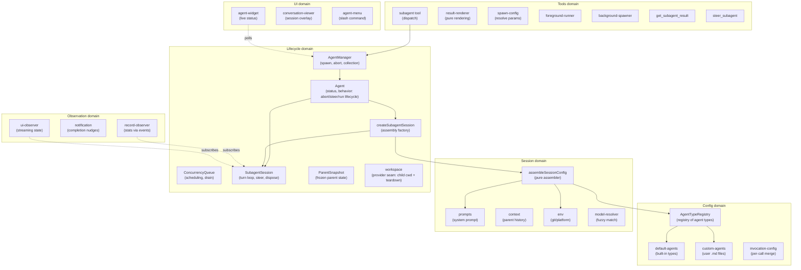
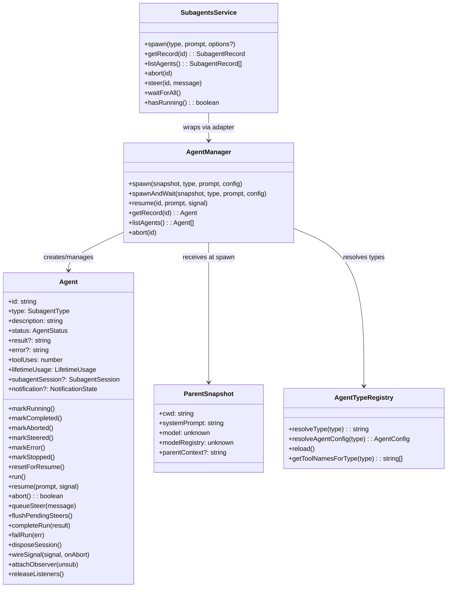
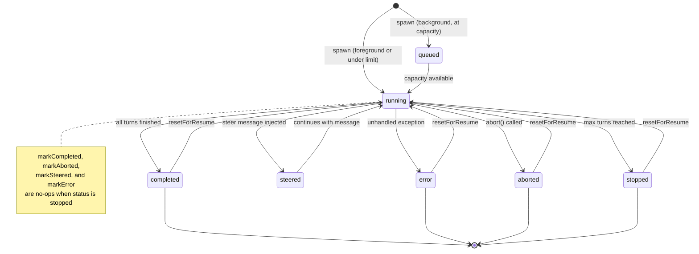
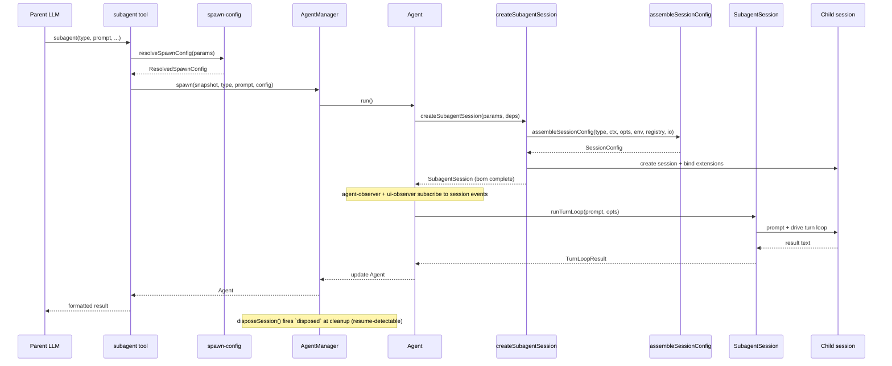
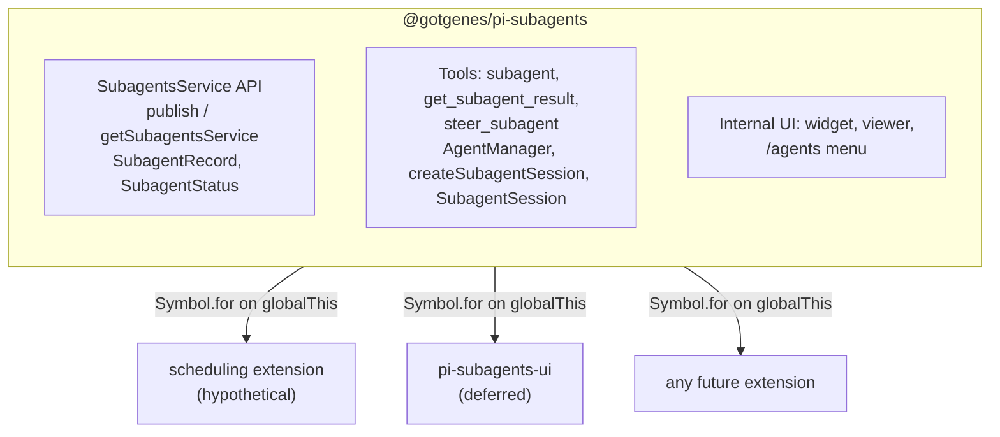
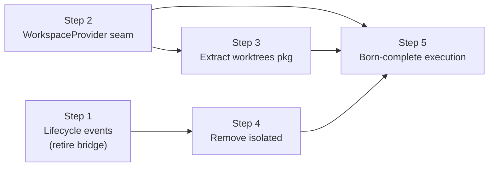

# Architecture

This document describes the architecture of the pi-subagents fork: a focused, composable core with a stable API boundary that other extensions can build on.

## Design principles

1. **Narrow core** — the extension owns agent spawning, execution, and result retrieval.
   Everything else is a consumer.
2. **Composable by default** — other extensions can spawn agents, observe their lifecycle, and display their state without importing this package directly.
3. **Typed API boundary** — this package exports a `SubagentsService` interface and `Symbol.for()` accessors (`publishSubagentsService` / `getSubagentsService`).
   Consumers declare this package as an optional peer dependency and use dynamic import for compile-time types.
   The runtime bridge is `Symbol.for("@gotgenes/pi-subagents:service")` on `globalThis` — no separate API package.
4. **No scheduling** — in-process scheduling is removed from the core.
   Scheduling is a separate concern that any extension can implement by calling `spawn()` on the published API.
5. **UI extraction is deferred** — the widget, conversation viewer, and `/agents` command menu stay in the core for now.
   They are the first candidate for extraction once the API boundary is proven stable.
6. **Snapshot, don't capture** — mutable parent state (ctx, session, model) is read once at spawn time and frozen into a `ParentSnapshot` data object.
   No live references survive past the spawn call.
7. **Subscribe, don't thread** — observation of agent progress uses direct session-event subscription, not callback parameters threaded through multiple layers.
8. **Construct complete** — objects are born with all their dependencies.
   If state isn't available yet, the object that needs it doesn't exist yet.
   No post-construction field writes from external code — if an object can't be instantiated ready-to-go, the prep work hasn't been done and the right dependencies haven't been identified.
9. **State owns its mutations** — mutable state lives in a class whose methods enforce valid transitions and invariants.
   Free functions that mutate module-scoped variables, closure-captured bags-of-functions, and external writes to shared interfaces are replaced by classes that encapsulate the state they manage.
10. **Open for extension, closed for modification** — pi-subagents is a minimal core that publishes events and a service API.
    Other packages (pi-permission-system, a future UI extension, hypothetical OTel integration) hook into these events to add permissions, rendering, or telemetry.
    Pi-subagents has zero knowledge of its consumers — dependency arrows point inward, never outward.

## Domain model

The extension is organized around six domains, each responsible for one aspect of managing agents.



### Key domain types



## Agent lifecycle



Note: `markStopped` always succeeds regardless of current status.
Other terminal transitions guard against overwriting `stopped` — once an agent is stopped, only `resetForResume` can return it to `running`.

## Execution flow



## Module organization

The extension has 56 source files organized into six domains plus entry-point wiring.
All eight domains have directories: `config/`, `session/`, `lifecycle/`, `observation/`, `service/`, `tools/`, `ui/`, and `handlers/`.
Issue #164 moved the 26 previously flat root-level files into five new domain directories, reducing the root to 5 files + 8 directories.

### Current layout

```text
src/
├── index.ts                        entry point, tool registration, event wiring
├── runtime.ts                      SubagentRuntime factory (session-scoped state)
├── types.ts                        shared type definitions
├── settings.ts                     SettingsManager (persistent operational settings)
├── debug.ts                        debug logging utility
│
├── config/                         agent type definitions and resolution
│   ├── agent-types.ts              AgentTypeRegistry class
│   ├── default-agents.ts           built-in agent configs (general-purpose, Explore, Plan)
│   ├── custom-agents.ts            user-defined agent .md file loader
│   └── invocation-config.ts        per-call config merge
│
├── session/                        session assembly and preparation
│   ├── session-config.ts           pure assembler (main entry)
│   ├── prompts.ts                  system prompt building
│   ├── content-items.ts            shared message content parsing (tool-call names, assistant content)
│   ├── context.ts                  parent conversation extraction
│   ├── conversation.ts             render a session's messages as formatted text
│   ├── env.ts                      git/platform detection
│   ├── model-resolver.ts           fuzzy model name resolution
│   └── session-dir.ts              session directory derivation
│
├── lifecycle/                      agent execution and state tracking
│   ├── agent-manager.ts            collection manager + observer wiring
│   ├── create-subagent-session.ts  assembly factory: session creation, binding, tool filtering
│   ├── subagent-session.ts         born-complete child session: turn loop, steer, dispose
│   ├── turn-limits.ts              normalizeMaxTurns (turn-count policy)
│   ├── agent.ts                    owns full execution lifecycle (run, abort, steer, workspace)
│   ├── concurrency-queue.ts        background agent scheduling with configurable concurrency limit
│   ├── parent-snapshot.ts          immutable spawn-time parent state
│   ├── child-lifecycle.ts          child-execution lifecycle event publisher
│   ├── workspace.ts                workspace provider seam (generative extension surface)
│   └── usage.ts                    token usage tracking
│
├── observation/                    progress tracking and notification
│   ├── record-observer.ts          session-event stats observer
│   ├── notification.ts             completion nudges
│   ├── notification-state.ts       per-agent notification tracking
│   └── renderer.ts                 notification TUI component
│
├── service/                        cross-extension API boundary
│   ├── service.ts                  SubagentsService interface + Symbol.for() accessors
│   └── service-adapter.ts          SubagentsServiceAdapter class wrapping AgentManager
│
├── tools/                          LLM-facing tool implementations
│   ├── agent-tool.ts               subagent tool definition, validation, dispatch
│   ├── result-renderer.ts          pure per-status result rendering
│   ├── spawn-config.ts             pure config resolution
│   ├── foreground-runner.ts        foreground execution loop
│   ├── background-spawner.ts       background spawn setup
│   ├── get-result-tool.ts          get_subagent_result tool
│   ├── steer-tool.ts               steer_subagent tool
│   └── helpers.ts                  shared tool utilities
│
├── ui/                             user-facing presentation
│   ├── agent-widget.ts             above-editor live status widget
│   ├── widget-renderer.ts          pure rendering for widget
│   ├── agent-menu.ts               /agents slash command menu
│   ├── agent-config-editor.ts      agent detail/edit view (AgentConfigEditor class)
│   ├── agent-creation-wizard.ts    agent creation (AgentCreationWizard class)
│   ├── conversation-viewer.ts      scrollable session overlay
│   ├── message-formatters.ts       pure per-message-type formatters (extracted from conversation-viewer)
│   ├── agent-activity-tracker.ts   live activity state tracker
│   ├── agent-file-ops.ts           filesystem abstraction
│   ├── agent-file-writer.ts        overwrite-guard + write + reload + notify helper
│   ├── ui-observer.ts              session-event observer for streaming
│   └── display.ts                  pure formatters and shared types
│
└── handlers/                       event handlers
    ├── index.ts                    barrel re-export
    ├── lifecycle.ts                session_start, session_before_switch, session_shutdown
    └── tool-start.ts               tool_execution_start handler
```

### Observation model

Record statistics (tool uses, token usage, compaction counts) are updated by `record-observer.ts`, which subscribes directly to session events.
UI streaming (active tools, response text, turn counts) is handled by `ui/ui-observer.ts`, which subscribes to the same session events independently.
Neither observer wraps or forwards the other — both subscribe directly to the session.

The widget reads agent state by polling a shared `Map<string, AgentActivityTracker>` on `SubagentRuntime` every 80 ms. The conversation viewer subscribes directly to `AgentSession` objects.

## Cross-extension architecture



Consumers call `getSubagentsService()?.spawn(...)` at runtime.
They declare this package as an optional peer dependency and use dynamic import for compile-time types.

### What the core owns

- The three tools: `subagent` (née `Agent`), `get_subagent_result`, `steer_subagent`.
- `AgentManager` — spawn, abort, resume, collection management, observer wiring.
- `ConcurrencyQueue` — background agent scheduling with configurable concurrency limit.
- `createSubagentSession` — assembly factory: session creation and extension binding; returns a born-complete `SubagentSession`.
- `SubagentSession` — the born-complete child session: drives the turn loop (`runTurnLoop`/`resumeTurnLoop`), steers, and disposes (firing `disposed` at true session disposal, so resume executions are registry-detected).
- `child-lifecycle` — publishes the child-execution lifecycle (`spawning`, `session-created` before `bindExtensions()`, `completed`, `disposed`) on `pi.events`.
  Reactive consumers subscribe: `@gotgenes/pi-permission-system` registers each child session on `session-created` and unregisters it on `disposed`.
  This replaced the former outbound `permission-bridge` (#261, ADR 0002) — the core no longer looks up a named consumer.
- `workspace` — the single generative seam (#262, ADR 0002): a registered `WorkspaceProvider` supplies a child's cwd plus bracketed `dispose()` at run-start.
  With no provider, children run in the parent cwd (default unchanged); the git worktree strategy lives behind this seam in `@gotgenes/pi-subagents-worktrees` (#263, the seam's first consumer).
- `session-config` — pure configuration assembler (called by `createSubagentSession`).
- `SubagentRuntime` — session-scoped state bag with methods.
- `ParentSnapshot` — immutable snapshot of parent session state, captured once at spawn time.
- `record-observer` — session-event observer that updates record statistics without callback threading.
- Agent type registry — default agents, custom `.md` file loading.
- Prompt assembly, context extraction, skills, environment.
- Worktree isolation — evicted to `@gotgenes/pi-subagents-worktrees` via the workspace provider seam in Phase 16 (#263, ADR 0002); `git` no longer appears in the core.
- Token usage tracking.
- Session directory derivation and persisted `SessionManager` for subagent transcripts.
- Settings persistence.
- Internal UI (widget, conversation viewer, `/agents` menu) — these stay until the API boundary is proven, then move to a separate extension.

### What the core dropped

- **Scheduling** (`schedule.ts`, `schedule-store.ts`, `ui/schedule-menu.ts`) — removed (#52).
- **Ad-hoc RPC** (`cross-extension-rpc.ts`) — replaced by the typed `SubagentsService` published via `Symbol.for()` (#49).
- **Group join** (`group-join.ts`) — removed (#49).
- **Output file** (`output-file.ts`) — replaced by `session-dir.ts` + `SessionManager.create()` (#61).
- **Callback threading** — the three-layer `on*` callback chain was replaced by direct session-event subscriptions (#100).
- **Live `ctx` capture** — replaced by `ParentSnapshot`, an immutable data object captured once at spawn time (#99).

## SubagentsService

The `SubagentsService` interface, accessor functions, and serializable types are exported from `@gotgenes/pi-subagents` via the `./service` export map entry.
No separate API package is needed.

Consumers declare this package as an optional peer dependency:

```json
{
  "peerDependencies": {
    "@gotgenes/pi-subagents": ">=5.0.0"
  },
  "peerDependenciesMeta": {
    "@gotgenes/pi-subagents": { "optional": true }
  }
}
```

At runtime, consumers use dynamic import for type-safe access to the accessor functions:

```typescript
const { getSubagentsService } = await import("@gotgenes/pi-subagents");
const svc = getSubagentsService();
if (svc) {
  svc.spawn("Explore", "Check for stale TODOs");
}
```

Pi's extension loader creates a fresh `jiti` instance per extension with `moduleCache: false`, so module-scoped singletons don't survive across extensions.
The accessor functions use `Symbol.for("@gotgenes/pi-subagents:service")` on `globalThis`, which is process-global by spec, to bridge this gap.
The dynamic import provides compile-time types; the `Symbol.for()` key is the actual runtime channel.

### Interface

See `src/service.ts` for the canonical definition.
Key types:

- `SubagentsService` — `spawn`, `getRecord`, `listAgents`, `abort`, `steer`, `waitForAll`, `hasRunning`.
- `SubagentRecord` — serializable agent snapshot (no live session objects).
- `SpawnOptions` — `description`, `model`, `maxTurns`, `thinkingLevel`, `inheritContext`, `foreground`, `bypassQueue`.
- `SUBAGENT_EVENTS` — channel constants for `pi.events` subscriptions.

### Accessor pattern

```typescript
const SERVICE_KEY = Symbol.for("@gotgenes/pi-subagents:service");

export function publishSubagentsService(service: SubagentsService): void {
  (globalThis as Record<symbol, unknown>)[SERVICE_KEY] = service;
}

export function getSubagentsService(): SubagentsService | undefined {
  return (globalThis as Record<symbol, unknown>)[SERVICE_KEY] as
    | SubagentsService
    | undefined;
}
```

If Pi gains a native service registry ([earendil-works/pi#4207]), these accessors can be updated to delegate to `pi.registerService()` / `pi.getService()` internally while keeping the same consumer API.

### Lifecycle events

The core emits events on `pi.events` that any extension can observe:

| Channel               | Payload                                     | When                 |
| --------------------- | ------------------------------------------- | -------------------- |
| `subagents:started`   | `{ id, type, description }`                 | Agent begins running |
| `subagents:completed` | `{ id, type, status, result?, error? }`     | Agent finishes       |
| `subagents:activity`  | `{ id, toolName?, textDelta?, turnCount? }` | Streaming progress   |

These are fire-and-forget broadcast events — no request IDs, no reply channels.

## Target architecture

The long-term architectural direction is to make pi-subagents a **minimal orchestrator** with inverted dependencies.
The core spawns a child session derived from the parent, runs the turn loop, tracks and streams and collects the result, gates concurrency, supports resume, and **publishes its lifecycle**.
Everything else — permissions, worktree/workspace isolation, UI, telemetry — is an extension that attaches through one of two surfaces and never reaches into the core.

The rationale and the full reasoning chain that led here are recorded in [`docs/decisions/0002-extensions-on-a-minimal-core.md`](../decisions/0002-extensions-on-a-minimal-core.md).

### Two extension surfaces

Extensions attach through exactly two surfaces, distinguished by the direction of information flow.

1. **Lifecycle events (observational) — unlimited.**
   The core emits awaited, ordered events for the child-execution lifecycle (`spawning`, `session-created` pre-`bindExtensions`, `completed`, `disposed`).
   Any number of extensions subscribe; handlers return nothing.
   Reactive concerns live here: permission detection, telemetry, UI, notifications.
   Adding a reactive concern never modifies the core.
2. **Provider seams (generative) — rationed.**
   The rare concern that must *inject* a value the core consumes synchronously registers a provider the core consults.
   Today there is exactly one: the **workspace provider** (returns the child's working directory plus bracketed setup/teardown).
   A provider seam is the only place the core is "open," so the list is kept as small as possible.

The discriminator when deciding how a concern attaches:

- It only needs to **know** what happened → subscribe to a lifecycle event (observational, unlimited).
- It must **return a value the core consumes** → register a provider (generative, rationed).

The governing rule — **no vacant hooks**: the architecture must *admit* a seam without *shipping* it until a concrete consumer exists.
A provider seam with no consumer is a speculative abstraction that taxes every reader and that `fallow` flags as dead.
Latent extensibility is the deliverable; a vacant hook is not.

### Core responsibilities (keep)

- **Agent definitions** — name, model, thinking, system prompt, tools list.
- **Prompt composition** — system prompt assembly.
- **Session lifecycle** — create child sessions, bind extensions, run conversation loop, track results.
- **Concurrency management** — queue, abort, resume, max concurrency.
- **Recursion guard** — remove pi-subagents' own three tools from child sessions (prevent infinite nesting).
  With `isolated` removed (#264), children always load the parent's resources, so the guard is unconditional rather than gated on `cfg.extensions`.
  This is the core defending its own invariant, keyed off its own tool names — not policy.
- **Lifecycle events** — emit awaited, ordered events when child sessions spawn, are created, complete, and are disposed.
- **Workspace provider seam** — accept a registered `WorkspaceProvider` and consult it for the child's cwd; default to the parent's cwd when none is registered.
- **Service API** — publish `SubagentsService` via `Symbol.for()` for cross-extension access.

### Responsibilities to remove

- **Tool policy** (`disallowed_tools`) — access control belongs in pi-permission-system's `permission:` frontmatter.
- **Extension filtering** (`extensions: string[]` allowlist) — tool visibility is pi-permission-system's job.
- **Worktree isolation** (`worktree.ts`, `worktree-isolation.ts`, `GitWorktreeManager`, the `isolation: "worktree"` spawn mode) — environment policy, not core.
  Git worktrees are one *strategy* for choosing the child's working directory; containers, throwaway tmpdirs, and remote sandboxes are others.
  Evicted to `@gotgenes/pi-subagents-worktrees` (#263), the first consumer of the workspace provider seam.
- **Extension lifecycle control** (`extensions: false`, `isolated`, `noSkills`) — removed in #264.
  Deny-at-use (the in-child permission layer blocking disallowed tool calls) covers what `isolated` pretended to do for tools.
  Prevent-load (refusing to bind an extension because of load-time side effects, cost, or true sandboxing) is genuinely generative and is left as a *latent* (un-built) provider seam, added only if a real consumer needs it.

### Composition model

In the target state, pi-subagents publishes events and a provider seam; other packages hook in:

- **pi-permission-system** (observational) subscribes to child-session lifecycle events, detects subagent execution context in the child, and gates tool calls at runtime.
- **pi-subagents-worktrees** (generative) registers a `WorkspaceProvider` that prepares a git worktree at run-start and tears it down after, supplying the child's cwd.
- **pi-subagents-ui** (future) subscribes to the service API, renders the widget, conversation viewer, and `/agents` menu.
- **Any future extension** (OTel, auditing, cost tracking) subscribes to the same events without pi-subagents knowing.

Composition test: install neither extension, only permissions, only workspaces, or both — the core is byte-for-byte identical in all four cases, and the two extensions never reference each other.

This is achieved across phases: Phase 14 (strip policy), Phase 16 (invert dependencies — extensions on a minimal core), and Phase 17 (extract UI).

## Current structural analysis

### Health metrics

| Metric                     | Value                             |
| -------------------------- | --------------------------------- |
| Health score               | 78/100 (B)                        |
| Total LOC                  | 7,778 (57 files)                  |
| Dead code                  | 0 files, 0 exports                |
| Maintainability index      | 90.8 (good)                       |
| Avg cyclomatic complexity  | 1.4                               |
| P90 cyclomatic complexity  | 2                                 |
| Production duplication     | 11 lines (1 internal clone group) |
| Test duplication           | 42 clone groups, 661 lines        |
| Fallow refactoring targets | 0                                 |

### Dependency bag inventory

These interfaces carry hidden dependencies that obscure true coupling.
Bags with 10+ fields are the highest priority for decomposition.

| Interface                     | Fields                                                       | Consumers                                         | Severity  |
| ----------------------------- | ------------------------------------------------------------ | ------------------------------------------------- | --------- |
| `ResolvedSpawnConfig`         | 3 nested                                                     | foreground-runner, background-spawner, agent-tool | ✓ done    |
| `AgentSpawnConfig`            | 13 → 13 (ParentSessionInfo nested)                           | agent-manager (internal)                          | ✓ done    |
| `CreateSubagentSessionParams` | 6 (snapshot, type, cwd, parentSession, model, thinkingLevel) | create-subagent-session                           | ✓ done    |
| `TurnLoopOptions`             | 4 (maxTurns, defaultMaxTurns, graceTurns, signal)            | subagent-session                                  | ✓ done    |
| `SessionConfig`               | 6 (flat fields; extensions/noSkills/extras removed in #264)  | session-config (output of assembler)              | ✓ done    |
| `NotificationDetails`         | 10                                                           | notification                                      | Low (DTO) |
| `ResourceLoaderOptions`       | 10                                                           | create-subagent-session (SDK bridge)              | Low (SDK) |
| `SubagentSessionIO`           | split → `EnvironmentIO` (3) + `SessionFactoryIO` (5+1)       | create-subagent-session                           | ✓ done    |
| `CreateSessionOptions`        | 9                                                            | create-subagent-session (SDK bridge)              | Low (SDK) |
| `AgentToolDeps`               | 8                                                            | agent-tool                                        | ✓ done    |
| `AgentMenuDeps`               | 8                                                            | agent-menu                                        | ✓ done    |
| `ConversationViewerOptions`   | 8                                                            | conversation-viewer                               | Low       |
| `AgentInit`                   | 8                                                            | agent                                             | Low       |

### Complexity hotspots

Functions with cyclomatic complexity ≥ 21 (critical threshold):

No functions remain above the critical threshold — all hotspots resolved in Phase 12. 6 functions remain at HIGH severity (CRAP ≥ 65); 13 at moderate.

### Churn hotspots

Files with highest commit frequency × complexity:

| Score | File                        | Commits | Trend          |
| ----- | --------------------------- | ------- | -------------- |
| 65.0  | `index.ts`                  | 128     | ▲ accelerating |
| 9.1   | `ui/agent-widget.ts`        | 13      | ▼ cooling      |
| 8.4   | `ui/conversation-viewer.ts` | 11      | ─ stable       |
| 6.4   | `runtime.ts`                | 12      | ─ stable       |
| 3.3   | `settings.ts`               | 4       | ─ stable       |
| 2.9   | `handlers/lifecycle.ts`     | 11      | ─ stable       |

Most files have cooled to stable after 13 phases of structural work.
`index.ts` remains the sole accelerating hotspot — expected as the wiring entry point for each refactoring phase.

### Production duplication

The prior clone group between `agent-runner.ts` and `message-formatters.ts` was resolved in #172.
The 20-line clone group between `agent-config-editor.ts` and `agent-creation-wizard.ts` was resolved in #217 — extracted into `ui/agent-file-writer.ts` (`writeAgentFile`).
One 11-line internal clone group remains within `agent-config-editor.ts` (lines 135–145 / 173–183).

### Session encapsulation debt (Law of Demeter) — [#277]

Discovered while planning [#265].
Consumers reach the raw SDK `AgentSession` through the `Agent.session` getter (`this.subagentSession?.session`) and operate on it directly, instead of telling the owning agent what they want.
These are Law of Demeter / Tell-Don't-Ask reach-throughs; the fix is intent-revealing methods on the owning object (`Subagent` / `SubagentSession`, introduced by [#265]).

| Reach-through                         | Sites                                               | Missing method                                   |
| ------------------------------------- | --------------------------------------------------- | ------------------------------------------------ |
| Steer (buffer-or-deliver, duplicated) | `service-adapter.ts` (~L93), `steer-tool.ts` (~L43) | `Subagent.steer(message)`                        |
| Conversation viewing                  | `get-result-tool.ts:84`, `agent-menu.ts:255`        | `Subagent.getConversation()`                     |
| Session-readiness guard               | `agent-tool.ts:111`, `agent-manager.ts:203`         | `Subagent.isSessionReady()`                      |
| Session disposal                      | `agent-manager.ts:235,309`                          | `SubagentSession.dispose()` — resolved by [#265] |

[#265] introduces `SubagentSession` and routes the run / resume / dispose path (and steering during a run) through it; the consumer-facing reach-throughs above are deferred to [#277].
The steer buffer-or-deliver decision is duplicated across two call sites — two callers performing the same reach-through plus the same decision is the signal for the missing method.

### Proposed bag decompositions

#### ResolvedSpawnConfig (15 fields → 3 value objects)

This bag mixes three concerns: who the agent is, how it should run, and how it should be displayed.
Each consumer uses a different subset.

```typescript
/** Who this agent is — type resolution result. */
interface SpawnIdentity {
  subagentType: string;
  rawType: SubagentType;
  fellBack: boolean;
  displayName: string;
}

/** How the agent should run — execution parameters. */
interface SpawnExecution {
  prompt: string;
  description: string;
  model: Model<any> | undefined;
  effectiveMaxTurns: number | undefined;
  thinking: ThinkingLevel | undefined;
  inheritContext: boolean;
  runInBackground: boolean;
  agentInvocation: AgentInvocation;
}

/** How the agent is presented — display metadata. */
interface SpawnPresentation {
  modelName: string | undefined;
  agentTags: string[];
  detailBase: Pick<AgentDetails, ...>;
}
```

`foreground-runner` and `background-spawner` primarily consume `SpawnExecution` + `SpawnIdentity`.
`agent-tool` uses all three to build the `AgentSpawnConfig` and the result text.
After decomposition, each consumer declares its real dependencies explicitly.

#### AgentSpawnConfig — ParentSessionInfo extracted (done, [#166][166])

The `parentSessionFile`, `parentSessionId`, and `toolCallId` fields were grouped into `ParentSessionInfo`:

```typescript
/** Parent session identity — always travel together from the tool boundary. */
export interface ParentSessionInfo {
  parentSessionFile?: string;
  parentSessionId?: string;
  toolCallId?: string;
}
```

`AgentSpawnConfig` now carries `parentSession?: ParentSessionInfo` instead of three flat optional fields.

#### RunOptions (12 fields → extract RunContext) — done ([#169][169]), updated by [#231]

`RunContext` was extracted and nested as `RunOptions.context` in #169.
Issue #231 moved the two static dependencies (`exec`, `registry`) to `RunnerDeps` on `ConcreteAgentRunner`, leaving `RunContext` with only per-call fields:

```typescript
/** Per-call execution context — fields that vary per spawn. */
export interface RunContext {
  cwd?: string;
  parentSession?: ParentSessionInfo;
}
```

The remaining `RunOptions` fields (`model`, `maxTurns`, `signal`, `thinkingLevel`, `defaultMaxTurns`, `graceTurns`, `onSessionCreated`) are genuine execution parameters.
`RunOptions` now has 9 fields: 1 nested `context: RunContext` (2 per-call fields) plus 8 flat execution fields.

#### SessionConfig (11 fields → extract ToolFilterConfig) — done ([#168][168])

The tool-filtering cluster (`toolNames`, `disallowedSet`, `extensions`) was extracted into `ToolFilterConfig` and nested as `SessionConfig.toolFilter`.
`filterActiveTools` now accepts a single `ToolFilterConfig` argument instead of three positional parameters.
`SessionConfig` reduced from 10 to 8 top-level fields.

#### RunnerIO (9 methods → 2 focused interfaces) — done ([#167][167])

The IO boundary was split into two focused interfaces:

```typescript
/** Environment discovery — detect runtime context and resolve directories. */
export interface EnvironmentIO {
  detectEnv: (exec: ShellExec, cwd: string) => Promise<EnvInfo>;
  getAgentDir: () => string;
  deriveSessionDir: (
    parentSessionFile: string | undefined,
    effectiveCwd: string,
  ) => string;
}

/** Session factory — create SDK objects for a child agent session. */
export interface SessionFactoryIO {
  createResourceLoader: (opts: ResourceLoaderOptions) => ResourceLoaderLike;
  createSessionManager: (cwd: string, sessionDir: string) => SessionManagerLike;
  createSettingsManager: (cwd: string, agentDir: string) => SettingsManager;
  createSession: (
    opts: CreateSessionOptions,
  ) => Promise<{ session: AgentSession }>;
  assemblerIO: AssemblerIO;
}

/** Backward-compatible intersection of the two focused interfaces. */
export type RunnerIO = EnvironmentIO & SessionFactoryIO;
```

`RunnerIO` is kept as a type alias for the intersection.
All existing consumers satisfy both sub-interfaces via structural typing with no call-site changes.

## Phase 11 (complete)

Phase 11 converted all closure factories to classes, eliminating adapter closure density in `index.ts`.
Four layers: SessionContext typing → runtime query methods → interface alignment → class conversions → index.ts simplification.
See [phase-11-closure-to-class.md](history/phase-11-closure-to-class.md) for details.

## Phase 12 (complete)

Phase 12 decomposed the three remaining high-complexity UI functions and extracted shared test fixtures.
All four steps are closed: [#205], [#206], [#207], [#208].

## Phase 13 (complete)

Phase 13 addressed remaining closure factories, the last fallow refactoring target, oversized methods, production duplication, SDK boundary coupling, and test clone families.
All six steps are closed: [#214], [#215], [#216], [#217], [#218], [#219].
See [phase-13-remaining-smells.md](history/phase-13-remaining-smells.md) for details.

## Phase 14 (complete)

Phase 14 removed tool and extension policy enforcement from pi-subagents, eliminating overlap with pi-permission-system.
All four steps are closed: [#237], [#238], [#239], [#242].
See [phase-14-strip-policy.md](history/phase-14-strip-policy.md) for details.

[#237]: https://github.com/gotgenes/pi-packages/issues/237
[#238]: https://github.com/gotgenes/pi-packages/issues/238
[#239]: https://github.com/gotgenes/pi-packages/issues/239
[#242]: https://github.com/gotgenes/pi-packages/issues/242

## Phase 15 (complete)

Phase 15 evolved `Agent` from a passive state machine (`AgentRecord`) into an object that owns its entire execution lifecycle.
Before Phase 15, `AgentManager` orchestrated everything: calling the runner, handling session creation, wiring observers, and cleaning up worktrees — reaching into Agent 10+ times across `spawn()` and `startAgent()`.
After Phase 15, Agent is born complete with all dependencies and configuration, owns `run()` and `resume()`, and manages its own observer and worktree lifecycle.
All six steps are closed: [#227], [#228], [#231], [#229], [#230], [#232].
See [phase-15-domain-model-evolution.md](history/phase-15-domain-model-evolution.md) for details.

## Improvement roadmap (Phase 16 — invert dependencies: extensions on a minimal core)

Phase 16 reclaims its original intent — invert the core's outbound dependencies — and extends it: worktree isolation joins permissions as an *extension* on a minimal core, leaving pi-subagents a pure child-session orchestrator.
The decision and the full reasoning chain are recorded in [ADR 0002](../decisions/0002-extensions-on-a-minimal-core.md); the two-surface extension model is described under [Target architecture](#target-architecture).

### Abandoned exploration: agent collaborator architecture

An earlier Phase 16 plan ("agent collaborator architecture") proposed giving `Agent` three collaborators — a session factory, a `WorktreeIsolation`, and a lifecycle observer — and dissolving the runner.
That framing was abandoned.
Pulling on a single late-bound `create(cwd?)` parameter on the planned `ChildSessionFactory` exposed deeper problems:

- `WorktreeIsolation.setup()` is a two-phase `construct-then-setup()` that violates "Construct complete" (principle 8) — the worktree is only *ready* at dequeue.
- The worktree and the child session share one lifespan, so they are one run-scoped resource, not sibling collaborators that `Agent` must sequence; the `cwd` parameter only existed because the worktree was split out and `Agent` relayed its output back in.
- Worktrees are not intrinsic to subagents — they are one *workspace strategy* and belong outside the core, exactly as Phase 14 evicted tool/extension policy.

Issue #256 (`WorktreeIsolation` as a collaborator) shipped under the abandoned plan and is now superseded by #263; issue #257 (`ChildSessionFactory` extraction) was parked.
The structural win the collaborator plan chased — a born-complete child execution and the dissolution of the runner — is recovered by a cleaner route once the workspace seam exists (Step 5).

### Steps

#### Step 1: Child-execution lifecycle events; retire permission-bridge — [#261] ✅ Delivered

Emit ordered child-execution events (`spawning`, `session-created` before `bindExtensions()`, `completed`, `disposed`) carrying child identity (session directory, agent name, parent session id).
Migrate `@gotgenes/pi-permission-system` to subscribe to `session-created`/`disposed` for registration instead of being looked up by the core; delete `permission-bridge.ts`.

- Cross-package: pi-subagents (emit + remove bridge) and pi-permission-system (subscribe).
- Investigation (resolved): `pi.events` is a Node `EventEmitter`, so `emit()` dispatches listeners synchronously on the same call stack — a synchronous subscriber completes before `emit()` returns.
  Emitting `session-created` immediately before `bindExtensions()` therefore guarantees the registry entry lands pre-bind, with no new SDK hook.
  The synchronous-handler constraint is encoded as a real-bus test in pi-permission-system.
- Outcome: the core stops reaching out to a named consumer; permission detection rides events.
- Deferred: removing the now-caller-less `registerSubagentSession`/`unregisterSubagentSession` from `PermissionsService` → #267; registry-detected resume ("executing now" → "exists" semantics) → #265.

#### Step 2: Define the `WorkspaceProvider` seam — [#262] ✅ Delivered

Added the `WorkspaceProvider` / `Workspace` interfaces (`src/lifecycle/workspace.ts`) and `SubagentsService.registerWorkspaceProvider` (single provider, throws on duplicate, returns an unregister disposer).
All five workspace types are named-re-exported from `service.ts`: `WorkspaceProvider`, `Workspace`, `WorkspacePrepareContext`, `WorkspaceDisposeOutcome`, and `WorkspaceDisposeResult` (added in #272).
At run-start `Agent.run()` consults the registered provider for the child's cwd and a disposal handle; with no provider the child runs in the parent's cwd (the legacy worktree-collaborator fallback was removed when worktrees left the core in #263).
On completion the core calls `Workspace.dispose({ status, description })` and appends the returned `resultAddendum` verbatim — the provider owns the wording.

- The seam is additive and non-breaking: the existing `isolation: "worktree"` path is untouched (its eviction is Step 3).
- Land alongside its first consumer (Step 3) to avoid a vacant hook — the "no vacant hooks" rule.
  Within #262 the seam is exercised only by test fakes; do not cut a release containing the seam without `@gotgenes/pi-subagents-worktrees`.
- Outcome: a single generative seam; the core no longer knows what an "isolation strategy" is.

#### Step 3: Extract worktrees to `@gotgenes/pi-subagents-worktrees` — [#263] ✅ Delivered

New package implementing `WorkspaceProvider`: prepares a git worktree at run-start (born complete), tears it down after (saving the branch), and owns the "changes saved to branch" result.
Worktree isolation is opt-in per agent type via the package's own `worktreeAgents` config; creation failure for an opted-in agent throws (strict, no silent fallback).
Removed `worktree.ts`, `worktree-isolation.ts`, `GitWorktreeManager`, and the `isolation: "worktree"` mode from the core; dropped `isolation` from the spawn API and `SubagentsService`, and `worktreeResult` from `SubagentRecord`.

- Supersedes #256.
  New package registered in `release-please-config.json` and `.pi/settings.json` (after pi-subagents); consumes the published `@gotgenes/pi-subagents` from the registry (`linkWorkspacePackages: false`), since `exports.types` resolves to the shipped declaration bundle.
  From the release carrying #272, all five workspace types are importable by name: `WorkspaceProvider`, `Workspace`, `WorkspacePrepareContext`, `WorkspaceDisposeOutcome`, and `WorkspaceDisposeResult`.
- Outcome: git leaves the core; worktree users install one package, everyone else pays nothing.

#### Step 4: Remove `isolated` / `extensions: false` / `noSkills` — [#264] ✅ Delivered

Children always load the parent's extensions and skills; the recursion guard is now unconditional.
Deny-at-use (the in-child permission layer) covers tool restriction; prevent-load is left as a latent provider seam (not shipped).
The `skills` curation axis collapsed symmetrically with `extensions`: `AgentConfig.skills`, the skill-preload path (`skill-loader.ts`, `safe-fs.ts`, `preloadSkills`, `PromptExtras`), `SessionConfig.{extensions,noSkills,extras}`, and the `isolated:` / `extensions:` / `skills:` custom-agent frontmatter keys are all gone.

- Depended on: Step 1 (deny-at-use over events).
- Outcome: the `isolated`/`extensions`/`noSkills`/`skills` axis is gone; the guard is unconditional.

#### Step 5: Born-complete child execution; dissolve the runner — [#265] ✅ Delivered

`createSubagentSession()` is an assembly factory that returns a born-complete `SubagentSession` (session created, extensions bound, recursion guard applied).
`SubagentSession` owns turn driving (`runTurnLoop`/`resumeTurnLoop`), steering, and disposal.
`Agent.run()` is coordination, not assembly; `runAgent` / `resumeAgent` / `ConcreteAgentRunner` / `AgentRunner` / `RunOptions` / `RunResult` / `ExecutionState` dissolved.
`getAgentConversation()` relocated to `session/conversation.ts`; `normalizeMaxTurns()` to `lifecycle/turn-limits.ts`.
`disposed` now fires at true session disposal (cleanup), so resume executions are registry-detected (closing the gap deferred from #261).

- Depends on: Steps 2–4.
- Outcome: the "runner" concept is gone; `Agent.run()` is coordination, not assembly — the structural goal of the abandoned collaborator plan, reached cleanly.

### Step dependency diagram



### Tracks

1. **Track A — Inversion seams** (Steps 1, 2): lifecycle events and the workspace seam.
   Independent of each other — can proceed in parallel.
2. **Track B — Eviction** (Steps 3, 4): worktrees and `isolated` leave the core.
   Step 3 depends on Step 2.
3. **Track C — Consolidation** (Step 5): dissolve the runner around the new seam.
   Depends on Tracks A and B.

## Improvement roadmap (Phase 17 — extract UI)

Phase 17 is the long-deferred UI extraction (originally Phase 6).
The widget, conversation viewer, and `/agents` command menu move to a separate `pi-subagents-ui` extension that consumes the `SubagentsService` API.
By this point the core is minimal and stable — the API boundary has been proven across Phases 14–16.

## Refactoring history

Phases 1–5, 7–14 are complete.
Phase 6 (UI extraction to a separate package) is deferred.
Detailed records are preserved in per-phase history files:

| Phase | Title                                               | Status              | History                                                                              |
| ----- | --------------------------------------------------- | ------------------- | ------------------------------------------------------------------------------------ |
| 1     | Export SubagentsService API boundary                | Complete            | [phase-1-api-boundary.md](history/phase-1-api-boundary.md)                           |
| 2     | Remove scheduling subsystem                         | Complete            | [phase-2-remove-scheduling.md](history/phase-2-remove-scheduling.md)                 |
| 3     | Remove group-join, RPC; replace output-file         | Complete            | [phase-3-remove-rpc-groupjoin.md](history/phase-3-remove-rpc-groupjoin.md)           |
| 4     | Implement and publish SubagentsService              | Complete            | [phase-4-implement-service.md](history/phase-4-implement-service.md)                 |
| 5     | Decompose index.ts                                  | Complete            | [phase-5-decompose-index.md](history/phase-5-decompose-index.md)                     |
| 6     | Extract UI to separate package                      | Deferred → Phase 17 | —                                                                                    |
| 7     | Encapsulation and dependency narrowing              | Complete            | [phase-7-encapsulation.md](history/phase-7-encapsulation.md)                         |
| 8     | Testability, display extraction, menu decomposition | Complete            | [phase-8-testability.md](history/phase-8-testability.md)                             |
| 9     | Observation consolidation, ctx elimination          | Complete            | [phase-9-observation-ctx.md](history/phase-9-observation-ctx.md)                     |
| 10    | Domain organization, bag decomposition, complexity  | Complete            | [phase-10-structural-decomposition.md](history/phase-10-structural-decomposition.md) |
| 11    | Closure factories to classes                        | Complete            | [phase-11-closure-to-class.md](history/phase-11-closure-to-class.md)                 |
| 12    | Complexity reduction and test fixture extraction    | Complete            | [phase-12-complexity-test-fixtures.md](history/phase-12-complexity-test-fixtures.md) |
| 13    | Remaining structural smells                         | Complete            | [phase-13-remaining-smells.md](history/phase-13-remaining-smells.md)                 |
| 14    | Strip policy from core                              | Complete            | [phase-14-strip-policy.md](history/phase-14-strip-policy.md)                         |
| 15    | Domain model evolution                              | Complete            | [phase-15-domain-model-evolution.md](history/phase-15-domain-model-evolution.md)     |
| 16    | Invert dependencies (extensions on a minimal core)  | Planned             | [ADR 0002](../decisions/0002-extensions-on-a-minimal-core.md)                        |
| 17    | Extract UI to separate package                      | Planned             | —                                                                                    |

### Structural refactoring issues

| Phase                | Issue                                                      | Summary                                                                                                                                                    |
| -------------------- | ---------------------------------------------------------- | ---------------------------------------------------------------------------------------------------------------------------------------------------------- |
| Foundation           | #69, #71, #76, #80                                         | SubagentRuntime, pure assembler, cwd injection, config consolidation                                                                                       |
| Core decomposition   | #84, #72, #87, #70                                         | WorktreeManager, AgentManager DI, runtime methods, handler extraction                                                                                      |
| Interface polish     | #66, #77                                                   | SDK types, projectAgentsDir                                                                                                                                |
| Features             | #61                                                        | JSONL session transcripts                                                                                                                                  |
| AgentManager         | #98, #99, #100, #102                                       | Record state machine, ParentSnapshot, session-event observation, test factory                                                                              |
| Encapsulation        | #108, #109, #110, #111, #112, #113, #114, #115, #116, #118 | Registry, settings, activity tracker, record lifecycle, observer, spawn options, deps narrowing, tool split, type housekeeping                             |
| Testability          | #131, #132, #133, #134, #135, #136                         | Shared fixtures, session-config IO, runner SDK boundary, as-any reduction, display extraction, menu decomposition                                          |
| Observation/ctx      | #144, #145, #146, #147, #148                               | Observation consolidation, execute decomposition, UI context, text wrapping injection, widget rendering split                                              |
| Phase 10             | #164, #165, #166, #167, #168, #169, #170, #171, #172       | Domain directories, ResolvedSpawnConfig, ParentSessionInfo, RunnerIO split, ToolFilterConfig, RunContext, buildContentLines, renderResult, content-items   |
| Phase 11             | #192, #193, #194, #195, #196                               | SessionContext, runtime queries, interface alignment, tool classes, runner/menu classes, index.ts simplification                                           |
| Phase 12             | #205, #206, #207, #208                                     | renderWidgetLines, showAgentDetail, widget update, shared test fixtures                                                                                    |
| Phase 13             | #214, #215, #216, #217, #218, #219                         | Closure-to-class, buildParentContext, startAgent decomp, overwrite guard, settings SDK, test duplication                                                   |
| Phase 14             | #237, #238, #239, #242                                     | Remove disallowed_tools, remove extensions filtering, collapse filterActiveTools, rename Agent to subagent                                                 |
| Phase 15             | #227, #228, #231, #229, #230, #232                         | Agent domain model, async startAgent, runner self-contained, Agent.run(), ConcurrencyQueue, Agent.resume()                                                 |
| Phase 16             | #261, #262, #263, #264, #265                               | Lifecycle events (retire permission-bridge), WorkspaceProvider seam, extract worktrees package, remove isolated, born-complete execution / dissolve runner |
| Phase 16 (abandoned) | #256 (superseded), #257 (parked)                           | Agent collaborator architecture — replaced by the inversion approach above (ADR 0002)                                                                      |

The remaining open issue is #22 (parent-session resolution), a cross-extension track that does not gate the structural work.

## Relationship with upstream

This fork (`@gotgenes/pi-subagents` in the [gotgenes/pi-packages] monorepo) is a hard fork of [tintinweb/pi-subagents].
The decomposition diverges materially from upstream's direction.

The three upstream PRs (#71, #72, #73) remain open.
If they land, upstream gains the peer-dep fix and the two RepOne patches.
This fork continues independently regardless.

Upstream fixes and ideas are cherry-picked when they align with this fork's scope.
The upstream test suite is run periodically as a regression canary for the session assembly core.

[earendil-works/pi#4207]: https://github.com/earendil-works/pi/issues/4207
[gotgenes/pi-packages]: https://github.com/gotgenes/pi-packages
[tintinweb/pi-subagents]: https://github.com/tintinweb/pi-subagents
[166]: https://github.com/gotgenes/pi-packages/issues/166
[167]: https://github.com/gotgenes/pi-packages/issues/167
[168]: https://github.com/gotgenes/pi-packages/issues/168
[169]: https://github.com/gotgenes/pi-packages/issues/169
[#205]: https://github.com/gotgenes/pi-packages/issues/205
[#206]: https://github.com/gotgenes/pi-packages/issues/206
[#207]: https://github.com/gotgenes/pi-packages/issues/207
[#208]: https://github.com/gotgenes/pi-packages/issues/208
[#214]: https://github.com/gotgenes/pi-packages/issues/214
[#215]: https://github.com/gotgenes/pi-packages/issues/215
[#216]: https://github.com/gotgenes/pi-packages/issues/216
[#217]: https://github.com/gotgenes/pi-packages/issues/217
[#218]: https://github.com/gotgenes/pi-packages/issues/218
[#219]: https://github.com/gotgenes/pi-packages/issues/219
[#227]: https://github.com/gotgenes/pi-packages/issues/227
[#228]: https://github.com/gotgenes/pi-packages/issues/228
[#229]: https://github.com/gotgenes/pi-packages/issues/229
[#230]: https://github.com/gotgenes/pi-packages/issues/230
[#231]: https://github.com/gotgenes/pi-packages/issues/231
[#232]: https://github.com/gotgenes/pi-packages/issues/232
[#261]: https://github.com/gotgenes/pi-packages/issues/261
[#262]: https://github.com/gotgenes/pi-packages/issues/262
[#263]: https://github.com/gotgenes/pi-packages/issues/263
[#264]: https://github.com/gotgenes/pi-packages/issues/264
[#265]: https://github.com/gotgenes/pi-packages/issues/265
[#277]: https://github.com/gotgenes/pi-packages/issues/277
