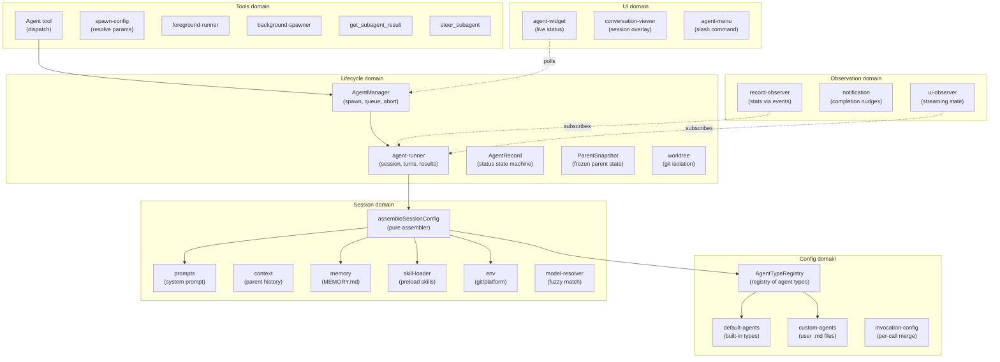
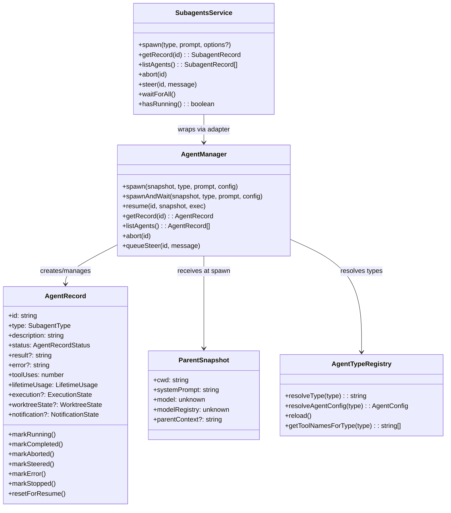
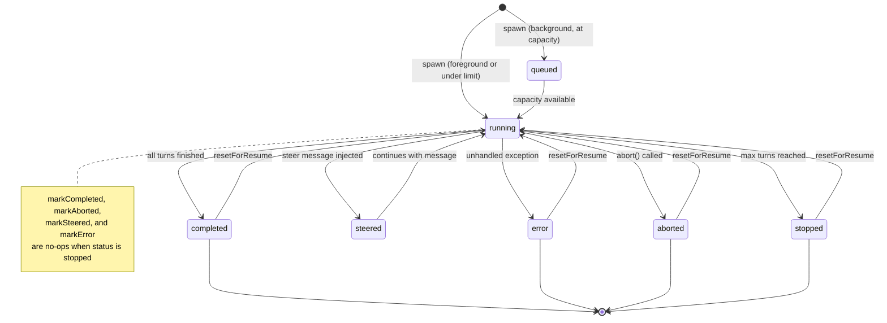
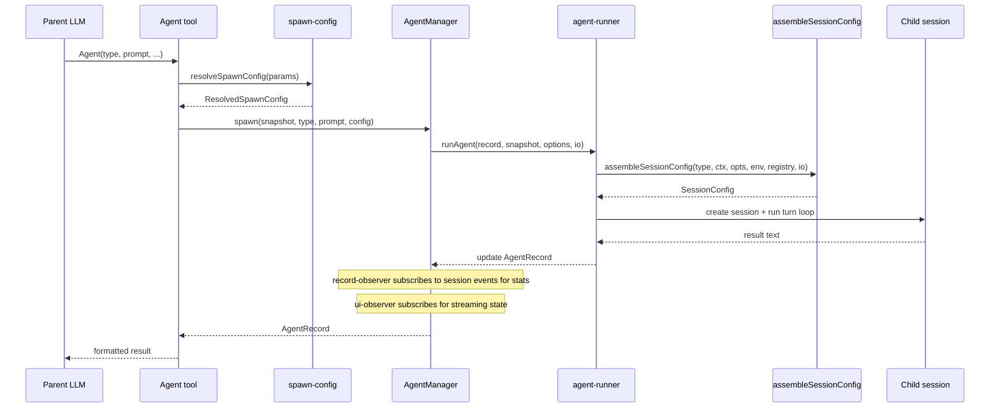
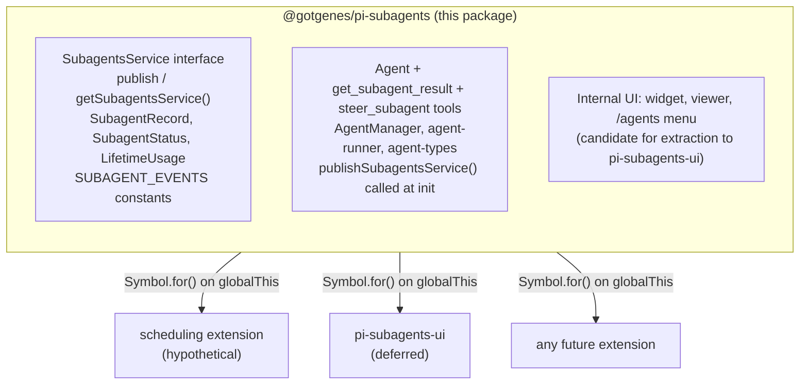
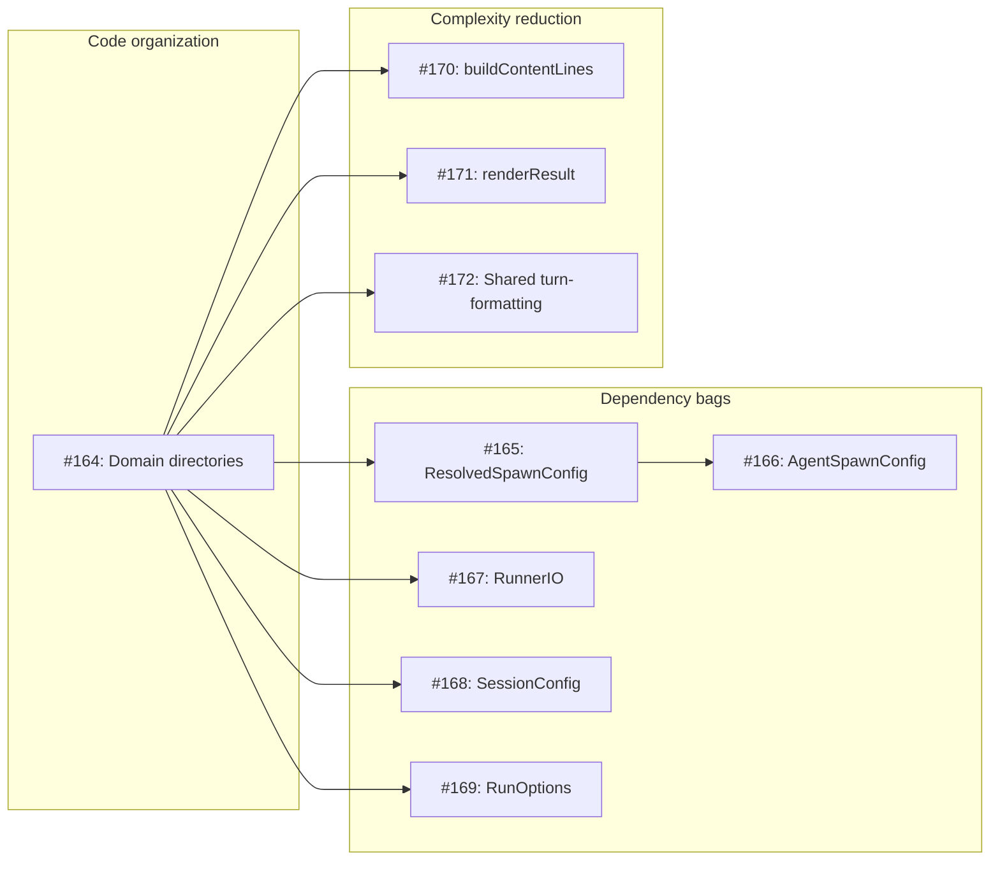

# Architecture

This document describes the architecture of the pi-subagents fork: a focused, composable core with a stable API boundary that other extensions can build on.

## Design principles

1. **Narrow core** — the extension owns agent spawning, execution, and result retrieval.
   Everything else is a consumer.
2. **Composable by default** — other extensions can spawn agents, observe their lifecycle, and display their state without importing this package directly.
3. **Typed API boundary** — this package exports a `SubagentsService` interface and `Symbol.for()` accessors (`publishSubagentsService` / `getSubagentsService`).
   Consumers declare this package as an optional peer dependency and use dynamic import for compile-time types.
   The runtime bridge is `Symbol.for("@gotgenes/pi-subagents:service")` on `globalThis` — no separate API package.
4. **No scheduling** — in-process scheduling is removed from the core.
   Scheduling is a separate concern that any extension can implement by calling `spawn()` on the published API.
5. **UI extraction is deferred** — the widget, conversation viewer, and `/agents` command menu stay in the core for now.
   They are the first candidate for extraction once the API boundary is proven stable.
6. **Snapshot, don't capture** — mutable parent state (ctx, session, model) is read once at spawn time and frozen into a `ParentSnapshot` data object.
   No live references survive past the spawn call.
7. **Subscribe, don't thread** — observation of agent progress uses direct session-event subscription, not callback parameters threaded through multiple layers.
8. **Construct complete** — objects are born with all their dependencies.
   If state isn't available yet, the object that needs it doesn't exist yet.
   No post-construction field writes from external code — if an object can't be instantiated ready-to-go, the prep work hasn't been done and the right dependencies haven't been identified.
9. **State owns its mutations** — mutable state lives in a class whose methods enforce valid transitions and invariants.
   Free functions that mutate module-scoped variables, closure-captured bags-of-functions, and external writes to shared interfaces are replaced by classes that encapsulate the state they manage.

## Domain model

The extension is organized around six domains, each responsible for one aspect of managing agents.



### Key domain types



## Agent lifecycle



Note: `markStopped` always succeeds regardless of current status.
Other terminal transitions guard against overwriting `stopped` — once an agent is stopped, only `resetForResume` can return it to `running`.

## Execution flow



## Module organization

The extension has 53 source files organized into six domains plus entry-point wiring.
All eight domains have directories: `config/`, `session/`, `lifecycle/`, `observation/`, `service/`, `tools/`, `ui/`, and `handlers/`.
Issue #164 moved the 26 previously flat root-level files into five new domain directories, reducing the root to 5 files + 8 directories.

### Current layout

```text
src/
├── index.ts                        entry point, tool registration, event wiring
├── runtime.ts                      SubagentRuntime factory (session-scoped state)
├── types.ts                        shared type definitions
├── settings.ts                     SettingsManager (persistent operational settings)
├── debug.ts                        debug logging utility
│
├── config/                         agent type definitions and resolution
│   ├── agent-types.ts              AgentTypeRegistry class
│   ├── default-agents.ts           built-in agent configs (general-purpose, Explore, Plan)
│   ├── custom-agents.ts            user-defined agent .md file loader
│   └── invocation-config.ts        per-call config merge
│
├── session/                        session assembly and preparation
│   ├── session-config.ts           pure assembler (main entry)
│   ├── prompts.ts                  system prompt building
│   ├── context.ts                  parent conversation extraction
│   ├── memory.ts                   persistent MEMORY.md per agent
│   ├── skill-loader.ts             skill preloading
│   ├── env.ts                      git/platform detection
│   ├── model-resolver.ts           fuzzy model name resolution
│   └── session-dir.ts              session directory derivation
│
├── lifecycle/                      agent execution and state tracking
│   ├── agent-manager.ts            spawn, queue, abort, resume, concurrency
│   ├── agent-runner.ts             session creation, turn loop, tool filtering
│   ├── agent-record.ts             status state machine
│   ├── parent-snapshot.ts          immutable spawn-time parent state
│   ├── execution-state.ts          session/output phase state
│   ├── worktree.ts                 git worktree isolation
│   ├── worktree-state.ts           worktree phase state
│   └── usage.ts                    token usage tracking
│
├── observation/                    progress tracking and notification
│   ├── record-observer.ts          session-event stats observer
│   ├── notification.ts             completion nudges
│   ├── notification-state.ts       per-agent notification tracking
│   └── renderer.ts                 notification TUI component
│
├── service/                        cross-extension API boundary
│   ├── service.ts                  SubagentsService interface + Symbol.for() accessors
│   └── service-adapter.ts          SubagentsService wrapper around AgentManager
│
├── tools/                          LLM-facing tool implementations
│   ├── agent-tool.ts               Agent tool definition, validation, dispatch
│   ├── result-renderer.ts          pure per-status result rendering
│   ├── spawn-config.ts             pure config resolution
│   ├── foreground-runner.ts        foreground execution loop
│   ├── background-spawner.ts       background spawn setup
│   ├── get-result-tool.ts          get_subagent_result tool
│   ├── steer-tool.ts               steer_subagent tool
│   └── helpers.ts                  shared tool utilities
│
├── ui/                             user-facing presentation
│   ├── agent-widget.ts             above-editor live status widget
│   ├── widget-renderer.ts          pure rendering for widget
│   ├── agent-menu.ts               /agents slash command menu
│   ├── agent-config-editor.ts      agent detail/edit view
│   ├── agent-creation-wizard.ts    agent creation (AI + manual)
│   ├── conversation-viewer.ts      scrollable session overlay
│   ├── message-formatters.ts       pure per-message-type formatters (extracted from conversation-viewer)
│   ├── agent-activity-tracker.ts   live activity state tracker
│   ├── agent-file-ops.ts           filesystem abstraction
│   ├── ui-observer.ts              session-event observer for streaming
│   └── display.ts                  pure formatters and shared types
│
└── handlers/                       event handlers
    ├── index.ts                    barrel re-export
    ├── lifecycle.ts                session_start, session_before_switch, session_shutdown
    └── tool-start.ts               tool_execution_start handler
```

### Observation model

Record statistics (tool uses, token usage, compaction counts) are updated by `record-observer.ts`, which subscribes directly to session events.
UI streaming (active tools, response text, turn counts) is handled by `ui/ui-observer.ts`, which subscribes to the same session events independently.
Neither observer wraps or forwards the other — both subscribe directly to the session.

The widget reads agent state by polling a shared `Map<string, AgentActivityTracker>` on `SubagentRuntime` every 80 ms. The conversation viewer subscribes directly to `AgentSession` objects.

## Cross-extension architecture



Consumers call `getSubagentsService()?.spawn(...)` at runtime.
They declare this package as an optional peer dependency and use dynamic import for compile-time types.

### What the core owns

- The three tools: `Agent`, `get_subagent_result`, `steer_subagent`.
- `AgentManager` — spawn, queue, abort, resume, concurrency control.
- `agent-runner` — session creation, turn loop, tool filtering, extension binding (Patches 2 and 3).
- `session-config` — pure configuration assembler (extracted from `agent-runner`).
- `SubagentRuntime` — session-scoped state bag with methods.
- `ParentSnapshot` — immutable snapshot of parent session state, captured once at spawn time.
- `record-observer` — session-event observer that updates record statistics without callback threading.
- Agent type registry — default agents, custom `.md` file loading.
- Prompt assembly, context extraction, memory, skills, environment.
- Worktree isolation.
- Token usage tracking.
- Session directory derivation and persisted `SessionManager` for subagent transcripts.
- Settings persistence.
- Internal UI (widget, conversation viewer, `/agents` menu) — these stay until the API boundary is proven, then move to a separate extension.

### What the core dropped

- **Scheduling** (`schedule.ts`, `schedule-store.ts`, `ui/schedule-menu.ts`) — removed (#52).
- **Ad-hoc RPC** (`cross-extension-rpc.ts`) — replaced by the typed `SubagentsService` published via `Symbol.for()` (#49).
- **Group join** (`group-join.ts`) — removed (#49).
- **Output file** (`output-file.ts`) — replaced by `session-dir.ts` + `SessionManager.create()` (#61).
- **Callback threading** — the three-layer `on*` callback chain was replaced by direct session-event subscriptions (#100).
- **Live `ctx` capture** — replaced by `ParentSnapshot`, an immutable data object captured once at spawn time (#99).

## SubagentsService

The `SubagentsService` interface, accessor functions, and serializable types are exported from `@gotgenes/pi-subagents` via the `./service` export map entry.
No separate API package is needed.

Consumers declare this package as an optional peer dependency:

```json
{
  "peerDependencies": {
    "@gotgenes/pi-subagents": ">=5.0.0"
  },
  "peerDependenciesMeta": {
    "@gotgenes/pi-subagents": { "optional": true }
  }
}
```

At runtime, consumers use dynamic import for type-safe access to the accessor functions:

```typescript
const { getSubagentsService } = await import("@gotgenes/pi-subagents");
const svc = getSubagentsService();
if (svc) {
  svc.spawn("Explore", "Check for stale TODOs");
}
```

Pi's extension loader creates a fresh `jiti` instance per extension with `moduleCache: false`, so module-scoped singletons don't survive across extensions.
The accessor functions use `Symbol.for("@gotgenes/pi-subagents:service")` on `globalThis`, which is process-global by spec, to bridge this gap.
The dynamic import provides compile-time types; the `Symbol.for()` key is the actual runtime channel.

### Interface

See `src/service.ts` for the canonical definition.
Key types:

- `SubagentsService` — `spawn`, `getRecord`, `listAgents`, `abort`, `steer`, `waitForAll`, `hasRunning`.
- `SubagentRecord` — serializable agent snapshot (no live session objects).
- `SpawnOptions` — `description`, `model`, `maxTurns`, `thinkingLevel`, `isolated`, `inheritContext`, `foreground`, `bypassQueue`, `isolation`.
- `SUBAGENT_EVENTS` — channel constants for `pi.events` subscriptions.

### Accessor pattern

```typescript
const SERVICE_KEY = Symbol.for("@gotgenes/pi-subagents:service");

export function publishSubagentsService(service: SubagentsService): void {
  (globalThis as Record<symbol, unknown>)[SERVICE_KEY] = service;
}

export function getSubagentsService(): SubagentsService | undefined {
  return (globalThis as Record<symbol, unknown>)[SERVICE_KEY] as
    | SubagentsService
    | undefined;
}
```

If Pi gains a native service registry ([earendil-works/pi#4207]), these accessors can be updated to delegate to `pi.registerService()` / `pi.getService()` internally while keeping the same consumer API.

### Lifecycle events

The core emits events on `pi.events` that any extension can observe:

| Channel               | Payload                                     | When                 |
| --------------------- | ------------------------------------------- | -------------------- |
| `subagents:started`   | `{ id, type, description }`                 | Agent begins running |
| `subagents:completed` | `{ id, type, status, result?, error? }`     | Agent finishes       |
| `subagents:activity`  | `{ id, toolName?, textDelta?, turnCount? }` | Streaming progress   |

These are fire-and-forget broadcast events — no request IDs, no reply channels.

## Current structural analysis

### Health metrics

| Metric                    | Value                        |
| ------------------------- | ---------------------------- |
| Health score              | 75/100 (B)                   |
| Total LOC                 | 7,461 (52 files)             |
| Dead code                 | 0 files, 0 exports           |
| Maintainability index     | 90.7 (good)                  |
| Avg cyclomatic complexity | 1.5                          |
| P90 cyclomatic complexity | 2                            |
| Production duplication    | 18 lines (1 clone group)     |
| Test duplication          | 71 clone groups, 1,424 lines |

### Dependency bag inventory

These interfaces carry hidden dependencies that obscure true coupling.
Bags with 10+ fields are the highest priority for decomposition.

| Interface                   | Fields                                                 | Consumers                                         | Severity |
| --------------------------- | ------------------------------------------------------ | ------------------------------------------------- | -------- |
| `ResolvedSpawnConfig`       | 3 nested                                               | foreground-runner, background-spawner, agent-tool | ✓ done   |
| `AgentSpawnConfig`          | 13 → 13 (ParentSessionInfo nested)                     | agent-manager (internal)                          | ✓ done   |
| `RunOptions`                | 9 (`RunContext` nested)                                | agent-runner                                      | ✓ done   |
| `SessionConfig`             | 8 (ToolFilterConfig nested)                            | agent-runner (output of assembler)                | ✓ done   |
| `NotificationDetails`       | 10                                                     | notification                                      | Medium   |
| `ResourceLoaderOptions`     | 10                                                     | agent-runner (SDK bridge)                         | Medium   |
| `RunnerIO`                  | split → `EnvironmentIO` (3) + `SessionFactoryIO` (5+1) | agent-runner                                      | ✓ done   |
| `CreateSessionOptions`      | 9                                                      | agent-runner (SDK bridge)                         | Medium   |
| `AgentToolDeps`             | 8                                                      | agent-tool                                        | Low      |
| `AgentMenuDeps`             | 8                                                      | agent-menu                                        | Low      |
| `ConversationViewerOptions` | 8                                                      | conversation-viewer                               | Low      |
| `AgentRecordInit`           | 8                                                      | agent-record                                      | Low      |

### Complexity hotspots

Functions with cyclomatic complexity ≥ 21 (critical threshold):

| Function            | Cyclomatic | Cognitive | File                        | Concern                            |
| ------------------- | ---------- | --------- | --------------------------- | ---------------------------------- |
| `showAgentDetail`   | 25         | 33        | `ui/agent-config-editor.ts` | Agent detail/edit view             |
| `renderWidgetLines` | 25         | 44        | `ui/widget-renderer.ts`     | Renders widget status lines        |
| `ejectAgent`        | 21         | 20        | `ui/agent-config-editor.ts` | Eject agent to filesystem          |
| `update`            | 21         | 31        | `ui/agent-widget.ts`        | Widget lifecycle + polling         |

### Churn hotspots

Files with highest commit frequency × complexity (accelerating trend):

| Score | File                  | Commits |
| ----- | --------------------- | ------- |
| 85.7  | `index.ts`            | 65      |
| 35.9  | `agent-manager.ts`    | 31      |
| 25.9  | `ui/agent-menu.ts`    | 26      |
| 23.3  | `tools/agent-tool.ts` | 30      |

### Production duplication

One clone group (18 lines) shared between `agent-runner.ts:456-468` and `conversation-viewer.ts:261-278`.
Both format turn-event content for display — identical iteration over message content items, extracting tool names and text.

### Proposed bag decompositions

#### ResolvedSpawnConfig (15 fields → 3 value objects)

This bag mixes three concerns: who the agent is, how it should run, and how it should be displayed.
Each consumer uses a different subset.

```typescript
/** Who this agent is — type resolution result. */
interface SpawnIdentity {
  subagentType: string;
  rawType: SubagentType;
  fellBack: boolean;
  displayName: string;
}

/** How the agent should run — execution parameters. */
interface SpawnExecution {
  prompt: string;
  description: string;
  model: Model<any> | undefined;
  effectiveMaxTurns: number | undefined;
  thinking: ThinkingLevel | undefined;
  inheritContext: boolean;
  runInBackground: boolean;
  isolated: boolean;
  isolation: IsolationMode | undefined;
  agentInvocation: AgentInvocation;
}

/** How the agent is presented — display metadata. */
interface SpawnPresentation {
  modelName: string | undefined;
  agentTags: string[];
  detailBase: Pick<AgentDetails, ...>;
}
```

`foreground-runner` and `background-spawner` primarily consume `SpawnExecution` + `SpawnIdentity`.
`agent-tool` uses all three to build the `AgentSpawnConfig` and the result text.
After decomposition, each consumer declares its real dependencies explicitly.

#### AgentSpawnConfig — ParentSessionInfo extracted (done, [#166][166])

The `parentSessionFile`, `parentSessionId`, and `toolCallId` fields were grouped into `ParentSessionInfo`:

```typescript
/** Parent session identity — always travel together from the tool boundary. */
export interface ParentSessionInfo {
  parentSessionFile?: string;
  parentSessionId?: string;
  toolCallId?: string;
}
```

`AgentSpawnConfig` now carries `parentSession?: ParentSessionInfo` instead of three flat optional fields.

#### RunOptions (12 fields → extract RunContext) — done ([#169][169])

The `RunOptions` bag mixes execution parameters with context information.
`RunContext` was extracted and nested as `RunOptions.context`:

```typescript
/** Parent execution context — where/who is running. */
export interface RunContext {
  exec: ShellExec;
  registry: AgentConfigLookup;
  cwd?: string;
  parentSession?: ParentSessionInfo;
}
```

The remaining `RunOptions` fields (`model`, `maxTurns`, `signal`, `isolated`, `thinkingLevel`, `defaultMaxTurns`, `graceTurns`, `onSessionCreated`) are genuine execution parameters.
`RunOptions` now has 9 fields: 1 nested `context: RunContext` plus 8 flat execution fields.

#### SessionConfig (11 fields → extract ToolFilterConfig) — done ([#168][168])

The tool-filtering cluster (`toolNames`, `disallowedSet`, `extensions`) was extracted into `ToolFilterConfig` and nested as `SessionConfig.toolFilter`.
`filterActiveTools` now accepts a single `ToolFilterConfig` argument instead of three positional parameters.
`SessionConfig` reduced from 10 to 8 top-level fields.

#### RunnerIO (9 methods → 2 focused interfaces) — done ([#167][167])

The IO boundary was split into two focused interfaces:

```typescript
/** Environment discovery — detect runtime context and resolve directories. */
export interface EnvironmentIO {
  detectEnv: (exec: ShellExec, cwd: string) => Promise<EnvInfo>;
  getAgentDir: () => string;
  deriveSessionDir: (parentSessionFile: string | undefined, effectiveCwd: string) => string;
}

/** Session factory — create SDK objects for a child agent session. */
export interface SessionFactoryIO {
  createResourceLoader: (opts: ResourceLoaderOptions) => ResourceLoaderLike;
  createSessionManager: (cwd: string, sessionDir: string) => SessionManagerLike;
  createSettingsManager: (cwd: string, agentDir: string) => SettingsManager;
  createSession: (opts: CreateSessionOptions) => Promise<{ session: AgentSession }>;
  assemblerIO: AssemblerIO;
}

/** Backward-compatible intersection of the two focused interfaces. */
export type RunnerIO = EnvironmentIO & SessionFactoryIO;
```

`RunnerIO` is kept as a type alias for the intersection.
All existing consumers satisfy both sub-interfaces via structural typing with no call-site changes.

## Improvement roadmap (Phase 10)

Phase 10 addresses the structural gaps identified in this analysis: flat code organization, oversized dependency bags, and complexity hotspots.

### Step 1: Reorganize source into domain directories ([#164][164]) ✓ Done

Moved files into `config/`, `session/`, `lifecycle/`, `observation/`, and `service/` subdirectories.
All `src/` internal imports now use `#src/` path aliases (same style as `test/` files), eliminating relative depth arithmetic for future moves.

- Domain model is now visible in the filesystem.
- Root reduced to 5 files + 8 directories (was 31 files + 3 directories).
- All subsequent steps can move or extract files without `../` import churn.

### Step 2: Decompose ResolvedSpawnConfig ([#165][165])

Split the 15-field bag into `SpawnIdentity`, `SpawnExecution`, and `SpawnPresentation`.
Each consumer declares its real dependencies.
Enables Step 3 (narrowing AgentSpawnConfig, [#166][166]).

### Step 3: Extract ParentSessionInfo from AgentSpawnConfig ([#166][166]) — Complete

Extracted `parentSessionFile`, `parentSessionId`, `toolCallId` into `ParentSessionInfo`.
`AgentSpawnConfig`, `BackgroundParams`, `ForegroundParams`, and `RunOptions` all carry the nested group.

### Step 4: Narrow RunnerIO ([#167][167]) ✓ Done

`RunnerIO` split into `EnvironmentIO` (3 methods: environment discovery) and `SessionFactoryIO` (5 methods + `assemblerIO`: SDK object creation).
`RunnerIO` kept as a backward-compatible type alias for the intersection.
All existing consumers satisfy both sub-interfaces via structural typing with no call-site changes.

### Step 5: Extract ToolFilterConfig from SessionConfig ([#168][168]) ✓ Done

`ToolFilterConfig` extracted from `SessionConfig`, grouping `toolNames`, `disallowedSet`, and `extensions`.
`filterActiveTools` now accepts a single `ToolFilterConfig` argument.
`SessionConfig` reduced from 10 to 8 top-level fields.

### Step 6: Extract RunContext from RunOptions ([#169][169]) ✓ Done

Extracted `exec`, `registry`, `cwd`, and `parentSession` into `RunContext`, nested as `RunOptions.context`.
`RunOptions` reduced from 12 to 9 fields (1 nested `context` + 8 flat execution fields).

### Step 7: Reduce buildContentLines complexity ([#170][170]) ✓ Done

Extracted formatting sub-functions for each content type (user, assistant, tool result, bash execution, streaming indicator) into `ui/message-formatters.ts`.
`buildContentLines` in `conversation-viewer.ts` is now a ~30-line dispatch loop delegating to `formatMessage` and `formatStreamingIndicator`.

### Step 8: Reduce renderResult complexity ([#171][171])

`renderResult` in `agent-tool.ts` has cognitive complexity 43.
Extract result formatting by status (completed, error, aborted, stopped).

### Step 9: Extract shared turn-formatting logic ([#172][172])

The 18-line production clone between `agent-runner.ts` and `conversation-viewer.ts` extracts into a shared function in the session domain.

### Step dependencies



Step 1 ([#164][164], directory restructuring) unblocks all other steps by co-locating related files.
Steps 2–6 (bag decomposition) and Steps 7–9 (complexity reduction) are independent tracks that can proceed in parallel.
Within the bag track, Step 2 ([#165][165], ResolvedSpawnConfig) enables Step 3 ([#166][166], AgentSpawnConfig).

## Refactoring history

Phases 1–5 and 7–9 are complete.
Phase 6 (UI extraction to a separate package) is deferred.
Detailed records are preserved in per-phase history files:

| Phase | Title                                               | Status   | History                                                                    |
| ----- | --------------------------------------------------- | -------- | -------------------------------------------------------------------------- |
| 1     | Export SubagentsService API boundary                | Complete | [phase-1-api-boundary.md](history/phase-1-api-boundary.md)                 |
| 2     | Remove scheduling subsystem                         | Complete | [phase-2-remove-scheduling.md](history/phase-2-remove-scheduling.md)       |
| 3     | Remove group-join, RPC; replace output-file         | Complete | [phase-3-remove-rpc-groupjoin.md](history/phase-3-remove-rpc-groupjoin.md) |
| 4     | Implement and publish SubagentsService              | Complete | [phase-4-implement-service.md](history/phase-4-implement-service.md)       |
| 5     | Decompose index.ts                                  | Complete | [phase-5-decompose-index.md](history/phase-5-decompose-index.md)           |
| 6     | Extract UI to separate package                      | Deferred | —                                                                          |
| 7     | Encapsulation and dependency narrowing              | Complete | [phase-7-encapsulation.md](history/phase-7-encapsulation.md)               |
| 8     | Testability, display extraction, menu decomposition | Complete | [phase-8-testability.md](history/phase-8-testability.md)                   |
| 9     | Observation consolidation, ctx elimination          | Complete | [phase-9-observation-ctx.md](history/phase-9-observation-ctx.md)           |

### Structural refactoring issues

| Phase              | Issue                                                      | Summary                                                                                                                        |
| ------------------ | ---------------------------------------------------------- | ------------------------------------------------------------------------------------------------------------------------------ |
| Foundation         | #69, #71, #76, #80                                         | SubagentRuntime, pure assembler, cwd injection, config consolidation                                                           |
| Core decomposition | #84, #72, #87, #70                                         | WorktreeManager, AgentManager DI, runtime methods, handler extraction                                                          |
| Interface polish   | #66, #77                                                   | SDK types, projectAgentsDir                                                                                                    |
| Features           | #61                                                        | JSONL session transcripts                                                                                                      |
| AgentManager       | #98, #99, #100, #102                                       | Record state machine, ParentSnapshot, session-event observation, test factory                                                  |
| Encapsulation      | #108, #109, #110, #111, #112, #113, #114, #115, #116, #118 | Registry, settings, activity tracker, record lifecycle, observer, spawn options, deps narrowing, tool split, type housekeeping |
| Testability        | #131, #132, #133, #134, #135, #136                         | Shared fixtures, session-config IO, runner SDK boundary, as-any reduction, display extraction, menu decomposition              |
| Observation/ctx    | #144, #145, #146, #147, #148                               | Observation consolidation, execute decomposition, UI context, text wrapping injection, widget rendering split                  |

The remaining open issue is #22 (parent-session resolution), a cross-extension track that does not gate the structural work.

## Relationship with upstream

This fork (`@gotgenes/pi-subagents` in the [gotgenes/pi-packages] monorepo) is a hard fork of [tintinweb/pi-subagents].
The decomposition diverges materially from upstream's direction.

The three upstream PRs (#71, #72, #73) remain open.
If they land, upstream gains the peer-dep fix and the two RepOne patches.
This fork continues independently regardless.

Upstream fixes and ideas are cherry-picked when they align with this fork's scope.
The upstream test suite is run periodically as a regression canary for the agent-runner core.

[earendil-works/pi#4207]: https://github.com/earendil-works/pi/issues/4207
[gotgenes/pi-packages]: https://github.com/gotgenes/pi-packages
[tintinweb/pi-subagents]: https://github.com/tintinweb/pi-subagents

[164]: https://github.com/gotgenes/pi-packages/issues/164
[165]: https://github.com/gotgenes/pi-packages/issues/165
[166]: https://github.com/gotgenes/pi-packages/issues/166
[167]: https://github.com/gotgenes/pi-packages/issues/167
[168]: https://github.com/gotgenes/pi-packages/issues/168
[169]: https://github.com/gotgenes/pi-packages/issues/169
[170]: https://github.com/gotgenes/pi-packages/issues/170
[171]: https://github.com/gotgenes/pi-packages/issues/171
[172]: https://github.com/gotgenes/pi-packages/issues/172
